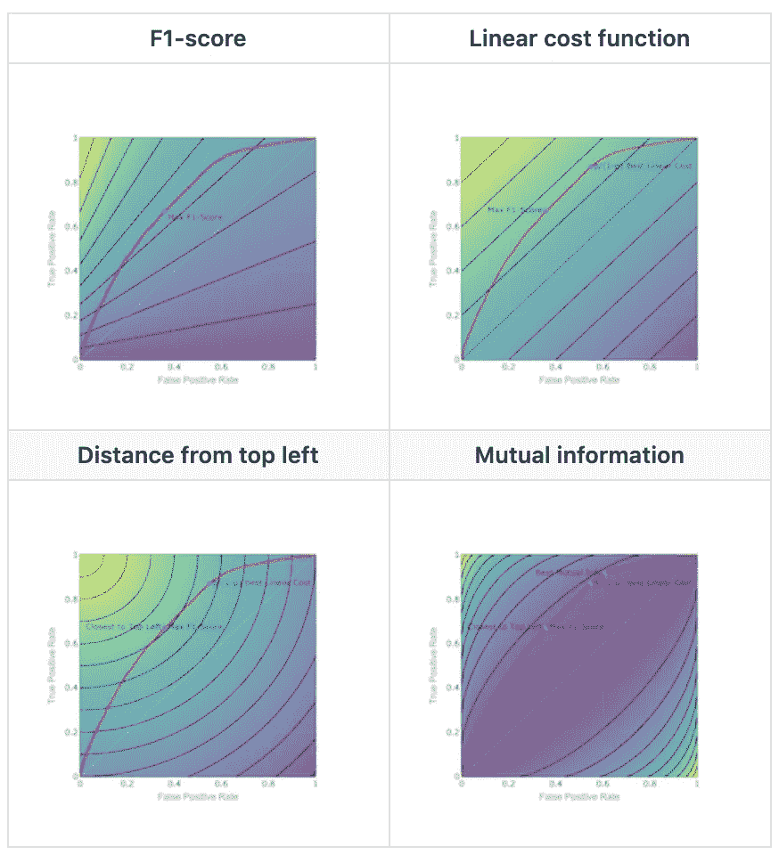
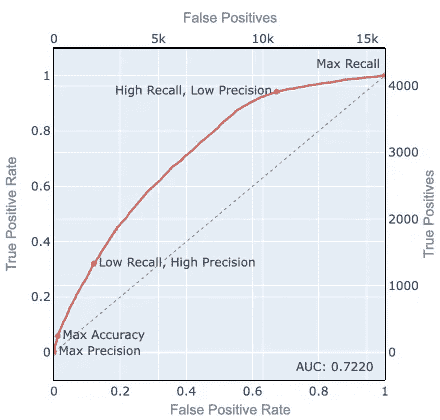
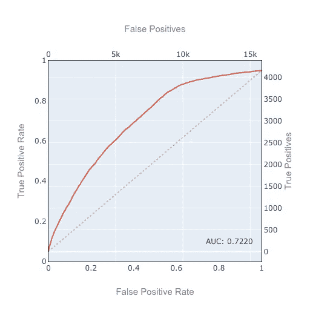
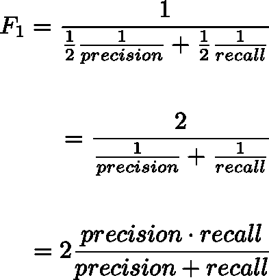
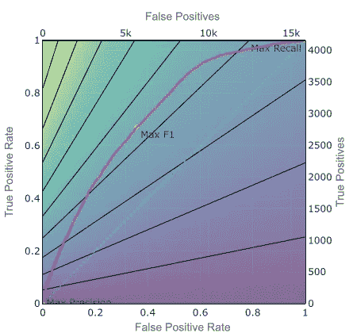
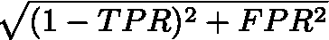
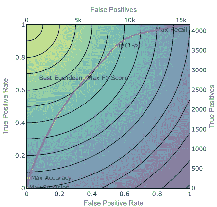
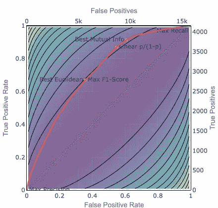

# 使用等曲线了解分类阈值

> 原文：<https://towardsdatascience.com/understanding-classification-thresholds-using-isocurves-9e5e7e00e5a2?source=collection_archive---------18----------------------->

你在一个会议室里，展示你的一个分类问题。您展示了您在特征工程、预测器选择、模型选择、超参数调整和集成方面的所有神奇之处。你用预测概率和 [ROC 曲线](http:)以及奇妙的 [AUC](https://en.wikipedia.org/wiki/Receiver_operating_characteristic#Area_under_the_curve) 来结束你的陈述。你坐下来，对自己出色的工作充满信心。

经理说，“我该怎么处理这些概率和 ROC 之类的东西？我只是想知道我应该做 *x* 还是 *y* 。”x 可能在哪里，我是否应该将此邮件归类为垃圾邮件？还是面对这种路况我的特斯拉应该踩刹车？或者我该不该批准这笔贷款？

Optimal thresholds using different metrics, with isocurves

在你解释如何解释模型并应用它之前，你作为数据科学家的工作还没有结束。这意味着为激励模型的商业决策选择阈值。

作为一名数据科学家，你可能会说… *“一篇关于阈值的博文？这甚至不是一个数据科学问题，而是一个业务问题。”*

你是对的！阈值选择缺乏吸引力，比如说，生成性对抗网络。

但这也是橡胶遇到道路的地方，在这里你用奇特的算法做的所有创造性的东西与现实世界的决策相互作用。

它受到了冷遇。因此，这里有一个深入的阈值选择，包括 F1 分数及其与其他指标的比较。让我们开始吧！

# 1.你需要一个度量或者一个成本函数来优化。

企业不关心 Kaggle 指标。企业在数据科学上投资的唯一正当理由是:1)获得并留住客户，2)降低成本，3)更好地开展业务，从而 4)增加利润。如果您了解模型的业务目标，模型可以改进哪些关键绩效指标(KPI ),并应用科学方法来提出正确的问题并改进这些 KPI，您可能会成为 A-team 数据科学家。

在预测观察值属于正类的概率的算法的情况下，阈值选择是必要的。这是大多数(但不是全部)分类算法的工作方式。接下来的问题是，如果我们需要根据建模的概率进行离散预测，那么将一个观察结果归类为阳性的最佳阈值是什么？

要问的第一个问题是:您能使用企业关心的 KPI 量化第一类和第二类错误的成本吗？什么是假阳性的边际成本，什么是假阴性的边际成本？如果你能确定正确的成本函数，你的工作基本上就完成了。

选择使交叉验证中的假阳性和假阴性*的总成本最小化的阈值。(始终处于交叉验证中:永远不要选择超参数或使用训练数据或测试数据对您的模型做出任何决定；分类阈值可以被认为是一个超参数。)*

假设我们预测一个借款人是否会拖欠信用卡。提供本应被拒绝的信贷会造成 50，000 美元的信贷损失和管理成本。拒绝本应提供的信贷会导致客户损失 10，000 美元的终身价值(LTV)。选择在交叉验证集合(或折叠)中假阳性和假阴性总成本最低的阈值。

# 2.当您改变分类阈值时，ROC 曲线可视化了一组可行的解决方案，隐含地改变了假阳性相对于假阴性的成本。

如果阳性类别代表检测到停车标志或医疗状况，则假阴性的成本很高。你需要一个低门槛来最大限度地减少假阴性，这些假阴性会导致你冲过十字路口，与交通相撞，或者无法获得进一步的救命诊断或治疗。

如果您的问题是垃圾邮件检测，阻止一封重要的电子邮件比让垃圾邮件通过的成本更高。所以你倾向于使用更高的阈值来将邮件标记为垃圾邮件，以减少误报。

*图一。ROC 曲线*

这是来自 Kaggle 数据集的 ROC 图。

我们来回顾一下如何解读 ROC 剧情:

*   *真阳性*是被正确预测为真的真实观察。
*   *真阳性率(TPR)* 是*真阳性/真阳性*的数量(也称为*召回*或*灵敏度*)。*地面真阳性=真阳性+假阴性:TPR = tp / (tp+fn)*
*   *假阳性*是错误预测为真的错误观察。
*   *假阳性率(FPR)* 是*假阳性/真阴性数* (1 — FPR 是*特异性*)。*地面真阴性=真阴性+假阳性:FPR = fp / (tn + fp)*
*   ROC 图上最好的点是左上角，100% TPR，灵敏度或回忆，0% FPR，或 100%特异性。
*   最佳*可行*点在 ROC 曲线上。当你从左向右移动时，你降低了将一个观察归类为积极的阈值。你得到更多的真阳性，但也有更多的假阳性。
*   一个很好的类比是用网捕鱼:当你使用更细的网时，漏网的鱼会更少，但你也会捕获更多的海藻和垃圾。这个价值 64，000 美元的问题是如何使用一张网来获得最好的结果。

# 3.ROC 曲线的斜率反映了每接受一个假阳性，您获得了多少个真阳性。

我们来讨论一下如何解读 ROC 曲线的斜率。

*图二。ROC 曲线斜率*

我们把 TPR 放在左轴，把 FPR 放在底轴。我们也用虚线画出了 45 度线。45 线是 ROC 曲线，如果你用基本比率对你的观察值进行随机分类，你会得到这条曲线。在这个例子中，大约 20.8%的观察结果是基本事实。如果您使用随机分类器将 20.8%随机分类为阳性，您的 ROC 曲线将大致遵循 45°线。这是你不用做任何建模就能得到的最好的 AUC(ROC 曲线下面积)。或建模尝试失败的最坏情况 AUC，其不能找到任何预测信号。

回想一下，TPR 是真阳性，作为基础真阳性的百分比，我们将实际真阳性计数放在右轴上。同样，由于 FPR 是假阳性占地面真实阴性的百分比，所以实际的假阳性计数在顶轴上。

这有助于我们解释斜率:斜率是通过接受一个额外的假阳性而获得的额外的真阳性的数量。(近似值，记住 ROC 曲线是由离散点组成的)。

45°线在 TPR/FPR 空间中的斜率为 1(FPR 每增加一个百分点，TPR 增加一个百分点)。在原始真阳性/假阳性空间中，45°线的斜率是阳性总数/阴性总数。如果正类以概率 *p* 出现，则斜率为 *p / (1 — p)* 。

如果你有一个理想的 ROC 曲线，斜率连续下降(凹下)，你可以从左下开始，一直向右上，只要假阴性表达的额外真阳性的成本是可接受的。

(真实世界的 roc 通常更混乱，可能没有连续递减的斜率。但是 ROC 曲线总是正倾斜的，除了在边缘处，从不平坦或垂直。这将意味着两点，其中一点在一个维度上更好，而在另一个维度上相等。那么只有一个可能是最优解，而且只有那个应该在 ROC 曲线上。此外，最合理的阈值选择度量将忽略不在“外壳”上但暂时向左下角倾斜的区域中的点。所以考虑一条斜率连续下降的 ROC 曲线是合理的。)

# 4.精确度、召回率和 F1 分数

现在，如果您不能确定假阳性和假阴性的真实成本，会发生什么？

一个常用的指标是 *F1-score* ，它是精确度和召回率的调和平均值。

*   *精度*是真阳性/预测阳性，即我们正确预测的阳性预测的百分比。
*   *回忆一下*是 TPR:真阳性/基本事实阳性，即我们正确预测的基本事实阳性的百分比。
*   为了计算谐波平均值，我们反转输入，计算它们的平均值，然后反转平均值。

为了获得关于调和平均值的直觉:如果车辆以速度 *x* ( *例如* 60 *km/h* 向外行驶距离 *d* ，并以速度 *y* ( *例如* 20 *km/h* 返回相同的距离，那么其平均速度是 *x* 和*的调和平均值*

这并不等于算术平均值(40 *km/h* ),如果您在两个不同速度的路段中行驶了相同的*时间*，则算术平均值是适用的。

如果任一条腿上的速度接近 0，则无论另一条腿上的速度如何，整个距离的调和平均值都将接近 0。如果任何一段的速度正好为 0，你就永远不会到达目的地，所以整个行程的平均速度为 0。

F1 分数平衡了精确性和回忆性，惩罚了其中任何一个方面的极端弱点。

F1 的分数是不对称的。我们有不平衡的 79.2%/20.8%的负面/正面比率。假设我们的分类器预测一切都是积极的。那么召回率是 1，精度是 0.208，F1 是 0.344。现在假设标签反了，你预测一切都是正的，回忆是 1，精度是 0.792，F1 是 0.884。这看起来很棒，但事实并非如此，因为我们所做的只是将所有东西归类为多数类。由于这种不对称性，我们总是小心翼翼地将少数类标记为正类来计算 F1 分数。

不对称有时是好的。有时业务问题是不对称的。在一个搜索引擎应用程序中，我们不太关心我们没有检索到的所有文档。

我们可以通过使用加权平均值而不是等加权平均值来将阈值向精确度或召回率倾斜，在这种情况下，我们称之为 F2-score 等。

F-score 似乎是合理的，虽然调和平均值的适用性对我来说不是完全直观的。我从未遇到过假阳性和假阴性的真实成本函数是调和平均值的业务问题。

# 5.等曲线可帮助您可视化任何评分或成本函数，如 F1

如果你想要最好的折衷，用等曲线可视化折衷是有帮助的。等值成本曲线或无差别曲线描绘了一组具有相同成本或度量值的点:例如，F1 值为 0.5 的所有点。这可以让您直观地看到当您沿着 ROC 曲线移动时，指标是如何演变的。

对于 F1 指标，等曲线看起来像这样。

*图 3。f1-得分等曲线*

*   底部轴:回忆= 0，F1 = 0
*   左上角:我们完美地分类了:召回率= 1，精确度= 1，F1 = 1
*   右上方:我们对所有阳性进行分类:召回率= 1，精确度= 0.208，F1 = 0.344

要选择具有最高 F1 的点，选择 ROC 曲线上位于最佳 F1 等曲线上的点，即最接近左上的等曲线。

# 6.线性成本等值线

F-score 是一个非线性成本函数。如果成本函数是 TPR 和 FPR(或假阳性和假阴性)的线性函数，用一个假阳性换一个假阴性的相对成本是*常数*，并且你有均匀间隔的线性等曲线。

*图四。线性成本等值线*

再次选择 ROC 曲线上的点，该点也在最靠近左上方的等曲线上。在这个例子中，相对价格是 *p/(1-p)* 。所以等曲线平行于 45°线，对应于使用基本速率 p 的随机分类器。

与 F1 等曲线相比，当你上升时，F1 在左侧上升得更快。因此，当你提高 ROC 时，在其他条件相同的情况下，连接最佳 F1 点的路径将向左弯曲(凹下)。连接最佳线性成本的路径将是一条直线。就像他们说的，证据是作为练习留下的。

我们可以衡量假阳性对假阴性的相对成本。当我们这样做时，等曲线的斜率会发生变化，我们会倾向于精度高于回忆，反之亦然。

# 7.圆形或“最接近左上”等曲线

假设我们希望通过欧几里德距离尽可能接近左上。对应于圆形等曲线。成本函数是从左上角开始的距离:

*图五。最靠近左上角:圆形等曲线*

我们还可以对平方根下的项进行加权，以提高精确度或召回率，并将曲线做成水平或垂直的椭圆。

与恒定成本等曲线相比，圆形等曲线倾向于将最佳点保持在中间，靠近对角脊，从而平衡精确度和召回率。

# 8.交互信息

最后再来看*互信息*。互信息是一种信息论度量，就像 [*日志损失*](/understanding-binary-cross-entropy-log-loss-a-visual-explanation-a3ac6025181a) 。Log loss 可以解释为我们的预测与实际结果之间的错误或意外，用比特来衡量。 [*互信息*](https://en.wikipedia.org/wiki/Mutual_information) 可以解释为我们预测中的正确信息量，用比特来衡量。

互信息是我们用来测量电话线或无线信道上信号的带宽容量的。我们可以把预测看作是关于未来的信号。在同样的意义上，互信息衡量的是一个信道上可以传输多少有用的信号，互信息告诉我们有多少关于未来的有用信息。

如果我们用互信息作为我们的成本函数，我们会得到这样的等值线。

*图 6。互信息等曲线*

在信息论的意义上，最大化互信息可以最小化预测中的意外或错误，并最大化“正确”信息。由于没有假阳性和假阴性的明确成本，互信息似乎是一个自然的度量选择。

然而，互信息等曲线符合 ROC 曲线的一般形状。所以他们在选择是偏向精确还是偏向回忆方面可能不是很稳定。

倾向于精确还是召回的选择是基于算法在精确还是召回方面更好，而不是任何现实世界的成本。因此，阈值的选择可能是任意的，很难解释。

同样值得注意的是，完全错误的预测与完全正确的预测包含相同的互信息，因为您可以从该信号中提取正确的预测。这也有点违反直觉。

互信息具有理论吸引力，但可解释性具有挑战性。

# 9.结论

当我开始建立分类模型时，我经常使用 F1 分数。现在，我一般用 AUC 进行模型选择和超参数调优。对于阈值选择，我尝试识别最相关的真实世界度量。

我发现线性等曲线最容易解释。在没有一个好的先验成本函数的情况下，我还发现证明 *p/(1-p)* 比 F1 或其他更复杂的指标更容易。圆形等曲线更难解释，但有利于精确度和召回率之间的平衡。但从经验上看，F1 表现不错。

要选择一个门槛，就要把某个东西最大化。您最大化的指标应该是*可解释的，并与现实世界的成本相关联*。

*外卖*:

*   阈值选择是数据科学与现实决策相结合的地方。
*   不要自动使用 50%的阈值，甚至 F1 分数；考虑假阴性和假阳性的真实成本。
*   要选择一个阈值，你必须优化一些指标:一个成本函数。
*   业务环境决定了您正在优化的成本函数:您愿意在第一类和第二类错误之间做出的真实世界的权衡；为了以假阳性为代价获得更多的真阳性，您应该将阈值降低到什么程度。
*   等曲线等高线图是一种可视化，每当您必须权衡两个变量时，它都可以为您的成本函数提供良好的直觉。
*   最小化成本函数时，选择 ROC 曲线与最低成本(或最高度量)等曲线相交的最佳分类阈值。

等曲线可用于在任何一组竞争的备选方案之间做出合理的选择，而不仅仅是分类阈值。这篇文章涵盖了大约 30%最重要的经济学原理:人们面临权衡；某物的成本是你为了得到它而放弃的东西；理性的人在边际思考；你必须选择最大化什么。

选择优化 KPI 和实现业务目标的阈值，可以最大化您作为数据科学家的价值…这是一个真正的最佳结果。

可视化的代码在 GitHub [这里](https://github.com/druce/threshold_selection)。

另请参见:

福塞特，汤姆。" ROC 图:研究人员的注意事项和实际考虑."机器学习 31.1(2004):1–38。【https://www.hpl.hp.com/techreports/2003/HPL-2003-4.pdf 

《通过科学做出更好的决策》《科学美国人》, 2000 年第 283 卷第 4 期，第 82-87 页。JSTOR，[www.jstor.org/stable/26058901](http://www.jstor.org/stable/26058901)。

grandenberger，[评估分类模型，第 3 部分:Fᵦ和其他加权毕达哥拉斯方法的精确度和召回率](https://medium.com/shoprunner/https-medium-com-shoprunner-evaluating-classification-models-3-cabb9660ea5b)