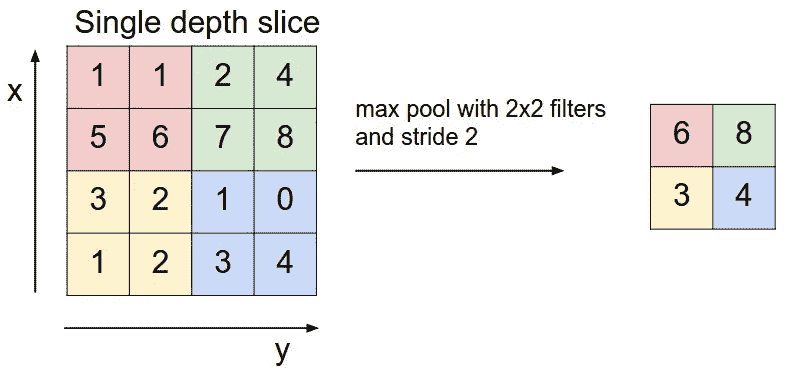

# 了解 CNN(卷积神经网络)

> 原文：<https://towardsdatascience.com/understanding-cnn-convolutional-neural-network-69fd626ee7d4?source=collection_archive---------3----------------------->

## 数据科学家的技术说明

## 你学习图像分类深度学习的第一步

Source [Unsplash](https://unsplash.com/photos/fYnyfx3UBxk)

> 想象一下 Google 相册:对于你所有的图片，你是如何用物体来标记的？要不要一个一个贴标签？可以搜索一下你最新的马里兰鸡快照吗？进入 CNN！

# 理解图像分类

> 图像分类定义图像对象，并从标记的例子中标记这些图像。

我们的大脑是快速判断物体的大师。当你进入一家杂货店时，你可以把香蕉和鞋子等其他商品分开。我 2 岁的侄女知道如何区分猫和狗。

然而，用计算机来教这些分类是非常困难的。

My search for the word “cat”

看看这些图片。在几个惊鸿一瞥之内，你应该已经意识到，在猫的形象中间，有几个来自音乐剧《猫》的女演员。也有一些是猫涂鸦的图片，但不是猫。那么我们如何教会我们的计算机理解这些图像呢？

# 经典图像分类

过去，图像分类模型使用原始像素对图像进行分类。您可以通过颜色直方图和边缘检测对猫进行分类，边缘检测允许您通过颜色和耳朵形状对猫进行分类。这种方法是成功的，但是直到该方法遇到更复杂的变体。

Imagine if our classifiers only specify cats by their black color and ear shape. Are all of these pictures cats?

这就是经典图像识别失败的地方，因为模型没有考虑其他特征。但是这些*的其他特征*是什么呢？需要一个一个讲型号吗？你会发现这即使不是不可能，也是一件非常麻烦的事。

# 介绍卷积神经网络(CNN)

CNN Architecture

CNN 是一种神经网络模型，它允许我们提取图像内容的更高表示。与传统的图像识别不同，在传统的图像识别中，您需要自己定义图像特征，CNN 获取图像的原始像素数据，训练模型，然后自动提取特征以进行更好的分类。

让我们来看看下面的视错觉，了解 CNN 是如何工作的。

## CNN 的直觉——想象一个视错觉

Psychologist Edwin Boring introduced the painting of “My Wife and My Mother-in-Law” where the figure seems to morph from young lady to old woman, to the public in 1930\. (Source)

考虑这个图像。你看到一位年轻女士还是一位老奶奶？如果你把焦点放在图像中间的一个点上，你会看到一位年轻的女士。然而，如果你把焦点放在图像中下方的黑色条纹上，你会看到一位老太太。请看图片上的红色方框。

这张图片提供了人类如何识别图像的见解。因为人类的大脑被设计用来捕捉模式以对物体进行分类，所以改变你观察的焦点也会改变你对整体图像的理解。

与人类大脑的工作方式类似，CNN 区分图像中有意义的特征，以便对图像进行整体分类。

# CNN 原理

## 盘旋

卷积通过图像扫描窗口，然后计算其输入和过滤点积像素值。这允许卷积强调相关特征。

1D Convolution Operation with features(filter)

看看这个输入。我们将用一个小窗口包住窗口元素，用点乘它与过滤器元素，并保存输出。我们将重复每个操作以导出 5 个输出元素作为[0，0，0，1，0]。从这个输出中，我们可以知道序列 4 中的特征变化(1 变成 0)。过滤器很好地识别了输入值。同样，这也发生在 2D 卷积。

2D Convolution Operation with features(filter) — [Source](https://github.com/PetarV-/TikZ/tree/master/2D%20Convolution)

通过这种计算，您可以从输入图像中检测出特定的特征，并生成强调重要特征的**特征图**(卷积特征)。这些卷积特征将总是根据受梯度下降影响的滤波器值而变化，以最小化预测损失。

此外，部署的过滤器越多，CNN 提取的特征就越多。这允许发现更多的特征，但是代价是更多的训练时间。有一个甜蜜点的层数，通常，我会把 150 x 150 大小的图像 6。

Feature map in each layer of CNN ([source](https://stackoverflow.com/questions/52741291/creating-a-cnn-model-in-keras-with-feature-maps-from-each-of-the-previous-filter))

然而，边角值呢。它们没有足够的相邻块来适合过滤器。我们应该移除它们吗？

不，因为你会丢失重要信息。因此，你要做的反而是**填充；**用 0 填充相邻的特征图输出。通过将 0 插入其相邻像素，您不再需要排除这些像素。

本质上，这些卷积层促进了**权重共享**来检查内核中的像素，并开发视觉上下文来对图像进行分类。与权重独立的神经网络(NN)不同，CNN 的权重被附加到相邻像素，以提取图像每个部分的特征。

## 最大池化

We take the maximum max pooling slices of each 2x2 filtered areas ([source](http://cs231n.github.io/convolutional-networks/))

CNN 使用 **max pooling** 用 max summary 替换输出，以减少数据大小和处理时间。这使您可以确定产生最大影响的特征，并降低过度拟合的风险。

最大池有两个**超参数**:步幅和大小。步幅将决定价值池的跳跃，而大小将决定每次跳跃中价值池的大小。

## 激活函数(ReLU 和 Sigmoid)

在每个卷积和最大池操作之后，我们可以应用校正线性单元(ReLU)。ReLU 函数模拟我们的神经元在“足够大的刺激”下的激活，从而为值 x>0 引入非线性，如果不满足条件，则返回 0。这种方法对于解决梯度递减是有效的。在 ReLU 激活功能后，非常小的权重将保持为 0。

# CNN 大图+全连接层

CNN architectures with convolutions, pooling (subsampling), and fully connected layers for softmax activation function

最后，我们将使用全连接图层(FCL)提供卷积和最大池要素地图输出。我们将特征输出展平为列向量，并将其前馈到 FCL。我们用 **softmax** 激活函数包装我们的特征，该函数为每个可能的标签分配十进制概率，其总和为 1.0。前一层中的每个节点都连接到最后一层，并表示要输出哪个不同的标签。

**最终结果如何？**你将能够对狗和猫的图片进行如下分类。

Finding the perfect image classification with softmax ([Source](https://colab.sandbox.google.com/drive/1v0VWuWnmP1Ns-PAUCiksxbzpy3AopXjc))

# CNN 中的清洗和防止过拟合

不幸的是，CNN 也不能幸免于过度拟合。如果没有适当的监控，模型可能会被训练得太多，以至于不能概括看不见的数据。通过我的经验，我犯了许多初学者过度拟合的错误，我是如何解决它们的如下:

## 使用测试集作为验证集来测试模型

即使我们不使用测试集来训练模型，模型也可以用测试集来调整损失函数。这将使训练基于测试数据集，并且是过度拟合的常见原因。因此，在训练过程中，我们需要使用**验证集**，然后用看不见的测试集最终测试完成的模型。

## 数据集相对较小

当数据集很小时，很容易专注于几组规则而忘记概括。例如，如果您的模型只将靴子视为鞋子，那么下次您展示高跟鞋时，它不会将其识别为鞋子。

因此，在训练数据集很小的情况下，你需要人为地提振训练样本的多样性和数量。这样做的一个方法是添加**图像增强**并创建新的变体。这些包括转换图像和创建尺寸变化，如缩放、裁剪、翻转等。

Image augmentation [Source](https://www.javatpoint.com/pytorch-data-augmentation-process)

## 过度记忆

过多的神经元、层和训练时期会促进记忆并抑制概括。你训练你的模型越多，它就越有可能变得过于专业化。为了解决这个问题，你可以通过去除一些隐藏层和每层的神经元来降低复杂度。

或者，您也可以使用正则化技术，如 **Dropout** 来移除每个梯度步长训练中的激活单元。每个历元训练去激活不同的神经元。

因为梯度步骤的数量通常很高，所以所有神经元将平均具有相同的丢失发生率。直觉上，你退出的越多，你的模型记忆的可能性就越小。

Drop out images

## 处理彩色图像

您还可以轻松地包含具有 3 层颜色通道的图像:红绿蓝(RGB)。在卷积过程中，您为每个颜色通道使用 3 个单独的卷积，并训练 3 级过滤器堆栈。这允许您检索 3D 要素地图。

# 我们如何做得更好？—迁移学习

随着用例变得复杂，模型的复杂性也需要提高。有了几层 CNN，你可以确定简单的特征来分类狗和猫。然而，在深度学习阶段，你可能希望从图像中分类更复杂的对象，并使用更多的数据。因此，**迁移学习**允许你利用现有的模型快速分类，而不是自己训练它们。

**迁移学习**是一种将现有模型重新用于当前模型的技术。你可以在现有模型的基础上制作，这些模型是由专家精心设计的，并用数百万张图片进行了训练。

然而，你需要遵循一些注意事项。首先，您需要修改最终层以匹配可能的类的数量。第二，您需要冻结参数，并将训练好的模型变量设置为不可变的。这阻止了模型的显著变化。

你可以使用的一个著名的迁移学习工具是 MobileNet。它是为内存和计算资源较少的移动设备创建的。你可以在 [Tensorflow Hub](https://www.tensorflow.org/hub) 找到 MobileNet，里面聚集了很多预训练的模型。你可以简单地在这些模型上添加你自己的 FCL 层。

# 结论:CNN 感知我们的视觉世界

CNN 是一门很难的课程，但却是一门值得学习的技术。它教会我们如何感知图像，并学习对图像和视频进行分类的有用应用。在学习了 CNN 之后，我意识到我可以在谷歌的项目中使用这个来检测网络钓鱼攻击。

我也意识到对 CNN 的了解很深。多年来，CNN 变体有许多改进，包括最新的 ResNet，它甚至在 ImageNet 分类中击败了人类评论者。

1.  乐网(杨乐村，1998 年)
2.  亚历克斯·奈特(2012 年)
3.  VGGNet (2014) —深度神经网络
4.  初始模块 Google Net (2014) —堆栈模块层
5.  ResNet (2015) —首个超过人类图像网络的网络

对我来说，我写这篇文章是为了我在谷歌工作的一个项目探索我对 CNN 的基本理解。因此，如果我在写作中犯了任何错误或知识空白，请随时给我反馈。索利·迪奥·格洛丽亚。

# 参考

我真诚地希望这能激起你更深入了解 CNN 的兴趣。如果你有，这里有一些你可能会觉得非常有用的资源:

1.  [CNN 的 Yann LeCun 论文](http://yann.lecun.com/exdb/publis/pdf/lecun-99.pdf)
2.  [CS 231 斯坦福](http://cs231n.github.io/convolutional-networks/)
3.  [谷歌 ML CNN](https://developers.google.com/machine-learning/practica/image-classification/convolutional-neural-networks)
4.  和许多其他人

# 最后…

我真的希望这是一本很棒的读物，是你发展和创新的灵感来源。

请在下面**评论**以获得建议和反馈。就像你一样，我也在学习如何成为一名更好的数据科学家和工程师。请帮助我改进，以便我可以在后续的文章发布中更好地帮助您。

谢谢大家，编码快乐:)

# 关于作者

Vincent Tatan 是一名数据和技术爱好者，拥有在 Google LLC、Visa Inc .和 Lazada 实施微服务架构、商业智能和分析管道项目[的相关工作经验。](https://bit.ly/2I8jkWV.?source=post_page---------------------------)

Vincent 是土生土长的印度尼西亚人，在解决问题方面成绩斐然，擅长全栈开发、数据分析和战略规划。

他一直积极咨询 SMU BI & Analytics Club，指导来自不同背景的有抱负的数据科学家和工程师，并为企业开发他们的产品开放他的专业知识。

文森特还在 10 日至 8 日开放了他的一对一导师服务，指导你如何在谷歌、Visa 或其他大型科技公司获得你梦想中的数据科学家/工程师工作。

1.  [**如果你需要转介到谷歌，请通知他。谷歌在招人！**](https://forms.gle/iyo4oJtqKpQ1MgWy5)
2.  如果你正在寻找良师益友，请在这里预约你和他的约会。

最后，请通过[**LinkedIn**](http://www.linkedin.com/in/vincenttatan/?source=post_page---------------------------)**，**[**Medium**](https://medium.com/@vincentkernn?source=post_page---------------------------)**或** [**Youtube 频道**](https://www.youtube.com/user/vincelance1/videos?source=post_page---------------------------) 联系文森特