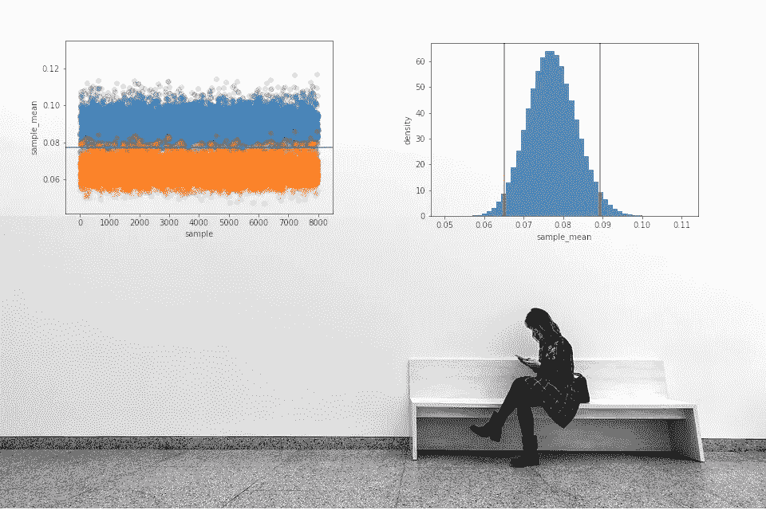
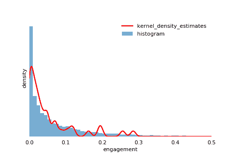
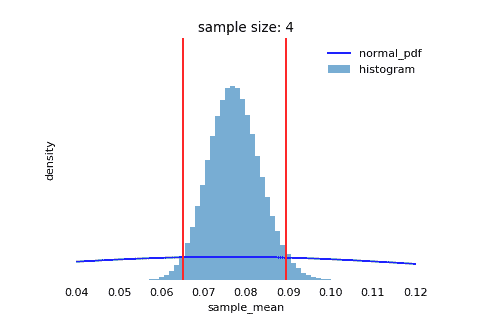
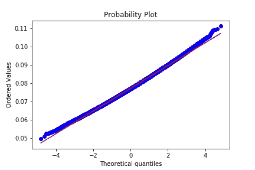
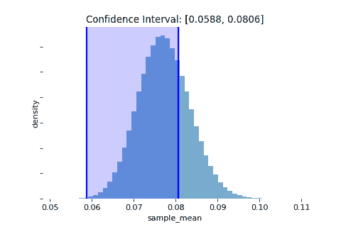

# 理解置信区间

> 原文：<https://towardsdatascience.com/understanding-confidence-interval-d7b5aa68e3b?source=collection_archive---------8----------------------->

## *思考频率主义者，而不是贝叶斯:在 Udacity 参与度数据集上模拟一百万次实验*

> "我们有 95%的把握总体均值落在置信区间内."

事实证明，上述说法具有误导性。置信区间是一个源于频率统计的概念，而陈述表达了贝叶斯信念。在本文中，我们将通过对真实数据的模拟实验来找出置信区间的真正含义。

频率主义者和贝叶斯统计之间的区别是根本性的。教科书上的例子是抛硬币。一个经常光顾的统计学家会将硬币抛 100 万次，如果观察到 50 万个头像，他会宣布硬币是公平的。贝叶斯统计学家会从硬币是否公平的先验信念开始，当他抛硬币时，根据证据逐渐调整他的信念。

在实验背景下，频率主义者认为，无论你相信什么，都只有一个正确的总体均值，而贝叶斯主义者认为总体均值是一个随机变量:你假设它在一个可能值的范围内，你用概率来对冲你的信念。在下面的模拟中，我们将看到为什么**置信区间只能用频率主义的方式**来解释。

**Udacity 参与度数据集**

我们将使用来自 [Udacity](https://github.com/shawlu95/Data-Science-Toolbox/blob/master/concepts/data/engagement.csv) 的参与度数据集。每个数据点都是学生观看视频教程的时间片段。如果一个学生看完了整个课程，他是 100%投入的，他的数据点是 1。啮合遵循指数分布。大多数学生一开始就辍学，只有少数学生完成了整个课程，这并不奇怪。

在现实世界中，我们会将该数据集视为大小为 8702 的样本。但是在这个模拟中，我们将它视为整个人口，并从中抽取 100 万个大小为 300 的样本(这个过程称为 Bootstrap 抽样)。因为我们这里有完整的总体，我们可以很容易地看出，抽样分布的均值是总体均值的无偏估计量(0.07727)。此外，很容易确认经验计算的标准误差与分析的标准误差相同(0.0062)。

总体分布显然不是正态的，但是中心极限定理保证了抽样分布是正态的，给定足够大的样本量(300 就足够了)。如密度图所示，抽样分布确实非常正常。我添加了两条垂直线，标记平均值上下 1.96 的标准误差。这是双尾显著性水平为 0.05 的 z 得分。在正态分布中，有 2.5%以上的概率，和 2.5%以下的概率。

在我们的例子中，我们有 2.06%的下尾部和 2.83%的上尾部。抽样分布是正偏的，因为我们不能有负值。这和 QQ 剧情一致。在低端，极值出现的频率低于正常预期，而在高端，极值出现的频率高于正常预期。

但实际上，这种抽样分布不仅仅满足正态假设:大多数数据点恰好落在 QQ 图对角线上。这是一个重要的健全性检查:正态抽样分布是 z-检验和 t-检验的基本假设(稍后将详细介绍 t-检验)。如果抽样分布不正态，所有测试结果无效。

事实上，我们不知道总体均值或标准误差。毕竟知道了总体均值，就不需要统计检验或者置信区间了！此外，我们不能成为常客。没有人有钱或时间去画一百万个样本，或者把一枚硬币掷一百万次。我们通常只获得一个样本，计算样本平均值和平均值的标准误差，加上和减去一些标准误差的 t 分数倍数，以获得我们的置信区间。

**一个常客模拟**

如果我们能提取几十万个样本呢？我们已经模拟了一百万个样本。在下面的代码中，我们为每个样本建立了一个置信区间，并检查总体均值是否在置信区间内。请记住，我们已经精确地计算出人口平均值为 0.07727。

结果是 94.4%的置信区间捕捉到了总体均值。这就是置信区间的真正含义:*如果我们无限次重复抽样程序，大约 95%的置信区间将包含总体均值。*

换句话说，大约有 5%的置信区间没有捕捉到总体均值。在下图中，当蓝色点(上限)低于总体平均值时，或者当橙色点(下限)高于总体平均值时，就会发生这种情况。

Visualizing upper and lower bounds of confidence intervals

那么为什么贝叶斯解释不准确呢？给定任何一个置信区间，我们都不能对总体均值本身做出任何陈述。我们不知道它是属于包含总体均值的 95%区间，还是不属于总体均值的剩余 5%。我们甚至不能推断数据在置信区间内的分布。置信区间可以包含细尾的一部分，或者正好位于总体均值的中心。

A confidence interval could cover any part of the distribution

总之，我们对数据如何在置信区间内分布一无所知，更不用说它是否包含总体均值了。*我们能做的陈述是关于置信区间的边界，而不是总体均值的位置。*

**结论**

本文主要研究总体均值的置信区间。我们经常会遇到关于比例(z 检验)和线性回归参数的置信区间。尽管如此，解释是一样的。

我们生活在一个贝叶斯世界。一个人说“我们 95%有信心……”你的经理毕竟不想重复一百万次实验，这很容易被原谅，但是当我们告诉别人这意味着什么时，我们不应该忘记置信区间是一个频繁出现的概念。

## 延伸阅读

下面的博客涵盖了与 AB 测试相关的主题，以及对本文中提到的关键概念的更深入的回顾。

*   可视化贝塔分布和贝叶斯更新[ [链接](/visualizing-beta-distribution-7391c18031f1)
*   A/B 测试的威力[ [环节](/the-power-of-a-b-testing-3387c04a14e3)
*   超越 A/B 测试:多臂强盗实验[ [链接](/beyond-a-b-testing-multi-armed-bandit-experiments-1493f709f804) ]
*   你知道可信区间[ [链接](/do-you-know-credible-interval-e5b833adf399#bce7)吗
*   代码在我的 Kaggle [笔记本](https://www.kaggle.com/shawlu/understanding-confidence-interval)里。