# 理解卷积神经网络:CNN——Eli 5 方式

> 原文：<https://towardsdatascience.com/understanding-convolution-neural-networks-the-eli5-way-785330cd1fb7?source=collection_archive---------14----------------------->

## ELI5 项目机器学习

Photo by [Efe Kurnaz](https://unsplash.com/@efekurnaz?utm_source=medium&utm_medium=referral) on [Unsplash](https://unsplash.com?utm_source=medium&utm_medium=referral)

通用逼近定理表示，前馈神经网络(也称为**多层神经元网络**)可以作为强大的逼近器来学习输入和输出之间的非线性关系。但是前馈神经网络的问题是，由于网络内存在许多要学习的参数，网络容易过度拟合。

我们是否可以拥有另一种类型的神经网络，它可以学习复杂的非线性关系，但参数较少，因此容易过拟合？。**卷积神经网络** (CNN)是另一种类型的神经网络，可用于使机器能够可视化事物并执行任务，如图像分类、图像识别、对象检测、实例分割等，这是 CNN 最常用的一些领域。

# 概述

在本文中，我们将深入探讨卷积神经网络的工作原理。本文大致分为两个部分:

1.  在第一部分中，我们将讨论卷积运算在不同输入(1D、2D 和 3D 输入)中的工作原理。
2.  在第二部分，我们将探讨卷积神经网络的背景以及它们与前馈神经网络的比较。之后，我们将讨论 CNN 的关键概念。

> 引用说明:本文的内容和结构基于四分之一实验室——[pad hai](https://padhai.onefourthlabs.in/)的深度学习讲座。

# 1D 卷积运算

让我们从基础开始。在本节中，我们将了解什么是卷积运算，它实际上是做什么的！。

想象一下，有一架飞机从阿里格纳安娜国际机场(印度钦奈)起飞，向英迪拉·甘地国际机场(印度新德里)飞去。通过使用某种仪器，你可以定期测量飞机的速度。在典型的情况下，我们的设备可能不是 100%准确，因此我们可能希望采用过去值的平均值，而不是依赖设备的最新读数。

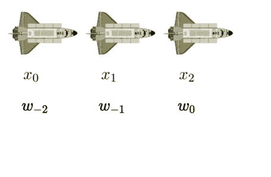

Readings of aircraft

由于这些读数是在不同的时间步长获取的，而不是简单的平均读数，我们希望给予最近的读数比以前的读数更大的重要性，即…给当前读数分配更大的权重，给以前的读数分配较小的权重。

假设在当前时间步分配给读数的权重是 w₀，先前读数的权重是 w₋₁，依此类推。权重按递减顺序分配。从数学的角度来看，想象一下，我们有无限多的飞机读数，在每一个时间步，我们都有分配给该时间步的权重，一直到无穷大。那么当前时间步长的速度由(Sₜ)给出，

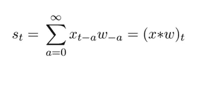

The weighted sum of all values

让我们举一个简单的例子，看看如何使用上面的公式计算当前时间步长的读数。

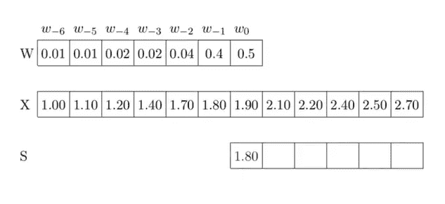

从上图可以看出，我们想计算飞机在当前时间步(t₀).)的速度我们从仪器中得到的实际速度是 1.90，我们不相信这个值，所以我们将通过取以前读数的加权平均值以及它们的重量来计算一个新值。我们从这个操作中获得的新读数是 1.80。

> 在卷积运算中，我们得到一组输入，我们根据所有先前输入及其权重计算当前输入的值。

在这个例子中，我没有谈到我们如何获得这些权重，不管这些权重是对还是错。现在，我们只关注卷积运算是如何工作的。

# 2D 卷积运算

在上一节中，我们已经了解了卷积运算在 1D 输入中的工作原理。简而言之，我们将特定输入的值重新估计为其周围输入的加权平均值。让我们讨论一下如何将同样的概念应用于 2D 输入。

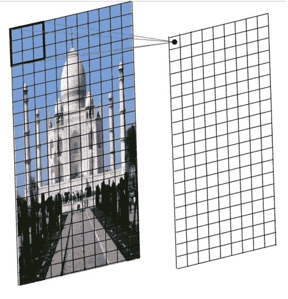

Convolution with 2D filter

为了便于解释，我把上面显示的图像看作只有一个颜色通道的灰度图像。想象一下，上图中的每个像素都是由照相机拍摄的读数。如果我们想要重新估计任何像素的值，我们可以取其邻居的值，并计算这些邻居的加权平均值，以获得重新估计的值。该操作的数学公式由下式给出:

*哪里有*，

k-表示分配给像素值的权重的矩阵。它有两个索引 a，b——a 表示行，b 表示列。

I-包含输入像素值的矩阵。

sᵢⱼ-某一位置像素的重新估计值。

让我们举个例子来理解公式的工作原理。假设我们有一个泰姬陵的图像和 3x3 的权重矩阵(也称为内核)。在卷积运算中，我们对图像施加核，使得感兴趣的像素与核的中心对齐，然后我们将计算所有邻域像素的加权平均值。然后，我们将从左到右滑动内核，直到它通过整个宽度，然后从上到下计算图像中所有像素的加权平均值。卷积运算看起来像这样，

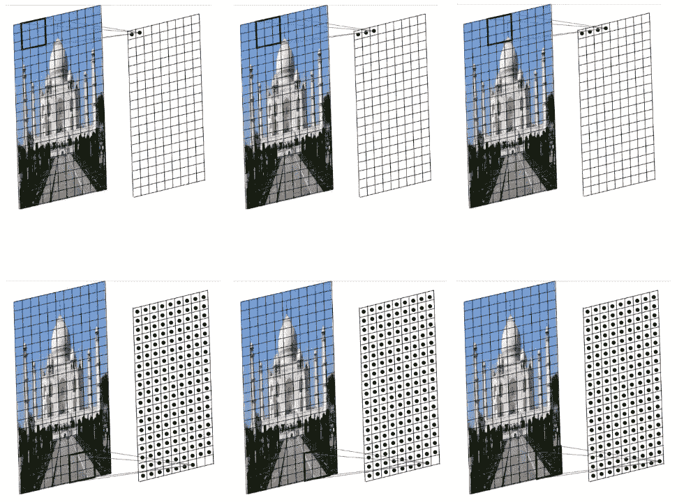

## 模糊图像

考虑我们将使用 3×3 单位核矩阵来重新估计图像中的像素值。我们这样做的方法是系统地检查图像中的每个像素，并放置内核，使像素位于内核的中心。然后将该像素的值重新估计为其所有邻居的加权和。

blur

在这个操作中，我们平均取 9 个邻居，包括像素本身。因此，合成的图像会变得模糊或平滑。

# 使用 3D 滤波器的 2D 卷积

在 3D 输入的情况下，如何执行卷积运算？

到目前为止，我们看到的任何图像都是 3D 图像，因为有 3 个输入通道——红色、绿色和蓝色(RGB ),但为了便于解释，我们忽略了这一点。但是，在本节中，我们将考虑原始形式的图像，即… 3D 输入。在 3D 图像中，每个像素都有 3 个值，分别代表红色、绿色和蓝色值。

在 2D 输入中，我们在水平和垂直方向滑动内核(也是 2D)。在 3D 输入中，我们将使用 3D 内核，这意味着图像和内核的深度是相同的。由于内核和图像具有相同的深度，因此内核不会随深度移动。

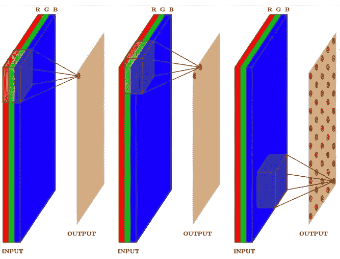

类似于 2D 卷积运算，我们将在水平方向上滑动内核。每次我们移动内核时，我们都要对整个 3D 邻域进行加权平均，即 RGB 值的加权邻域。因为我们只在两个维度上滑动内核——从左到右和从上到下，所以该操作的输出将是 2D 输出。

> 尽管我们的输入是 3D 的，核是 3D 的，但是我们执行的卷积运算是 2D 的，这是因为滤波器的深度与输入的深度相同。

## 我们可以对同一个图像应用多个滤镜吗？

实际上，我们可以在同一幅图像上一个接一个地应用具有不同值的多个核，而不是应用一个核，这样我们就可以获得多个输出。

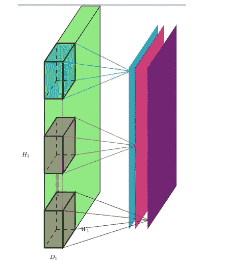

Application of Multiple Filters

所有这些输出可以堆叠在一起，形成一个卷。如果我们对输入应用三个过滤器，我们将得到深度等于 3 的输出。卷积运算的输出深度等于应用于输入的过滤器数量。

# 计算输出尺寸

到目前为止，在前面的章节中，我们已经了解了卷积运算在不同输入情况下的工作原理。在这一节中，我们将讨论如何计算卷积运算后输出的维数？。

假设我们有大小为 7x7 的 2D 输入，我们从图像的左上角开始对图像应用 3x3 的过滤器。当我们在图像上从左到右从上到下滑动内核时，很明显输出小于输入，即… 5x5。

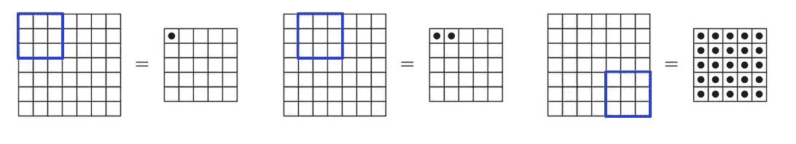

> 为什么产量变小了？

因为我们不能把内核放在角落，因为它会穿过输入边界。图像外的像素值是不确定的，所以我们不知道如何计算该区域像素的加权平均值。

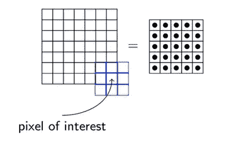

对于输入中的每个像素，我们不是计算加权平均值和重新估计像素值。这适用于图像中存在的所有阴影像素(至少对于 3x3 内核)，因此输出的大小将会减小。这个操作被称为**有效填充**。

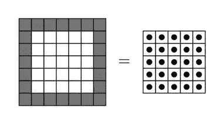

> 如果我们希望输出和输入的大小相同呢？

原始输入的大小是 7x7，我们也希望输出大小是 7x7。因此，在这种情况下，我们可以在输入周围均匀地添加一个带有零的人工填充，这样我们就可以将内核 **K** (3x3)放在角点像素上，并计算邻居的加权平均值。

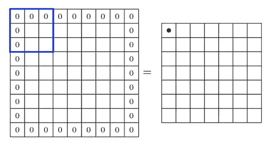

通过在输入周围添加这种人工填充，我们能够保持输出的形状与输入相同。如果我们有一个更大的内核( **K** 5x5)，那么我们需要应用的填充量也会增加，这样我们就能够保持相同的输出大小。在此过程中，输出的大小与输出的大小相同，因此得名 **Same Padding (P)** 。

到目前为止，我们已经在图像中看到，我们以一定的间隔从左到右滑动内核(过滤器)，直到它通过图像的宽度。然后我们从上到下滑动，直到整个图像横向移动。**步距****【S】**定义应用过滤器的间隔。通过选择大于 1 的步幅(间隔),当我们计算邻居的加权平均值时，我们跳过了几个像素。步幅越高，输出图像的尺寸越小。

如果我们将本节所学的内容结合到一个数学公式中，就可以帮助我们找到输出图像的宽度和深度。公式应该是这样的，

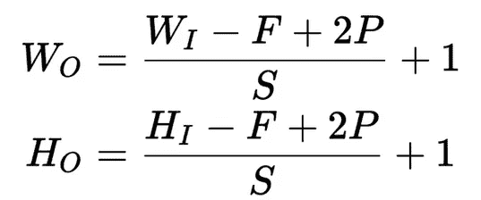

最后，对于输出的深度，如果我们对输入应用' **K** '滤波器，我们将得到' **K** '这样的 2D 输出。因此，输出的深度与过滤器的数量相同。

# 卷积神经网络

> 我们是如何得到卷积神经网络的？

在我们讨论卷积神经网络之前，让我们回到过去，了解在前深度学习时代如何进行图像分类。这也是为什么我们更喜欢卷积神经网络用于计算机视觉的一个动机。

Photo by [Dominik Scythe](https://unsplash.com/@drscythe?utm_source=medium&utm_medium=referral) on [Unsplash](https://unsplash.com?utm_source=medium&utm_medium=referral)

让我们以图像分类为例，我们需要将给定的图像分类到其中一个类别中。实现这一点的早期方法是展平图像，即将 30×30×3 的图像展平为 2700 的向量，并将该向量输入到任何机器学习分类器，如 SVM、朴素贝叶斯等。此方法的关键要点是，我们将原始像素作为输入输入到机器学习算法，并学习图像分类的分类器参数。

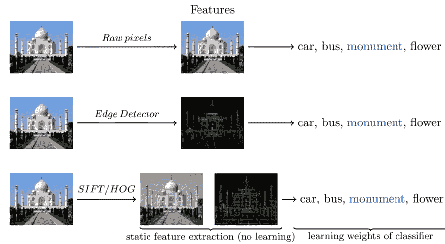

从那以后，人们开始意识到并不是图像中的所有信息对于图像分类都是重要的。在这种方法中，我们不是将原始像素传递到分类器中，而是通过应用一些预定义或手工制作的过滤器(例如，在图像上应用边缘检测器过滤器)来预处理图像，然后将预处理的表示传递到分类器。

一旦特征工程(预处理图像)开始给出更好的结果，像 SIFT/HOG 这样的改进算法就被开发出来，以生成图像的精确表示。由这些方法生成的特征表示是静态的，即……在生成表示时不涉及学习，所有的学习都被推送到分类器。

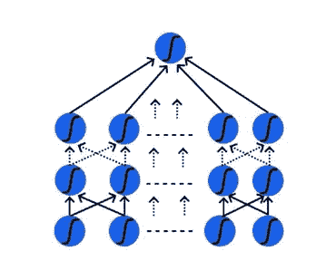

而不是手动生成图像的特征表示。为什么不将图像展平成 2700×1 的向量，并将其传递到**前馈神经网络**或多层神经元网络(MLN)中，以便网络也可以学习特征表示？

与 SIFT/HOG、边缘检测器等静态方法不同，我们不固定权重，而是允许网络通过反向传播进行学习，从而降低网络的整体损耗。前馈神经网络可以学习图像的单个特征表示，但是在复杂图像的情况下，神经网络将不能给出更好的预测，因为它不能学习图像中存在的像素依赖性。

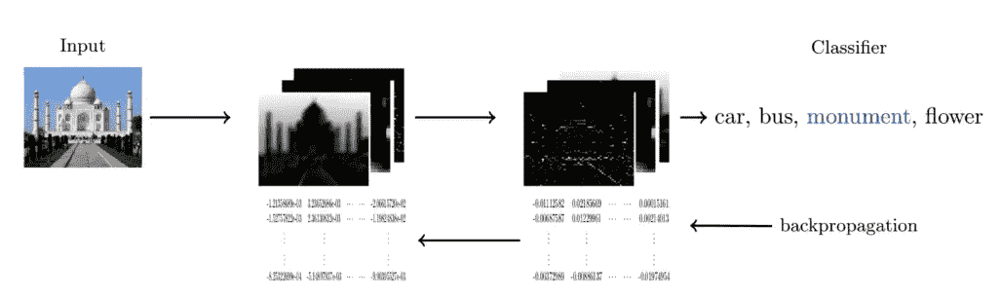

卷积神经网络可以通过应用不同的滤波器/变换来学习图像的多层特征表示，使得它能够保持图像中存在的空间和时间像素依赖性。在 CNN 中，网络要学习的参数数量明显低于 MLN，因为稀疏连接和网络中的权重共享允许 CNN 传输得更快。

# 稀疏连接和权重共享

在第节中，我们将了解前馈神经网络和卷积神经网络在稀疏连接和权重共享方面的区别。

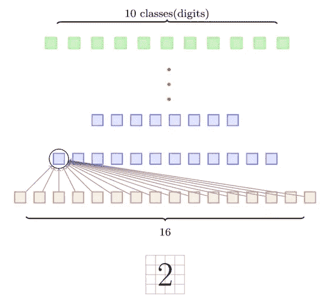

假设我们正在执行一项数字识别任务，我们的输入是 16 个像素。在前馈神经网络的情况下，输入/隐藏层中的每个神经元都连接到前一层的所有输出，即…它对连接到该神经元的所有输入进行加权平均。

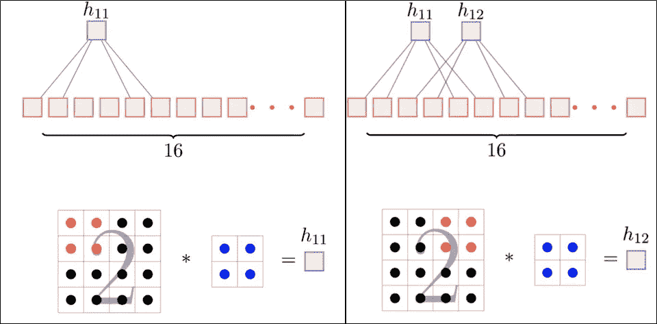

在卷积神经网络中，通过在图像上叠加核，我们一次只考虑几个输入来计算所选像素输入的加权平均值。使用稀疏得多的连接而不是考虑所有连接来计算输出 h₁₁。

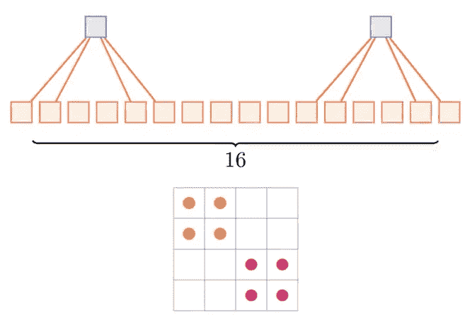

请记住，当我们试图计算输出 h₁₁时，我们只考虑了 4 个输入，对于输出 h₁₂.也是如此需要注意的重要一点是，我们使用相同的 2x2 内核来计算 h₁₁和 h₁₂，即使用相同的权重来计算输出。不像在前馈神经网络中，隐藏层中存在的每个神经元将具有单独的权重。这种利用输入的相同权重来计算加权平均值的现象被称为**权重共享。**

# 汇集层

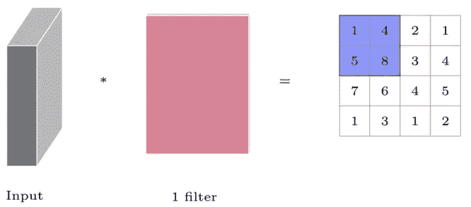

考虑我们有一个长度、宽度和深度为 3 个通道的输入体积。当我们对输入应用相同深度的滤波器时，我们将得到 2D 输出，也称为输入的特征图。一旦我们得到了特征图，我们通常会执行一个叫做**汇集操作**的操作。因为学习图像中存在的复杂关系所需的隐藏层的数量将是巨大的。我们应用池操作来减少输入特征表示，从而减少网络所需的计算能力。

一旦我们获得了输入的特征映射，我们将在特征映射上应用一个确定形状的过滤器，以从特征映射的该部分获得最大值。这就是所谓的**最大池**。它也被称为**子采样**，因为我们从内核覆盖的整个特征图部分采样一个最大值。

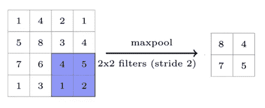

类似于最大池，**平均池**计算内核覆盖的特征图的平均值。

# 全连接层

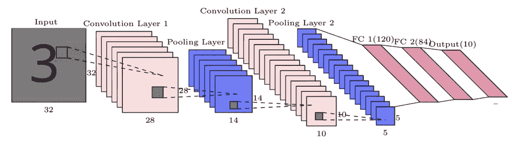

LeNet — 5

一旦我们对图像的特征表示进行了一系列卷积和汇集操作(最大汇集或平均汇集)。我们将最终池层的输出展平为一个向量，并通过具有不同数量的隐藏层的完全连接的层(前馈神经网络)来学习特征表示中存在的非线性复杂性。

最后，完全连接的层的输出通过所需大小的 Softmax 层。Softmax 层输出一个概率分布向量，帮助执行图像分类任务。在数字识别器的问题中(如上所示),输出 softmax 层有 10 个神经元，用于将输入分类为 10 个类别(0-9 个数字)中的一个。

Photo by [Fab Lentz](https://unsplash.com/@fossy?utm_source=medium&utm_medium=referral) on [Unsplash](https://unsplash.com?utm_source=medium&utm_medium=referral)

# 继续学习

如果你想用 Keras & Tensorflow 2.0 (Python 或者 R)学习更多关于人工神经网络的知识。查看来自 Starttechacademy[的 Abhishek 和 Pukhraj 的](https://courses.starttechacademy.com/full-site-access/?coupon=NKSTACAD)[人工神经网络](https://courses.starttechacademy.com/full-site-access/?coupon=NKSTACAD)。他们以一种简单化的方式解释了深度学习的基础。

# 结论

在这篇文章中，我们已经讨论了卷积运算如何在不同的输入上工作，然后我们继续讨论了一些导致 CNN 的图像分类的原始方法。之后，我们讨论了 CNN 的工作，也了解了卷积神经网络的一些重要技术方面。最后，我们看了在 CNN 的《学习复杂关系》的末尾附上 MLN 的来解决图像分类问题背后的原因。

*推荐阅读*

 [## 深度学习:解释前馈神经网络

### 你的第一个深度神经网络

medium.com](https://medium.com/hackernoon/deep-learning-feedforward-neural-networks-explained-c34ae3f084f1)  [## 使用免费 GPU 在 Google Collab 中开始使用 Pytorch

### 在 CUDA 支持下学习 Colab 中的 Pytorch

medium.com](https://medium.com/hackernoon/getting-started-with-pytorch-in-google-collab-with-free-gpu-61a5c70b86a) 

在我的下一篇文章中，我们将讨论如何使用 Pytorch 可视化卷积神经网络的工作。所以确保你在媒体上跟踪我，以便在它下降时得到通知。

直到那时和平:)

NK。

你可以在 [LinkedIn](https://www.linkedin.com/in/niranjankumar-c/) 上联系我，或者在 [twitter](https://twitter.com/Nkumar_283) 上关注我，了解关于深度学习和人工智能的最新文章。

**免责声明** —这篇文章中可能有一些相关资源的附属链接。你可以以尽可能低的价格购买捆绑包。如果你购买这门课程，我会收到一小笔佣金。