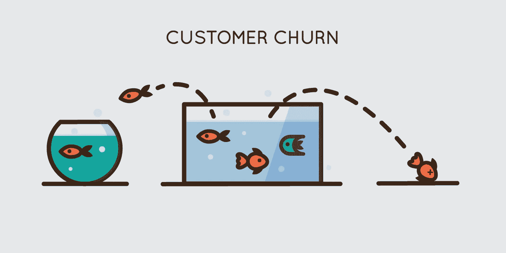
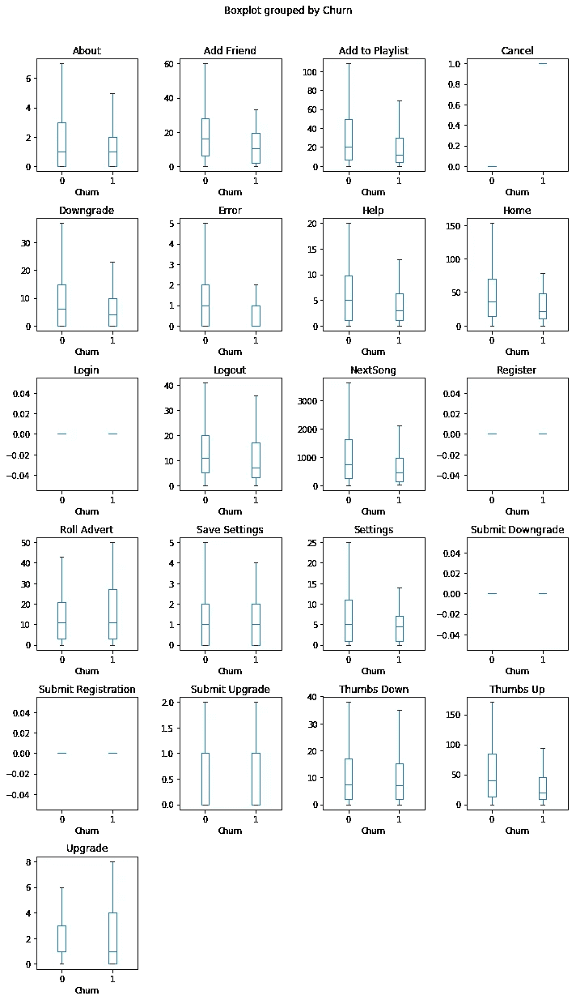
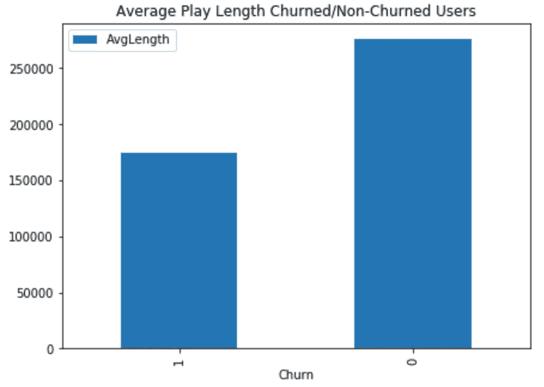
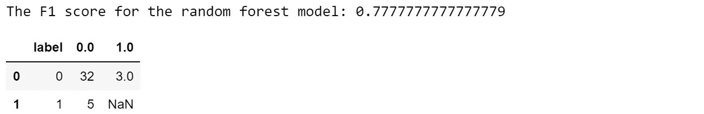
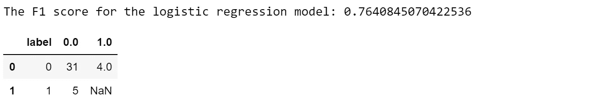
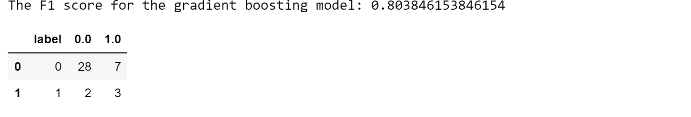
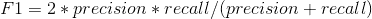
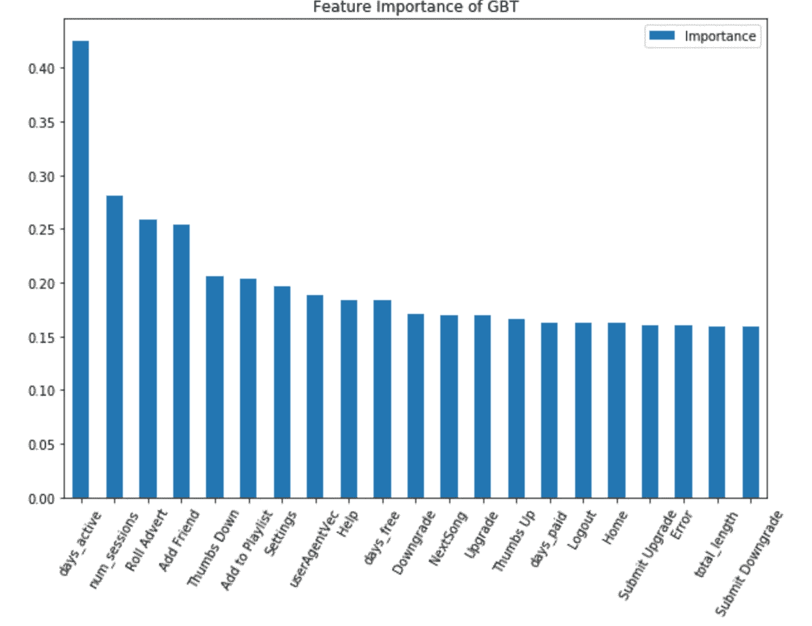

# 利用大数据分析了解客户流失

> 原文：<https://towardsdatascience.com/understanding-customer-churning-with-big-data-analytics-70ce4eb17669?source=collection_archive---------12----------------------->

## 如何利用数据科学为您的企业带来价值的实例


Photo by [Matt Hoffman](https://unsplash.com/@__matthoffman__?utm_source=unsplash&utm_medium=referral&utm_content=creditCopyText) on [Unsplash](https://unsplash.com/s/photos/water-leak?utm_source=unsplash&utm_medium=referral&utm_content=creditCopyText)

猜猜看。目前世界上最有价值的资产是什么？

不是黄金，不是原油……是数据。您一定听说过流行的术语“大数据”，并且想知道这个术语到底是什么意思。想想你最喜欢的音乐流媒体服务——Spotify、Pandora 等。在世界各地，每秒钟都有许多不同的用户登录到该服务，与该服务进行公平的交互。由于每一次移动都对应一个可收集的数据点，所以您可以想象存储如此大的数据会面临怎样的挑战。

幸运的是，如果以正确的方式使用，这些大型数据集可以为企业带来真正的价值。在这篇博文中，我们将讨论这些大数据集的一个常见用例——预测客户流失。

**了解流失**

客户流失指的是从大量客户中悄悄流失客户的行为。一些客户可能会转向竞争对手，而一些人可能会永远离开服务。



开始时可能不明显，但随着时间的推移，这种损失的影响会逐渐积累。作为这些音乐流媒体服务提供商的决策者，我们希望了解这种搅动行为的成因，这将成为我们今天项目的主要目标。

我们将从检查可用的数据集开始。

完整的数据集是存储在 12 GB 中的用户日志。json 文件——这个大小只能由一些大数据工具处理，比如 Spark。为了充分理解可用的字段，我们将从获取数据的一个小子集(大约 128 MB)开始，以便在单台机器上进行探索性的数据分析。我们将通过以下命令加载数据集，

```
# create a Spark session
**spark = (SparkSession.builder 
                    .master("local") 
                    .appName("Creating Features") 
                    .getOrCreate())**# Read in .json file as events **events = spark.read.json('mini_sparkify_event_data.json')
events.persist()**
```

Spark 有一个很棒的单行快捷方式，可以显示所有字段及其各自的数据类型

```
**events.printSchema()**root
 |-- artist: string (nullable = true)
 |-- auth: string (nullable = true)
 |-- firstName: string (nullable = true)
 |-- gender: string (nullable = true)
 |-- itemInSession: long (nullable = true)
 |-- lastName: string (nullable = true)
 |-- length: double (nullable = true)
 |-- level: string (nullable = true)
 |-- location: string (nullable = true)
 |-- method: string (nullable = true)
 |-- page: string (nullable = true)
 |-- registration: long (nullable = true)
 |-- sessionId: long (nullable = true)
 |-- song: string (nullable = true)
 |-- status: long (nullable = true)
 |-- ts: long (nullable = true)
 |-- userAgent: string (nullable = true)
 |-- userId: string (nullable = true)
```

在查看数据集的头部后，我们会发现所有的用户交互都记录在*页面的*列中。

当大多数用户继续播放下一首歌曲时，有一些用户进入了“取消”页面——他们都通过“取消确认”页面确认了他们的取消(参见相同数量的“取消”和“取消确认”.**我们将搅动活动具体定义为取消确认的数量**。第*页*列有“取消确认”的用户将是我们特别感兴趣的搅动用户。

**特征工程**

我们已经成功地识别了流失的用户，现在是时候用我们的商业思维来思考用户流失的影响因素了。 ***如果你真的很讨厌你的音乐流媒体服务，你会怎么做？*** 我想出了下面 7 个特性，

1.  **代表性用户互动**



我们有理由期待其他一些用户互动最终会导致我们的用户流失。我们可以使用箱线图来执行第一级过滤。箱线图将有效地帮助我们可视化特定数据分布的最小值、第 25 个百分点、平均值、第 75 个百分点和最大值。通过绘制搅动和非搅动用户的箱线图，我们可以清楚地解释特定交互中两类用户之间的差异。

以下相互作用显示了两组之间的显著分布差异，

*   添加好友——喝醉的用户不太可能添加好友
*   **添加到播放列表** —喝醉的用户不太可能添加到播放列表
*   **升级** —被搅动的用户有各种各样的升级活动
*   **下一首歌**——喝醉的用户不太可能播放下一首歌
*   **拇指朝上**——喝醉的用户不太可能竖起大拇指
*   **滚动广告**——被搅动的用户在滚动广告上有更广泛的传播
*   **设置** —搅动的用户不太可能访问设置页面
*   **注销** —大量用户不太可能注销(由于登录次数减少)
*   **帮助**——不焦虑的用户更有可能寻求帮助
*   首页——不安的用户不太可能访问主页

请注意，我们所有的用户交互都在同一列中，我们需要透视和聚合每个客户的某个交互的总数。基于以上筛选，我们将去掉一些不太重要的交互。

```
**events = events.drop('firstName', 'lastName', 'auth',
                      'gender', 'song','artist',
                      'status', 'method', 'location', 
                      'registration', 'itemInSession')****events_pivot = (events.groupby(["userId"])
                      .pivot("page")
                      .count()
                      .fillna(0))****events_pivot = events_pivot.drop('About', 'Cancel', 'Login',  
                                 'Submit Registration','Register',
                                 'Save Settings')**
```

2.**平均音乐播放时间**

对我自己来说，我使用它的时间可能会比普通用户短。因此，**用户花在播放音乐上的平均时间长度**将是一个非常重要的因素。一个简单的可视化显示确认结果如下。



我们将把这个特性添加到我们的 *events_pivot* 表中，

```
# filter events log to contain only next song
**events_songs = events.filter(events.page == 'NextSong')**# Total songs length played
**total_length = (events_songs.groupby(events_songs.userId)
                           .agg(sum('length')))**# join events pivot
**events_pivot = (events_pivot.join(total_length, on = 'userId', 
                                  how = 'left')
                     .withColumnRenamed("Cancellation Confirmation",
                                        "Churn")
                     .withColumnRenamed("sum(length)", 
                                        "total_length"))**
```

3.**活动天数**

我们还期望搅动组和非搅动组之间活动天数的差异。由于 datetime 列只包含以秒为单位的单位，我们将需要使用一个窗口函数来合计每个客户的总活动时间，并将该值转换为天数。我们将把这个特性添加到 *events_pivot* 中。

```
**convert = 1000*60*60*24** # conversion factor to days# Find minimum/maximum time stamp of each user
**min_timestmp = events.select(["userId", "ts"])
                     .groupby("userId")
                     .min("ts")****max_timestmp = events.select(["userId", "ts"])
                     .groupby("userId")
                     .max("ts")**# Find days active of each user
**daysActive = min_timestmp.join(max_timestmp, on="userId")
daysActive = (daysActive.withColumn("days_active", 
                      (col("max(ts)")-col("min(ts)")) / convert))****daysActive = daysActive.select(["userId", "days_active"])**# join events pivot
**events_pivot = events_pivot.join(daysActive, 
                                 on = 'userId',
                                 how = 'left')**
```

4.**付费用户的天数**

类似地，我们也可以通过使用窗口函数来计算付费用户的天数，我们只需要为要成为付费用户的客户添加一个过滤器。

```
# Find minimum/maximum time stamp of each user as paid user
**paid_min_ts = events.filter(events.level == 'paid')
                    .groupby("userId").min("ts")****paid_max_ts = events.filter(events.level == 'paid')
                    .groupby("userId").max("ts")**# Find days as paid user of each user**daysPaid = paid_min_ts.join(paid_max_ts, on="userId")
daysPaid = (daysPaid.withColumn("days_paid", 
                    (col("max(ts)")-col("min(ts)")) / convert))****daysPaid = daysPaid.select(["userId", "days_paid"])**# join events pivot
**events_pivot = events_pivot.join(daysPaid,
                                 on = 'userId', 
                                 how='left')**
```

5.**免费用户的天数**

现在使用免费用户过滤器，我们可以找到每个客户作为免费用户的天数，

```
# Find minimum/maximum time stamp of each user as paid user
**free_min_ts = events.filter(events.level == 'free')
                    .groupby("userId").min("ts")
free_max_ts = events.filter(events.level == 'free')
                    .groupby("userId").max("ts")**# Find days as paid user of each user
**daysFree = free_min_ts.join(free_max_ts, on="userId")
daysFree = (daysFree.withColumn("days_free", 
                        (col("max(ts)")-col("min(ts)")) / convert))****daysFree = daysFree.select(["userId", "days_free"])**# join events pivot
**events_pivot = events_pivot.join(daysFree, 
                                on = 'userId', 
                                how='left')**
```

6.**会议次数**

音乐播放的次数也可能是一个影响因素。由于这个数据集中有 *sessionId* ，我们可以使用 ***groupby*** 子句直接计算每个用户的惟一 Id 的数量。

```
# count the number of sessions **numSessions = (events.select(["userId", "sessionId"])
                      .distinct()
                      .groupby("userId")
                       .count()
                      .withColumnRenamed("count", "num_session**s"))# join events pivot
**events_pivot = events_pivot.join(numSessions,
                                 on = 'userId',
                                 how = 'left')**
```

7.**用户访问代理**

流服务在不同的用户代理上可能具有不同的性能。我们将尝试在模型中加入这一因素。由于有 56 个不同的用户代理，我们将使用 Spark 的 one-hot 编码器将这些不同的用户代理转换成一个向量。

```
# find user access agents, and perform one-hot encoding on the user 
**userAgents = events.select(['userId', 'userAgent']).distinct()
userAgents = userAgents.fillna('Unknown')**# build string indexer
**stringIndexer = StringIndexer(inputCol="userAgent",      
                              outputCol="userAgentIndex")****model = stringIndexer.fit(userAgents)
userAgents = model.transform(userAgents)**# one hot encode userAgent column
**encoder = OneHotEncoder(inputCol="userAgentIndex", 
                        outputCol="userAgentVec")
userAgents = encoder.transform(userAgents)
                    .select(['userId', 'userAgentVec'])**# join events pivot
**events_pivot = events_pivot.join(userAgents, 
                                 on = 'userId',
                                 how ='left')**
```

**模型构建**

在我们设计了适当的功能后，我们将构建三个模型——逻辑回归、随机森林和梯度推进树。为了避免编写冗余代码，我们将构建 stage 对象，并在管道末端用不同的分类器构建管道。

```
# Split data into train and test set
**events_pivot = events_pivot.withColumnRenamed('Churn', 'label')
training, test = events_pivot.randomSplit([0.8, 0.2])**# Create vector from feature data
**feature_names = events_pivot.drop('label', 'userId').schema.names
vec_asembler = VectorAssembler(inputCols = feature_names,
                               outputCol = "Features")**# Scale each column
**scalar = MinMaxScaler(inputCol="Features", 
                      outputCol="ScaledFeatures")**# Build classifiers
**rf = RandomForestClassifier(featuresCol="ScaledFeatures", 
                            labelCol="label",
                            numTrees = 50, 
                            featureSubsetStrategy='sqrt')****lr = LogisticRegression(featuresCol="ScaledFeatures",  
                        labelCol="label", 
                        maxIter=10,
                        regParam=0.01)****gbt = GBTClassifier(featuresCol="ScaledFeatures", 
                    labelCol="label")**# Consturct 3 pipelines
**pipeline_rf = Pipeline(stages=[vec_asembler, scalar, rf])
pipeline_lr = Pipeline(stages=[vec_asembler, scalar, lr])
pipeline_gbt = Pipeline(stages=[vec_asembler, scalar, gbt])**# Fit the models
**rf_model = pipeline_rf.fit(training)
lr_model = pipeline_lr.fit(training)
gbt_model = pipeline_gbt.fit(training)**
```

现在三个对象 *rf_model* 、 *lr_model* 、 *gbt_model* ，代表了 3 种不同的拟合模型。

**车型评价**

我们将测试拟合模型的性能，并选择具有最佳性能的模型作为最终模型。我们将首先构建一个专门用于此目的的函数，

```
**def modelEvaluations(model, metric, data):**
    """ Evaluate a machine learning model's performance 
        Input: 
            model - pipeline object
            metric - the metric of the evaluations
            data - data being evaluated
        Output:
            [score, confusion matrix]
    """
    # generate predictions
    **evaluator = MulticlassClassificationEvaluator(
                metricName = metric)
    predictions = model.transform(data)**

    # calcualte score
 **score = evaluator.evaluate(predictions)
    confusion_matrix = (predictions.groupby("label")
                                   .pivot("prediction")
                                   .count()
                                   .toPandas())
    return [score, confusion_matrix]**
```

我们将调用上面的函数来评估上面的模型

```
**f1_rf, conf_mtx_rf = modelEvaluations(rf_model, 'f1', test)
f1_lr, conf_mtx_lr = modelEvaluations(lr_model, 'f1', test)
f1_gbt, conf_mtx_gbt = modelEvaluations(gbt_model, 'f1', test)**
```



梯度推进模型在测试集中表现出最好的性能(F1 分数)。F1 分数定义为精确度和召回率的调和平均值，计算如下



精度是计算正确的正类标识的比例，在数学表达式中是这样的

*精度= tp/(tp + fp)*

召回是计算实际正类样本被正确识别的比例，在数学表达式中，

*召回= tp/(tp + fn)*

您可能想知道为什么我们选择更复杂的度量标准而不是最直观的准确性，这是因为数据集中存在不平衡的类分布。**由于只有一小部分用户最终会流失，我们希望我们的模型能够正确识别他们，而不是追求高整体性能**。想象一下，如果只有 6%的客户会在真实的人口分布中流失，预测每个人都不会流失仍然会给我们 94%的准确性。另一方面，F1 分数将惩罚单个班级的不良表现，这将有效地缓解这些问题。不平衡类特征将出现在每个流失预测问题中——F1 将始终是未来使用的指标。

**特征重要性**

我们将利用特征重要性函数，并可视化我们构建的每个特征的相对重要性等级。由于最后一个特性 *userAgentVec* 实际上是一个热编码向量，我们将把 *userAgentVec* 特性视为一个。下面的代码将对从独热编码向量获得的所有子特征的所有特征重要性值求和。

```
**feature_importances = np.array(gbt_model.stages[-1]
                               .featureImportances)****userAgentVec = feature_importances[len(feature_names) :].sum()
feature_importances = feature_importances[:len(feature_names)]
                      + [userAgentVec]**
```

现在我们绘制梯度推进树的特征重要性。



我们构建的大多数功能都是用户流失的重要因素，其中 *days_active* 是最重要的因素。

**全数据集运行**

我们已经构建了适当的框架——我们准备按照上面相同的步骤，使用 AWS 的 EMR 服务让模型在完整的 12 GB 数据集上运行。我们将通过以下方式初始化会话

```
# Create spark session
**spark = (SparkSession 
        .builder 
        .appName("Sparkify") 
        .getOrCreate())**# Read in full sparkify dataset
**event_data = "s3n://dsnd-sparkify/sparkify_event_data.json"
events = spark.read.json(event_data)**
```

我们不再重复这些步骤——我已经在 [nbviewer 网站](https://nbviewer.jupyter.org/github/chenbowen184/Data_Science_Portfolio/blob/master/Capstone%20Project/Spark%20-%20Full%20Dataset.ipynb)上附上了完整的脚本。

最终，梯度推进模式产生了 0.8896 的 **F1 成绩，这是一个很棒的表现。**

```
+-----+----+---+
|label| 0.0|1.0|
+-----+----+---+
|    0|1612| 70|
|    1| 163|344|
+-----+----+---+
```

**经营战略**

我们经历了怎样的旅程——但我们还没有完成我们的使命。在数据科学领域，每个模型背后都有一个商业意图。有了我们创造的功能重要性，我们肯定可以想出一些商业策略来应对客户的抱怨。我们将简要讨论两种可能的策略，它们将真正为我们的提供商带来一些价值。

我们知道**活跃天数是最重要的因素，**我们可以建议**高层管理人员建立一个奖励系统，鼓励低活跃度用户长时间保持在线**。

此外，由于**用户用来访问服务的代理也很重要，**我们还可以**找出表现不佳的代理，并让我们的工程团队专门解决这个问题。**

我希望你能像我喜欢写这篇文章一样喜欢读这篇文章。我们一起使用大数据分析框架 Spark 来构建端到端的机器学习工作流，以从用户日志中识别潜在的音乐流媒体服务客户。我们执行了以下步骤，

1.  探索性数据分析
2.  特征工程
3.  模型结构
4.  模型评估
5.  模型放大
6.  商业策略

由于我们正在处理的数据规模庞大，执行超参数搜索变得尤为困难。可以想象，让笔记本电脑长时间开着并不是使用资源的最有效方式。使用 ssh 来保持程序运行的一些好技巧肯定有助于应对这一挑战。

如果说我们应该从这篇文章中学到什么的话，那就是我们在故事开始时提到的那一点。作为杰出的工程师，我们经常被吸引去通过各种技术构建最好的高性能模型，但是**我们的模型需要解决商业问题才能有价值。**