# 使用 Scikit-Learn 了解决策树分类

> 原文：<https://towardsdatascience.com/understanding-decision-tree-classification-with-scikit-learn-2ddf272731bd?source=collection_archive---------1----------------------->

## 基尼指数、管道和网格研究

Trees! (Source: Author’s Own Work)

决策树是用于分类和回归任务的最基本的机器学习工具之一。在这篇文章中，我将介绍:

1.  以基尼系数作为衡量分裂标准的决策树算法。
2.  决策树在现实数据分类中的应用。
3.  创建一个管道，并使用 [GridSearchCV](https://scikit-learn.org/stable/modules/generated/sklearn.model_selection.GridSearchCV.html) 为分类任务选择最佳参数。所有代码和情节的 GitHub 链接将在文章末尾给出。

让我们开始吧…

## 决策树:

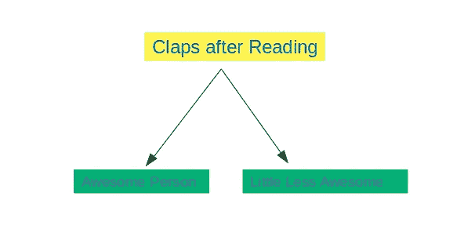

决策树算法的思想是学习一组可以导致决策的 if/else 问题。这里有一个很幼稚的给一个人分类的例子。如果他/她看完博客后拍手称赞，那么这个人被认为很棒，否则，就没那么棒了。该树基于是/否问题。但是即使对于数字数据，这个想法也是一样的。决策树可以结合数字和分类数据。下图显示了决策树中使用的一些术语—

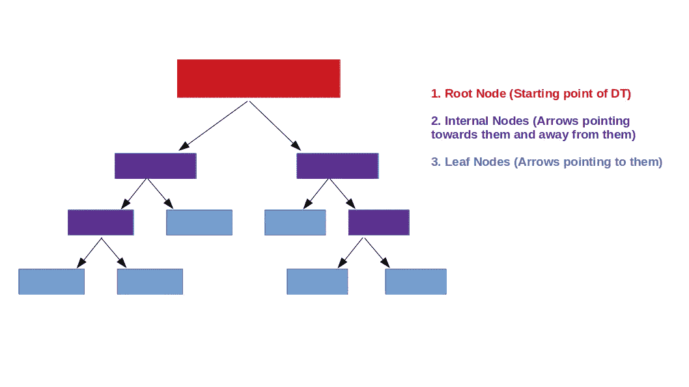

这里我们可以看到节点是如何根据它们在 DT 中的位置来划分的。首先我们需要学习如何选择根节点，这里我们需要学习一个决定节点的标准，基尼系数。

## 基尼杂质:

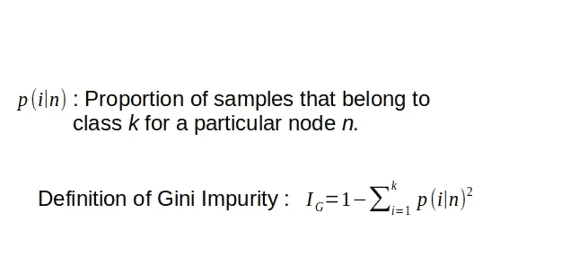

基尼系数是以意大利统计学家[科拉多基尼](https://en.wikipedia.org/wiki/Corrado_Gini)命名的。基尼不纯可以理解为一个最小化误分类概率的标准。为了理解决策树的定义(如图所示)以及我们如何构建决策树，让我们从一个非常[简单的数据集](https://www.kaggle.com/fredericobreno/play-tennis#play_tennis.csv)开始，根据不同的天气条件，我们决定是否玩户外游戏。根据定义，*仅包含一个类别的数据集将具有 0 基尼系数杂质*。*在建立决策树时，我们的想法是选择基尼系数最小的特征作为根节点，以此类推...让我们从简单的数据集开始——*

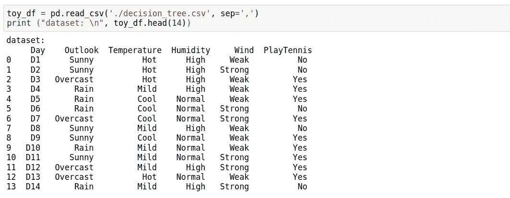

这里我们看到，根据 4 个特征(前景、温度、湿度、风)，决定是否打网球。那么根节点上会有什么特性呢？决定我们将利用基尼系数。先说功能‘Outlook’吧。重要的是要注意，当“展望”是阴天，我们总是出去打网球。该节点只有一类样本(如下图所示)。

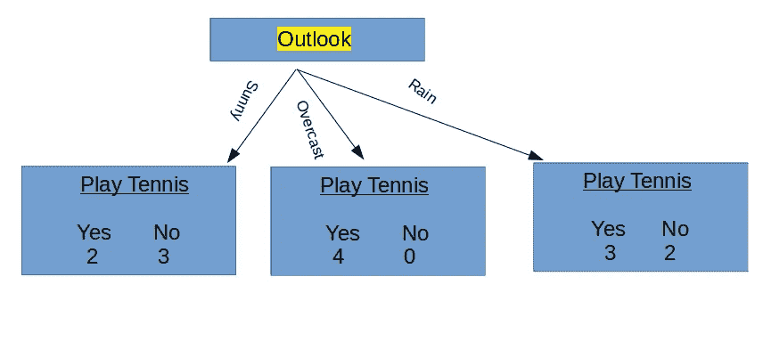

由于这些是分类变量，如果我们想要应用决策树分类器并适合数据，首先我们需要创建虚拟变量。

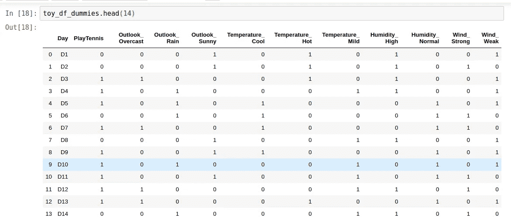

在这里，我们可以确定一件事，一旦我们创建了一个决策树，根节点将肯定是功能' Outlook _ cover '。让我们看看决策树(如下图所示)。当“展望 _ 阴”≤0.5 为假时，即当“展望阴”为 1 时，我们有一个基尼不纯度为 0 的纯样本的叶节点。

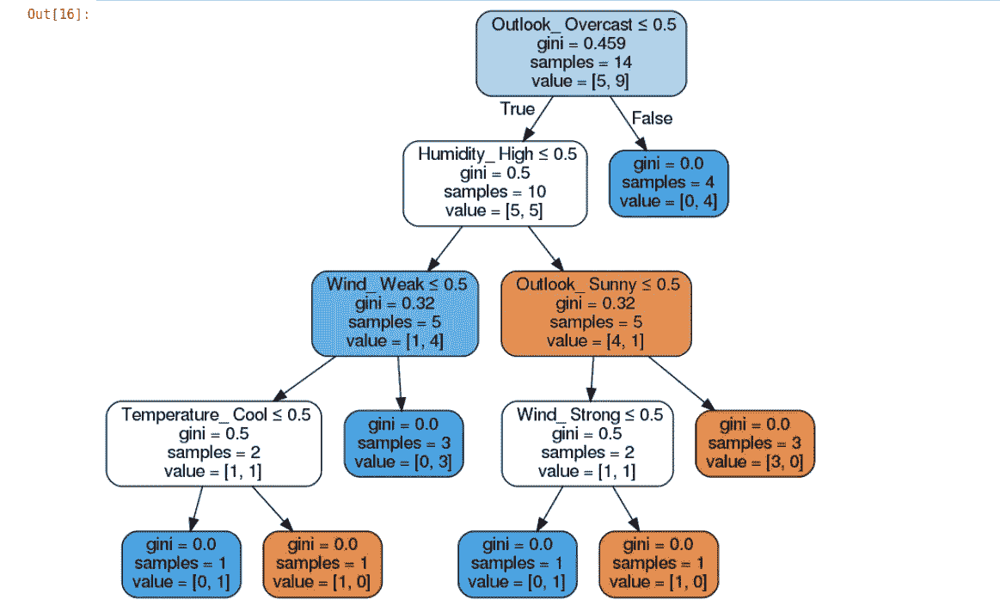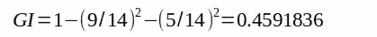

对于根节点，让我们计算基尼系数。由于我们有 9 个 1('是')和 5 个 0('否')，所以基尼杂质是~ 0.459。下一个节点是“湿度 _ 高”,因为该特征将为我们提供最少的基尼系数杂质。对于像这样的小数据集，我们总是可以使用 Pandas 数据框特征来检查这一点，并计算每个特征的基尼系数。一旦我们将“Outlook _ govern”作为根节点，我们将在叶节点中获得 4 个样本(“yes”)。在剩下的 10 个样本中，我们有 5 个“是”和“否”。然后选择“湿度高”作为特征，节点的基尼系数为 0.5，以此类推

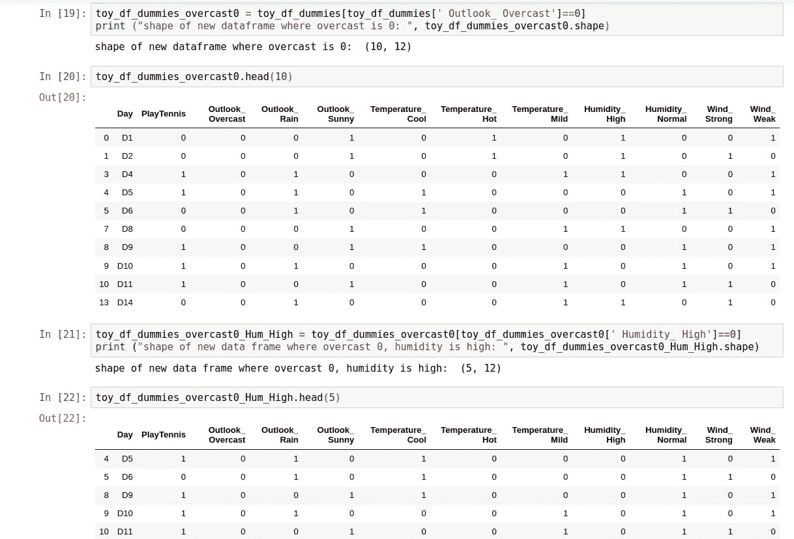

Gini 杂质计算可能比熵计算有一点优势，因为熵需要计算 log [1] [2]，所以为大型数据集构建决策树花费的时间可能更少。《Python 机器学习》一书的作者 Sebastian Raschka 有一篇精彩的博客，讲述了我们为什么使用熵而不是分类错误来构建决策树[3]。看看这个。让我们进入下一节，为一个真实的数据集实现决策树算法。

## 银行定期存款数据集:

这里我将使用加州大学欧文分校机器学习库中的[银行营销数据集](https://archive.ics.uci.edu/ml/datasets/Bank+Marketing)。网站所述数据集的摘要如下

> **摘要**:该数据与一家葡萄牙银行机构的直接营销活动(电话)有关。分类的目标是预测客户是否会认购定期存款(变量 y)。

让我们用熊猫加载数据集

因此有 16 个特征，包括分类变量和数值变量，样本总数为 11162。首先，我们检查标签(“是”、“否”)是如何分布的。我们可以使用下面的 [Seaborn countplot](https://seaborn.pydata.org/generated/seaborn.countplot.html)

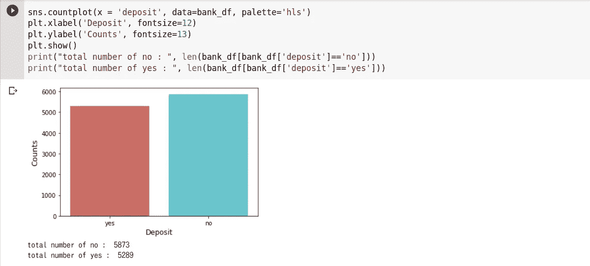

数据集稍微偏向于更多的拒绝次数(“否”)。*因此，稍后当数据集将被分为训练集和测试集时，我们将使用分层。*我们还可以使用 [Matplotlib Hist](https://matplotlib.org/3.1.1/api/_as_gen/matplotlib.pyplot.hist.html) 检查一些数字变量的分布，如下所示

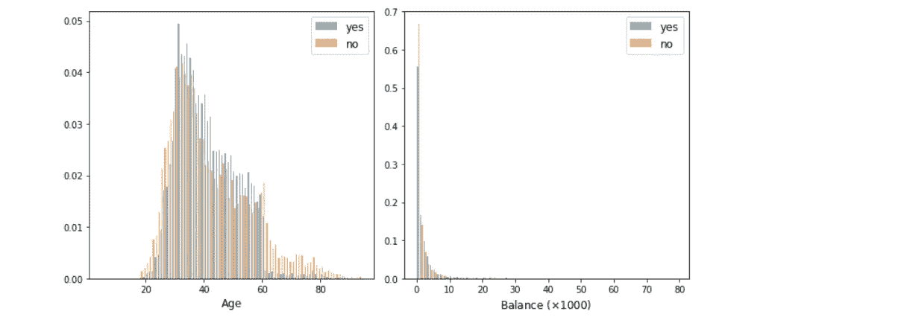

Histogram plots of two numerical features — Age and Balance.

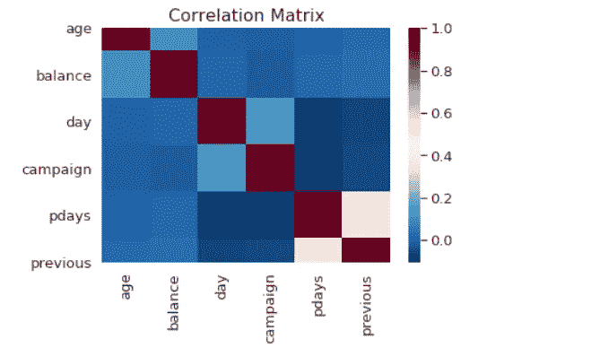

数值变量的相关图(使用 [Seaborn Heatmap](https://seaborn.pydata.org/generated/seaborn.heatmap.html) 绘制)显示特征之间的相关性很小。一旦我们玩够了数据集，就让我们为应用 DT 算法准备数据集。由于有几个分类变量，我们需要将它们转换成虚拟变量。我放弃了“持续时间”这个特性，因为正如在数据集的描述中提到的，这个特性极大地影响了目标变量(当持续时间=0 时，y=“否”)。

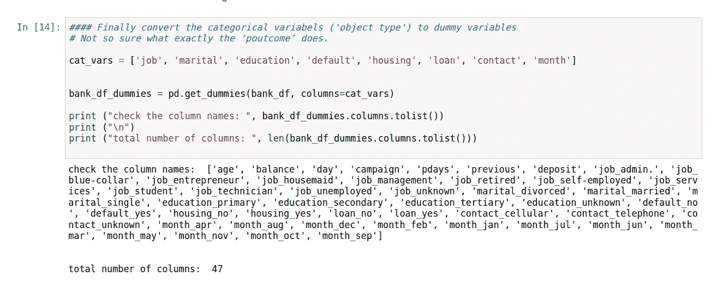

下一步是选择特征和标签—

下一步是将数据集分成训练集和测试集—

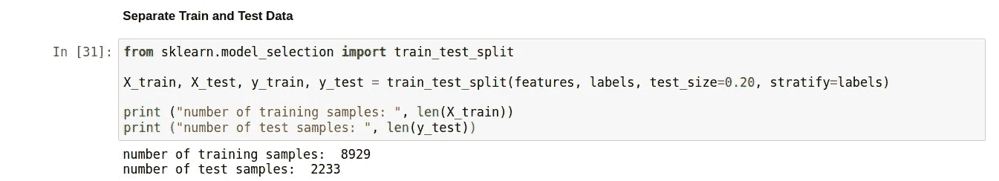

## 应用决策树分类器:

接下来，我创建了一个 [StandardScaler](https://scikit-learn.org/stable/modules/generated/sklearn.preprocessing.StandardScaler.html) (标准化特性)和 DT 分类器的管道(参见下面关于特性标准化的注释)。我们可以从 Scikit-Learn 导入 DT 分类器作为`from sklearn.tree import DecisionTreeClassifier` 。为了确定 DT 分类器的最佳参数(分裂标准和最大树深度)，我还使用了网格搜索交叉验证。下面的代码片段不言自明。

接下来，我应用了 3、4、5 倍交叉验证来确定最佳参数—

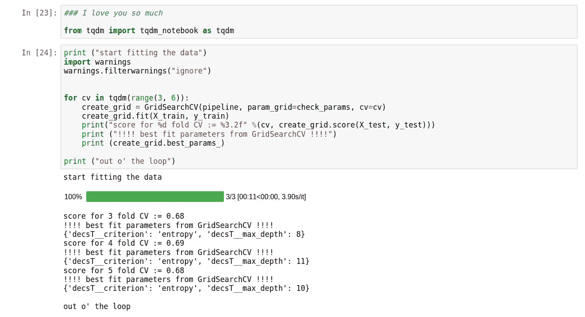

这里我们已经看到，如何在网格搜索交叉验证中成功地应用决策树分类器，来确定和优化最佳拟合参数。因为这个特殊的例子有 46 个特性，所以很难在一个中等大小的页面中可视化这个树。因此，我通过删除“月”特征(因为它创建了虚拟变量的最大数量，12)使数据框更简单，并再次进行拟合过程，特征数量现在是 35。

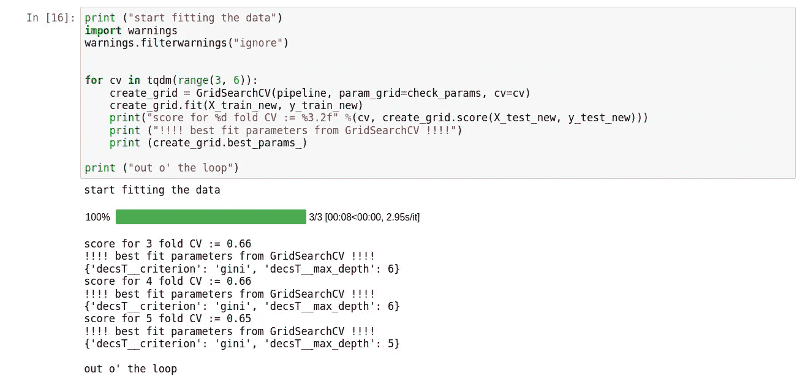

让我们用最大深度 6 和“基尼”作为标准来绘制决策树。使用 Scikit Learn 可视化树需要一些编码—

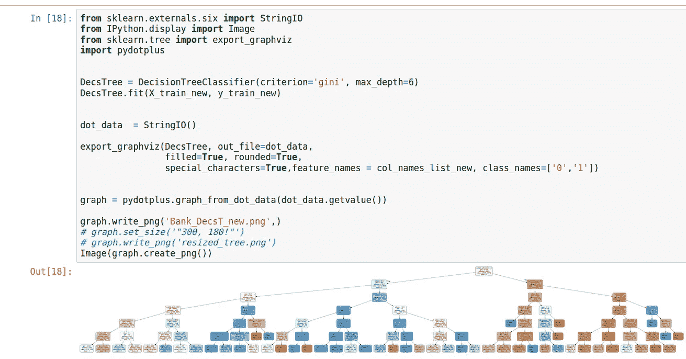

让我们更详细地看看树的根和前几个节点—

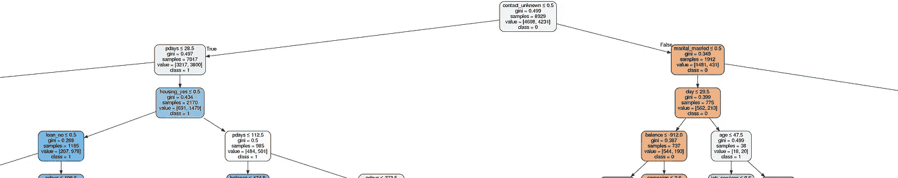

First few nodes of our decision tree!

在这里，我们看到“contanct_unknown”被选为根节点的特征。训练样本总数为 8929，基尼系数约为 0.5。接下来，我们看到一个数值变量“pdays”被选为属性以分割样本，等等…由于有如此多的特征和特别广泛分布的数值特征，手动构建一个树是非常困难的，这种情况可以与以前使用的更简单的网球数据集进行比较。我们还可以使用 *DecisionTreeClassifier* 类的`feature_importance_`属性来绘制在构建树时哪些特性是重要的。下图显示了—

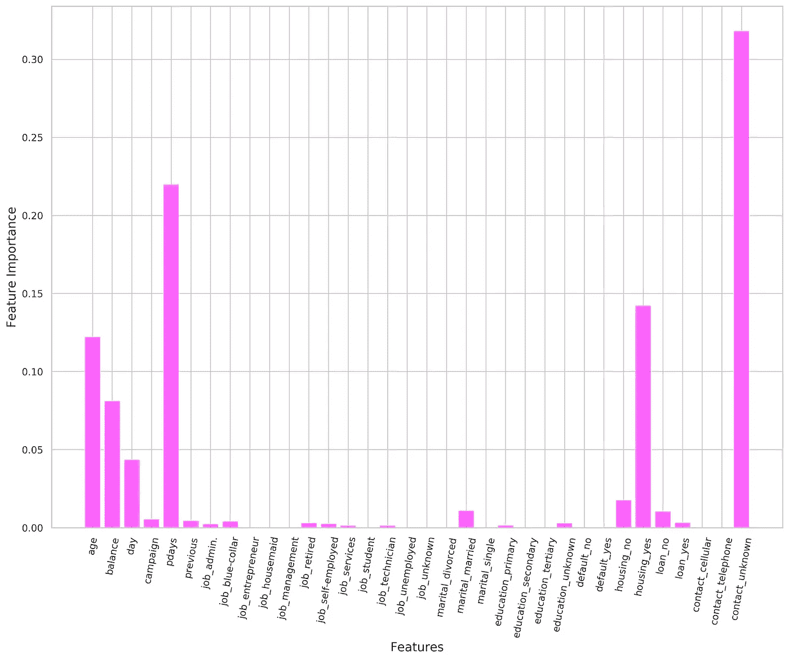

正如从树中所预期的，作为树的根节点的“contanct _ unknown”具有最高的重要性，并且许多特征几乎没有或可以忽略的作用。具有低特征重要性或零特征重要性的特征可能意味着存在编码相同信息的另一个特征。

*注意:关于这篇文章的另一个相关信息是，即使我使用了标准化，DT 算法对数据的缩放是完全不变的[4]。由于每个要素都是单独处理的，因此要素的缩放对分割没有任何影响。*

综上所述，我们已经了解了使用基尼系数作为划分标准来构建 DT 的基本原理。我们还实现了网格搜索交叉验证，为我们的模型选择最佳参数，以对现实数据集进行分类。希望，你已经发现所有这些小有帮助！

保持坚强，干杯！

## 参考资料:

[1] [用决策树进行二元分类](https://sebastianraschka.com/faq/docs/decision-tree-binary.html)；塞巴斯蒂安·拉什卡

[2] [决策树:](https://courses.cs.washington.edu/courses/cse546/13au/slides/decision-trees.pdf)卡洛斯·盖斯特林，华盛顿大学，课堂讲稿。

【3】[为什么要用熵来生长决策树？](https://sebastianraschka.com/faq/docs/decisiontree-error-vs-entropy.html)；塞巴斯蒂安·拉什卡

【4】[用 Python 进行机器学习的介绍](https://www.amazon.com/Introduction-Machine-Learning-Python-Scientists/dp/1449369413)；吉多·穆勒

[5][sci kit-学习决策树手册。](https://scikit-learn.org/stable/modules/tree.html#tree)

[6] [链接所有代码和图像。](https://github.com/suvoooo/Machine_Learning/tree/master/DecsTree)