# 了解分类决策树(Python)

> 原文：<https://towardsdatascience.com/understanding-decision-trees-for-classification-python-9663d683c952?source=collection_archive---------1----------------------->

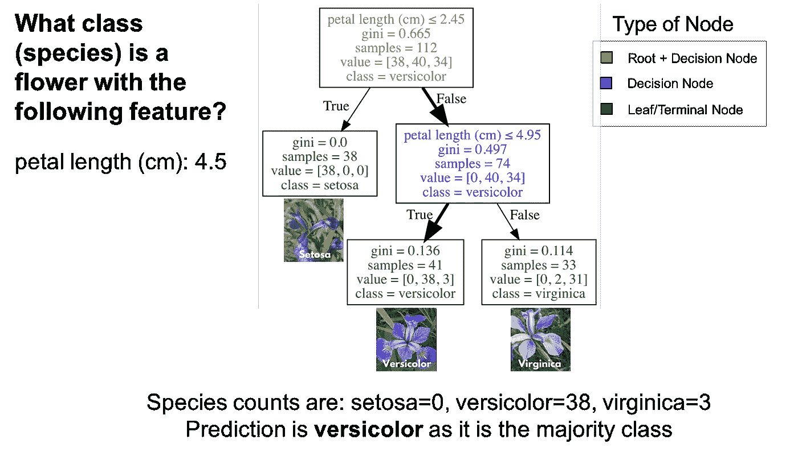

This tutorial goes into extreme detail about how decision trees work.

由于各种原因，决策树是一种流行的监督学习方法。决策树的好处包括它们可以用于回归和分类，它们易于解释并且不需要特征缩放。它们有几个缺点，包括容易过度拟合。本教程涵盖了分类决策树，也称为分类树。

此外，本教程将涵盖:

*   分类树的剖析(树的深度、根节点、决策节点、叶节点/终端节点)。
*   分类树如何进行预测
*   如何使用 scikit-learn (Python)制作分类树
*   超参数调谐

和往常一样，本教程中使用的代码可以在我的 GitHub 上获得([解剖学](https://github.com/mGalarnyk/Python_Tutorials/blob/master/Sklearn/CART/Dt_Classification/ClassificationTreeAnatomy.ipynb)，[预测](https://github.com/mGalarnyk/Python_Tutorials/blob/master/Sklearn/CART/Dt_Classification/ClassificationTreesUsingPython.ipynb))。就这样，让我们开始吧！

# 什么是分类树？

**C** 分类 **a** nd **R** 回归 **T** rees (CART)是 Leo Breiman 引入的一个术语，指的是可以学习用于分类或回归预测建模问题的决策树算法。这篇文章涵盖了分类树。

## 分类树

分类树本质上是一系列旨在指定分类的问题。下图是在 IRIS 数据集(花卉种类)上训练的分类树。根节点(棕色)和决策节点(蓝色)包含分解成子节点的问题。根节点只是最顶层的决策节点。换句话说，这是您开始遍历分类树的地方。叶节点(绿色)也称为终端节点，是不会分裂成更多节点的节点。叶节点是通过多数投票分配类别的地方。

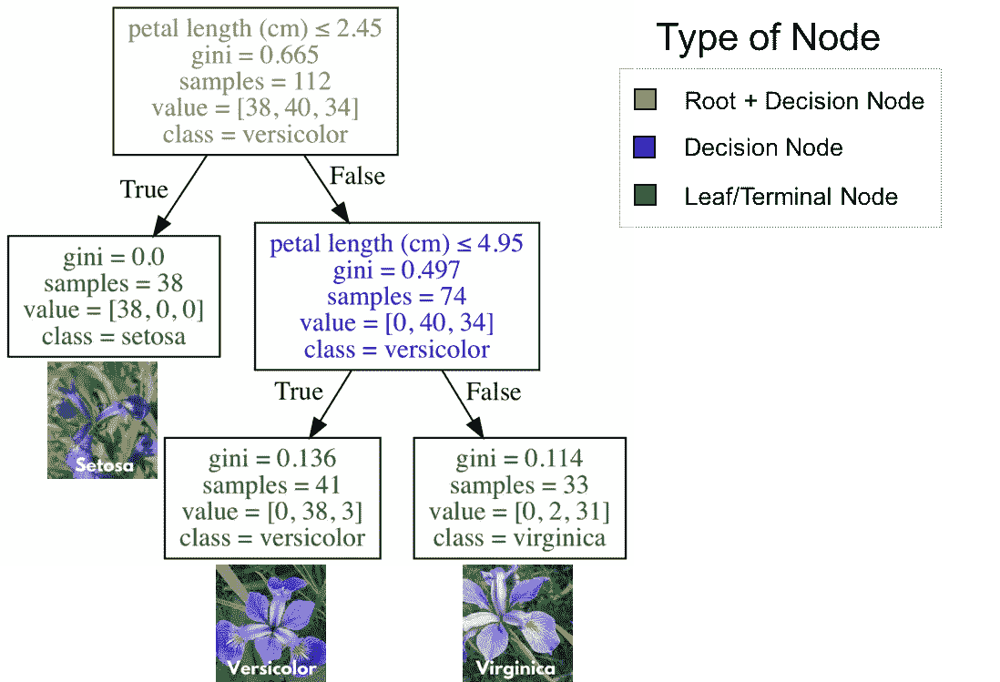

Classification tree to classification one of three flower species (IRIS Dataset)

**如何使用分类树**

要使用分类树，从根节点(棕色)开始，遍历树，直到到达叶(终端)节点。使用下图中的分类树，假设你有一朵花瓣长度为 4.5 厘米的花，你想对它进行分类。从根节点开始，你会先问“花瓣长度(cm) ≤ 2.45 吗”？长度大于 2.45，因此该问题为假。进行到下一个决策节点，问“花瓣长度(cm) ≤ 4.95 吗”？这是真的，所以你可以预测花种为杂色。这只是一个例子。


**分类树是如何生长的？(非数学版)**

分类树学习一系列 if then 问题，每个问题涉及一个特征和一个分割点。看下面(A)的部分树，问题，“花瓣长度(cm) ≤ 2.45”根据某个值(本例中为 2.45)将数据拆分成两个分支。节点之间的值称为分割点。一个好的分割点值(能产生最大信息增益的值)能够很好地将一个类从其他类中分离出来。查看下图的 B 部分，分割点左侧的所有点被归类为 setosa，而分割点右侧的所有点被归类为 versicolor。

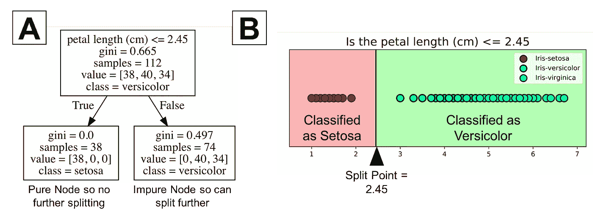

该图显示 setosa 在所有 38 个点上都被正确分类。它是一个纯节点。分类树不会在纯节点上分裂。这不会导致进一步的信息增益。然而，不纯的节点可以进一步分裂。请注意，图 B 的右侧显示许多点被错误分类为杂色。换句话说，它包含两个不同类别的点(virginica 和 versicolor)。分类树是一种贪婪算法，这意味着默认情况下，它将继续分裂，直到它有一个纯节点。同样，该算法为不纯节点选择最佳分裂点(我们将在下一节讨论数学方法)。

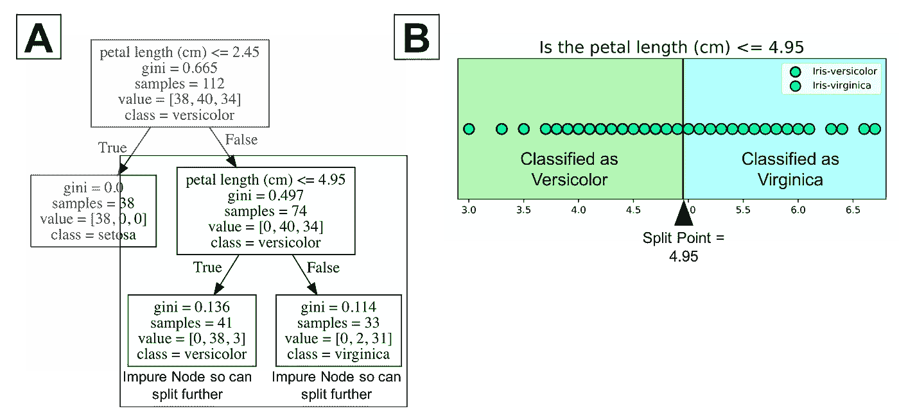

在上图中，树的最大深度为 2。树深度是对一棵树在进行预测之前可以分裂多少次的度量。这个过程可以继续进行更多的分裂，直到树尽可能的纯净。这个过程的许多重复的问题是，这可能导致具有许多节点的非常深的分类树。这通常会导致对训练数据集的过度拟合。幸运的是，大多数分类树实现允许您控制树的最大深度，从而减少过度拟合。例如，Python 的 scikit-learn 允许您预编译决策树。换句话说，您可以设置最大深度来阻止决策树超过某个深度。为了直观地了解最大深度，你可以看看下面的图片。

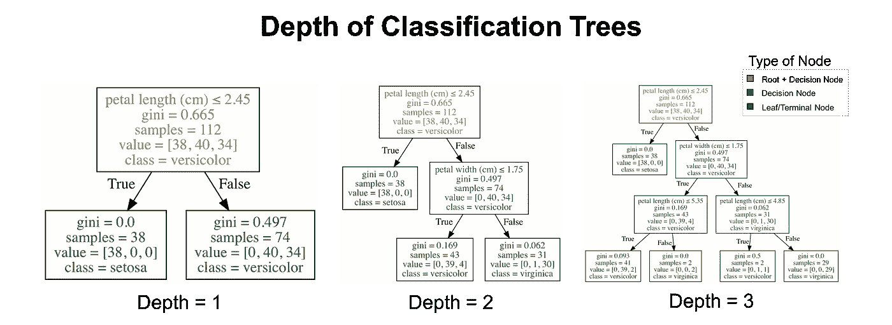

Classification trees of different depths fit on the IRIS dataset.

## 选择标准

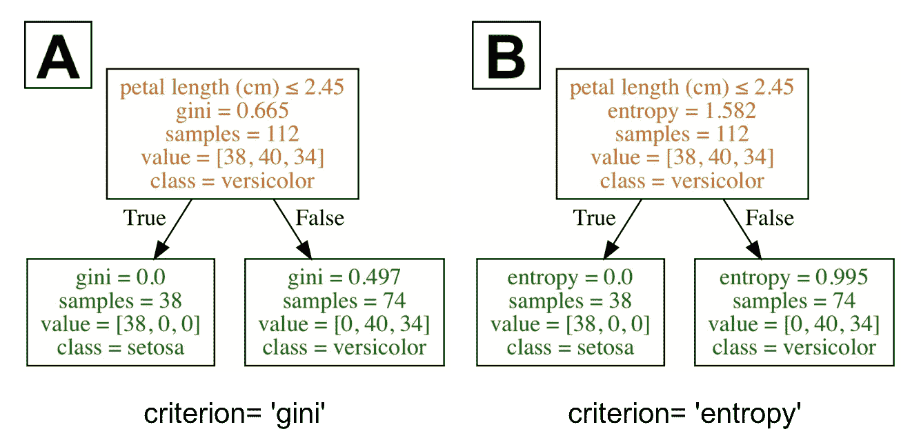

This section answers how information gain and two criterion gini and entropy are calculated.

这一节实际上是关于理解什么是分类树上根/决策节点的好的分割点。对于给定的标准(本例中为基尼系数或熵)，决策树在导致最大信息增益(IG)的特征和相应分裂点上分裂。粗略地说，我们可以将信息增益定义为

```
IG = information before splitting (parent) — information after splitting (children)
```

为了更清楚地了解父母和孩子，请看下面的决策树。

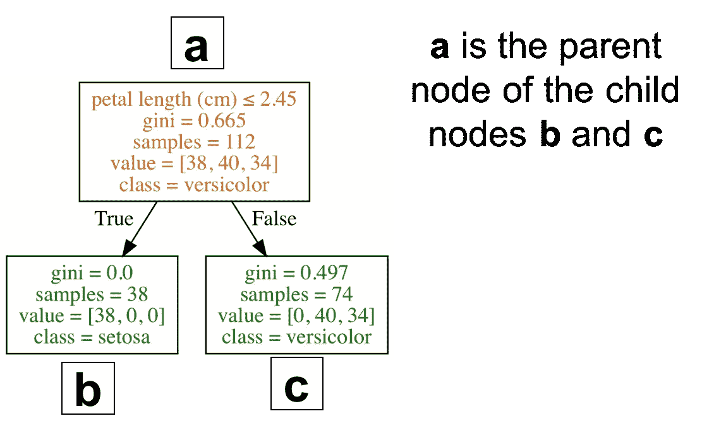

一个更合适的信息增益公式如下。

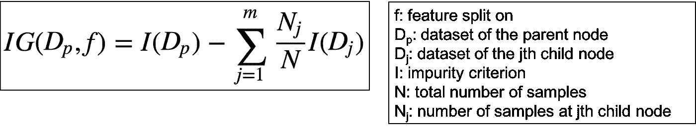

由于分类树具有二元分割，因此该公式可以简化为下面的公式。

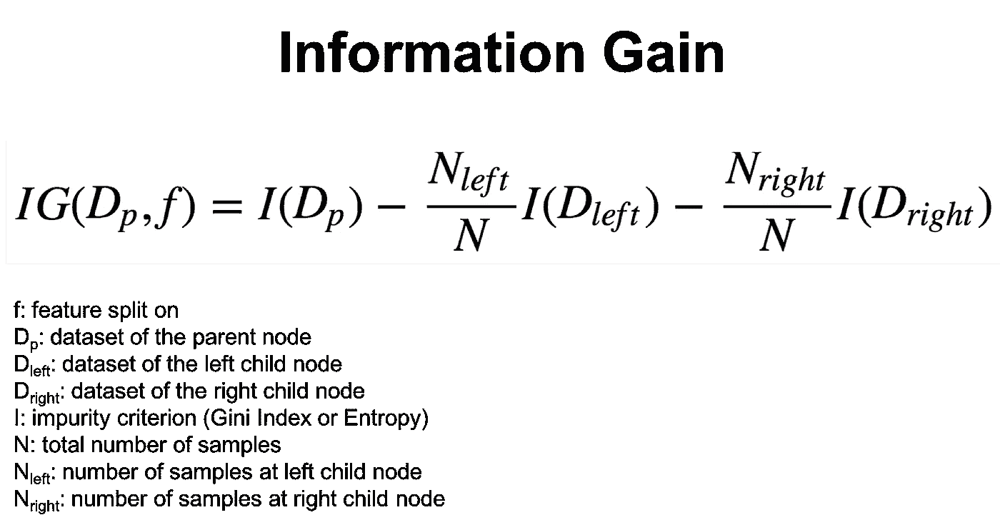

用于衡量节点杂质的两个常用标准`I`是基尼指数和熵。

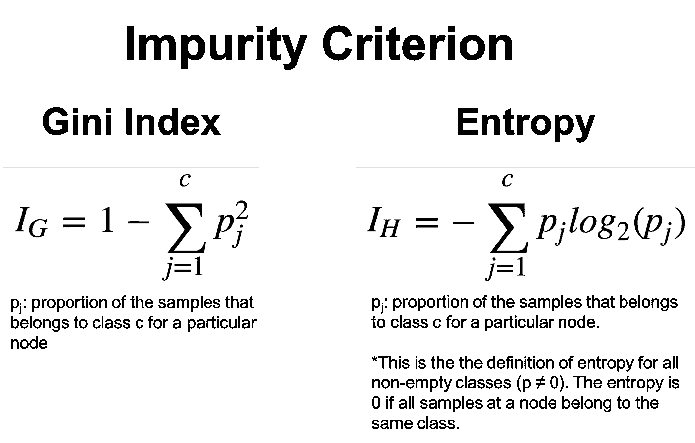

为了更好地理解这些公式，下图显示了如何使用基尼系数计算决策树的信息增益。

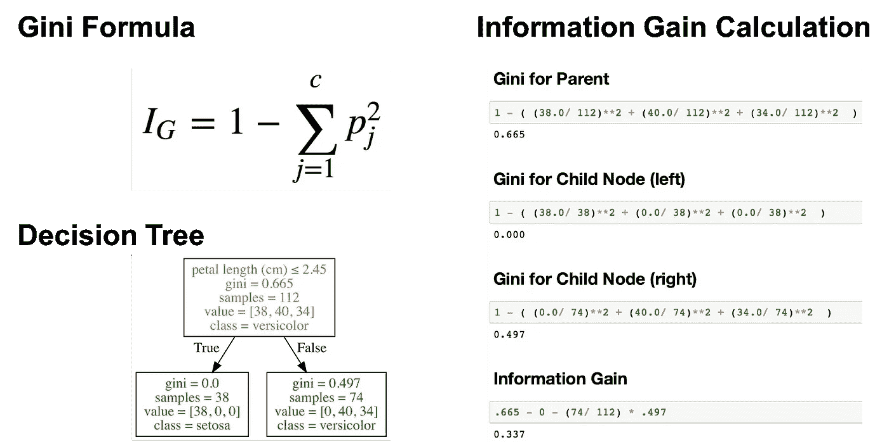

下图显示了如何使用熵计算决策树的信息增益。


我不打算对此进行更详细的讨论，因为应该注意的是，不同的杂质指标(基尼指数和熵)[通常会产生类似的结果](https://www.unine.ch/files/live/sites/imi/files/shared/documents/papers/Gini_index_fulltext.pdf)。下图显示基尼指数和熵是非常相似的杂质标准。我猜 Gini 是 scikit-learn 中的默认值的原因之一是熵的计算可能会慢一些(因为它使用了对数)。

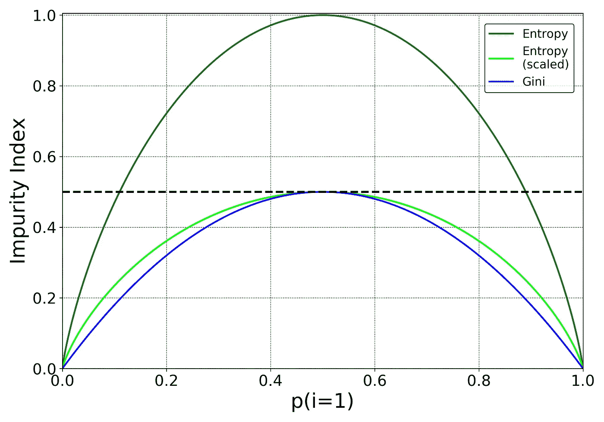

Different impurity measures (Gini index and entropy) [usually yield similar results](https://www.unine.ch/files/live/sites/imi/files/shared/documents/papers/Gini_index_fulltext.pdf). Thanks to [Data Science StackExchange](https://datascience.stackexchange.com/questions/10228/gini-impurity-vs-entropy) and [Sebastian Raschka](https://twitter.com/rasbt) for the inspiration for this graph.

在结束这一部分之前，我应该注意到有各种不同的决策树算法。一些比较流行的算法是 ID3、C4.5 和 CART。Scikit-learn 使用了一个[优化版本的 CART 算法](http://scikit-learn.org/stable/modules/tree.html#tree-algorithms-id3-c4-5-c5-0-and-cart)。你可以在这里了解它的时间复杂度[。](http://scikit-learn.org/stable/modules/tree.html#complexity)

# 使用 Python 的分类树

前面几节回顾了分类树的理论。学习如何用编程语言制作决策树是件好事，原因之一是处理数据有助于理解算法。

## 加载数据集

Iris 数据集是 scikit-learn 附带的数据集之一，不需要从外部网站下载任何文件。下面的代码加载 iris 数据集。

```
import pandas as pd
from sklearn.datasets import load_irisdata = load_iris()
df = pd.DataFrame(data.data, columns=data.feature_names)
df['target'] = data.target
```

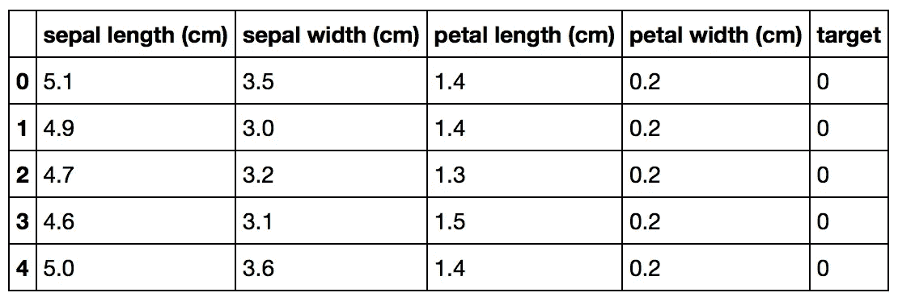

Original Pandas df (features + target)

## 将数据分为训练集和测试集

下面的代码执行[训练测试分割](/understanding-train-test-split-scikit-learn-python-ea676d5e3d1)，将 75%的数据放入训练集，25%的数据放入测试集。

```
X_train, X_test, Y_train, Y_test = train_test_split(df[data.feature_names], df['target'], random_state=0)
```

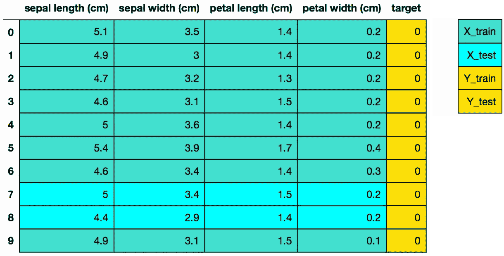

The colors in the image indicate which variable (X_train, X_test, Y_train, Y_test) the data from the dataframe df went to for this particular train test split.

请注意，决策树的一个好处是您不必标准化您的数据，不像 [PCA](/pca-using-python-scikit-learn-e653f8989e60) 和逻辑回归[对未标准化您的数据的影响很敏感](http://scikit-learn.org/stable/auto_examples/preprocessing/plot_scaling_importance.html#sphx-glr-auto-examples-preprocessing-plot-scaling-importance-py)。

## sci kit-学习 4 步建模模式

**步骤 1:** 导入您想要使用的模型

在 scikit-learn 中，所有的机器学习模型都是作为 Python 类实现的

```
from sklearn.tree import DecisionTreeClassifier
```

**步骤 2:** 制作模型的实例

在下面的代码中，我设置了`max_depth = 2`来预编译我的树，以确保它的深度不超过 2。我应该注意到，教程的下一部分将介绍如何为你的树选择一个最佳的`max_depth`。

还要注意，在我下面的代码中，我做了`random_state = 0`，这样你可以得到和我一样的结果。

```
clf = DecisionTreeClassifier(max_depth = 2, 
                             random_state = 0)
```

**第三步:**根据数据训练模型

该模型正在学习 X(萼片长度、萼片宽度、花瓣长度和花瓣宽度)和 Y(鸢尾的种类)之间的关系

```
clf.fit(X_train, Y_train)
```

**步骤 4:** 预测看不见的(测试)数据的标签

```
# Predict for 1 observation
clf.predict(X_test.iloc[0].values.reshape(1, -1))# Predict for multiple observations
clf.predict(X_test[0:10])
```

请记住，预测只是叶节点中实例的主要类别。

## 衡量模型性能

虽然有其他方法来衡量模型性能(精确度、召回率、F1 分数、 [ROC 曲线](/receiver-operating-characteristic-curves-demystified-in-python-bd531a4364d0)等)，但我们将保持简单，使用精确度作为我们的衡量标准。

精确度定义为:

(正确预测的分数):正确预测/数据点总数

```
# The score method returns the accuracy of the model
score = clf.score(X_test, Y_test)
print(score)
```

# 调整树的深度

找到`max_depth`的最佳值是调整模型的一种方法。下面的代码输出了具有不同`max_depth`值的决策树的精确度。

```
# List of values to try for max_depth:
max_depth_range = list(range(1, 6))# List to store the accuracy for each value of max_depth:
accuracy = []for depth in max_depth_range:

    clf = DecisionTreeClassifier(max_depth = depth, 
                             random_state = 0)
    clf.fit(X_train, Y_train) score = clf.score(X_test, Y_test)
    accuracy.append(score)
```

由于下图显示，当参数`max_depth`大于或等于 3 时，模型的精确度最高，因此最好选择最不复杂的带`max_depth = 3`的模型。

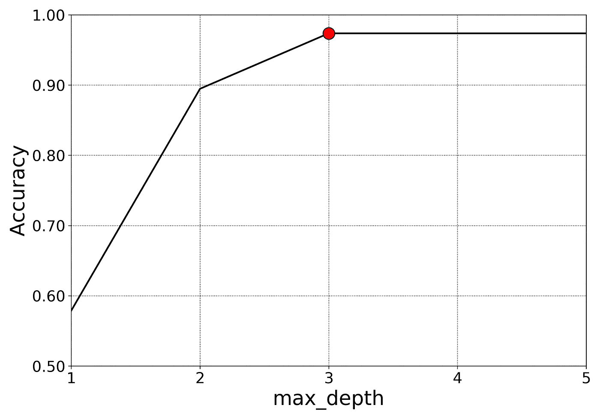

I choose max_depth =3 as it it seems to be an accurate model and not the most complicated.

记住`max_depth`和决策树的深度不是一回事，这一点很重要。`max_depth`是一种预编译决策树的方法。换句话说，如果一棵树在某个深度已经尽可能纯净，它就不会继续分裂。下图显示了`max_depth`值为 3、4 和 5 的决策树。请注意，`max_depth`为 4 和 5 的树是相同的。它们的深度都是 4。

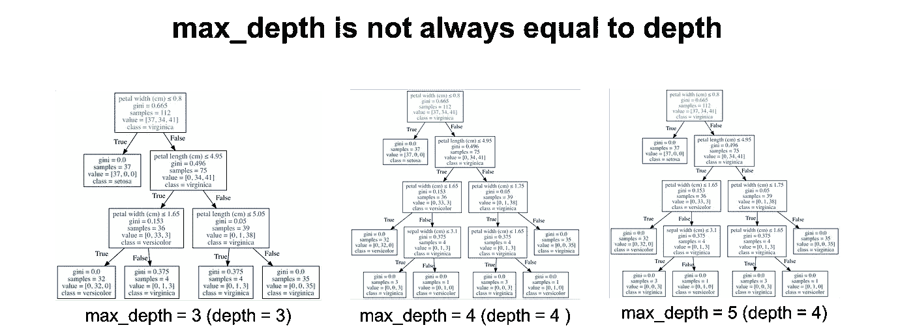

Notice how we have two of the exact same trees.

如果你想知道你训练的决策树有多深，你可以使用`get_depth`方法。此外，您可以通过使用`get_n_leaves`方法来获得经过训练的决策树的叶节点数。

虽然本教程涵盖了更改树的选择标准(基尼指数、熵等)和`max_depth`，但请记住，您还可以调整要分裂的节点的最小样本数(`min_samples_leaf`)、最大叶节点数(`max_leaf_nodes`)等等。

# 特征重要性

分类树的一个优点是它们相对容易解释。scikit-learn 中的分类树允许您计算特征重要性，这是基尼指数或熵由于给定特征的分割而减少的总量。Scikit-learn 为每个特性输出一个介于 0 和 1 之间的数字。所有要素的重要性都被规范化为总和为 1。下面的代码显示了决策树模型中每个功能的功能重要性。

```
importances = pd.DataFrame({'feature':X_train.columns,'importance':np.round(clf.feature_importances_,3)})
importances = importances.sort_values('importance',ascending=False)
```

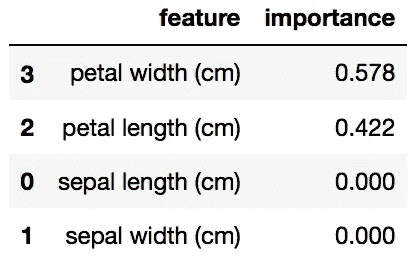

在上面的例子中(对于虹膜的特定训练测试分割)，花瓣宽度具有最高的特征重要性权重。我们可以通过查看相应的决策树来确认。

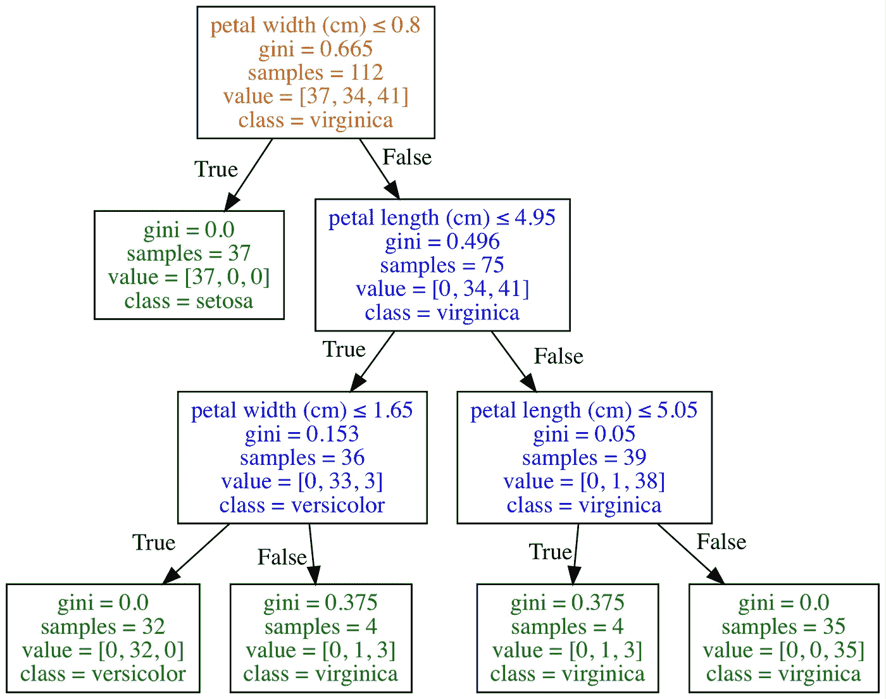

The only two features this decision tree splits on are petal width (cm) and petal length (cm).

请记住，如果某个要素的要素重要性值较低，这并不一定意味着该要素对预测不重要，而只是意味着该特定要素没有在树的特定早期级别被选择。也可能该特征与另一个信息特征相同或高度相关。要素重要性值也不会告诉您它们对哪个类具有很高的预测性，也不会告诉您可能会影响预测的要素之间的关系。值得注意的是，当执行交叉验证或类似操作时，可以使用来自多个训练测试分割的特征重要性值的平均值。

# 结束语

**C** 分类 **a** 和 **R** 回归 **T** rees (CART)是一项相对古老的技术(1984 年)，是更复杂技术的基础。决策树的好处包括它们可以用于回归和分类，它们不需要特征缩放，并且它们相对容易解释，因为你可以可视化决策树。我应该注意到，如果你对学习如何使用 matplotlib 和/或 Graphviz 可视化决策树感兴趣，我有一篇关于它的文章[在这里](/visualizing-decision-trees-with-python-scikit-learn-graphviz-matplotlib-1c50b4aa68dc)。如果你对教程有任何问题或想法，欢迎在下面的评论中或通过 [Twitter](https://twitter.com/GalarnykMichael) 联系。如果你想了解我如何制作我的一些图表，或者如何利用 Pandas、Matplotlib 或 Seaborn 库，请考虑参加我的[Python for Data Visualization LinkedIn 学习课程](https://www.linkedin.com/learning/python-for-data-visualization/value-of-data-visualization)。