# 理解决策树(一劳永逸！)🙌

> 原文：<https://towardsdatascience.com/understanding-decision-trees-once-and-for-all-2d891b1be579?source=collection_archive---------5----------------------->

Photo by [David Vig](https://unsplash.com/@davidvig?utm_source=medium&utm_medium=referral) on [Unsplash](https://unsplash.com?utm_source=medium&utm_medium=referral)

这篇文章是为完全的机器学习初学者编写的，他们希望理解一个最简单的算法，但也是最重要的算法之一，因为它的可解释性、预测能力以及在不同变体(如随机森林或梯度推进树)中的使用。
这篇文章也是写给所有和我一样奔向决策树(随机森林或梯度提升树)孩子的机器学习者，因为他们通常在 Kaggle 竞赛中表现更好，忘记了熟悉决策树，揭开了它所有的神秘面纱。🔮

文章的第一部分是关于建立数据集和模型，第二部分是关于理解模型:决策树。

这篇文章还附有一个笔记本，你可以在这里找到。

# 设置数据集和模型

## 定义目标

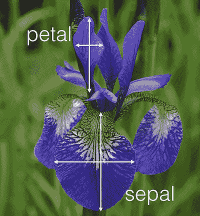

Iris sepal and petal

为了揭开决策树的神秘面纱，我们将使用著名的 iris 数据集。这个数据集由 **4 个特征**组成:*花瓣长度*、*花瓣宽度*、*萼片长度*和*萼片宽度*。要预测的**目标**变量是鸢尾物种。其中有三种: ***鸢尾******云芝******海滨鸢尾*** 。

Iris species

我们可以注意到的第一件事是，对于像我这样的非园艺专家来说，很难区分这三种鸢尾的区别。让我们用机器学习来做这个任务吧！😃

## 分析数据集

现在我们知道了我们要寻找什么，让我们更仔细地看看数据集。

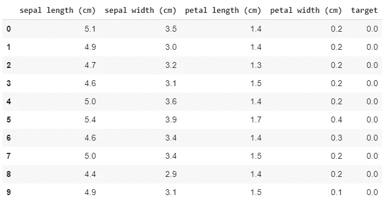

First 10 rows of the iris dataset

在上图中，我们可以看到虹膜数据集的前 10 行。前 4 列是我们将用于预测目标鸢尾物种的前 4 个特征，由最后一列的数值表示:0 代表 *setosa* ，1 代表 *versicolor* ，2 代表 *virginica* 。
我们总共有 150 个观察值(150 行)，每个鸢尾物种 50 个观察值:数据集是平衡的。

## 准备数据集和要素选择

为了便于我们理解决策树是如何工作的，我们将只研究两个特征:*花瓣宽度*和*萼片宽度*。(然后，我们删除这些特征重复的观察结果，以便能够看到图表上的每个点，我们将绘制这些图来帮助我们理解)。

## 建模和评估

如您所知，所选的型号是…

…决策树！！！😉

在没有优化超参数(如树深度、节点中的最小叶子数或分割节点……)的情况下，仅用**两个特征**，我们已经在测试集上获得了 **93%的准确率**。

> 准确度是好预测的数量与预测的数量之比。

这个指标很有意思，但并不能帮助我们理解决策树犯了什么错误。混乱矩阵可以帮助我们。

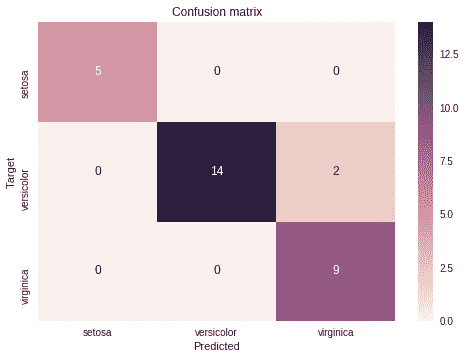

Confusion matrix of the Decision Tree on the testing set

上面的**混淆矩阵**由两个轴组成， **y 轴**是**目标**，鸢尾物种的真实值， **x 轴**是决策树已经为该鸢尾预测的物种。在左上角的方块中，我们可以看到对于 5 个*刚毛鸢尾*来说，决策树已经预测了该物种的*刚毛鸢尾*。第二行显示在 16 个*杂色*鸢尾中，14 个被归类为*杂色*，2 个被误认为*海滨鸢尾*。这就是我们没有 100%准确率的原因。最后右下角的方块显示所有的*海滨鸢尾*都被归类为*海滨鸢尾*。多亏了混淆矩阵，我们可以恢复准确性:所有对角线元素都是好的预测，5+14+9=28，所有预测都是正方形，5+14+2+9=30。我们发现同样的准确率 28/30 = 93%。

# 了解决策树是如何构建的

现在我们已经建立了数据集和模型，我们终于可以开始构建决策树了！😜

## 可视化树

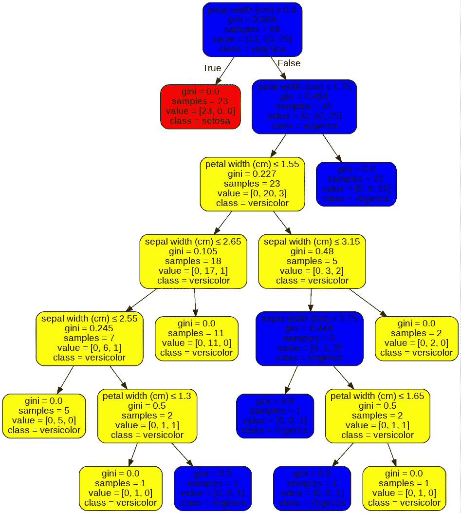

Decision Tree built after training

上面我们可以看到训练后建立的树。在训练阶段，决策树添加节点，将它们分成导致叶子的分支。

## 我们如何获得这棵树？🌳

由于训练集，从根到叶迭代地构建树。事实上，数据集被分成两部分:决策树用来训练自身的**的**训练集**和用来测量决策树的**性能**的**测试集**，该测试集是通过将决策树的预测与真实值进行比较而构建的。**

> 决策树的目标是将训练集分成同质区域，在这些区域中，根据给定的特征(这里是花瓣和萼片的宽度),只存在一种鸢尾属物种。

**节点 0:根节点**

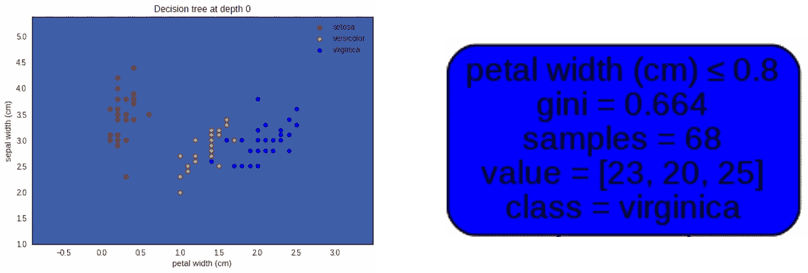

上图根据选取的两个特征显示了鸢尾属物种的分布:x 轴上的*花瓣宽度*，y 轴上的*萼片宽度*。圆点的颜色代表鸢尾的种类:红色代表*刚毛鸢尾*，黄色代表*杂色鸢尾*，蓝色代表*海滨鸢尾*。
上图右边的根节点，给了我们几个信息:
-有 68 个虹膜(' *samples=68'* )，我们可以在左边的图上数出来的虹膜点；
- ' *value=[23，20，25]'* 描述了这些鸢尾在鸢尾属物种的三个可能类中的分配，即 *setosa* 为 23， *versicolor* 为 20，virginica 为 25；
-'*class = virginica '*。这是决策树在根节点预测的鸢尾物种。**之所以做出这个决定，是因为在根节点上，海滨锦鸡儿是数量最多的物种(25 *海滨锦鸡儿*，相比之下，20 *云芝*和 23**)。这就是为什么左图的背景颜色是蓝色的原因，这是为 *virginica* 物种选择的颜色。
根节点也给我们多了两条信息'*花瓣宽度(cm) ≤ 0.8'* 和' *gini = 0.664'* 。我们现在将讨论它们的含义…😃

**节点 0:让学习开始吧！😎**

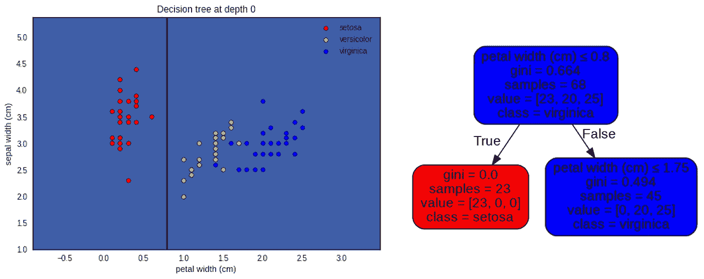

左边的这个图与上一个图相同，但带有树的第一个决策边界:`**petal width = 0.8 cm**`。

*这个决策边界是怎么决定的？*

> 通过测试分割数据集的所有可能的决策边界，并选择使两个分割的**基尼系数杂质**最小的一个，来决定决策边界。

*什么是* ***基尼杂质*** *？*

基尼系数是衡量随机选择的元素(此处为虹膜)被错误分类的概率的指标，即选择一个元素的概率乘以被错误分类的概率。如果我们对所有 J 个可能的类别求和，我们得到基尼不纯:

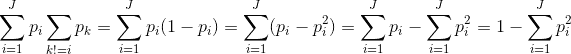

最后一个表达式是我们将要用来执行**基尼系数测试**的表达式。

*让我们计算第一个节点的基尼系数*

在根节点处，所有的数据点都是混合的。用上面的结果基尼不纯是:

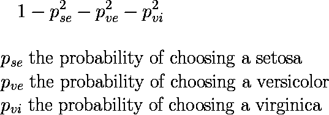

这给了我们:

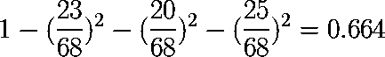

我们可以通过检查根节点上的基尼信息来验证这个数字:*‘基尼= 0.664’*。对于第一个节点，我们的基尼系数为 0.664。

*让我们回到第一个决策边界*

确定一个决策边界要问的问题是: ***如何分裂鸢尾物种，以便我们创建更同质的群体？***
直观地，我们可以在上面的图表中观察到，我们可以通过沿着*花瓣宽度*轴分割数据集来创建一个仅包含 *setosa* 物种的同质组。

但是算法没有直觉。那么它是如何找到最佳分割点的呢？

*   **它将沿着所有特征**尝试所有可能的边界，即所有轴*花瓣宽度*和*萼片宽度*。
*   对于每次分割，该算法将计算所创建的两个组的基尼系数。
*   最后，它将选择给出两组的最低基尼系数杂质的决策边界(或者对每组的基尼系数杂质求和，或者求平均值)。

*让我们回到第一个节点和第一次拆分*

在根节点的情况下，该算法已经发现，在所有可能的分裂中，具有`**petal width = 0.8 cm**`的分裂给出最低的 Gini 杂质。
左叶的基尼杂质为:

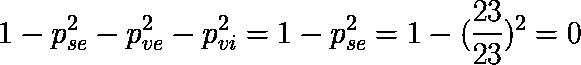

我们用树形图验证了这个结果。这个结果并不令人惊讶，因为在与图的左边部分相匹配的左叶中，我们只有 *setosa* iris，所以该组是非常同质的，基尼系数是同质性的度量。

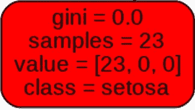

右叶的基尼系数为:

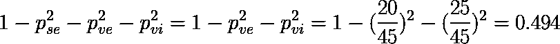

我们发现与树形图中显示的结果相同。此外，这种基尼系数接近 0.5，因为海滨鸢尾和杂色鸢尾几乎一样多。

**节点 1**

> 所描述的过程将迭代地继续，直到树成功或试图分离所有的数据点，或者对算法应用限制条件，如树深度的限制。

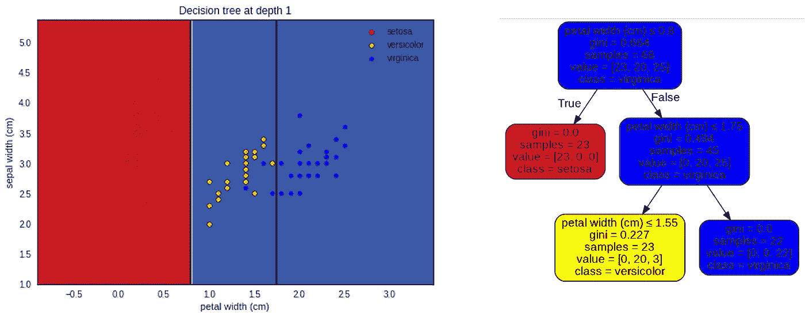

由于`**petal width <= 0.8 cm**`的 Gini 杂质为 0，即我们不能有一个更同质的组，算法将不再尝试分割这一部分，并将集中在树的右边部分。

直观上，决策树继续使用*花瓣宽度*功能将右边部分一分为二。事实上，使用*花瓣宽度*而不是*萼片宽度*似乎更容易创建同质群组。在`**petal width <= 0.8 cm**` 分裂产生了一个只有*海滨鸢尾*的群体(因此基尼系数为 0)。设法创造一个只有一个物种的群体并不总是最好的选择，我们将在下一次分裂中看到…

由于算法已经创建了一个只有 *virginica* 的节点，该节点将不再被分割，它将是一片叶子。

**节点 2**

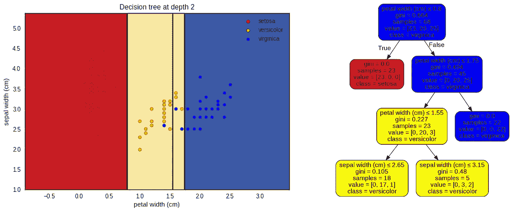

对于这个节点，算法选择在`**petal width = 1.55 cm**`分裂树，创建两个不同的组。凭直觉，我们会在`**petal width = 1.3 cm**`或`**sepal width = 3.1 cm**`分开，创建一个只有*杂色*虹膜的组。事实上，这将创建一个基尼系数为 0 的节点。但事实上，所创建的另一个节点更不均匀，以至于该节点的基尼不纯度大于用另一个分裂所创建的两个节点之和的基尼不纯度。

***我们来验证一下这个:***

*基尼不纯与*分裂于`**petal width = 1.55 cm**`

*   左侧节点:

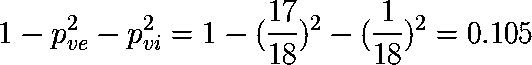

我们在树上验证了这个结果。

*   右节点:

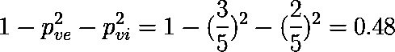

我们再次在树上验证了这个结果。

*   这种分裂的基尼系数是:

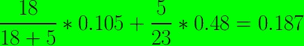

**一个分裂的基尼指数是由每一组的点数来衡量的。**

*基尼不纯与* `**petal width = 1.3 cm**`的分裂

*   左侧节点:

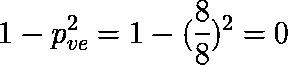

*   右节点:

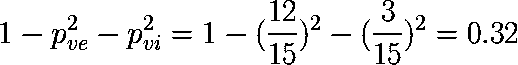

*   这种分裂的基尼系数是:

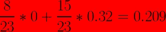

算法是对的，而我们的直觉是错的。实际上，第一次分割产生的基尼系数最低，因此这种分割更可取。提醒:该算法尝试每个特征的每个可能的分割。

**节点 3**

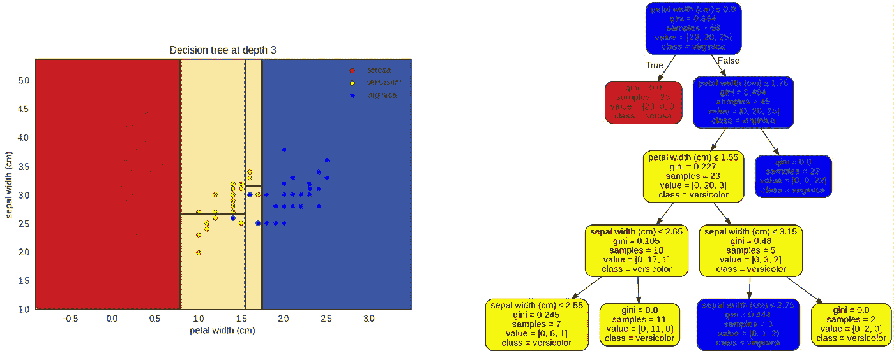

首先要注意的是，之前的拆分并没有改变拆分`**petal width = 1.55 cm**`上下树的决策函数。事实上，对于创建的两个节点，*杂色*仍然占大多数。

对于这个级别，决策树最终使用*萼片宽度*特征。创建的两个分割是`**petal width = 2.65 cm**`(在细分`**0.8 cm** < **petal width <= 1.55 cm**`中)和`**petal width = 3.15 cm**`(在细分`**1.55 cm** < **petal width <= 1.75 cm**`中)。

**节点 4、5、6**

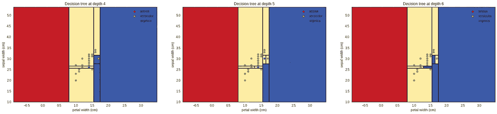

一次又一次地应用相同的原理，该算法将试图隔离每个点，直到它只有同类组。例如，如果我们不限制树的大小，这会导致**过度拟合**。(树正在用心学习训练集，而不是理解它，这将阻止他在测试集上做出好的预测)。

在上图中，我们可以看到深度为 4、5、6 的树的决策边界。深度 6 是树叶的深度，并结束树的构建。

## 构建的树如何做出决定？

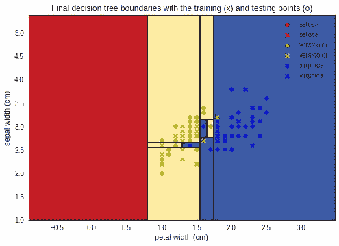

在上面的图中，我们可以看到决策树已经被训练(并且已经过拟合)的**训练数据**(由 o 表示)和**测试数据**(由 x 表示)。

> 当决策树必须为属于**测试集**的虹膜预测目标(虹膜种类)时，它从根节点沿树向下行进，直到到达叶子，通过针对父节点条件测试正在测试的虹膜的特征值来决定去左边还是右边的子节点。

例如，在根节点处，如果测试的虹膜`**petal width <= 0.8 cm**`到达作为叶子的左侧节点，并且将虹膜分类为 *setosa* 虹膜。否则，它会转到正确的节点，并继续相同的过程，直到到达一个叶子。

正如我们在混淆矩阵中看到的，两只*云芝*被错误地归类为*弗吉尼亚*:

*   在`**1.75 cm < petal width**`区域:我们可以看到黄色的十字，即蓝色背景上的*杂色*鸢尾，即决策树将其归类为*海滨*。
*   在`**1.55 cm < petal width <= 1.75 cm**`和`**sepal width <= 2.75 cm**`区域:推理同上。

其余的测试虹膜已经被**很好地分类**，这给了我们 0.93 的**精度。**

在测试阶段，该算法取每个点，并遍历决策树，根据被测试虹膜的特征值选择左边或右边的节点。

# 结论

在本文中，我们剖析了决策树，以理解构建该算法背后的每个概念，这是必须知道的。👏为了理解决策树是如何构建的，我们举了一个具体的例子:由连续特征和分类目标组成的虹膜数据集。决策树也可以使用分类特征(甚至更简单，因为一个分支是一个类别)或连续目标(这里可能有点复杂，因为它不使用基尼系数来衡量同质性，而是使用方差度量……)。这可能是另一篇文章的主题…