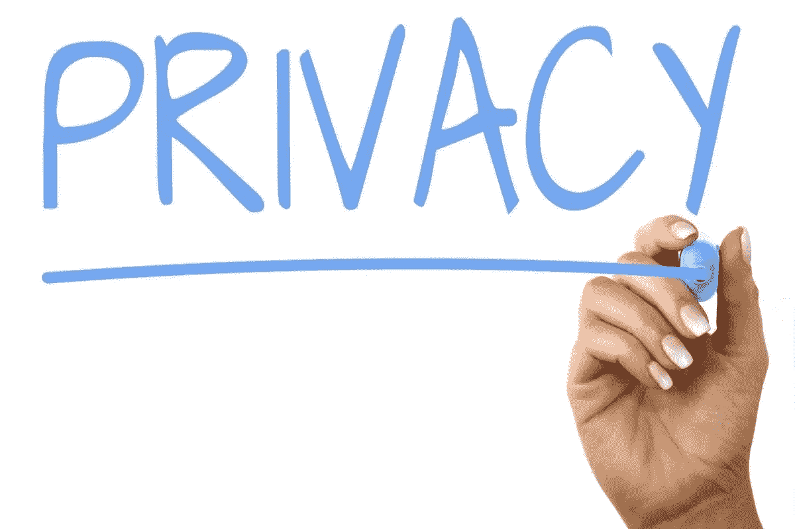
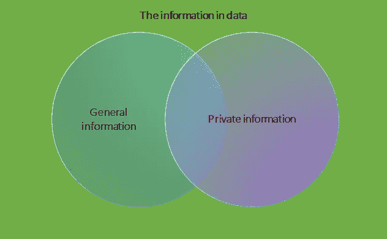
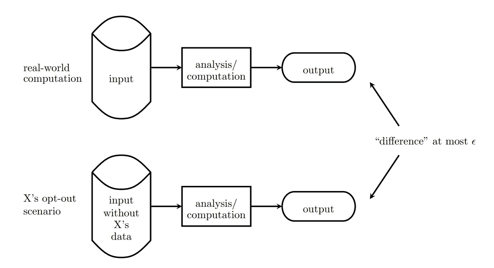
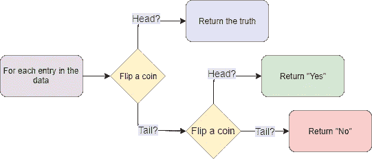
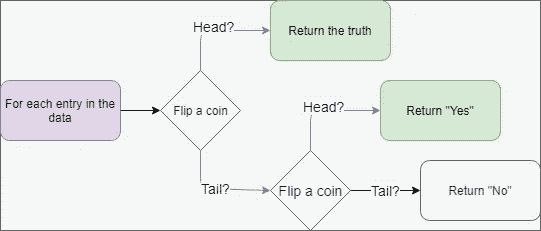
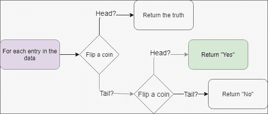
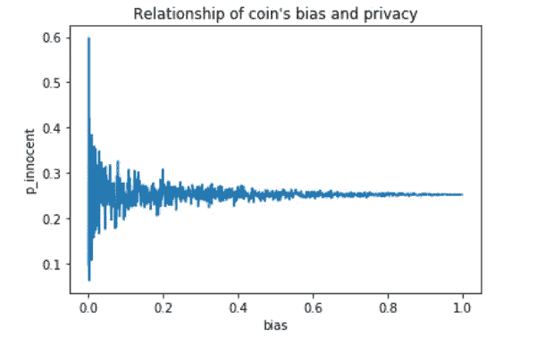
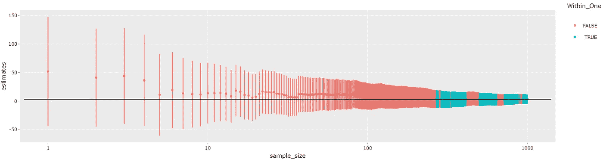
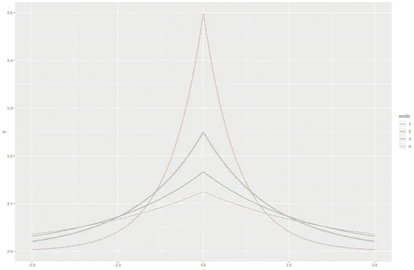
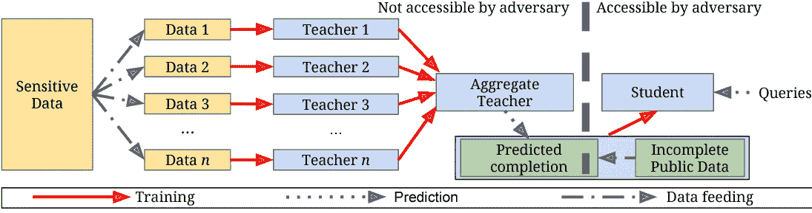

# 了解差异隐私

> 原文：<https://towardsdatascience.com/understanding-differential-privacy-85ce191e198a?source=collection_archive---------2----------------------->

## 从理论背后的直觉到私人的人工智能应用。



[Privacy](https://www.thebluediamondgallery.com/handwriting/p/privacy.html) by [Nick Youngson](http://www.nyphotographic.com/) [CC BY-SA 3.0](https://creativecommons.org/licenses/by-sa/3.0/) [Alpha Stock Images](http://alphastockimages.com/)

他的文章是对差分隐私的简明介绍。通过阅读，你将从差异隐私的重要概念背后的直觉和原因，如隐私损失，隐私损失和准确性(差异隐私输出)之间的关系。然后，这些直觉将通过具体的说明性故事来解释，并通过编程进行定性和定量分析来加强。在文章的最后，我们期待的是在 [MNIST 手写数字数据集](https://en.wikipedia.org/wiki/MNIST_database)上使用*私人聚集教师集合*算法(PATE)的私人人工智能应用。

*注意:该应用将要求读者必须熟悉 Pytorch。*

> “差分隐私使科技公司有可能收集和分享关于用户习惯的聚合信息，同时维护个人用户的隐私。”
> 
> [对话](https://theconversation.com/explainer-what-is-differential-privacy-and-how-can-it-protect-your-data-90686)

**差分隐私有哪些实际应用？**

在 21 世纪，我们面临许多[大数据泄露](https://www.csoonline.com/article/2130877/the-biggest-data-breaches-of-the-21st-century.html)，迫使政府、组织和公司重新考虑隐私。相比之下，机器学习的几乎突破都来自于需要大量训练数据的学习技术。此外，研究机构经常使用和共享包含个人敏感或机密信息的数据。此类数据的不当披露会对数据主体的私人信息产生不利后果，甚至会导致民事责任或人身伤害。

差分隐私等正式隐私模型的发展有助于解决这个问题。因此，越来越多的组织和公司正在应用差分隐私来保护敏感信息，如个人信息、用户事件、个人实时位置，如本文所述:[差分隐私的高级介绍](/a-high-level-introduction-to-differential-privacy-edd20e6adc3b)。甚至有一个[开源差分隐私项目](https://github.com/uber/sql-differential-privacy)，用于在任何标准 SQL 数据库上执行差分隐私查询。

简而言之，差分隐私许可:
—公司在不违反隐私的情况下访问大量敏感数据用于研究和业务。
—研究机构可以开发[差分隐私技术](https://www.deakin.edu.au/research/research-news/articles/arc-grant-secures-path-to-cyber-privacy)，在各国的云共享社区中实现隐私流程自动化。因此，他们可以保护用户的隐私和解决数据共享问题。

# 差分隐私简介



Figure 1: Information in data under Differential Privacy view.

**什么是差分隐私？**
—差分隐私(DP)是在统计和机器学习分析的背景下对隐私的一个强有力的数学定义。根据这个数学定义，DP 是隐私保护的一个标准，许多用于分析敏感个人信息的工具都是为了满足这个标准而设计的。[1].

上图显示了 DP 视图下数据中包含的信息。因此，一般信息是不特定于任何单个数据主题的任何信息。一般信息可以理解为数据中整个总体的信息(不仅仅是一个个体或一组数据主体)。与一般信息形成对比的是私人信息，即特定于任何单个数据主体的信息。



Figure 2 [1]: Differential privacy.

*如何区分私人信息和一般信息？*
——在 DP 看来，隐私信息是数据中的信息在个体数据主体选择退出前后的变化(如图 2 所示)。这也解释了名字中的“差”字。

*   **它能保证什么？
    —** 差分隐私从数学上保证，任何人看到差分隐私分析的结果，都会对任何个人的隐私信息做出相同的推断，无论该个人的隐私信息是否包含在分析的输入中。[1]
    — DP 提供了一种数学上可证明的隐私保护保证，可以抵御大范围的*隐私攻击(*包括*差异攻击*、*链接攻击、*和*重构攻击)*【2】。
*   它不能保证什么？DP 并不保证一个人认为是自己的秘密会一直保密。重要的是要识别哪些是一般信息，哪些是私人信息，以便从 DP 保护伞中获益并减少伤害。DP 保证只保护私人信息(如上所述)。所以，如果一个人的秘密是一般信息，它将不受保护！

> 为了理解这一点，让我们考虑一个场景，当你，一个吸烟者，决定被纳入调查。然后，对调查数据的分析表明，吸烟会导致癌症。作为一个吸烟者，你会受到分析的伤害吗？也许——基于你是一个吸烟者的事实，人们可能会猜测你的健康状况。他在研究后对你的了解肯定比之前知道的更多(这也是说这是“一般信息”，而不是“公开信息”背后的原因)，但你的信息被泄露了吗？差分隐私将认为它不是，理由是对吸烟者的影响是相同的，与他是否在研究中无关。影响吸烟者的是研究得出的结论，而不是他在数据集中的存在与否。[2]

## 它是如何工作的？

> 让我们考虑一个典型的例子，看看满足 DP 标准的 DP 算法是如何工作的:假设你是一名社会数据科学家，想要对一个非常禁忌的行为的调查数据进行分析。数据中的每个条目都是被调查人群中个人的一个答案(真相)，即“是”或“否”。由于隐私政策，数据持有人或馆长永远不会允许您直接访问数据。

作为一名数据挖掘专家，您向馆长建议了一种数据挖掘算法，用于删除数据中的私人信息，从而可以对数据进行分析。因此，对于每个条目，策展人将应用以下算法:

*   抛硬币(硬币的偏向是其结果是正面的概率，它将被表示为 *p_head* 。).
*   如果是正面，返回条目中的答案。
*   如果是反面，再掷一次硬币，如果是正面，返回“是”，如果是反面，返回“否”。



Figure 3\. Flow diagram of the Differential privacy algorithm.

现在，每个人都受到“似是而非的否认”的保护，因为一个人通过抛硬币的随机性来似是而非地否认答案。假设你想从嘈杂的数据中推断出人口中无辜者的百分比( *p_innocent* )。这可以通过以下步骤实现:

*   假设个人不是无辜的，计算返回“是”的概率:P("是" |不是无辜的)=*P _ head*+(*1*-*P _ head*)**P _ head。*



*   假设个人是无辜的，计算返回“是”的概率:P(" yes " | innocent)=(1-*P _ head*)**P _ head。*



*   计算*P _ innocent*:
    *P _ innocent*=(P(" yes ")-P(" yes " | not innocent))/(P(" yes " | innocent)-P(" yes " | not innocent))= 1-(P(" yes ")-(1-*P _ head*)**P _ head*)/*P _ head。*(演绎证明)

注:以上结果是由大数定律保证的渐近结果。



Figure 4: Compute on a simulated survey data of 20,000 individuals. Low bias coins add more noise to the data. A consequence of adding noise is the decrease in privacy loss.

*   DP 告诉我们什么？
    如图 4 所示，当 *p_head* 接近 0 时， *p_innocent* 的方差急剧增加并接近无穷大，这导致隐私损失迅速减少。DP 也给了我们同样的结论。因此，当 *p_head* 为 0 时，无论个人是否无辜，返回结果的分布都是相同的(2 个分布的距离为 P(" yes " | not innocent)-P(" yes " | innocent)=*P _ head*，偏差)。如果参与数据的无辜者的数量发生变化，它不会导致有噪声的返回数据中的信息发生任何变化。意味着在嘈杂的返回数据中没有私人信息。

## 差异隐私的原因

DP 具有有价值的属性[2]使其成为分析敏感个人信息和隐私保护的丰富框架:

1.  ***隐私损失的量化。***
    隐私损失是任何 DP 机制和算法中的一个度量。它允许不同技术之间的比较。隐私损失是可控的，这确保了它和一般信息的准确性之间的权衡。
2.  ***作文。***
    损失的量化允许通过多次计算对累积隐私损失进行分析和控制。理解组合下差分私有机制的行为使得能够从较简单的差分私有构建块设计和分析复杂的差分私有算法。
3.  ***群体隐私。***
    DP 允许对家庭等群体发生的隐私损失进行分析和控制。
4.  ***闭合下的后处理。***
    DP 不受后处理的影响:一个数据分析师，如果没有关于私有数据库的额外知识，就不能计算差分私有算法输出的函数并使其不那么差分私有。

# 测量差分隐私并报告最大噪音

现在，我们准备好了微分隐私的数学定义。让我们来看看:

> *随机化算法 k 给出了*ε-差分隐私*如果对于所有数据集 d 和 d’至多在一行上不同，以及任何 S ⊆范围(k)*


DP 算法中必须考虑的两个量是:

*   Epsilon (ε):数据差异变化(添加、删除 1 个条目)时隐私损失的度量。值越小，隐私保护越好。
*   准确性:DP 算法的输出与纯输出的接近程度。在*带 PATE 的私人机器学习*部分，我将使用测试集上的分类精度作为评估精度的统计量。

*注:还有另外一个量，对于拉普拉斯机制以外的机制，没有提到的是δ(δ)*【2】*。*

**有些东西你需要补上:**

1.  ε减小会导致精度下降。
    *如果你的算法是 0-差分隐私，很好的保护了隐私，那么它的准确率很低，那就没用了。因为除了噪音你什么也得不到。这也显示在图 4 中。你可以在这里验证一下:*[https://georgianpartners.shinyapps.io/interactive_counting/](https://georgianpartners.shinyapps.io/interactive_counting/)。
2.  ε=0(一般情况下δ=0)相当于绝对隐私。
    *可以直接从*差分隐私*的定义中推导出来。简而言之，ε=0 相当于 Pr[K(D)] = Pr[K(D')]，这导致算法 K 独立于数据，从而完美地保护了隐私。*



Figure 5: Confidence intervals of the average of results of an ε=0.03-differential privacy mechanism over 1000 queries. Note the confidence level is 95%, and that “Within_one” means the estimate is in the interval [2.5, 3.5]. Take from [https://georgianpartners.shinyapps.io/interactive_counting](https://georgianpartners.shinyapps.io/interactive_counting/).

**小心！**

> 对数据应用算法的次数越多，隐私损失就越多。类似于玩[“我是间谍。”](https://en.wikipedia.org/wiki/I_spy)。你的任务是猜测间谍看到的物体。随着间谍的每一个回答，你会得到更多关于这个物体的信息。所以，经过一定次数的查询，你就能知道是什么东西了。在这种情况下， ***DP 的组合属性*** 将有助于分析敏感的个人信息。对这一事实感到好奇的读者可以阅读参考资料中的“隐私预算”概念[1]和这个故事 T25。

## 报告噪声最大值算法

*对于 PATE 算法的解释，我将讲述关于报告噪声 Max (RNM)算法。*

为什么是 RNM？
RNM 算法(在[【差分隐私】发明者辛西娅·德沃克的](https://www.cis.upenn.edu/~aaroth/Papers/privacybook.pdf)差分隐私算法基础中介绍)适用于:

> …“我们希望知道在一组被调查者的病史中，哪种疾病(大约)是最常见的，因此，对于所考虑的每种疾病，我们的问题是，被调查者是否接受过这种疾病的诊断。由于个人可能经历许多情况，这组问题的敏感性可能很高。尽管如此，正如我们接下来所描述的，这项任务可以通过在每个计数中增加 Lap(1/ε)噪声来解决(注意噪声的小范围，它与条件总数无关)。至关重要的是，m 个嘈杂的计数本身不会被发布(尽管“获胜”的计数可以在没有额外隐私成本的情况下发布)。
> 
> [](https://www.cis.upenn.edu/~aaroth/Papers/privacybook.pdf)****差分隐私的算法基础，第 35 页。****

**RNM 算法的朴素伪实现；**

****输入:**一个标签向量:X，隐私损失水平:ε，标签数:n
**输出:**一个嘈杂的最大答案
从 X 计算标签数，将结果赋给 y
从一个零中值拉普拉斯分布中画出一个随机的 n 维向量 L，方差为 2/(ε*ε)(L 中的元素相互独立)。**

****返回** arg max(Y + L)**

****

**Figure 6\. PDF of zero median Laplace distributions.**

****RNM 算法被证明是ε-差分隐私，其中ε是隐私损失等级(来源:**[](https://www.cis.upenn.edu/~aaroth/Papers/privacybook.pdf)****差分隐私算法基础，第 35 页)。******

# ****使用 PATE 实践差分隐私****

## ****教师集合的私有聚集算法****

****在这一部分，我将解释*教师集合的私有聚合*算法(PATE) [3]，并使用它来加强对 DP 的理解。****

*   ******为什么是肉酱？**
    [**利用置信度信息的模型反转攻击及基本对策**](https://www.cs.cmu.edu/~mfredrik/papers/fjr2015ccs.pdf)**【4】论文表明，利用机器学习算法输出的私人信息是可能的。PATE 就是为了解决这个问题而发明的，它是一种普遍适用的方法，可以为训练数据提供强大的隐私保证。******
*   ******它是如何工作的？
    PATE 背后的思想是对敏感模型的输出应用 DP 聚合(RNM 算法)，称为“教师”(敏感模型直接在标记的敏感数据上训练)。聚集的结果将用于在未标记的公共数据上训练另一个公共模型。因此，对教师的回答应用 DP 可以被视为保护敏感数据隐私的代理，并且**教师必须接受数据不相交子集的培训**。******

> ****为什么它们一定是不相交的？
> 想象一下，如果每个教师都在整个数据上接受培训，那么移除一个教师不会对聚合结果中任何单个数据主体的参与产生任何影响，因为该单个数据主体仍然参与培训其他教师。这将使得对教师的回答应用差别隐私不再是保护敏感数据中个人数据主体隐私的有效代理。因此，训练数据集必须是不相交的。****

## ****安装 PySyft****

****使用 [Pysyft](https://github.com/OpenMined/PySyft) 可以分析*PATE 的差分隐私*，或者执行 PATE 分析。您可以按照这些步骤来安装 Pysyft 和相关的库。****

*   ****安装所需库的最简单方法是使用 [Conda](https://docs.conda.io/projects/conda/en/latest/user-guide/overview.html) 。创建一个新环境，然后在该环境中安装依赖项。在您的终端中:****

*   ****如果您有任何与 zstd 相关的错误，请运行以下命令(如果上面的一切安装正常，则跳过这一步):****

*   ****重试安装 syft (pip 安装 syft)。****

## ****PATE 差异隐私分析的 API****

****我们将使用 Pysyft 中“pate”包的 Numpy 和 *perform_analysis* 函数:****

******对*执行 _ 分析*功能的描述:**
**输入**(参数为文章目的而简化):****

****—( m，n)个教师模型输出的二维数组。
m:教师数量或产出数量。
n:查询次数。
—最多投票标签的向量。
—RNM 算法的ε。****

******输出:******

****—数据无关 epsilon [3]:最坏情况下的隐私丢失。
—数据相关的 epsilon [3]:基于教师模型输出的真实值的隐私损失的紧界。
计算数据相关的ε:
对于每个查询，计算聚集数据的紧界隐私损失，这是通过将 RNM 算法应用于教师模型的输出而生成的。
对紧界隐私损失求和，然后将结果分配给数据相关的 epsilon。****

******返回:**数据无关的ε和数据相关的ε****

******描述 *cal_max* 和*noise _ max*功能:******

*****cal_max* 具有为每个查询找到投票最多的标签的功能。并且，*noise _ max*是 RNM 算法。****

## ****PATE 分析****

*******我将用“数据”这个词来表示教师模型的输出。*******

****让我们考虑这些场景，并将我们的预期与分析结果进行比较:****

*****在前三个场景中，我将使用具有较大隐私损失级别(ε=5)的 RNM 算法，以减少其对数据的影响。因此，允许我们能够“观察”固有数据的私有信息。*****

*   ******首先，数据中没有信息:******

****创建数据:****

```
**array([[0., 0., 0., ..., 0., 0., 0.],
       [0., 0., 0., ..., 0., 0., 0.],
       [0., 0., 0., ..., 0., 0., 0.],
       ...,
       [0., 0., 0., ..., 0., 0., 0.],
       [0., 0., 0., ..., 0., 0., 0.],
       [0., 0., 0., ..., 0., 0., 0.]])**
```

****期望:
在汇总结果中没有一般信息，也没有私人信息。因此，依赖于数据的ε应该较低。****

****执行 PATE 分析:****

```
**Warning: May not have used enough values of l. Increase 'moments' variable and run again.
Data Independent Epsilon: 10000.164470363787
Data Dependent Epsilon: 0.16447036378528898**
```

****依赖于数据的ε非常低，反映了预期。****

*   ******第二，数据中有丰富的信息，教师之间有很强的一致性:******

****创建数据:****

```
**array([[  0,   1,   2, ..., 997, 998, 999],
       [  0,   1,   2, ..., 997, 998, 999],
       [  0,   1,   2, ..., 997, 998, 999],
       ...,
       [  0,   1,   2, ..., 997, 998, 999],
       [  0,   1,   2, ..., 997, 998, 999],
       [  0,   1,   2, ..., 997, 998, 999]])**
```

****期望:
数据中的信息丰富可能导致一般信息和私人信息的丰富。但是，在这种情况下，老师们有一个强烈的共识。因此，选择退出教师不会影响最后的结果。意思是没有私人信息。这样，数据相关的ε应该很低，即使 RNM 算法的隐私损失水平很大(ε=5)。****

****PATE 分析(相同代码):****

```
**Warning: May not have used enough values of l. Increase 'moments' variable and run again.
Data Independent Epsilon: 10000.57564627325
Data Dependent Epsilon: 0.5756462732485115**
```

****接得好！****

*   ******三、随机数据:******

****创建数据:****

```
**array([[74, 60, 81, ..., 44, 95, 90],
       [77, 50, 72, ..., 40, 14, 49],
       [69, 60, 54, ..., 57, 60,  9],
       ...,
       [57, 47, 67, ..., 40, 59, 55],
       [26, 74, 21, ..., 27, 88, 57],
       [85, 39, 39, ...,  7, 84, 30]])**
```

****期望:这个案例与之前的案例形成了鲜明的对比，之前的案例中老师们不再有强烈的共识。因此，信息的丰富性与一般信息和私人信息共享。因此，数据相关的ε应该很高。****

****PATE 分析(相同代码):****

```
**Data Independent Epsilon: 10000.57564627325
Data Dependent Epsilon: 8135.9030202753**
```

****依赖于数据的ε如预期的那样高。****

*   ******第四，随机数据和小隐私损失水平(ε=0.001) RNM******

****创建数据(与第三个场景相同):****

****期望:
在所有情况下，RNM 隐私损失水平的降低将减少隐私损失。因此，与数据无关的ε和与数据相关的ε应该较低。****

****PATE 分析(相同代码):****

```
**Data Independent Epsilon: 0.3054858613811872
Data Dependent Epsilon: 0.3054858613811865**
```

****再说一次，我们是对的。与数据无关的ε和与数据相关的ε较低。****

# ****使用 PATE 的私人机器学习(Pytorch)****

********

****Figure 7 [3]: Private Machine Learning with PATE.****

****它是如何工作的？
使用 PATE，我们将使用教师模型的聚合结果，在未标记(不完整)的公共数据上训练另一个模型，即“学生”。这有助于我们从敏感数据源中获益。****

## ****问题描述****

*   ****数据:****

****我们将在“火炬视觉”包中使用由灰度手写数字组成的 [MNIST 数据集](https://en.wikipedia.org/wiki/MNIST_database)。每个图像都是 28x28 像素的数字图像，如下图所示:****

********

****因此，训练数据集表示已标记的敏感数据集，而测试数据集表示未标记的公共数据。****

*   ****目标:
    —为被标记的敏感数据集提供强大的隐私保障。
    —训练一个模型，用于从未标记的公共数据中对手写单个数字(0-9)的输入图像(28×28 像素)进行分类。****

## ****履行****

******导入库******

****下载[*aggregation . py*](https://github.com/tensorflow/privacy/blob/master/research/pate_2017/aggregation.py)*导入它和相关库。*****

*******加载 MNIST 数据*******

*******培养学生模型*******

*****我将假设您已经有了 250 个微调教师模型的预测-来自未标记公共数据的 2048 个输入样本的 2048 个查询，它存储在一个二维数组中，如 *PATE Analysis* 部分所述:*****

```
***array([[7, 2, 1, ..., 3, 4, 6],
       [7, 2, 1, ..., 3, 9, 5],
       [7, 2, 1, ..., 3, 4, 6],
       ...,
       [7, 9, 7, ..., 9, 9, 8],
       [2, 2, 2, ..., 7, 1, 7],
       [6, 6, 6, ..., 6, 6, 6]])***
```

*****PATE 分析:*****

```
***Data Independent Epsilon: 751.0955105579642
Data Dependent Epsilon: 0.7707510458439465***
```

*****使用 2048 个查询的输入和 RNM 输出(隐私损失水平ε=0.3)来训练该学生模型:*****

******培训代码:******

*******结果:** 该模型具有 **82.5%** 的准确率和小于 **0.771** 的总隐私损失。*****

*****你可以在这个 [*GitHub 项目*](https://github.com/thienan092/60-Days-Of-Udacity/tree/master/Private%20Machine%20Learning%20with%20PATE) *中找到源代码。******

# *****最后的想法*****

*****差分隐私是量化和解决隐私相关实际问题的有力工具。其灵活的定义使其有可能应用于广泛的应用中，包括机器学习应用。所有这些只是一个起点，但我希望这也是一个迹象，表明有可能在不牺牲隐私的情况下从大数据技术中获得所有好处。*****

# *****参考*****

*****[1] Kobbi Nissim 等人[差分隐私:非技术受众入门](https://privacytools.seas.harvard.edu/files/privacytools/files/pedagogical-document-dp_new.pdf)。2018 年 2 月 14 日。*****

*****[2]辛西娅·德沃克和亚伦·罗斯。[差分隐私的算法基础](https://www.cis.upenn.edu/~aaroth/Papers/privacybook.pdf)。理论计算机科学的基础和趋势，9(3 4):211–407，2014。*****

*****[3] Nicolas Papernot 等[从私人训练数据进行深度学习的半监督知识转移](https://arxiv.org/abs/1610.05755)。2017.*****

*****[4]弗雷德里克松、马特&贾、萨默什&里斯坦帕尔、托马斯(2015).[利用信任信息的模型反转攻击和基本对策](https://www.cs.cmu.edu/~mfredrik/papers/fjr2015ccs.pdf)。1322–1333.10.1145/2810103.2813677.*****