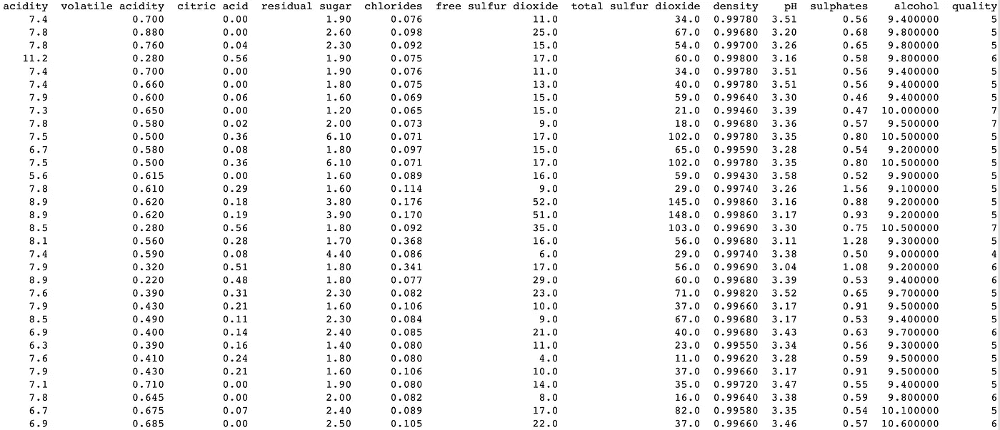

# 理解机器学习的降维

> 原文：<https://towardsdatascience.com/understanding-dimensionality-reduction-for-machine-learning-ad9a3811bd89?source=collection_archive---------14----------------------->


Photo by [Oliver Schwendener](https://unsplash.com/@oliverschwendener?utm_source=medium&utm_medium=referral) on [Unsplash](https://unsplash.com?utm_source=medium&utm_medium=referral)

最近，我被要求处理一个有点偏重的数据集。它太大了，以至于我的 Excel 程序在加载时会停止响应几分钟，手动浏览数据开始变得非常痛苦。

我还是机器学习界的新手。因此，我不得不多次返回 Excel，以决定在机器学习模型中应该使用哪些功能。

但是，在经历了漫长而痛苦的时间后，我终于能够建立一个能给我一些不错的结果的模型了！我开始自我感觉良好，并开始相信我可以成为一名机器学习工程师！

但后来我遇到了下一个障碍:我如何向普通人展示我的成果？

我可以创建两列，一列显示真实世界的结果，另一列显示 ML 模型给我的结果。但这并不是视觉上最吸引人的方式。虽然机器在理解大量数字数据方面比我们更好，但人类思维更容易理解图形和绘图等视觉数据。

所以剧情是最好的前进方式。但是我们的屏幕是二维的，我们的数据可以有两个以上的特征，每个特征可以被认为是一个维度。这个图的两个维度之一将会是输出。因此，我们应该问自己的问题是:我们如何在一个维度中表示我们所有的特征，这些特征可能有数百个到数千个。

这就是降维发挥作用的地方！

# 什么是降维？

降维是机器学习中的一种技术，可以减少数据集中的要素数量。降维的好处在于，它不会对你的机器学习模型的性能产生负面影响。在某些情况下，这种技术甚至提高了模型的准确性。

通过减少数据集中的要素数量，我们也减少了存储数据所需的存储空间，我们的 python 编译器将需要更少的时间来遍历数据集。

在本帖中，我们将看看两种最流行的降维技术，主成分分析(PCA)和线性判别分析(LDA)。

# 入门指南

在我们继续之前，让我们确保您的系统已经准备好使用一些 python 代码。

Python 有两个主要版本:2.x 和 3.x。我建议您确保在系统上安装了 3.x 版本。如果不是这样，那么你可以从[这里](https://www.python.org/downloads/)得到。

接下来，我们需要一个好的代码编辑器，它将有助于使您的编码体验更加容易和愉快。我个人的选择是惊艳的 [VSCode](https://code.visualstudio.com/) ，不过你也可以试试 [Spyder](https://www.spyder-ide.org/) 或者 [Jupyter 笔记本](https://jupyter.org/)。还有一些在线代码编辑器，比如 [Repl](https://repl.it/languages/python3) 和 [Google Colab](http://colab.research.google.com/) 你可以试试。使用在线编辑器可以让你跳过安装 Python 库的浪费时间和存储的任务。

我们将致力于葡萄酒数据集。这个数据集完全是数值型的，不包含任何缺失值，非常适合本文，因为我不必在数据预处理技术上浪费时间，比如将分类数据转换成数值数据，以及将数据输入空单元格。

让我们从导入一些脚本中需要的 Python 库开始:

```
import pandas as pd
from sklearn.preprocessing import StandardScaler
```

我们还需要将葡萄酒数据集加载到我们的 python 脚本中。让我们使用来自`pandas`库的`read_csv()`函数来实现:

```
dataset_url = 'https://archive.ics.uci.edu/ml/machine-learning-databases/wine-quality/winequality-red.csv'dataset = pd.read_csv(dataset_url, sep=';')
```

数据集看起来像这样:



`quality`列将是我们机器学习模型的因变量，其余列将是自变量。因此，让我们相应地将数据集分成两部分:

```
X = dataset.iloc[:, 0:-1].values
y = dataset.iloc[:, -1].values
```

`X`包含 11 列，`y`包含第 12 列。

我们还需要对数据进行一些特征缩放。我们使用`StandardScalar`函数来完成这项工作。该函数将以这样一种方式转换我们的数据，即数据的分布将具有平均值 0 和标准差 1。我们将对`independent`变量进行特征缩放，因为我们希望`dependent`变量尽可能保持原样。

```
sc = StandardScaler()
X = sc.fit_transform(X)
```

我们现在准备执行降维！先从 PCA 开始，再进行 LDA。我建议创建一个新的 python 脚本文件，将您的代码复制到其中，稍后在 LDA 部分使用它。

# 主成分分析

主成分分析(PCA)是最流行的降维算法之一，也可用于噪声过滤、股市预测、数据可视化等等。

PCA 通过检测数据集中特征之间的相关性来减少特征的数量。当特征之间的相关性足够强时，它们将合并在一起并形成单个特征。

我们可以看一看算法背后的数学原理，并试图理解它是如何工作的，但我发现进入代码并查看我们得到的输出更容易。

从上一节我们留下代码的地方继续，让我们从从`sklearn`导入`PCA`类开始:

```
from sklearn.decomposition import PCA
```

接下来，我们需要创建一个`PCA`类的本地实例。

```
pca = PCA(n_components=None)
```

我们正在传递一个名为`n_components`的参数，我们将首先传递一个值`None`。

接下来，我们将调用`pca`上的`fit_transform`方法，并将`X_train`数据集作为输入传递给它。我们还将调用`transform`方法，并将`X_test`数据集作为输入传递

```
X = pca.fit_transform(X)
```

一旦这样做了，我们需要得到数据集不同主成分的解释方差。我们的`pca`对象有一个名为`explained_variance_ratio_`的属性，它包含一个百分比数组。

```
variances = pca.explained_variance_ratio_
```

如果您打印这个变量，您将得到一个类似如下的数组:

```
[0.28173931 0.1750827  0.1409585  0.11029387 0.08720837 0.05996439  0.05307193 0.03845061 0.0313311  0.01648483 0.00541439]
```

我们可以看到这个数组的元素是降序排列的。但是这些价值观是什么意思呢？每个值都解释了数据集中 11 个主成分的方差。

因此，如果只取第一个主成分，我们将有 28.17%的方差。如果我们取两个主成分，我们将得到数组前两个元素的和，其方差约为 45.68%，依此类推。

现在我们可以使用 Python 编译器，将传递给`PCA`内部`n_components`的`None`值替换为期望的维数。让我们看看选择`1`作为所需的维度数量会得到什么

```
pca = PCA(n_components=2)
X = pca.fit_transform(X)// Output
[[-1.61952988]  
 [-0.79916993]  
 [-0.74847909]  
 ...  
 [-1.45612897]  
 [-2.27051793]  
 [-0.42697475]]
```

瞧啊。我们已经成功地将输入数据集的维数从 11 减少到 1！

# 线性判别分析(LDA)

与 PCA 类似，LDA 也是一种降维算法。但与 PCA 不同的是，LDA 也将找到最大化多个类别之间的分离的特征。

你可能会问自己:为什么我要为这个新算法费心，这个新算法基本上和以前的算法做同样的事情？

PCA 和 LDA 都是降维算法。但是在 PCA 被认为是无监督算法的情况下，LDA 则被认为是有监督的。

有监督和无监督？这些是常见的机器学习术语，分别定义算法是否使用因变量。所以 LDA 使用因变量，而 PCA，正如我们之前看到的，不使用。

让我们来看一些代码，并理解如何在 python 代码中实现 LDA 算法。

如果您还没有这样做，那么从入门部分获取代码，并将其粘贴到一个新的 python 脚本文件中。然后，从`sklearn`导入`LinearDiscriminantAnalysis`类。

```
from sklearn.discriminant_analysis import LinearDiscriminantAnalysis
```

接下来，我们从`LinearDiscriminantAnalysis`创建一个名为`lda`的本地对象。我们还会给它传递一个名为`n_components`的参数。现在我们可以做所有的事情，找到每个主成分引入的方差的百分比。但是我将跳过这一部分，将`n_components`参数设置为`1`的值。

```
lda = LinearDiscriminantAnalysis(n_component=1)
```

最后一件事！在`lda`上调用`fit`方法，将`X`和`y`数据集作为输入传递给它，然后链接一个`transform`方法，将`X`作为其输入。

```
X = lda.fit(X,y).transform(X)// Output
[[-1.51304437]  
 [-1.28152255]  
 [-1.11875163]  
 ...  
 [ 0.71637389]  
 [-0.32030997]  
 [ 0.8645305 ]]
```

Tada！🎉我们现在已经成功地将`X`的尺寸减小到 1！

感谢你阅读这篇关于降维的文章。我希望它对你学习机器的旅程有一点点帮助。降维算法真的很棒，不仅有助于可视化您的结果，还有助于减少处理时间，并通过防止系统读取大型数据集来减轻系统压力。