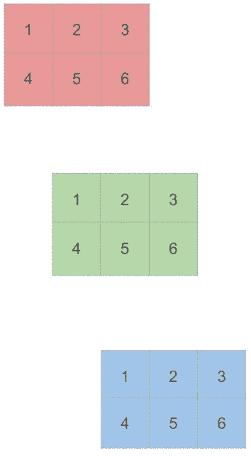
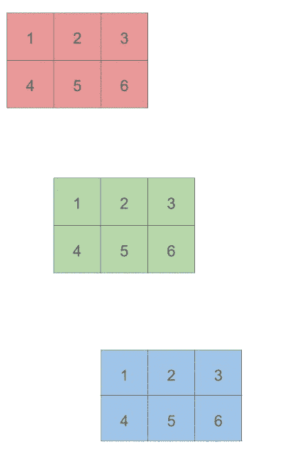
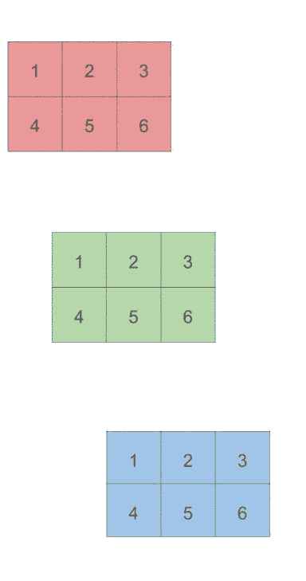

# 了解 PyTorch 中的维度

> 原文：<https://towardsdatascience.com/understanding-dimensions-in-pytorch-6edf9972d3be?source=collection_archive---------5----------------------->

## 通过对 3D 张量求和过程的可视化，对 PyTorch 维数有了更好的直觉


Photo by [Crissy Jarvis](https://unsplash.com/@crissyjarvis?utm_source=medium&utm_medium=referral) on [Unsplash](https://unsplash.com?utm_source=medium&utm_medium=referral)

当我开始用 PyTorch 张量做一些基本运算时，比如求和，对于一维张量来说，它看起来很容易，也很简单:

```
>> x **=** torch.tensor([1, 2, 3])>> torch.sum(x)tensor(6)
```

然而，一旦我开始摆弄 2D 和 3D 张量，并对行和列求和，我就对`torch.sum`的第二个参数`dim`感到困惑。

让我们从官方文件上说的开始:

> **torch.sum(input，dim，keepdim=False，dtype=None) → Tensor**
> 
> 返回给定维数 dim 中每一行输入张量的总和。

我不太理解这种解释。我们可以对多列求和，那么为什么有人提到它只是“返回每行的总和”呢？这是我第一次不理解。

然而，正如我所说，更重要的问题是每个维度的方向。我的意思是。当我们描述 2D 张量的形状时，我们说它包含一些**行**和一些**列。**所以对于一个 *2x3* 张量，我们有 2 行 3 列:

```
>> x = torch.tensor([
     [1, 2, 3],
     [4, 5, 6]
   ])>> x.shapetorch.Size([2, 3])
```

我们首先指定行(2 行)，然后指定列(3 列)，对吗？这使我得出结论，第一维( *dim=0* )适用于行，第二维( *dim=1* )适用于列。按照维度 *dim=0* 表示行方式的推理，我期望`*torch.sum(x, dim=0)*` 产生一个 ***1x2*** 张量(`1 + 2 + 3`和`4 + 5 + 6`产生一个`tensor[6, 15]`)。但结果我得到了不同的东西:一个 ***1x3*** 张量。

```
>> torch.sum(x, dim=0)tensor([5, 7, 9])
```

我惊讶地看到现实与我预期的相反，因为我最终得到了结果`tensor[6, 15]`，但是在传递参数 *dim=1* 时:

```
>> torch.sum(x, dim=1)tensor([6, 15])
```

为什么会这样呢？我找到了[一篇](https://medium.com/@aerinykim/numpy-sum-axis-intuition-6eb94926a5d1)关于 [Aerin Kim 的文章🙏](https://medium.com/u/1d8994ad0efc?source=post_page-----6edf9972d3be--------------------------------)解决同样的困惑，但是对于 NumPy 矩阵，我们传递第二个参数，称为*轴*。除了 PyTorch 中的 *dim* 在 NumPy 中被称为*轴*之外，NumPy sum 与 PyTorch 中的几乎相同:

> numpy.sum(a，axis=None，dtype=None，out=None，keepdims=False)

理解 PyTorch 中的 *dim* 和 NumPy 中的*轴*如何工作的关键是 Aerin 文章中的这段话:

> 理解 numpy sum 的**轴**的方法是:它 ***折叠*** 指定的轴。因此，当它折叠轴 0(行)时，它就变成了一行(按列求和)。

她很好地解释了*轴*参数在 *numpy.sum.* 上的作用，然而，当我们引入第三维时，它变得更加棘手。当我们观察一个 3D 张量的形状时，我们会注意到新的维度被预先考虑并占据了第一个位置(在下面的**粗体**中)，即第三维度变成了`dim=0`。

```
>> y = torch.tensor([
     [
       [1, 2, 3],
       [4, 5, 6]
     ],
     [
       [1, 2, 3],
       [4, 5, 6]
     ],
     [
       [1, 2, 3],
       [4, 5, 6]
     ]
   ])>> y.shapetorch.Size([**3**, 2, 3])
```

是的，相当混乱。这就是为什么我认为对不同维度的求和过程进行一些基本的可视化会大大有助于更好的理解。

这个 3D 张量的第一维( *dim=0* )是最高的一维，包含 3 个二维张量。因此，为了对它进行总结，我们必须将它的 3 个元素一个接一个地折叠起来:

```
>> torch.sum(y, dim=0)tensor([[ 3,  6,  9],
        [12, 15, 18]])
```

它是这样工作的:



对于第二维度( *dim=1* )，我们必须折叠行:

```
>> torch.sum(y, dim=1)tensor([[5, 7, 9],
        [5, 7, 9],
        [5, 7, 9]])
```



最后，第三维度在列上折叠:

```
>> torch.sum(y, dim=2)tensor([[ 6, 15],
        [ 6, 15],
        [ 6, 15]])
```



如果你像我一样，最近开始学习 PyTorch 或 NumPy，我希望这些基本的动画示例能帮助你更好地理解维度是如何工作的，不仅是对于 *sum* 也是对于其他方法。

感谢阅读！

参考资料:

[1] A .金， [Numpy 和轴直觉](https://medium.com/@aerinykim/numpy-sum-axis-intuition-6eb94926a5d1)