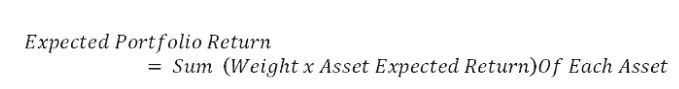
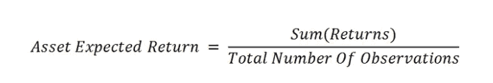
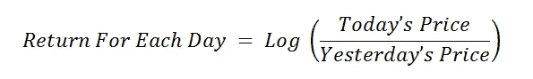
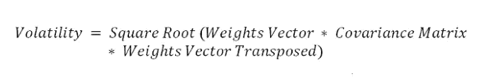
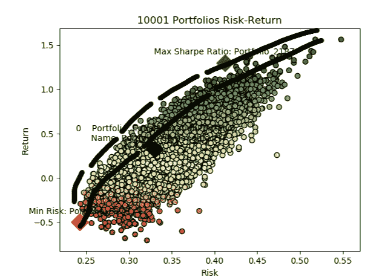
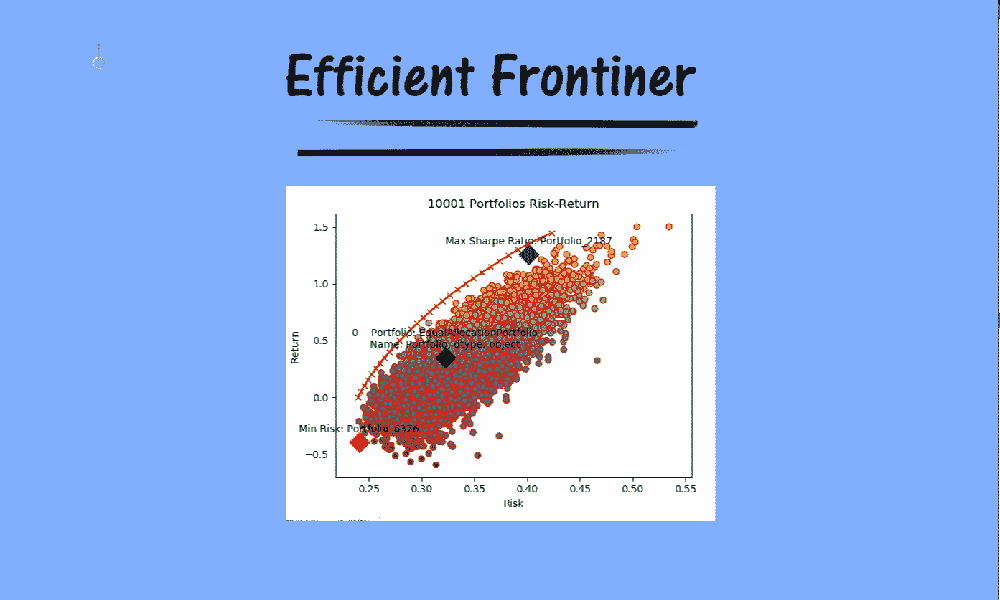
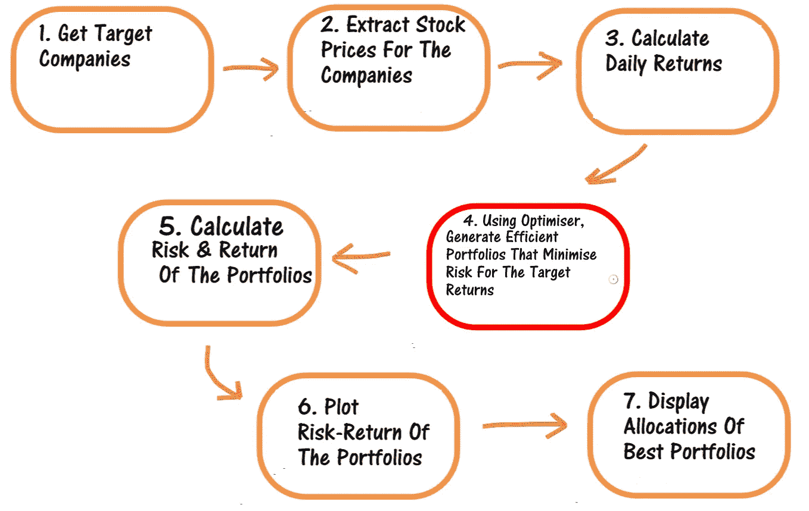
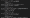
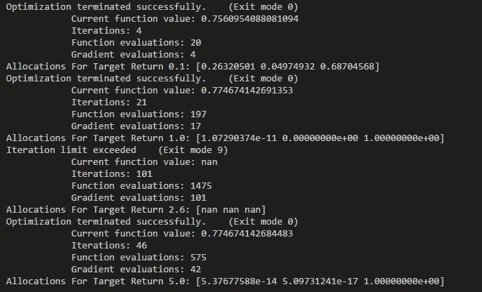

# 理解有效边界

> 原文：<https://towardsdatascience.com/understanding-efficient-frontier-46f1a429d526?source=collection_archive---------12----------------------->

## 诺贝尔奖得主理论让你的投资获得更高回报

# **问题:什么是好的投资组合？**

*一个好的投资组合不仅仅是一长串好的股票和债券。这是一个平衡的整体，为投资者提供了各种保护和机会。—哈里·马科维茨*

> 诺贝尔奖得主哈里·马科维茨的现代投资组合理论可以通过使用优化程序来实现。

*“该理论为你不应该把所有鸡蛋放在一个篮子里的直觉提供了坚实的基础，并向投资者展示了如何组合证券以最小化风险”(伯顿·g·马尔基尔)。*

# 文章目标

本文将记录以下三个要点:

1.  对有效边界的理解
2.  SciPy 包的快速概述
3.  如何在 Python 中生成高效的投资组合？

*请阅读 fintech explained*[*isclaimer*](https://medium.com/p/87dba77241c7?source=your_stories_page---------------------------)*。这个应用程序是基于我的意见，他们可能是错误的。在投资之前，一定要向专业理财顾问寻求建议。*

# 1.让我介绍一下有效边界

让我们假设你有 10，000 美元的现金，并且你有兴趣投资它。你的目标是将这笔钱投资一年。像任何理性的投资者一样，你希望一年后的最终金额高于你想要投资的 10，000 美元。

你最不希望的事情就是失去你开始投资的 10，000 美元。

**到目前为止，一切顺利！**

## 1.1 理解风险收益关系

有许多投资选择，如购买国债或公司股票等。一些投资选择比其他的风险更大，因为它们吸引我们获得更高的回报。

因此，要注意的一点是，存在风险回报权衡。

> 作为投资者，我们的唯一目标可能是投资于风险最小、回报最高的投资选择。

如果我们购买一些资产，如不同公司的股票，那么投资组合的总风险可以由于多样化而降低。这意味着投资者可以通过在投资组合中选择不同比例的不同资产来降低总风险，增加回报。这是因为资产可以相互关联。

## 1.1 A —投资组合回报

现在，如果我们将投资组合的回报率计算为:



其中每项资产的预期回报率为:



回报计算如下:



## 1.1 B —投资组合风险

我们可以将投资组合的风险计算为资产的波动性:



波动率是通过计算每只股票收益的标准差以及每对股票和股票权重之间的协方差来计算的。

这意味着权重可以改变投资组合的风险。

## 1.2 有效前沿理论

我们知道资产的分配(权重)可以改变投资组合的风险。因此，我们可以随机生成 1000 个投资组合，其中每个投资组合将包含一组不同的资产权重。

我们知道，随着投资组合数量的增加，我们将更接近真正的最优投资组合。这是一种蛮力方法，可能会是一项耗时的任务。此外，不能保证我们将找到正确的分配。

如果我们将每个投资组合的风险和回报绘制在图表上，那么我们会在投资组合的顶部看到一条拱形线。



我们可以看到图表在我用黑笔标出的投资组合顶部形成了一个拱形。

## 这条线本质上指向最有效的投资组合。这条线被称为有效边界。

> 有效边界是一组投资组合，以最低的风险给我们带来最高的回报。

其他所有不在有效边界上的投资组合都不那么有效，因为它提供了与有效边界上的投资组合相同的回报，但承担了更高的风险。

> *因此，任何其他投资组合都不如有效边界上的投资组合。因此，我们可以忽略不在有效边界上的投资组合。*



# 2.SciPy 优化快速概述

Python 中有许多库可以对 CVXPY 和 SciPy 等函数执行优化例程。

在这一节中，我将简要介绍 SciPy 包，这是需要熟悉的关键 Python 包之一。特别是，我将解释我们将执行的计算有效投资组合的函数，以及每个参数的含义。

优化技术帮助我们更快地找到一个函数的解，而不需要收集大量数据，也不需要使用分析技术。

可以对优化施加约束。我们也可以使用最优化技术来找出 x 的最小值和最大值。

其工作方式是，优化器试图找到我们的目标变量 x 的值，通过保持在指定的边界内，使实际值和观察值之间的差异最小化。

如果你想理解这个概念，请阅读这篇文章:

[](https://medium.com/fintechexplained/how-does-mathematical-optimisation-work-d1aa046c9bdd) [## 数学优化是如何工作的？

### 以直观的方式理解最优化科学

medium.com](https://medium.com/fintechexplained/how-does-mathematical-optimisation-work-d1aa046c9bdd) 

## 2.1 SciPy 优化

scipy 包中的 scipy.optimize 模块提供了多种优化算法。该模块包括无约束算法、全局优化程序、最小平方最小化、标量和多变量最小化等。

它提供了牛顿-克雷洛夫，牛顿共轭梯度，SLSQP，曲线拟合和双重退火算法等。

## 2.2 SciPy 最小化功能

scipy.optimize 模块中有一个 minimize 函数，它执行一个或多个变量的标量函数的最小化。最小化函数使我们更容易对目标函数执行所需的算法。

该方法的特征是:

```
**scipy.optimize.minimize(***fun***,** *x0***,** *args=()***,** *method=None***,** *jac=None***,** *hess=None***,** *hessp=None***,** *bounds=None***,** *constraints=()***,** *tol=None***,** *callback=None***,** *options=None***)**[**[source]**](https://github.com/scipy/scipy/blob/v1.3.0/scipy/optimize/_minimize.py#L42-L626)
```

关键论点是:

*   **fun:** 这是我们想要最小化的目标函数。在我们的案例中，我们的投资组合由许多资产组成。我们希望找到每种资产的配置，使我们的风险最小。该函数的第一个参数是分配的一维数组。我们也可以向函数传递一组其他参数。
*   **x0** :这是初步猜测。我们可以赋值 1/资产数，作为 x 的初始值。
*   **args** :这是一个可以包含额外可选参数的元组。例如，如果我们的目标风险函数接受协方差矩阵，那么我们可以在 args 元组中传递它。
*   **方法**:这是一个字符串参数，我们可以在其中传递算法名，比如 SLSQP
*   **约束**:这是我们要传入约束的地方，比如分配的总和应该是 1。
*   **bounds** :这些基本上是 x 中每个元素的最小和最大对。作为一个例子，我们可以指出我们不希望分配的值为负，这意味着我们不想出售资产。

## 2.3 SLSQP 算法

要对多元标量函数执行约束最小化，我们可以使用 SLSQP 算法来使用 minimize 函数。

SLSQP 代表序列最小二乘编程。想法是最小化服从约束函数的 x 的函数。约束可以是线性的和非线性的。它们被定义为词典。

字典的关键字包括:

*   **类型**:指定约束的类型，如 ineq(不等式)或 eq(等式)
*   **fun** :投资组合中资产配置之和等约束的函数应该等于 1。

# 3.如何在 Python 中生成高效的投资组合？

文章的最后一节将使用上面解释的知识来建立一套有效的投资组合。

## 3.1 有效边界的 7 个步骤

我们需要执行以下 7 个步骤:



1.  第一步(第 1-3 步)是计算我们股票的日收益。
2.  第二阶段是第 4 步，我们需要优化配置，为我们的每个目标回报找到最佳投资组合。
3.  最后一个阶段是使用分配来计算风险和回报，并绘制投资组合。

## 3.2 在 Python 中实现高效边界

1.  一旦我们获得了股票价格，我们就需要计算每只股票的预期平均收益:

```
import numpy as np
def asset_return_function(stock_prices):
  returns = np.log(stock_prices / stock_prices.shift(1))
  return returns.mean()
```

2.然后，对于每一个目标，我们将让优化者最小化风险(我们的目标函数),并给我们分配资产。

投资组合的风险计算如下:

```
import numpy as np
from functools import reduce
def risk_function(allocations, cov):
 return np.sqrt(reduce(np.dot, [allocations, cov, allocations.T]))
```

投资组合的回报计算如下:

```
def return_function(returns, allocations):
  return sum(returns * allocations)
```

3.最后，这段代码片段展示了我们如何使用 SciPy 优化器。

我已经生成了随机回报和协方差，这样我们就可以专注于优化器如何处理界限和约束了！

```
#initialise
returns = np.random.rand(3) covariance = np.random.rand(3,3)#set variables portfolio_size = len(returns)
risk_free_rate=0for my_return in [0.1,1.0,2.6,5.0]:

    x0 = np.ones(portfolio_size) * (1.0 / portfolio_size) bounds = ((0, 1),) * (portfolio_size)constraints=[]
    constraints.append({’type’: 'eq’, 'fun’: lambda inputs: 1.0 - np.sum(inputs)})
    constraints.append({’type’: 'eq’, 'args’: (returns,),
        'fun’: lambda allocations, returns:
    my_return - return_function(returns, allocations)})#optimised allocations allocations = minimize(risk_function, x0,
        args=(covariance), method=’SLSQP’,
        #prints covergence msgs
        options={’disp’: True},
        constraints=constraints,
        bounds=bounds).xexpectedreturns = return_function(returns, allocations) print(’Allocations For Target Return '+str(my_return)+’: '+str(allocations))
```

一旦我们运行上面的代码，它会产生以下输出:



我们可以看到优化例程运行了四次；每个目标返回一个。我们为每个分配指定了下限 0 和上限 1。增加了对分配的约束，以确保我们最大化回报，分配的总和为 1。

在每个优化例程中，优化器运行多次迭代，直到实现优化的分配。这些分配给了我们最好的投资组合，这就是所谓的有效边界。

> *对于每一个目标，它都返回了最优的投资组合。分配数组是构成我们每个目标回报的投资组合的资产的权重(比例)*

# 后续步骤:

**我将实现一个端到端的解决方案，展示我们如何在 Python 中运行有效边界，从获取股票价格到绘制有效边界。如果你感兴趣，请告诉我。**

# 摘要

本文记录了以下三个部分:

1.  对有效边界的理解
2.  SciPy 包的快速概述
3.  如何在 Python 中生成高效的投资组合？

如果您有兴趣查看 Python 中高效前沿的端到端解决方案，请告诉我。