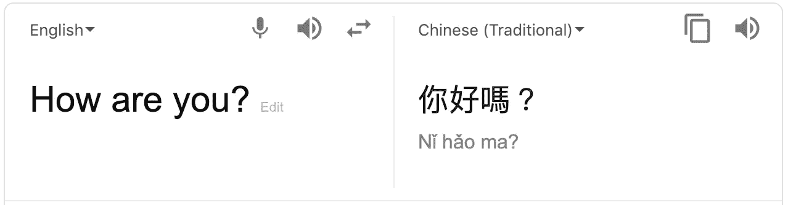
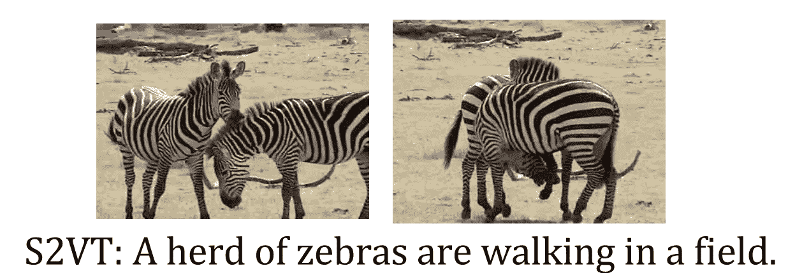
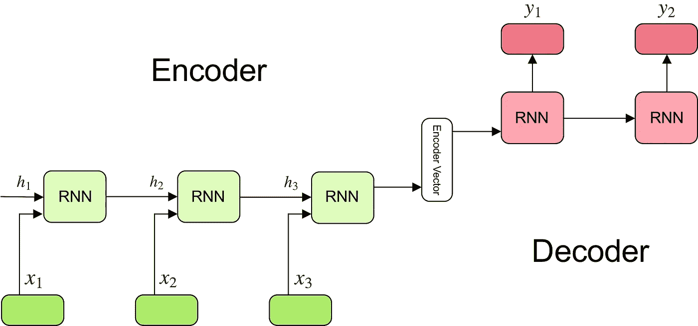

# 理解编码器-解码器序列到序列模型

> 原文：<https://towardsdatascience.com/understanding-encoder-decoder-sequence-to-sequence-model-679e04af4346?source=collection_archive---------1----------------------->

Photo by [Capturing the human heart.](https://unsplash.com/photos/TrhLCn1abMU?utm_source=unsplash&utm_medium=referral&utm_content=creditCopyText) on [Unsplash](https://unsplash.com/search/photos/mapping?utm_source=unsplash&utm_medium=referral&utm_content=creditCopyText)

在本文中，我将尝试对序列对序列模型给出一个简短的解释，该模型最近在机器翻译、视频字幕、问答等相当复杂的任务上取得了显著的成果。

先决条件:读者应该已经熟悉神经网络，特别是递归神经网络(RNNs)。此外，了解 LSTM 或 GRU 模型更佳。如果你还不熟悉 RNNs，我推荐阅读 [*这篇文章*](/learn-how-recurrent-neural-networks-work-84e975feaaf7) *它会让你快速入门。对于 LSTM 和 GRU，我建议看看* [*【了解 LSTM 网络】*](http://colah.github.io/posts/2015-08-Understanding-LSTMs/) *以及* [*【了解 GRU 网络】*](/understanding-gru-networks-2ef37df6c9be) *。*

# 序列对序列模型的用例

您每天面对的众多系统背后都有一个序列对序列模型。例如，seq2seq 模型支持谷歌翻译、语音设备和在线聊天机器人等应用。一般来说，这些应用程序包括:

*   *机器翻译*——谷歌 2016 年的一篇[论文](https://arxiv.org/pdf/1409.3215.pdf)展示了 seq2seq 模型的翻译质量如何“接近或超过目前所有公布的结果”。

*   *语音识别* —另一篇 Google [论文](https://www.isca-speech.org/archive/Interspeech_2017/pdfs/0233.PDF)在语音识别任务上对比了现有的 seq2seq 模型。

*   *视频字幕*—2015 年[的一篇论文](https://arxiv.org/pdf/1505.00487.pdf)展示了 seq2seq 如何在生成电影描述方面产生巨大的结果。

这些只是 seq2seq 被视为最佳解决方案的一些应用。该模型可用作任何基于序列的问题的解决方案，尤其是输入和输出具有不同大小和类别的问题。我们将在下面详细讨论模型结构。

# 序列到序列模型的定义

[由 Google](https://arxiv.org/pdf/1409.3215.pdf) 于 2014 年首次推出，序列到序列模型旨在将固定长度的输入与固定长度的输出进行映射，其中输入和输出的长度可能不同。

For example, translating “What are you doing today?” from English to Chinese has input of 5 words and output of 7 symbols (今天你在做什麼？). Clearly, we can’t use a regular LSTM network to map each word from the English sentence to the Chinese sentence.

这就是为什么序列对序列模型被用来解决这样的问题。

# 序列对序列模型如何工作？

为了充分理解模型的基本逻辑，我们将浏览下图:

Encoder-decoder sequence to sequence model

该模型由 3 部分组成:编码器、中间(编码器)向量和解码器。

## **编码器**

*   几个循环单元(LSTM 单元或 GRU 单元，性能更好)的堆栈，其中每个单元接受输入序列的单个元素，收集该元素的信息并将其向前传播。
*   在问答问题中，输入序列是问题中所有单词的集合。每个单词被表示为 *x_i* ，其中 *i* 是该单词的顺序。
*   隐藏状态 *h_i* 使用以下公式计算:

这个简单的公式代表了普通递归神经网络的结果。正如你所看到的，我们只是将适当的权重应用于先前的隐藏状态 *h_(t-1)* 和输入向量 *x_t.*

## 编码器向量

*   这是从模型的编码器部分产生的最终隐藏状态。它是用上面的公式计算的。
*   该向量旨在封装所有输入元素的信息，以帮助解码器做出准确的预测。
*   它充当模型解码器部分的初始隐藏状态。

## 解码器

*   几个循环单元的堆栈，每个循环单元在时间步长 *t* 预测一个输出 *y_t* 。
*   每个递归单元接受来自前一个单元的隐藏状态，并产生和输出它自己的隐藏状态。
*   在问答问题中，输出序列是答案中所有单词的集合。每个单词表示为 *y_i* ，其中 *i* 是该单词的顺序。
*   任何隐藏状态 *h_i* 都是使用以下公式计算的:

如你所见，我们只是使用前一个隐藏状态来计算下一个。

*   使用以下公式计算时间步长 *t* 的输出 *y_t* :

我们使用当前时间步长的隐藏状态以及相应的权重 W(S)来计算输出。 [Softmax](https://www.youtube.com/watch?v=LLux1SW--oM) 用于创建一个概率向量，该向量将帮助我们确定最终输出(如问答问题中的单词)。

**这个模型的强大之处在于它可以将不同长度的序列相互映射。**正如你所看到的，输入和输出是不相关的，它们的长度可以不同。这开启了一系列全新的问题，现在可以使用这种架构来解决。

## 进一步阅读

上面的解释只涵盖了最简单的序列对序列模型，因此，我们不能期望它在复杂的任务中表现良好。原因是使用单个向量来编码整个输入序列不能捕获全部信息。

这就是引入多种增强功能的原因。每一个都旨在增强该模型在具有长输入和输出序列的稍微复杂的任务上的性能。例如:

*   [颠倒输入顺序](https://arxiv.org/pdf/1409.3215.pdf)。
*   使用 LSTM 或 GRU 细胞。
*   [引入注意机制](http://www.wildml.com/2016/01/attention-and-memory-in-deep-learning-and-nlp/)。
*   还有很多。

如果你想加强你对这种奇妙的深度学习模型的了解，我强烈推荐你观看 [Richard Socher 关于机器翻译的讲座](https://youtu.be/QuELiw8tbx8?list=PL3FW7Lu3i5Jsnh1rnUwq_TcylNr7EkRe6&t=1190)。如果你仍然感到迷茫或有任何问题，请在评论区提问，我很乐意帮助你。

我希望这篇文章能让你很好地理解处理序列的最新模型(seq2seq ),并对你激动人心的深度学习之旅有所贡献。

> 还有哪些 AI 内容？在 LinkedIn 上关注我的每日更新。

## 感谢您的阅读。如果你喜欢这篇文章，给它一些掌声👏。希望你有一个伟大的一天！