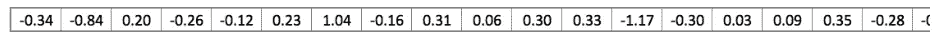
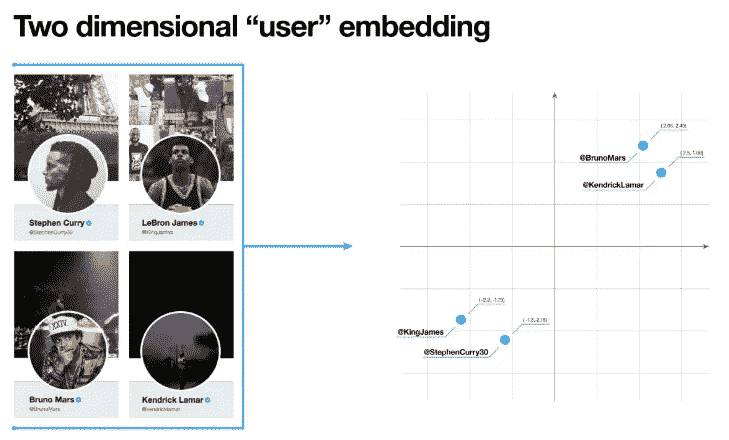
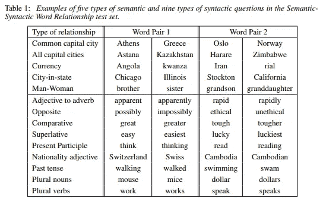
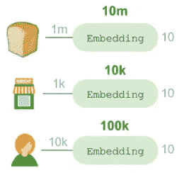
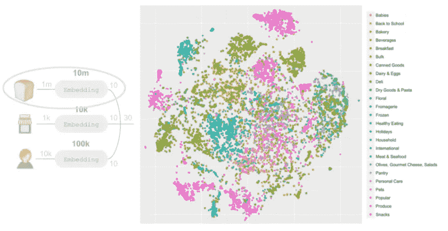
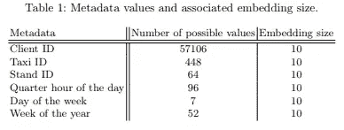
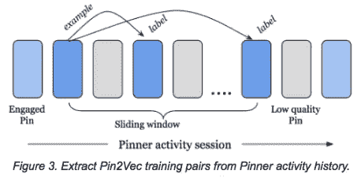
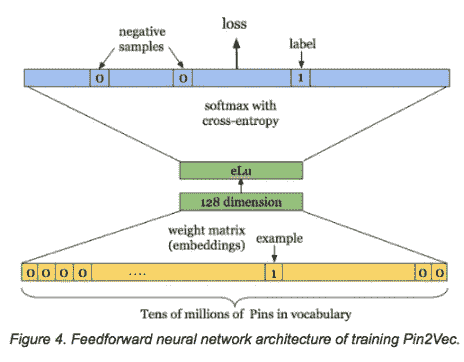
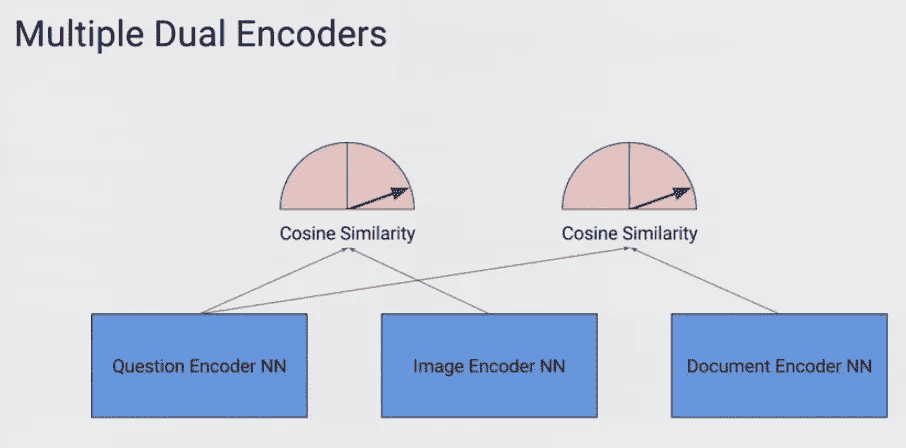
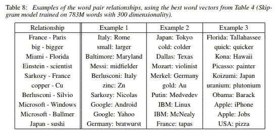

# 理解实体嵌入及其应用

> 原文：<https://towardsdatascience.com/understanding-entity-embeddings-and-its-application-69e37ae1501d?source=collection_archive---------5----------------------->

Knowledge, Alfons Morales — Unsplash

最近，在被指派研究一个预测问题后，我读了很多关于实体嵌入的文章。

手头的任务是，给定我们数据仓库中的历史招聘广告数据，预测给定职位的工资。很自然，我不得不寻找如何使用深度学习来解决这个问题——因为现在用深度学习而不是简单的线性回归来做事情要性感得多(如果你正在阅读这篇文章，并且因为只有数据科学家才会阅读这篇文章，我相信你会理解:)。

还有什么比从 fast.ai 中寻找例子更好的学习深度学习的方法呢？

瞧，他们确实有这样的例子。

 [## 表格数据深度学习介绍 fast.ai

### 有一种强大的技术正在赢得 Kaggle 比赛，并在谷歌广泛使用(据杰夫…

www.fast.ai](https://www.fast.ai/2018/04/29/categorical-embeddings/) 

完成代码和所有非常相似的问题，卡格尔罗斯曼挑战。我想我的任务结束了。

虽然已经运行了代码并将其改装到我的数据中，但显然还有很多东西需要理解，以便能够像作者预期的那样顺利运行。

我对这样一个想法很感兴趣:不仅可以用向量来表示单词，甚至可以表示基于时间的数据？—当时对我来说是新闻。那时我知道，我必须更深入地研究用向量来表示事物的概念，以及使用它还能完成什么。

因此有了这个帖子。

# 实体嵌入

## **什么事？**

不严格地说，实体嵌入是某种东西(也就是一个实体)的向量(一列实数)表示。例如，在自然语言处理(NLP)中，某个东西(也就是实体)可以是一个单词、一个句子或一个段落。

“ The GloVe word embedding of the word “stick” — a vector of 200 floats (rounded to two decimals). It goes on for two hundred values. “. [1]

然而，它真的不仅限于此。

实体(向量)也可以被认为是一个物体、一个上下文或一个想法。在流行的 Word2Vec 模型[8]中，那个东西——就是单词。但是最近，研究人员采用了在给定上下文的情况下创建嵌入的想法(回想一下，Word2Vec 是在给定其周围单词的上下文的情况下创建嵌入的)，并将其应用于其他类型的对象(我将在后面介绍)。

例如，在下图中，嵌入了的 Twitter 用户实体的可视化演示了在给定的向量空间中，具有相似特征的用户彼此更接近。

From Twitter [2]

## 为什么重要？

在 NLP 中，能够在嵌入中表示单词允许我们使用少得多的内存，因为向量长度通常比语言的词汇表短得多(传统上可以执行一键编码来表示词汇表中的每个单词)。此外，Word2Vec 论文还表明，嵌入也存储了单词的一些语义意义。

但更重要的是，能够将实体(如单词、Twitter 用户、一段时间内的购买行为)表示为向量，这为我们对其执行各种操作提供了可能性(典型的例子是，将它用作机器学习模型的输入)。

# 应用程序

以下是一些著名组织如何利用它的优势的例子。这并不意味着详尽或深入。如果需要更多细节，建议读者查阅各自的原始资料(参考资料部分提供了链接)。

## 模型特征

嵌入主要是作为一种以矢量格式表示事物的方式被创建的，用于深度学习模型。拥有它们是很有用的，因为它允许我们从原始数据中捕获并转发最重要的信息到我们的模型中。

> 使用嵌入作为输入特征的模型将受益于它们的编码知识，并因此提高性能。最重要的是，假设嵌入的紧密性，模型本身将需要更少的参数，从而在训练和服务期间在基础设施方面产生更快的迭代速度和成本节约。[2]

对于基于文本的数据，已经开发了许多形式的模型架构来更好地捕获文本可以包含的不同种类的信息。从简单的一键编码，TF-IDF，到基于神经的架构，如 Word2Vec、GloVe，再到当前的技术水平，如 ELMo、ULMFiT 和 BERT，今天的单词嵌入已经从仅仅存储二进制的是或否状态发展到捕获句法关系和上下文。

对于其他类型的信息，如 Twitter 用户、Pinterest pins 或历史产品销售收入，通常需要一种全新的模型架构。

对于 Instacart 来说，试图优化他们的个人购物者的效率；已经建立了一个深度学习模型来预测对它们中的项目进行排序的最快顺序。对于该模型，他们通过使用 Keras [3]中的`Embedding` 方法将商店位置、购物项目和购物者嵌入到一个 10 维向量空间中。

The store location embedding enables the model to learn store layouts and generalize learnings across retailers and locations. The shopper embedding learns that shoppers may take consistently different routes through stores.

随后深入观察嵌入层会发现一些有趣的见解。

2-dimensional space representation of the embeddings using t-SNE [3]

> 大多数这些聚类(如上)对应于部门，即使部门数据从未用于学习嵌入。此外，我们可以放大到一个区域，比如左上角的蓝色肉类和海鲜部。还有其他产品出现在肉类和海鲜附近，但不是肉类和海鲜。相反，这些是在肉类和海鲜柜台出售的产品(如香料、卤汁、熟食或其他物品)。该模型比我们拥有的部门和通道编码数据更好地学习了商店的组织结构。[3]

类似的技术也用于出租车目的地预测 Kaggle 比赛[5]，作者选择使用神经网络方法最终赢得比赛。

Categorical data (ie Client ID, Taxi ID, and Stand IDD) are represented in 10-dimension. Time is broken down to several bucket types and later embedded with the same dimension count.

## 特征压缩

在前面的出租车目的地预测示例中，我们看到嵌入了 6 个项目——3 个不同的 ID 类型和 3 个时间段。如果这种模型部署在生产中，并且随着我们不断向模型中添加越来越多的功能以提高其性能，在推理时间内处理所有事情的时间将会太慢。

因此，我们可以做的是在模型被训练后存储嵌入，并在以后加载它(像 Word2Vec 嵌入)。但是请注意，应该只存储本质上静态的嵌入(比如 IDs)。有效地使用加载已经预训练的嵌入将减少推断时间期间的计算和存储器负载。

## 最近邻搜索

正如我们之前在 Instacart 的可视化嵌入中看到的，相似的项目实际上在它们存在的多维向量空间中彼此更接近。利用这种行为，如果我们有一个基于距离感兴趣的样本向量，我们实际上可以寻找具有相似属性的项目。

例如，Pinterest 为它的 Pin 创建了一个 128 维的嵌入(又名 Pin2Vec)来捕捉每个 Pin 如何与 Pinners 相关的上下文[4]。然而，它的创建并不简单(不像 Instacart 或 Taxi competition ),因为他们采用了类似于 Word2Vec 的方法来实现这个表示。

“The learned Pin2Vec groups Pins with respect to a Pinner’s recent engagement” [4]

Pin2Vec architecture is inspired by Word2Vec [4]

结果是，与前一个建议相比，提出了一个更相关的建议。然而，对于数据稀疏的长尾引脚，他们仍然使用后者。

在 Pinterest 应用程序中，检索相关的 pin 码(即搜索结果)不仅仅是基于点击一个 pin 码。人们也可以利用视觉搜索功能，或应用程序顶部的文本栏。在这种情况下，还可以使用基于最近邻的搜索吗？

谷歌的丹·吉利克在伯克利的演讲中提出，如果我们能够放置来自文本、图像、视频或音频的所有不同的对象/实体，这是可能的；在同一个向量空间中。[6 (42:05) ]

By training all the model together, we can ensure that the embeddings reside in the same space.

以上图为例，有 2 个带标签的数据集:(I)问题-图像和(ii)问题-文档。通过一起训练两个模型数据集，我们可以确保问题、图像和文档都存在于单个向量空间中。

## 迁移学习

迁移学习是实体嵌入的另一个常见用途。本质上，它的意思是我们训练一个模型(即。一个语言模型)，并将其用于另一类问题(即。文本分类)。

Training a classifier using BERT [1].

一般来说，使用预训练模型构建的模型训练速度更快，并且可以获得更好的结果。在我目前的组织中，我们利用 BERT 来完成我们的一个文本分类任务，在这个任务中，对于给定的问题，它很快获得了最先进的结果。

# 摘要

从仅仅表示单词及其语义，到表示时间和空间位置——能够将实体很好地表示成向量似乎有明显的优势。

然而，这里的关键词是“能够”。

虽然在将单词或文本表示成嵌入方面已经有了很大的发展，但是对于其他类型的实体来说就不一样了。正如我们在 Pin2Vec 的案例中所看到的，提出嵌入确实需要对问题有所了解，并在解决问题时有所创新。

即使这样，重要的是我们不要假设学习到的表征是 100%正确的。即使是 Word2Vec，尽管大肆宣传，在某些情况下也不是那么可靠。例如，在下面的图表中，奥巴马和巴拉克的关系就像萨科齐和尼古拉的关系一样有意义，因为上下文是名和姓；普京和梅德韦杰夫就不一样了，他们是两个独立的个体。关于单词嵌入的更多细节，请查看[7]中的文章。

Word2Vec paper [8]

# 参考文献(排名不分先后)

[1]杰·阿拉玛，插图画家伯特—[http://jalammar.github.io/illustrated-bert/](http://jalammar.github.io/illustrated-bert/)

[2]Embeddings @ Twitter—[https://blog . Twitter . com/engineering/en _ us/topics/insights/2018/embeddingsattwitter . html](https://blog.twitter.com/engineering/en_us/topics/insights/2018/embeddingsattwitter.html)

[3]使用表情符号的深度学习-[https://tech . insta cart . com/Deep-Learning-with-e mojis-not-math-660 ba 1 ad 6 CDC](https://tech.instacart.com/deep-learning-with-emojis-not-math-660ba1ad6cdc)

[4]对相关引脚应用深度学习—[https://medium . com/the-graph/Applying-deep-learning-to-Related-Pins-a6 fee 3c 92 f5e](https://medium.com/the-graph/applying-deep-learning-to-related-pins-a6fee3c92f5e)

[5]人工神经网络在出租车目的地预测中的应用—[https://arxiv.org/pdf/1508.00021.pdf](https://arxiv.org/pdf/1508.00021.pdf)

[6]万物嵌入:神经网络时代的搜索—[https://www.youtube.com/watch?time_continue=36&v = jghvjxp 9 nhw](https://www.youtube.com/watch?time_continue=36&v=JGHVJXP9NHw)

[7]超越单词嵌入第 3 部分—[https://towards data science . com/超越单词嵌入-第 3 部分-四个常见缺陷-最先进的-神经-NLP-模型-c1d35d3496d0](/beyond-word-embeddings-part-3-four-common-flaws-in-state-of-the-art-neural-nlp-models-c1d35d3496d0)

[8]向量空间中单词表示的有效估计:[https://arxiv.org/pdf/1301.3781.pdf](https://arxiv.org/pdf/1301.3781.pdf)

## 其他参考文献

*   超越单词嵌入第二部分，亚伦·博恩施泰因:[https://towards data science . com/beyond-Word-embedding-Part-2-Word-vectors-NLP-modeling-from-bow-to-Bert-4 EBD 4711 d0 EC](/beyond-word-embeddings-part-2-word-vectors-nlp-modeling-from-bow-to-bert-4ebd4711d0ec)
*   卡格尔出租车预测一等奖获得者论文:【https://arxiv.org/pdf/1508.00021.pdf 
*   卡格尔·罗斯曼挑战赛三等奖获得者的论文:[https://arxiv.org/pdf/1604.06737.pdf](https://arxiv.org/pdf/1604.06737.pdf)