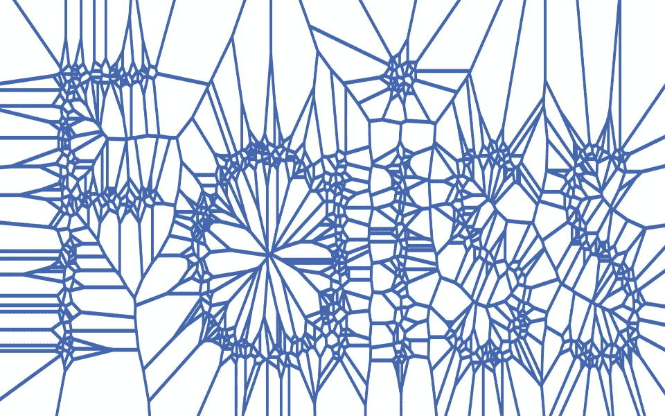

# 理解失败

> 原文：<https://towardsdatascience.com/understanding-faiss-619bb6db2d1a?source=collection_archive---------4----------------------->

## **…。相似性搜索的世界**



FAISS: Facebook AI Similarity Search

几周前，我偶然发现了 FAISS——脸书的图书馆，用于对非常大的数据集进行相似性搜索。我的兴趣被激起了，几个小时的网上搜索让我找到了一个知识宝库。在这篇文章中，我希望写下(或者更确切地说，写下)一些与这个库相关的基本概念。在我的[后续文章](https://medium.com/dotstar/understanding-faiss-part-2-79d90b1e5388)中，我将深入挖掘并探索一些更高级的概念。

# 相似性搜索和机器学习

通常在相似性搜索中，经常会有一个查询记录与存储的记录数据库(文档或图像等)进行比较。主要目的是检索一组与查询记录相似的数据库记录。所以，如果你有一张狗的图片，相似性搜索应该会给你一个有狗的图片列表(不是彩虹！)在他们身上。

当机器学习出现时，数据库对应于向量的集合。向量可以被视为由机器学习算法生成的输入数据的高维表示。这个上下文中的相似性搜索意味着基于某种相似性或距离度量来搜索给定查询向量的相似向量。

基于相似性进行搜索的一种简单方法是将查询向量与数据库中的所有其他向量进行比较。但是如果数据库有超过一百万个向量呢？输入 FAISS…

# FAISS 的故事及其倒排索引

FAISS 是一个 C++库(当然有 python 绑定！)当向量的数量可能达到数百万或数十亿时，这确保了更快的相似性搜索。

它的核心是索引。请注意，索引无处不在！(尽管形式和名称不同)。在这篇文章中，我将详细阐述一个:“倒排文件索引”或“试管婴儿”

让我告诉你一个小故事(请在这里耐心听我说，我保证它很重要……)

Someland 的女王刚刚征服了一片新的领土，发现这片土地上的土著被隔离在三个不同的部落中，他们根本无法相互容忍。因此，为了避免争斗，她决定为每个部落建立三个独立的城市。有趣的是，每个部落都有一套独特的技能。这有助于女王识别一个人属于哪个部落。格林一家似乎生来就擅长园艺，大部分时间都在照料植物。廷克一家是聪明、善于分析的一群人，主要由建筑师、建筑商和科学家组成。最后，还有创意奇思妙想，他们以精通美术而闻名。他们大多是诗人、舞蹈家或艺术家。

城市建成了，部落首领被任命为各自部落的代表。出于行政管理的目的，女王的大臣们保留了一本“总名册”，记录了部落首领的名字以及每个城市的市民的名字。

一天，一群旅行者来到这个王国，请求避难。女王现在遇到了一个问题。她必须找到合适的志愿者，他们会同意让旅行者住在他们家里。(显然王国里没有客栈)。她知道市民们相当谨慎，只对与他们志趣相投的人感兴趣。

终于找到了解决办法。对于每个旅行者，酋长根据旅行者的特征与部落特征的匹配程度来决定他或她属于哪个部落。当旅行者到达他们各自的城市时，一些市民走出来，自愿为其中一位旅行者提供住宿，因为他们觉得这位旅行者的特点与他们的相符。嗯…问题解决了！(女王现在可以安心睡觉了)。

维奥拉。我刚刚给了你一个倒排索引如何工作的鸟瞰图。

# 技术细节…

我们用上面的故事打个比方。

王国的所有公民都是数据库中的向量，三个部落对应于三个独立的“集群”或“细胞”。然后，根据某种相似性度量，将向量分配给这三个聚类之一。(还记得不同的部落使用不同的技能使他们彼此区分开来吗？).通常，L2 距离测量以及类似 K-means 的聚类算法被用于此。

就像我们故事中的部落酋长一样，每个集群都由一个集群质心或“代码”来表示。就像部长们的“主书”一样，维护着一个单独的“码本”,它记录着每个簇的代码(或簇形心)及其相应的向量。这实质上是“倒排文件”或索引。

量化器用于决定向量属于哪个簇(我猜这主要是女王的工作)。因此，当一个查询向量进来时(就像我们故事中的旅行者)，会根据它与聚类中心的相似性为查询向量找到一个合适的聚类(就像部落酋长根据他们的特征选择旅行者一样)。最后，在所选聚类中选择数量的相似向量作为查询结果返回(如自愿为旅行者提供住宿的城市居民)。这可以看作是倒排索引的一个非常基本的工作。

# 和一些代码…

首先，用 python 绑定安装 FAISS 库。请按照以下网址给出的说明操作:[https://github . com/Facebook research/faiss/blob/master/install . MD](https://github.com/facebookresearch/faiss/blob/master/INSTALL.md)

然后，使用以下命令导入 python 中的库和其他依赖项:

```
import numpy as np import faiss  # this will import the faiss library
```

现在，让我们为数据库创建一些向量。FAISS 要求预先定义数据库向量的维度。我们创建了大约 200 个维数为 128 的向量。这将创建一个(200 * 128)矢量矩阵。请注意，所有向量值都存储在 float 32 类型中。

```
dimension = 128    # dimensions of each vector n = 200    # number of vectors np.random.seed(1) db_vectors = np.random.random((n, dimension)).astype('float32')
```

我们对向量使用“IndexIVFFlat”索引类型。这里的“平坦”表示矢量被原样存储，没有任何压缩或量化(稍后将详细介绍)。试管婴儿指数有两个参数:

*   nlist:指定要形成的簇的数量
*   量化器:将向量分配给特定的簇。这通常是另一个使用 L2 距离度量的指数(我们使用 FlatL2 指数)

```
nlist = 5  # number of clustersquantiser = faiss.IndexFlatL2(dimension) index = faiss.IndexIVFFlat(quantiser, dimension, nlist,   faiss.METRIC_L2)
```

必须首先训练索引以创建“nlist”个聚类，然后将向量添加到这些聚类中。“is_trained”标志表示索引是否被训练,“ntotal”属性显示添加到索引的向量的总数。

```
print(index.is_trained)   # Falseindex.train(db_vectors)  # train on the database vectorsprint(index.ntotal)   # 0index.add(db_vectors)   # add the vectors and update the indexprint(index.is_trained)  # Trueprint(index.ntotal)   # 200
```

接下来，我们在索引上搜索 10 个查询向量。“nprobe”参数指定在搜索操作期间要访问的集群数。这可以被视为超参数，可以对其进行调整以获得不同的结果。请注意，“nprobe”不能超过“nlist”。

“k”指定了从被访问的聚类中返回的相似向量的数量。

```
nprobe = 2  # find 2 most similar clustersn_query = 10 k = 3  # return 3 nearest neighboursnp.random.seed(0) query_vectors = np.random.random((n_query, dimension)).astype('float32')distances, indices = index.search(query_vectors, k)
```

搜索操作将返回每个查询向量的 k 个最相似向量的 id(向量存储中的行号或索引)以及它们各自的距离。

```
distances: [[15.770459 16.773014 17.17131  17.439615 17.443993] [16.476107 18.52229  18.811913 18.974785 19.02668 ] [15.520995 16.500256 17.069542 17.483345 17.742079] [16.842718 17.712341 17.828487 18.699772 19.345257] [18.325392 18.495464 18.684456 18.70239  18.904179] [17.531885 18.18179  18.331263 19.429993 19.700233] [16.840158 17.03664  17.091755 17.34306  17.487806] [15.984037 16.380917 17.270592 17.620832 17.663855] [18.018503 18.0761   18.766172 18.956903 18.985767] [17.113918 17.385284 17.65757  18.122086 18.170212]]indices: [[185  35  96  80  75] [118  51 122 108  31] [148 149 173  27  84] [175 177  50  38  81] [ 44 144 174 105  70] [156  74 151 167 182] [ 57 144  18 174  74] [ 82  12  46  64 127] [ 52  73  59 138 131] [ 82  46  90  37 179]]
```

可以使用 write_index()函数将索引保存在磁盘上，以后可以使用 read_index()函数加载索引

```
faiss.write_index(index,"vector.index")  # save the index to diskindex = faiss.read_index("vector.index")  # load the index
```

那里！理解 faiss 索引的基本代码！

# FAISS 还提供什么？

FAISS 有一些功能，包括:

*   GPU 和多线程对索引操作的支持
*   降维:使用主成分分析可以将维数较大的向量降维
*   量化:FAISS 强调压缩和存储大规模向量的产品量化
*   批处理，即一次搜索多个查询

# 这个可以用在哪里？

相似性搜索和信息检索是老朋友了！图像检索或文档检索甚至推荐系统都使用相似性搜索。比方说，你在网上购买某个品牌的手表时，在你的推荐列表中看到各种性质相似的手表。

另一个探索的途径是分类。例如，如果我们以陈词滥调的“猫和狗”图像识别为例，我们实际上可以预测给定的查询图像是猫还是狗，这取决于从猫和狗图像的数据库返回的最相似的图像(嗯…这绝对是另一个帖子！)

# 最后的想法

我觉得我几乎没有触及表面！FAISS 是一个有趣的图书馆，肯定还有很多值得探索的地方。将所有内容都压缩在一篇文章中可能会让你滚动很长时间！因此，我的[下一篇文章](https://medium.com/dotstar/understanding-faiss-part-2-79d90b1e5388)将进一步深入这个库，并解释一个叫做产品量化的高级概念。

# 参考资料:

[](https://github.com/facebookresearch/faiss/wiki) [## facebookresearch/faiss

### 一个用于高效相似性搜索和密集向量聚类的库。- facebookresearch/faiss

github.com](https://github.com/facebookresearch/faiss/wiki) 

感谢阅读！！！