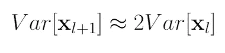
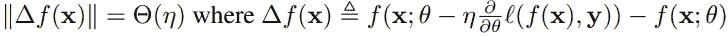
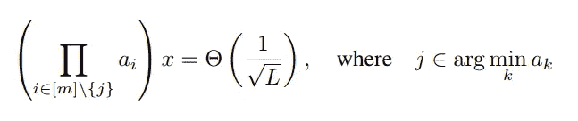
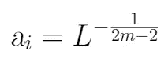
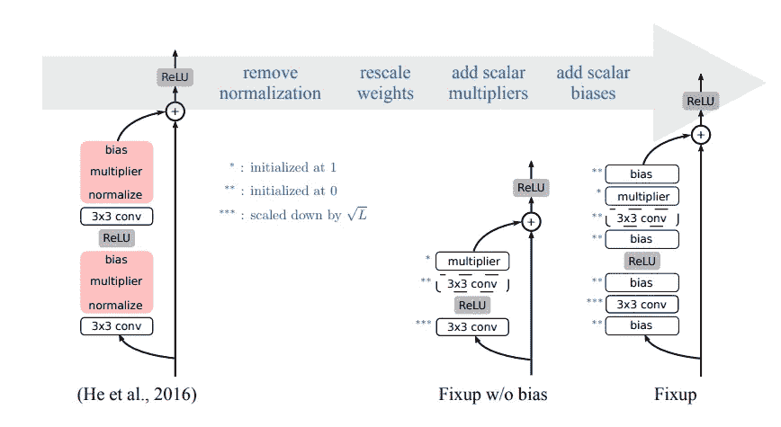

# 了解修正初始化

> 原文：<https://towardsdatascience.com/understanding-fixup-initialization-6bf08d41b427?source=collection_archive---------17----------------------->

## 如何在没有归一化层的情况下训练残差网络？

## 我们为什么要关心初始化呢？

权重矩阵的正确初始化极其重要。根据杰瑞米·霍华德的说法，由于初始化不当，人们几十年来都无法训练神经网络。为了看到它，我们可以重现杰里米[讲座](https://www.youtube.com/watch?v=AcA8HAYh7IE&feature=youtu.be&t=1138&fbclid=IwAR02htQ6jcHEROSaBt0RrSq2aIpHpWcgoOnpioWrstC7pBnJlbjt0itziFg)中的一个实验。让我们初始化一个随机权重矩阵和一个向量。我们可以通过取 x - > Ax 并重复这个过程 n 次来模拟一个神经网络。

因此，我们将看到，均值和标准差都是无穷大。错误在于我们的随机初始化。

幸运的是，还有其他初始化权重矩阵的方法。其中之一是修复。

## 什么是修正？

fixup(fixup-update initial ization)是最近由、Yann N. Dauphin 和马腾宇等人提出的一种用于资源网的初始化方法。在他们的[论文](https://arxiv.org/pdf/1901.09321.pdf)中，作者展示了在没有批量范数层的情况下训练残差网络是可能的。此外，作者还在图像分类和机器翻译方面取得了很好的效果。

## **修复的动机**

让我们考虑没有规范化层的 ResNet 的基本块。在这种网络的某些区域(正同质块)，该术语的详细描述在[文章](https://arxiv.org/pdf/1901.09321.pdf)中提供。)方差随深度呈指数增长:

Relationship between variance in the subsequent layers.

因此，可能会出现收敛、训练速度和推广能力方面的问题。标准化层是一个解决方案。近年来，人们认为这个解决方案是独一无二的。

然而，正如我们将看到的，这是不真实的。

## 目标

如果我们以直观的方式考虑分解梯度(如果梯度变得太大，那么很容易超过最小值)，我们可以注意到，如果在每一步中输出的变化是 O(η)，其中η是学习速率，则问题不会发生。更正式地说:

Condition for change in f after each step.

因此，如果我们有 L 个剩余分支，我们希望每个分支平均更新 O(η/L)。

现在，我们假设每个剩余分支有 m 层，其中 m 是一个小正整数(通常是 2 或 3)。

作者证明了如果标度因子(除了最小的那个)的乘积为 O(η)，则 SGD 每一步的输出变化为 O(η)。

The constraint for the product of scaling factors.

因此，提出了以下公式:

Scaling factors a_i.

## 加速修复

现在，我们已经实现了我们的主要目标，我们可以考虑提高网络性能的东西。

使用标量偏差和乘数是一种常见的做法，因为它们使每一层的输出适合后续层的激活。如果我们想改变平均值，我们只需添加一个偏差。类似地，乘数有助于操纵标准差。

此外，作者还发现:

> “我们发现，在每个权重层和非线性激活层之前只插入一个标量偏差就可以显著提高训练性能。”
> 
> 在具有乘数的分支中，这反过来导致乘数的增长，从而增加其他层的有效学习率。特别地，我们观察到，每个剩余分支仅插入一个标量乘数模仿了具有归一化的网络的权重范数动态，并且使我们免于搜索新的学习速率表。”

记住所有这些，建议残差块的以下架构:

Basic residual blocks of ResNet, Fixup with and without bias.

总而言之，为了修复和初始化您的网络，您必须:

> 1.将每个残差分支的分类层和最后一层初始化为 0。
> 
> 2.使用标准方法(例如，何等人(2015))初始化每隔一个层，并通过 L^(1/(2m-2 仅缩放剩余分支内的权重层)
> 
> 3.在每个分支中添加一个标量乘数(初始化为 1 ),在每个卷积、线性和元素激活层之前添加一个标量偏差(初始化为 0)。

值得注意的是，第二点是在没有正则化的情况下训练深度神经网络所必须的，而其他两点可以提高其性能。

**PyTorch 实现**

论文的实现可以在作者的一个 [GitHub](https://github.com/hongyi-zhang/Fixup) 上找到。我们将讨论最重要的部分。

首先，我们初始化两个基本的修正块:FixupBasicBlock 和 FixupBottleneck。如论文中所述，标量偏差和比例因子分别设置为 0 和 1。

与 FixupBasicBlock 相比，FixupBottleneck 多了一个卷积层和两个偏差。

然后，我们准备构建我们的第一个修正初始化 ResNet。我们首先定义基底，如层数、卷积等。

然后我们遍历网络的所有部分并初始化权重。请注意，比例因子是根据公式 L^(1/(2m-2)).计算的顶部的额外因子 2 有助于保持标准差等于 1。

由于 FixupBasicBlock 有 2 层，m=2，我们通过因子 L^(-0.5).来缩放权重类似地，FixupBottleneck 有三层，所以我们按 L^(-0.25 缩放)

最后，我们可以定义我们的修正初始化 ResNets！

## 结论

修正初始化是初始化权重矩阵的强大工具。这是非常重要的，因为它是第一种方法之一，允许在没有批量范数层的情况下训练甚至非常深的神经网络。