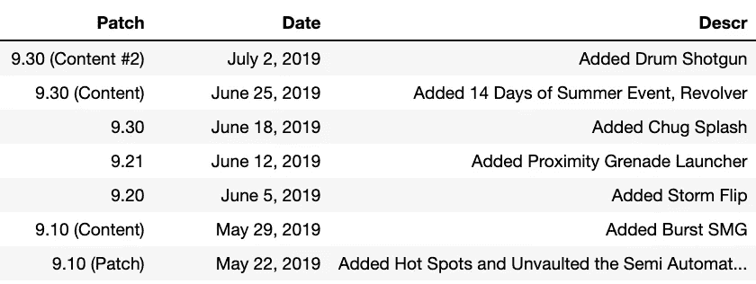
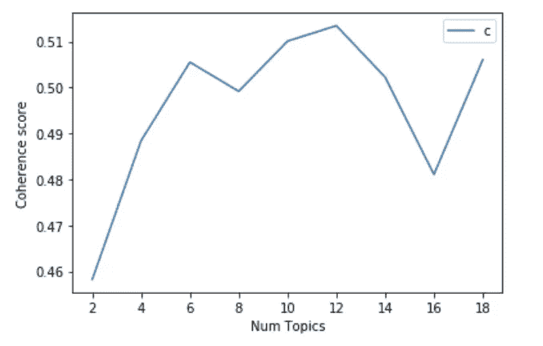
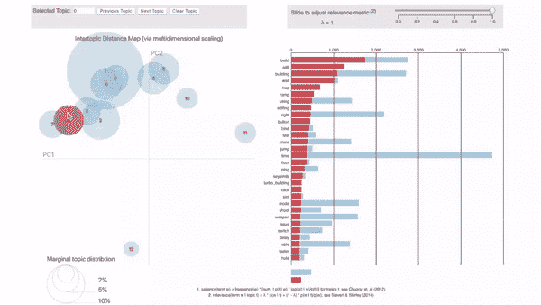
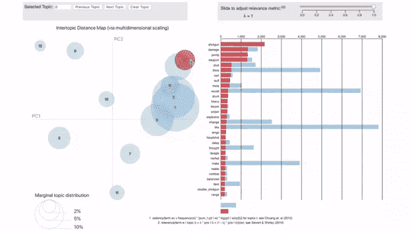

# 使用无监督主题建模理解堡垒之夜的 Reddit 社区

> 原文：<https://towardsdatascience.com/understanding-fortnites-reddit-community-using-unsupervised-topic-modeling-30f984f58129?source=collection_archive---------18----------------------->

# 概观

堡垒之夜打破了抽搐流记录，成为一个全国性的现象。不足为奇的是，正如许多视频游戏发生的那样，Reddit 上形成了大型社区来讨论这款游戏。虽然有多个堡垒之夜子街道，但我主要关注 r/FortNiteBR 和 r/FortniteCompetitive。r/FortNiteBR 目前拥有 110 万用户，可以说是堡垒之夜最大的专门论坛，而 r/FortniteCompetitive 目前拥有 18.3 万用户，与 r/FortNiteMobile 等子网站相比，它可以更好地了解竞争社区。由于这两个子街道都有一年多的历史，它们随着堡垒之夜史无前例的崛起而成长。我们可以使用这些子街道上的非结构化数据来洞察社区吗？

## 个人动机

作为这两个子编辑的订阅者，我注意到 r/FortNiteBR 和 r/fortnitecompetic 上的对话有很大的不同。顾名思义，r/FortNiteBR 适用于整个社区，而 r/fortnitecompetic 仅适用于该社区。由于我不会阅读每个子网站上的所有帖子，通常只看最受欢迎的，所以我想比较所有子网站，而不是根据我有限的个人阅读进行比较。在普通社区和竞争社区上举行的对话之间有可量化的差异吗？

## 商业案例

除了我的好奇心之外，还存在一个商业案例，用于对每个子主题中讨论的主题进行建模。Subreddit 管理员可以从总体上感受到他们的社区正在讨论什么。此外，堡垒之夜背后的公司 Epic Games 可以看到社区如何应对游戏变化，什么主导了围绕游戏的讨论，以及他们的社区是如何划分的。有了这些见解，Epic Games 可以调整他们的游戏开发计划，以迎合某些群体，并保持他们的玩家群参与。在过去，Epic Games 因不听取他们社区的意见而赢得了声誉，并因此让游戏失败。

# 抓取 API

首先，我使用 Python 的内置请求库点击了以下端点:

```
[https://api.pushshift.io/reddit/search/submission/](https://api.pushshift.io/reddit/search/submission/')
```

Pushshift.io 是抓取 Reddit 数据的一个很好的资源，因为他们自己有一个很大的存储，并且有一个比 Reddit 相对更容易理解的 API。端点将返回最多 500 个帖子，因为我想要多个 subreddit 的全部，所以我不得不多次点击这个端点。我用以下参数达到了端点:

```
params = {
 ‘size’:’500', 
 ‘subreddit’: SUBREDDIT, 
 ‘num_comments’:’>10', 
 ‘before’ : checkpoint[‘date’]
}
```

`before`参数允许我在多次调用中抓取所有子编辑。我存储了一个本地 JSON 文件`checkpoint`，它记录了我在子编辑历史中的位置。由于这个过程花费了相当多的时间，本地文件允许我在保持状态的同时随意启动和停止抓取脚本。最后，我过滤了 10 条评论或更少的帖子，假设参与度低的帖子不能反映社区的情绪。

## 改变我的方法

在遇到多个 API 极限错误并等待脚本完成几个小时后，我意识到我需要用不同的方法来抓取注释。一个帖子可能有超过 100 条评论，由于对一个请求返回的评论数量也有限制，我需要运行更多的请求。

为了解决第一个问题，我改用 Reddit API 而不是 Pushshift。Reddit 的速率限制是每个账户每分钟 60 个请求，而 Pushshfit 的速率限制是 200 个请求。然而，如果需要，我可以做多个 Reddit 开发帐户。实际上，我在 Reddit API 上收到的速率限制错误比 Pushshift 少得多。最流行的 Python Reddit API 包装器是 [Praw](https://praw.readthedocs.io/en/latest/\) ，但是 Praw 是写在请求库之上的，这是阻塞的。为了解决后一个问题，我不得不切换到异步方法。

对于异步请求，我使用了 [aiohttp](https://aiohttp.readthedocs.io/en/stable/) 。这个包的语法非常类似于请求。aiohttp 旨在与 asyncio 一起使用，asyncio 是将带有`async / await`语法的并发编程引入 Python 3.4 的库。有一个轻微的学习曲线，因为这是我第一次使用 asyncio。然而，使用 Node.js 的经验使这个过程变得更加容易。

最后，Reddit API 以嵌套的 JSON 结构返回注释。这反映了 Reddit 评论的树形结构。为了获得表格形式的评论，我必须在评论树上运行一个修改过的 BFS。见下文:

# 数据

抓取之后，我们有三个数据框架:帖子、评论和补丁。对于下面的 post 数据框架，我们主要关注的是`title`和`selftext`列。注意`score`每一行都是 1.0；这是 Pushshift API 的一个缺点，因为它在爬行时存储帖子的分数(与当前值相比)。


Posts DataFrame

评论数据框架也相对简单。`Body`是评论的文本，`parent_id`是评论所属文章的 id，是上票数减去下票数。请注意，由于使用了 Reddit API，这些分值会得到更新。


Comments DataFrame

最后，我们有一个数据框架，列出了每个补丁，补丁发布的日期，以及补丁内容的快速总结。这些都是用 [IGN](https://www.ign.com/wikis/fortnite/Updates_and_Patch_Notes) 的美汤(bs4)刮出来的。



Patches DataFrame

## 清理数据

由于刮擦数据的性质，数据相当脏。我不得不删除许多非字母数字字符。此外，还有不间断的空格符、换行符等。接下来，我删除了作者为`[deleted]`的行，因为这意味着标题和自我文本也被删除了。许多帖子也是图片，所以自我文本是空的；这些行也被删除。

接下来，我遵循标准的 NLP 管道，删除停用词，对数据进行标记化和词条化。下面的代码片段展示了这个过程的大部分:

最后，我使用 gensim 的短语模型在语料库中寻找二元和三元语法。这些子街道中常见的双字母组合的一个例子是`battle_royale`，因为这两个词经常一起出现。

# 建模主题

## 潜在狄利克雷分配

LDA 是一种从一组文档中提取潜在或隐藏主题的方法。LDA 假设文档由从概率分布中采样的一组主题组成，主题由从概率分布中采样的单词组成。实际的学习方法及其背后的数学原理是另一个讨论的话题。但是，更多的阅读可以在[这里](http://blog.echen.me/2011/08/22/introduction-to-latent-dirichlet-allocation/)完成。需要注意的是，LDA 不为你选择话题数量，也不为话题贴标签；根据主题中最常用的词来标记主题是由你决定的。

Gensim 使得 [LDA](https://radimrehurek.com/gensim/models/ldamodel.html) 很容易实现:

我们过滤掉最常用和最罕见的词。`docs`是一个 2d 数组，其中每个文档是一个令牌(单词)数组。单个文档可以用多种方式定义。

## 定义文档

一个潜在的狄利克雷分配模型期望文档有合适的大小。Reddit 标题通常不符合这一标准。除了过滤长度不超过 5 个令牌的帖子和评论之外，我还尝试了帖子标题、自我文本和评论的不同组合。我使用 [pyLDAvis 软件包](https://pyldavis.readthedocs.io/en/latest/)通过目测选择了最佳组合。pyLDAvis 允许您传递一个 gensim 模型，并在笔记本中获得一个 d3 构建的可视化。

我很快发现，仅仅使用 Reddit 标题不会提供连贯的主题。然后，我尝试将文档定义为帖子的标题、自我文本和所有评论。这个文档定义提供了相对一致的主题，但由于文档较大，所以速度较慢。此外，假设子注释应该是单个文档的一部分，这是一个逻辑上的小跳跃。最后，我决定将帖子的标题和自我文本作为一个单独的文档。结合使用 n 元语法，这种方法提供了最连贯的主题模型。

## 选择主题的数量

使用与 k-means 聚类时选择最佳主题数量相同的方法，我使用了 elbow 方法来选择具有最大化模型一致性分数的主题数量的模型。我使用了 Gensim 的内置一致性分数，但更深入的解释可以在这里找到[。](https://datascienceplus.com/evaluation-of-topic-modeling-topic-coherence/)



12 topics seem to be optimal

## 比较子记录

我现在对文档运行两个独立的 LDA 模型(文章标题+文章自我文本)。



r/FortNiteBR

我们看到合理的话题。例如，主题 6 可以是关于建筑，主题 8 可以被解释为武器平衡，而主题 9 可以是控制台对 PC 的辩论。



r/FortniteCompetitive

我们看到一些类似的话题。在第 6 节中，我们讨论了双泵，所以我们可以把这个话题称为武器战略，第 4 节是建筑战略，第 7 节是关于竞技玩家和流的讨论。当我们检查每个子编辑中主题的大小以及主题中使用的确切单词时，就会出现差异。虽然两个模型都有一个讨论飘带的主题，但 Nickmercs、Tfue、偷猎、忍者和神话是竞争子编辑中的常用词，而在普通子编辑中只有忍者和神话。

如果你想自己玩这些可视化，也可以通过补丁过滤，看看我做的 [React 应用](https://jeromecohen.github.io/)。

# 未来计划

## React 应用

我决定建立一个小的 React 应用程序，允许任何人检查每一个可视化。这款应用在[https://jeromecohen.github.io/fortnite](https://jeromecohen.github.io/fortnite/)举办，它允许任何人通过子编辑和补丁检查主题。pyLDAvis 允许您将可视化保存为 JSON 文件或独立的 HTML。我将 HTML 文件从 CDNs 中提取的脚本(d3 和一个定制的 d3 脚本)导入到我的 React 项目中。pyLDAvis 使用定制脚本来解析 JSON 文件并将其转化为可视化。d3 v3 不适合我，所以我找到了一个对 pyLDAvis 库的 pull 请求，该请求更新了他们的 d3 脚本以与 d3 v5 兼容。在安装了 d3 v5 并稍微调整了 pull 请求之后，可视化就可以运行了！

## 在线应用程序

自从我上一次刮起 subreddits 以来，堡垒之夜社区发生了很多事情。如果我的应用程序可以自动更新，那就太酷了。gensim 模型允许在线培训，即当新文档可用时更新模型。对 scraper 笔记本稍加调整，它可以作为一个独立的脚本运行在 cron 作业上，从任何子编辑中获取新的帖子或评论。一旦脚本完成，新文档就可以被传递给一个 gensim 模型，该模型被包装在一个简单的 Flask API 中。API 会将表示更新后的可视化的 JSON 文件返回给我已经构建好的 React 客户端。React 客户机已经预料到了，所以唯一需要的改变是改变 GET URL(当然，也可以改变 UI)。

## 分支项目

随着时间的推移，探索这两个社区的情绪可能会产生一些有趣的视觉效果。或许，我们会看到特定地区的平均情绪出现正峰值或负谷值。如果想用这些数据建立一个预测项目，可以很容易地使用 post ids 获得更新的分数。对于关心因果报应的社区成员来说，预测给定帖子的分数或评论数量可能是一个有用的模型。

***感谢阅读！在【https://github.com/JeromeCohen/fortnite】***[](https://github.com/JeromeCohen/fortnite)*检查所有代码或获取数据*