# 理解高斯过程，苏格拉底的方式

> 原文：<https://towardsdatascience.com/understanding-gaussian-process-the-socratic-way-ba02369d804?source=collection_archive---------0----------------------->


高斯过程是一种机器学习技术。你可以用它来做回归，分类，以及其他事情。高斯过程是一种贝叶斯方法，其预测具有不确定性。例如，它将预测明天的股票价格为 100 美元，标准差为 30 美元。了解不确定性对于算法交易等应用很重要。我设计过赚了大钱的交易策略和亏了大钱的策略。我亲身体会到不确定性会给你带来多大的影响。所以我决定研究高斯过程的内部运作。

高斯过程可以用几个公式来解释。但是这些公式背后有丰富的直觉和含义。为了学好英语，我将运用苏格拉底式教学法，即提问和回答。

我将使用以下模板进行解释:

1.  **高斯过程模型**部分定义了高斯过程先验和似然性。并解释了模型参数的先验性和似然性。
2.  计算后验概率的**部分**从先验和似然中导出后验概率。它描述了如何使用后验概率进行预测。
3.  **参数学习**部分找到模型参数的最佳具体值。上一节中的后验概率是一个提到模型参数的符号表达式。在我们找到模型参数的具体值之后，我们可以将后验估计成一个具体的数字。

这篇文章作为高斯过程的基本介绍；它帮助你在头脑中建立第一个 GP-sense。在应用程序设置中，您可能会遇到两个使高斯过程模型更实用的技巧:

*   [变分高斯过程——非高斯情况下该怎么办](/variational-gaussian-process-what-to-do-when-things-are-not-gaussian-41197039f3d4)引入变分推断，允许我们在高斯过程模型中使用非高斯可能性。
*   [稀疏和变化的高斯过程—当数据很大时该怎么办](/sparse-and-variational-gaussian-process-what-to-do-when-data-is-large-2d3959f430e7)引入诱导变量，使我们能够将高斯过程模型扩展到大型数据集。

根据我的经验，理解本文中的基础知识至少占了概念负担的一半。在你建立了足够的 GP-sense 之后，理解高级高斯过程模型就容易多了。

## 一些符号

中支持文本中的 Unicode。这允许我写很多数学下标符号，比如 *X₁* 和 *Xₙ.但是我不能写下其他的下标。例如:*


所以在正文中，我会用一个下划线“_”来引出这样的下标，比如 *X_** 和 *X_*1* 。

如果一些数学符号在你的手机上显示为问号，请尝试从电脑上阅读这篇文章。这是一个已知的 Unicode 呈现问题。

# 高斯过程模型

本节介绍回归的高斯过程模型。它解决了一个回归任务。

## 回归任务

在一个回归任务中，我们有一组成对的训练数据点 *(X₁，Y₁)* ， *(X₂，Y₂)* ，…， *(Xₙ，Yₙ)* ，其中 *Xᵢ* ， *Yᵢ，*为实值。我们用符号ℝ来表示所有实数值的集合。并用 *(X，Y)* 表示训练数据，其中 *X* 和 *Y* 都是长度为 *n* 的向量。

任务是找到一个函数 *f* ，它取一个实值并返回一个实值，记为 *f* : ℝ ⟼ ℝ.这个函数应该接近训练数据 *(X，Y)* 。“接近”意味着如果我们在 *f* 中插入一个 *Xᵢ* ，我们应该得到一个接近 *Yᵢ* 的值。这是机器学习中典型的回归任务。

## 定义函数的映射视图

我们习惯看到一个函数带体，像 *f(x) = x+1* ，带体" *x+1"* 。这个主体根据其输入 *x* 计算函数值。很多机器学习技术都是为功能找身体。比如线性回归以 *f(x) = ax+b* 的形式找到函数体。

但是在数学中，我们可以定义一个没有任何物体的函数。功能是从输入到输出的映射。body 仅仅是描述这种映射的一种简洁的方式。我们可以通过指定函数的所有输入输出映射来定义函数，而不是使用主体。例如，下面的映射定义了一个函数 *f:* ℝ ⟼ ℝ，域为{1，5}，范围为{7，4}:


我们不知道这个函数的主体是什么，但这并不妨碍我们定义它——我们只需要写下从每个输入到输出的映射。我们需要更多的空间来写下它们，但这在数学上是有效的。

## 现实生活中作为函数的映射

你可能会问，我们在日常生活中使用函数的这种映射视图吗？是的，我们一直在使用它。在学校，我们看到了[三角表](https://math.stackexchange.com/questions/1553990/easy-way-of-memorizing-values-of-sine-cosine-and-tangent):

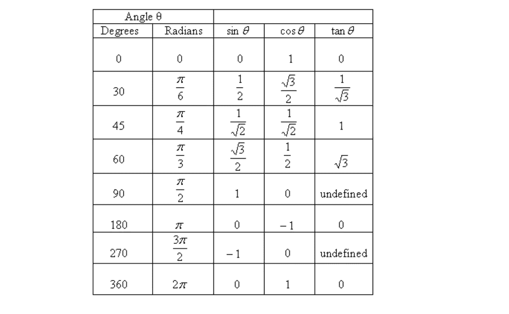

表格的第三列显示了半径为 0、π/2、**、**的正弦函数值，以此类推。你的初等数学书给你这个表而不是一个函数体来计算任意次的正弦值，因为那个[公式非常复杂](https://stackoverflow.com/questions/2284860/how-does-c-compute-sin-and-other-math-functions) —想想看，你并不真的知道如何从一个输入计算正弦函数值，比如π —你记得它的值，那是一个输入-输出映射视图。

这个表的缺点很明显，你不知道正弦在π/5，或者 2.7π的值。出于篇幅原因，该表仅列出了输入-输出映射的子集。这就是回归可以发挥作用的地方——它可以找到完整的映射。

在本文中，我们将使用高斯过程来学习一个看起来像正弦函数的函数。定义函数的映射观点是高斯过程背后的直觉。

首先，让我们生成一些训练数据。我们在 0 和 2π之间的一些 x 轴位置计算真正弦函数值，并向其中添加噪声。x 轴位置不是等距的。如下图所示，一些 x 轴区域比其他区域包含更多的数据点。在此图中，蓝色十字“x”标记训练数据点。有 50 分。我用[这个代码](https://github.com/jasonweiyi/understanding_gaussian_process/blob/master/sample_from_prior.py)来生成训练数据。如果要运行代码，请克隆 public[understanding _ Gaussian _ process](https://github.com/jasonweiyi/understanding_gaussian_process)Github 库，用 Python 3 解释器运行代码。

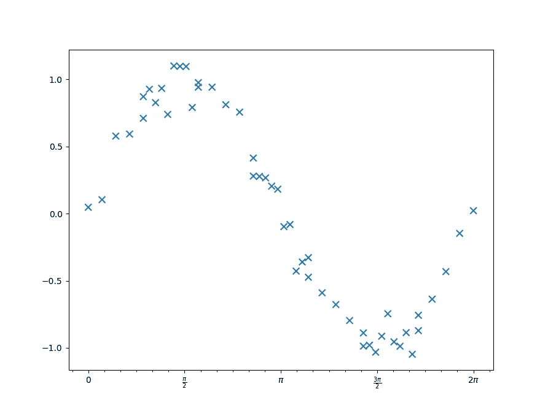

Training data points. Blue “x” markers are the data points. They are not equidistant.

我们的回归任务是学习一个能很好解释这个数据的函数。我们已经知道了正确的答案——这个函数是一个正弦函数。我们将看到高斯过程如何从生成的训练数据中学习该函数。

## 代表位置的实数集

函数 *f* : ℝ ⟼ ℝ将ℝ作为它的域，这意味着它接受任何实值输入。在我们的回归任务中，输入 *x* 是我们希望 *f* 接近 *sin(x)* 的值的位置。我们可以将域ℝ分成三组不相交的位置:

*   *X* 是我们训练数据中的一组位置。 *X* 是一个长度为 *n* 的向量:


*   我们想要评估我们的底层函数 *f* 的一组测试位置。记住这个回归任务的目标是找到 *f* ，这样我们就可以在测试位置得到它的值。X_* 是有限的，因为实际上，在我们的一生中，我们只能在有限数量的测试位置评估一个函数。 *X_** 是长度为 *n_** 的向量:


*   *X* ₒ(下标是字母“*o”*代表*其他，*不是数字 0)是ℝ.除 *X* 和 *X_** 以外的地点集合集合 *X_o* 的长度是无限的，因为在全实直线中，除了 *X* 和 *X_** 之外，还有无穷多个。记下 *X* ₒ为无限长的向量 *nₒ* :


## 代表函数值的随机变量

在我们定义了函数 *f* 的输入之后，我们开始定义它的输出。对于每个输入位置 *x* ，我们引入一个随机变量 *f(x)* 来表示函数 *f* 在这个位置的*可能的*输出。你可以这样理解 *f(x)* :

1.  随机变量 *f(x)* 有它的分布，我们还没有定义这个分布，但是剧透一下，它会是高斯的。我们使用这个分布来模拟 *f* 在位置 *x* 的可能值和它们出现的概率。高斯分布完全由其均值和方差来参数化。
2.  在位置 *x* *最终*的实际观测来自于 *f(x)* 的分布。换句话说，观测值是来自 *f(x)* 分布的样本。 *f(x)* 的方差控制这个样本可以偏离 *f(x)* 的平均值多少。请注意“最终”这个词，因为我们将引入另一个随机变量来对观测值进行抽样。原因在可能性部分会很清楚。

你可以看到这个模型与我们如何生成训练数据 *(X，Y)* 完全吻合。因为我们通过首先获得位置 *X* 处的真实正弦值(即平均值)并添加噪声(模拟方差)来生成 *Y* 。

注意 *f(x)* 只是位置 *x* 的随机变量的名字。请不要将 *f(x)* 解释为调用带参数 *x* 的函数 *f* 的函数应用。我决定在随机变量名称中包含位置信息，以使数学更容易理解。

由于我们正在模拟一个具有无限个输入的函数，我们需要引入无限个随机变量来表示它的输出，每个输入位置一个。对应于我们之前定义的位置的三个部分，我们将这些随机变量组织成三个相应的不相交集合:

*   *f(X)，*长度为 *n* 的随机变量的向量，
*   *f(X_*)* ，长度为 *n_** 的随机变量的向量。
*   *f(X* ₒ *)* ，一个无限长的随机变量向量 *nₒ* 。

## 重要提示(再次)

请注意 *f(X)* 是我们给一个随机变量列表的名字。那就是:


其中每个元素 *f(X₁)* 、 *f(X₂)* 、…、 *f(Xₙ)* 都是与位置 *X₁* 、 *X₂* 等相关联的单个随机变量。请不要将 *f(X)* 解读为将函数 *f* 应用于输入 *X* ，因为我们不会定义函数 *f* 。同样适用于 *f(X_*)* 和 *f(X* ₒ *)。*

## 函数值是相互依赖的

既然我们已经为函数值引入了随机变量，我们需要假设它们是相互依赖的。这是一个**非常重要的**假设。没有它，我们就无法继续。

这是因为如果相反，我们假设这些随机变量是彼此独立的，那么知道在训练位置 *X* 的随机变量 *f(X)* 的观察数据 *Y* 将不会给出关于在测试位置 *X_** 的可能随机变量值 *f(X_*)* 的任何信息。这意味着我们将无法学习一个可以描述测试位置值的回归函数。

所以我们需要一种方法来描述随机变量之间的依赖关系。在高斯过程中，我们使用随机变量 *f(X)* 、 *f(X_*)* 和 *f(X* ₒ *)* 的多元高斯分布来定义它们的相关性和均值。

多元高斯分布由平均向量和协方差矩阵指定:

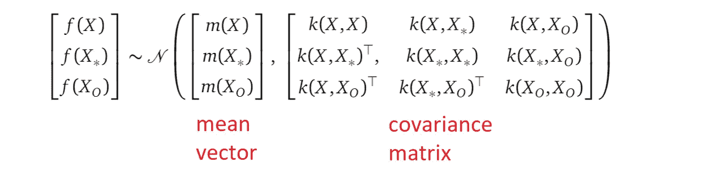

以上是多元高斯分布的模板。要完全定义这个分布，我们需要定义:

均值函数 *m* 给出这些随机变量的均值。我们使用 *m(x)* 来表示均值，也称为随机变量 *f(x)* 在位置 *x.* 处的期望值由于 *x* 表示一组位置， *m(x)* 是向量的形式，包含随机变量组的均值。因此，您将拥有:

1.  当 *x=X* 时，随机变量 *f(X)* 的均值向量 *m(X)* ，
2.  当 *x=X_** 时，随机变量 *f(X_*)* 的平均向量 *m(X_*)* ，
3.  当 *x=O* 时 *m(Xₒ)* 为随机变量 *f(Xₒ)* 的均值向量。

注意 *m(x)* 不是一个随机变量，它是一个以 *x* 为自变量的函数，返回位置 *x* 处相应随机变量的平均值。

我们还需要定义协方差矩阵中出现的协方差函数 *k* 。我们称 *k* 为**内核**函数。我们使用 *k* 来定义位置 *x* 和*x’处任意两个随机变量 *f(x)* 和*f(x’)*之间的协方差。*你会明白选择 *k* 是高斯过程中的关键。

**均值函数 m**

均值函数定义了向量 *[f(X)，f(X_*)，f(X* ₒ *)]ᵀ* 中每个随机变量的期望值。这里“*ᵀ”*代表转置运算符，它将列向量转换为行向量，这样我们就可以将它写在文本行中。均值函数 *m* 有值域ℝ和值域ℝ，即 *m* : ℝ ⟼ ℝ.当我们将 *m* 应用于上述每个位置时，我们得到一个平均值向量:


*m* 应该是什么样子？如果我们有关于函数 *f* 在每个位置的期望值的领域知识，我们可以将这些知识编码到 *m* 中。例如，如果您正在模拟服务器机房在给定时间 *X* 的温度，并且您知道平均温度，因为您将空调温度设置为 20 度，那么您可以设置 *m(X) = 20* 。但在大多数情况下，我们不知道。所以我们定义均值函数为零函数:


无论 *x* 是什么值，该函数都返回 0。你可能想知道为什么零均值函数是可以的，因为真实数据可能没有零均值。嗯，你总是可以标准化你的数据，所以它们的平均值为零。在大多数情况下，这是可行的。但有时，你确实需要更努力地思考非零均值函数，以获得更好的模型。

注意与 *f(X)* 不同的是， *m(X)* 不是一个随机变量，它是一个以 *X* 为自变量，返回一个实向量的函数。我们通常设置 *m(X)* = 0。

**内核函数 k**

协方差矩阵中的每一项代表一对随机变量 *f(x)* 和*f(x’)*之间的协方差。X 和*X′*可以来自位置集合 *X* 或 *X_** 。我们需要定义一个函数 *k(x，x’)*来返回 *f(x)* 和*f(x’)之间的协方差。*k*应该是什么样子？*

从我们的训练数据中，我们注意到如果两个位置 *x* 和*x′*在附近，它们对应的函数值是相似的。这就是平滑函数的表现。我们想对相似函数值的这种影响建模，当它们的评估位置在附近时。

请记住，我们使用随机变量 *f(x)* 和*f(x’)*来模拟函数 *f* 在位置 *x* 和*x’*的可能值。在随机变量的语言中，相似意味着具有高的正协方差。这是因为当 *f(x)* 和*f(x’)*具有高的正协方差时，当来自 *f(x)* 的样本是大值时，来自*f(x’)*的样本也更可能是大值——*f(x)*和*f(x’)*同向协变。这些相近位置的相似值构成了平滑曲线中的点。

两个自变量 *x* 和*x′*的许多函数满足我们的要求，当 *x* 和*x′*靠近时返回较大的正值，当它们远离时返回较小的值。我们关注以下一个:


在这个公式中， *exp* 是指数函数。 *l* 称为长度刻度， *σ* 称为信号方差。 *l* 和 *σ* 是标量。它们是**模型参数**。我们不知道这些模型参数的值；我们将使用参数学习来为它们找到好的值。这个核函数由于其结构而被称为平方指数核。

请注意，内核函数只提到了 *x* 和*x’。*完全没有提到函数值 *Y* 。这是因为要决定两个位置之间的距离，知道 *x* 和*x′*就足够了。别担心，我们在引入可能性的时候会用到 *Y* 。

我们可以验证这个核函数满足我们的要求:

1.  指数函数和 *σ* 都是正的，所以协方差总是正的。
2.  当 *x* 等于*x’，*时 *k* 有最大值 *σ* ，所以它们的距离最小为 0。指数函数的值为 1，因此核函数的值为 *σ。*
3.  随着 *x* 和*x′*漂移分开，当 x 和*x′*无限分开*时，核函数减小并达到其最小值 0。*

现在我们可以定义协方差矩阵中的元素:


我们需要使用 *k* 来定义这个协方差矩阵中的九个块条目。让我们以 *k(X，X)* 为例，其余条目类似。

让我们将 *k(X，X)* 表示为 *n ×n* 矩阵，其中我们将函数 *k* 应用于 *X.* 中的每一对位置，并且我们将这些位置对按照以下精确顺序放置:


同样，我们可以定义 *n×n_** 矩阵 *k(X，X_*)。*由于核函数的定义， *k(x，x’)= k(x’，x)，*协方差矩阵是对称的。所以我们有协方差 *k(X_*，X)* = *k(X，X_*)ᵀ* 。并且我们定义了 *n* _* *×n_** 矩阵 *k(X_*，X_*)。*

我们可以继续写下与 *X* ₒ相关的五个词条，比如 *k(X，Xₒ)* 和 *k(X_*，Xₒ)* 。这些条目将是无限维的矩阵，因为 *X* ₒ的长度是无限的。写下无限维的矩阵似乎不是一个有趣的任务。操纵它们似乎也不容易。

好消息是，我们不必处理那些无限矩阵*。*这是因为，实际上，我们只对与 *X* 和 *X_** 相关的部分感兴趣。这些部分是有限的。因此，我们只需要下面用红框突出显示的联合概率密度的部分:

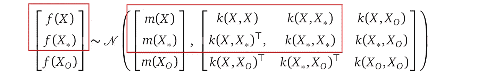

[高斯边缘化规则](https://en.wikipedia.org/wiki/Multivariate_normal_distribution#Marginal_distributions)告诉我们，高亮部分也形成多元高斯分布。这个分布是随机变量 *f(X)* 和 *f(X_*)* 的分布，其均值和协方差矩阵与红色框中突出显示的完全相同。因此，从现在开始，我们将使用以下有限分布:


或者，我们可以用概率密度函数来表示这种分布:

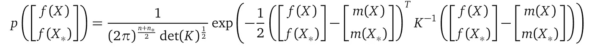

在上面的公式中，我用 *K* 来表示整个协方差矩阵，以节省空间。 *det(K)* 表示协方差矩阵 *K* 的行列式， *K⁻* 表示 *K* 的逆矩阵。常数 *2π* 的幂为 *(n+n_*)/2* 因为 *[f(X)，f(X_*)]ᵀ* 的长度为 *n+n_* —* 由于 GP 先验是一个 *n+n_** 维高斯分布，每个数据点都有一个单独的维，包括训练数据点(编号为 *n* )和测试数据点(编号为

写公式的时候，概率密度函数相当长，所以我经常用符号*𝒩(a；μ，σ)*来表示具有均值 *μ* 和协方差*σ*的随机变量 *a* 的高斯概率密度函数。

顺便说一下，我知道多元高斯的概率密度函数看起来很吓人。我天真的建议是自己写几遍，不要看。多元高斯是现代机器学习中非常重要的主题。你可以在[生成人脸](/understanding-the-denoising-diffusion-probabilistic-model-the-socratic-way-445c1bdc5756)或者[时间序列预测](https://medium.com/towards-data-science/demystifying-tensorflow-time-series-local-linear-trend-9bec0802b24a)中找到。

## 高斯过程先验(GP 先验)

我们称上述多元高斯分布为**高斯过程先验(GP 先验)**。它代表了我们对正在建模的底层函数值如何联合分布的假设。

**GP prior 是函数上的分布**

人们说 GP prior 是函数的分布。要理解为什么我们需要理解以下两点:

1.  随机变量向量*【f(x)】，f(X_*)]ᵀ* 代表一个函数。这就是我们需要映射视图来定义函数的地方。
2.  这些随机变量的多元高斯分布为不同的函数给出了不同的概率*。*

GP 先验是随机变量向量上的多元高斯分布:


请注意，集合 *X* 和 *X_** 是固定的，因为实际上 *X* 是作为训练数据的一部分给出的，它是固定的。 *X_** 包含测试位置；它也是固定的——我们知道要在哪里计算函数。

所以上面的随机变量向量代表位置 *X* 和 *X_** 的函数值。从映射视图来定义函数，这些随机变量代表下面的函数。


由于 *X* 和 *X_** 是固定的，这个函数就可以用随机变量向量*【f(x)】，f(X_*)]ᵀ* 来表示。现在很容易看出 GP 先验描述了函数的分布。让我们通过假设零均值函数再次写下 GP 先验的概率密度函数，并使用 *K* 来表示协方差矩阵以节省空间:

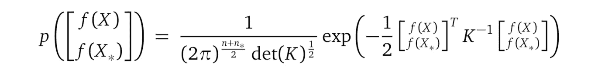

让我们在同一个固定的 *X={1}* 和 *X_*={2}* 上写下两个示例函数。第一个功能 *f₁* 是:


第二个功能 *f₂* 是:


在这个例子中，因为 *X* 和 *X_** 的长度都是 1，所以概率密度函数接受长度为 2 的向量并返回 0 和 1 之间的概率数。

如果我们将向量[3，4] *ᵀ* 对 *f₁* 和[5，6】*ᵀ*对 *f₂* 代入上述概率密度函数，我们得到两个标量数 *prob₁* 和 *prob₂* :

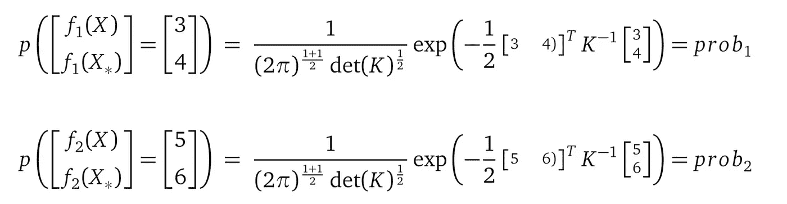

下图说明了这种概率密度函数。我在 x 轴上画出了函数 *f₁* 和函数 *f₂* 的位置，以及它们在 y 轴上对应的概率数。钟形曲线代表全概率密度。

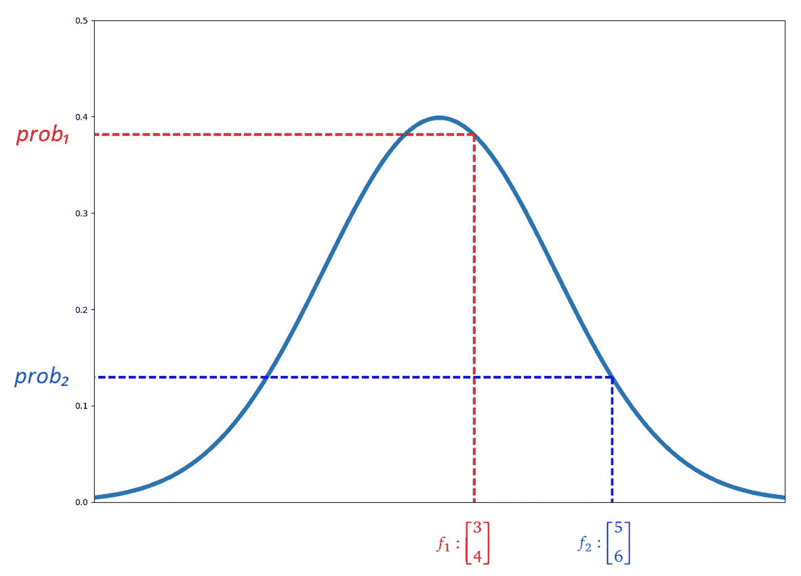

Illustration of distribution over functions, with highlighted function f₁ and *f₂*

该图显示了为什么 GP 先验是函数的分布:GP 先验概率密度函数将函数值向量，如 *f₁* 和函数*f₂*作为输入，并返回概率数。

请注意:

1.  在上图中，x 轴代表函数值向量。所有这些函数都有相同的域(x 轴位置，在我们的例子中是 1 和 2)。
2.  这个数字只是一个说明。实际上， *f₁* 的矢量不必在左边，而 *f₂* 的矢量不必在右边。函数的这种分布没有必要看起来像钟形曲线。并且 *prob₁* 不必大于 *prob₂* 。

# 之前从 GP 取样

由于 GP 先验是多元高斯分布，我们可以从中抽样。我生成了 600 个 0 到 2π之间的等距值，以形成我的采样位置。所以我的 GP 先验是 600 维多元高斯分布。我使用了一个零均值函数，并设置了长度标度 *l* = *1* 和信号方差 *σ =1。*下图显示了从本次 GP prior 中抽取的 50 份样本。我用[这个代码](https://github.com/jasonweiyi/understanding_gaussian_process/blob/master/sample_from_prior.py)从 GP 之前采样。

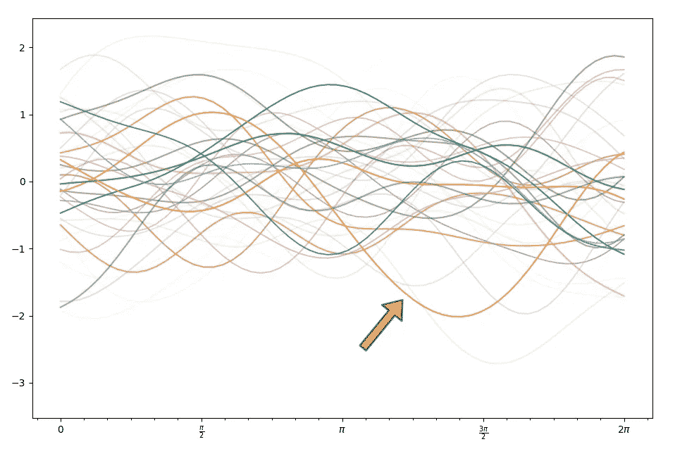

Samples from the GP prior

请暂时忽略橙色箭头。在图中，每条曲线由 600 个数据点组成。

在图中，我给了一些曲线更不透明的颜色，给了一些更透明的颜色，以证明根据先验知识，一些函数比其他函数更可能被绘制出来。一个函数越可能，我用来显示它的曲线的不透明颜色就越多。

为什么不同的曲线有不同的概率？这是因为每条曲线(由 600 个点组成)都是从 600 维高斯分布中抽取的样本。该多元高斯分布的概率密度函数定义了样本在抽奖中出现的可能性。如果一个函数越接近先验分布的均值，它被抽样的概率就越高。

从上图也可以看出，即使我们将均值函数 *m(x)* 设置为零(这样在每个 x 轴位置，对应的随机变量均值为零)，所抽取的样本(其值在 y 轴显示)也不一定为零。就像当你从均值为零的单变量高斯分布中抽取样本时，样本可能不等于零。

纯属运气，我注意到在这 50 个采样函数中，有一个是橙色曲线，有一个橙色箭头指向它。这条曲线非常接近我们想要找到的正弦函数。当运气来临时，让我们利用它来强调重要的一点。这条橙色曲线说明了贝叶斯学习的本质:我们设计先验分布来包含一大组候选函数，然后使用训练数据来重新加权这些候选函数。

我们可以从以下意义上理解这种“重新加权”:

1.  我们事先设计 GP 不是通过考虑训练数据，而是通过考虑我们使用的分布的数学便利性以及它可以描述什么函数。在我们的上下文中，我们选择高斯分布是因为它具有良好的性质，我们选择平方指数核来模拟平滑函数。这意味着先验可能无法很好地解释训练数据，如上图所示，对于甚至不像正弦波的函数，先验的概率很高。
2.  给定训练数据，以及我们将在下一节中介绍的可能性，贝叶斯学习使用贝叶斯规则来重新加权先验中的函数。贝叶斯规则输出后验分布。后验分布是与先验分布相同的一组函数的分布，但是它将不同的概率与这些函数相关联。后验概率给出了接近训练数据集的函数比远离训练数据集的函数高得多的概率。

通过下图中的后验概率抽样函数(稍后我将展示如何计算后验概率)，您可以看到贝叶斯规则的效果。它绘制了来自后验概率的 50 个采样函数:

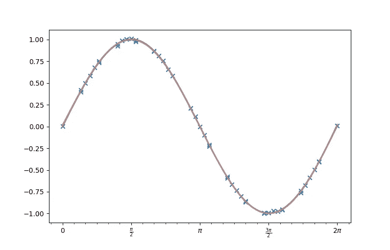

Sampled functions from the posterior

这些采样函数非常接近我们的训练数据点，这些数据点用蓝色的十字标记。这些曲线的高不透明度表明它们来自后验分布的高概率。这表明后验可以比先验更好地解释训练数据-通过高概率，后验区分出与训练数据点相似的函数。你看不到曲线远离正弦波，因为它们在后验概率很小，不容易采样。

## 贝叶斯规则，在重新加权视图中

注意因为我们的先验是连续随机变量的分布，它描述了一个无限的函数集。贝叶斯规则需要遍历这些无限数量的函数，并对它们重新加权。一个经历无限事物的过程如何终止？让我们来看看贝叶斯法则:

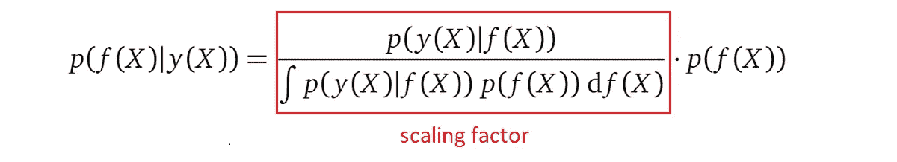

我们从一个候选函数 *f(X)* 开始，它具有来自先验的某个概率，那就是 *p(f(X))* ，它是介于 0 和 1 之间的概率数。贝叶斯规则用一个因子来衡量这个概率，写成分数。这个比例因子与给定候选函数的数据的似然性成比例，这是分子，由平均似然性归一化，在所有可能的(和无限个)候选函数上平均，这是分母。

积分是贝叶斯规则中的一部分，它遍历无限可能的函数集。我们已经知道积分是在有限的步骤中计算出的无穷和。这就是为什么贝叶斯规则的计算会终止。

注意，我应该将集成中的名字 *f(X)* 重命名为 *g(X)* :

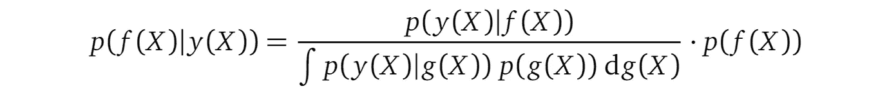

这个版本的贝叶斯法则在数学上更清晰。在数学中，一个名字只能代表一件事——2 总是代表数字 2，而不是这里代表 3，那里代表 4。所以在上面的公式中， *f(X)* 是我们要计算后验概率的函数； *g(X)* 是积分变量，对所有可能的 *n* 维实向量进行积分。他们是两个不同的东西，所以我们给他们不同的名字。

然而，在贝叶斯规则的第一个版本中，我们使用 *f(X)* 来表示我们想要计算后验概率的函数和积分变量。这在数学上令人困惑，但不幸的是，人们通常就是这么写的。

继续我们的橙色曲线示例，并尝试理解“后验概率给了这条橙色曲线更高的概率”这句话的含义:这条橙色曲线在 600 个固定 x 轴位置处的 *y* 值形成了一个 600 个实数的向量。这个向量应该在我们的后验分布中得到更高的概率(顺便说一下，它也是一个多元高斯分布，你稍后会看到)。

之前，我们说过贝叶斯规则为接近训练数据的函数赋予更高的概率。现在让我们想想后验是如何做到这一点的。它必须给予接近训练观察值 *Y* 的实数向量(代表函数值)更高的概率。因此，训练位置 *X* 处的后验均值不能为零；他们应该更靠近 *Y* 吧？就像如果你想让一个单变量高斯分布给一个数很高的概率，比如说 6，那么这个高斯分布应该有一个更接近 6 的均值，希望方差不要太大。

目前，直观地理解贝叶斯规则采用 GP 先验，参考训练数据，计算后验就足够了。稍后在*计算后验概率*部分，您将看到这种理解是如何反映在数学中的。

贝叶斯学习的本质表明，当你设计先验时:

1.  你不希望你的先验过于宽泛，否则寻找子集会更加困难。
2.  您也不希望您的先验过于严格，因为它可能会排除我们想要建模的真正功能。

贝叶斯学习的这种观点是使用数据对先验的东西进行重新加权，这就是我们想要查看先验样本的原因——我们想要确保我们设计的先验允许我们想要建模的函数。例如，通过查看另一组样本，我将长度比例 *l* 更改为 0.1:

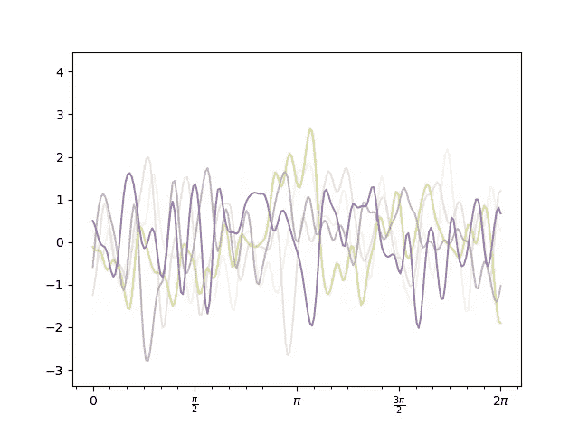

Samples from the GP prior with lengthscale 0.1, and signal variance σ²=1

我们立即知道这个先验不适用于正弦函数建模。因为样本是两个摆动的，看起来不像正弦波。

在实践中，您从先验中抽取样本，以查看这些样本函数的外观和感觉是否与您拥有的实际训练数据相似。样本用作健全性检查。然而，通常你会发现很难决定一个样本是否与你的训练数据相似。在这种情况下，接受使用样本的健全性检查有其局限性，并继续前进。

以上两个数字也揭示了长度刻度 *l* 的值很重要。它极大地影响了先验模型的函数形状。

与长度缩放的效果相比，信号方差参数 *σ* 仅缩放 y 轴上的函数。例如，如果 *σ* 是 *10* 而不是 1，来自 GP 先验的样本看起来如下:

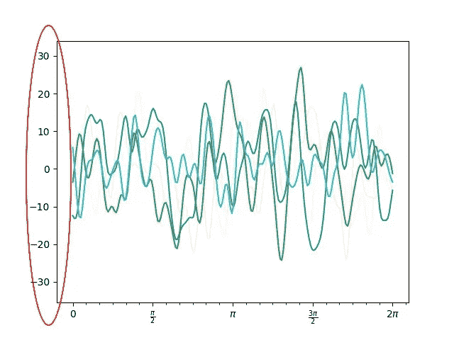

这些函数的外观与上图相似，只是 y 轴上的值被缩放以具有更大的范围。

## GP 先验的固定和可变部分

我们的 GP 先验具有多元高斯结构，并且它具有长度尺度 *l* 和信号方差 *σ* 作为参数。我们通过指定其均值 *m(x)* 和协方差 *k(x，x)* 分量*来固定多元高斯结构。*但是我们没有说明 *l 和σ* 的具体值*。*

多元高斯结构和模型参数值都有助于定义我们的先验包括的函数集。在参数学习过程中，我们改变模型参数值，以查看哪些值会产生最好地解释训练数据的后验概率。但是在参数学习期间，我们保持先验的高斯结构不变。这是因为如果我们改变先验的结构，我们将不再讨论高斯过程模型，这个模型可能是完全不同的，具有非常不同的性质。

# 可能性和边际可能性

GP prior 只提到了 *X* 。这是在实际观察 *Y* 之前连接来自 GP 的随机变量的可能性。根据先验和似然，我们可以计算后验。从后面，我们做出预测。

**可能性**

可能性是给定来自先验的随机变量 *f(X)* 和 *f(X_*)* 观察到 *Y* 的概率。要说观测到 *Y* 的概率，我们需要引入一组新的随机变量。对于 *X* 中的每个位置 *x* ，引入一个新的随机变量 *y(x)。*我们假设我们在位置 *x* 的观察值是这个随机变量 *y(x)* 的一个样本。在 *Y* 中有 *n* 个观测值，所以我们有一个长度为 *n* 的随机变量向量 *y(X)* 。

我们应该给 *y(X)* 什么分布？为了建立 *y(X)* 和随机变量 *f(X)* 之间的联系，我们将 *y(X)* 的分布定义为具有均值 *f(X)* 和协方差 *η Iₙ* 的多元高斯分布，其中 *η* 为标量模型参数，称为噪声方差， *I* ₙ为大小为 *n×n 的单位矩阵*


我用的是符号*𝒩(y(x)；f(X)，η Iₙ)* 来表示随机变量*y(x)*的多元高斯概率密度函数，这个概率密度有均值 *f(X)* 和协方差矩阵 *η Iₙ* 。

描述相同随机变量 *y(X)* 的等效方式是使用高斯线性变换形式:


该公式将 *y(X)* 表示为随机变量 *f(X)* 加高斯噪声 *ε* 的线性变换。变换矩阵不是别人，正是 *n×n* 单位矩阵 *Iₙ* 。同样，这两种定义 *y(X)* 的方式是等价的。

可能性的公式是给定 *f(X)* 的随机变量 *y(X)* 的概率密度函数:

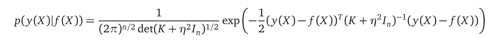

似然性是三个自变量的函数: *y(X)* 、*f(X)*和模型参数 *{l，σ，η }* ，我们将整套模型参数作为单个自变量处理。

为什么我们这样建模 *y(X)* ？因为:

1.  我们使用 *f(X)* 来模拟位置 *X* 处的可能函数值，很自然地将其用作我们的观察随机变量 *y(X)* 的平均值。
2.  我们想要模拟我们的观察值 *Y* 来自 *f(X)* 但是不知何故被随机噪声破坏了。所以我们引入了噪声方差 *η Iₙ* 。每个位置的腐败 *x* 是相互独立的，这就是为什么 *η Iₙ* 是一个对角矩阵，所以两个不同位置的噪声之间没有相关性。

你可能会疑惑， *f(X)* 已经是一个有自己方差的随机变量，由 *k(X，X)* 定义，为什么还要引入另一个层次的方差 *η Iₙ* ？

答案是:不必。这是你的造型。你想怎么建模都行。您可以将观察值 *Y* 建模为来自 *f(X)* 的样本，而无需引入 *y(X)* 。这被称为无噪声高斯过程(此处为[，第 15 页](http://www.gaussianprocess.org/gpml/chapters/RW.pdf))。

但更常见的是引入观测噪声。因为这样我们就有了更好的关注点分离: *f(X)* 及其方差侧重于对底层系统动态及其固有的不确定性进行建模。而 *y(X)* 及其方差则侧重于观察过程中出现的不确定性。这更接近真实系统。

你可能也想知道:为什么噪声需要在 *X* 的每个位置都是独立的？因为如果噪声不是独立的，例如，如果噪声随着 *X* 中的位置以线性方式变大而变大，那么它不再是噪声。这是系统的一个特征，我们应该事先对其建模。

你可能也想知道，可能性通常不是观察随机变量的概率密度，给定**所有**先前介绍的随机变量？换句话说，你会建议可能性是:


还有为什么我把可能性定义为 *p(y(X)|f(X))* 没有随机变量 *f(X_*)* ？答案是:你是对的。可能性应该是你建议的公式。但是你的配方和我的一样。这是因为我将观测随机变量建模为 *y(X)=Iₙ f(X) + ε，*所以 *y(X)* 只取决于 *f(X)* ，而不取决于 *f(X_*)* 。我认为这种建模是有意义的，因为在测试位置 *X_** 对依赖于随机变量 *f(X_*)* 的 *y(X)* 建模会很奇怪。

由于 *y(X)* 不依赖于 *f(X_*)* ，我们可以在条件中去掉 *f(X_*)* 这个不相关的提及，那么 *p(y(X)|f(X)，f(X _ *)*就变成了 *p(y(X)|f(X))* 。如果你想了解更多关于如何从概率密度中去除随机变量的知识，请去我的另一篇文章[揭秘 Tensorflow 时间序列:局部线性趋势](/demystifying-tensorflow-time-series-local-linear-trend-9bec0802b24a)搜索“如何从公式中去除随机变量”。

根据我们的模型，实际观测值 *Y* 是来自随机变量 *y(X)* 的一个样本。于是 *f(X)* 和 *f(X_*)* 就成了随机变量，它们的样本我们永远也观察不到。在概率论中，我们称 *f(X)* 和 *f(X_*)* *潜在随机变量*。

**边际可能性**

我们已经提到，观测随机变量 *y(X)* 可以用高斯线性变换方式定义:


从这个公式中，我们可以应用高斯线性变换规则来推导出 *y(X)* 的概率密度函数，而不用提及 *f(X)。*

首先，通过应用多元高斯边缘化规则，我们可以从 GP 先验中得到随机变量 *f(X)* 的分布:


我们以前曾经使用过这个规则来去除任何与 *X* ₒ相关的东西，比如**内核函数 k* 中的 *f(Xₒ)* 和 *y(Xₒ)* 。这里我们用同样的规则从先验中去掉 *f(X_*)* 得到的只是 *f(X)* 的分布。所以:*

**

*然后，我们可以应用高斯线性变换规则(参见我的文章[揭开 Tensorflow 时间序列的神秘面纱:局部线性趋势](/demystifying-tensorflow-time-series-local-linear-trend-9bec0802b24a)了解该规则的详细信息)来获得随机变量 *y(X)* 的分布。以下是多元高斯线性变换规则:*

*如果多元随机变量 *a* 来自以下高斯分布:*

**

*随机变量 *b* 是从 *a* 的线性变换，其中 *A* 为变换矩阵，并添加了高斯噪声 *η* :*

**

*那么 *b* 的分布为:*

**

**b* 的分布使用了 *a* 的分布中的量，但没有提及随机变量 *a* 。这是很重要的一点。*

*多元高斯线性变换绝对值得你花时间去记住，它会在机器学习的很多很多地方出现。例如，你需要它来理解[卡尔曼滤波算法](/demystifying-tensorflow-time-series-local-linear-trend-9bec0802b24a)，你也需要它来推理[最小二乘线性回归](/where-do-confidence-interval-in-linear-regression-come-from-the-case-of-least-square-formulation-78f3d3ac7117)中的不确定性。*

*对于我们来说， *a* 是 *f(X)* ， *b* 是 *y(X)* ， *A* 是 *Iₙ* ， *η* 是 *ε。*我们应用线性变换规则推导出 *y(X)* 的分布:*

**

*其概率密度函数为:*

*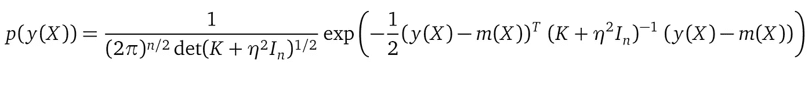*

*这个概率密度函数就是著名的**边际似然**。与似然的概率密度函数不同，上述边际似然密度只提到了随机变量 *y(X)* 而不再提到 *f(X)* 。你能指出这个概率密度函数和可能性密度函数之间的 4 个区别吗(当你家里有一个小孩时，这种问题自然会出现)？*

*由于我们将随机变量 *f(X)* 从似然公式中剔除，我们将结果称为边际似然。*

*边际似然概率密度函数有两个自变量， *y(X)* 和模型参数集。知道一个函数的哪些未知数/自变量是重要的。因为后面我们会用边际似然公式作为参数学习的目标函数。所以我们需要确定边际可能性是一个只有模型参数作为自变量的函数。*

*虽然边际似然有两个自变量， *y(X)* 和模型参数集，但是我们有针对 *y(X)* 的观测值 *Y* 。我们可以将 *Y* 插入到 *y(X)* 的位置，得到一个只有一个自变量的函数——模型参数集。*

*你可能会想，我们通常不都是通过把潜在随机变量 *f(X)* 积分出来得出边际似然的吗，像这样:*

*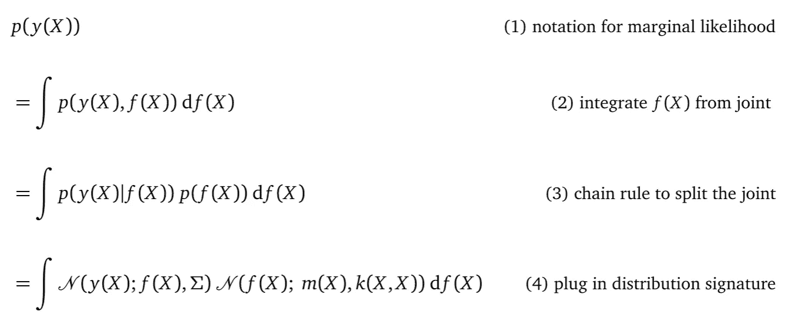*

*你是对的，如果你计算这个积分(我将提供另一篇文章来进行这个计算)，结果与上面我们应用高斯线性变换规则时的结果相同。*

*应用高斯线性变换规则的优点是它简单得多。缺点是当一切都是高斯时，我们只能使用高斯线性变换规则。然而，使用积分的上述推导适用于任何概率系统，因为它仅使用概率论的基本规则。*

# *计算后验概率*

*在贝叶斯方法中，我们需要根据先验和似然性计算后验概率。后验概率是与前验概率相同的一组随机变量。*

*我们的 GP 先验由两个潜在的随机变量向量 *f(X)* 和 *f(X_*)* 组成，但是我们只对寻找后验的 *p(f(X_*)|y(X))* 感兴趣，因为我们需要它在测试位置 *X_** 进行预测。我们可以随意地计算 *p(f(X)|y(X))* 的后验概率，首先计算 *p(f(X_*)|y(X))，*，然后将 *X* 代入 *X_*。**

*为了计算后验概率 p(f(X_*)|y(X)) ，我们依赖于这样一个事实，即 *f(X_*)* 和 *y(X)* 都是多元高斯随机变量，并且我们知道这两个变量的分布。*

**f(X_*)* 的分布是通过在去除与 *f(X)相关的东西之前将多元高斯边缘化规则应用于 GP 而得到的。**

**

*这是我们第三次应用多元高斯边缘化规则:*

**

*在*可能性和边际可能性*部分，我们推导出了 *y(X)* 的分布，这就是边际可能性:*

**

*由于 *f(X_*)* 和 *y(X)* 都是高斯分布，我们可以把它们的联合分布写下来(我们为什么要写联合分布的原因下面几段就清楚了)如下，前提是我们可以计算出 *f(X_*)* 和 *y(X)* 之间的协方差，用 *Cov(f(X_*)，y(X))* 表示:*

*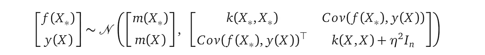*

*如果我们记得协方差的定义，计算 *Cov(f(X_*)，y(X))* 就很简单:*

*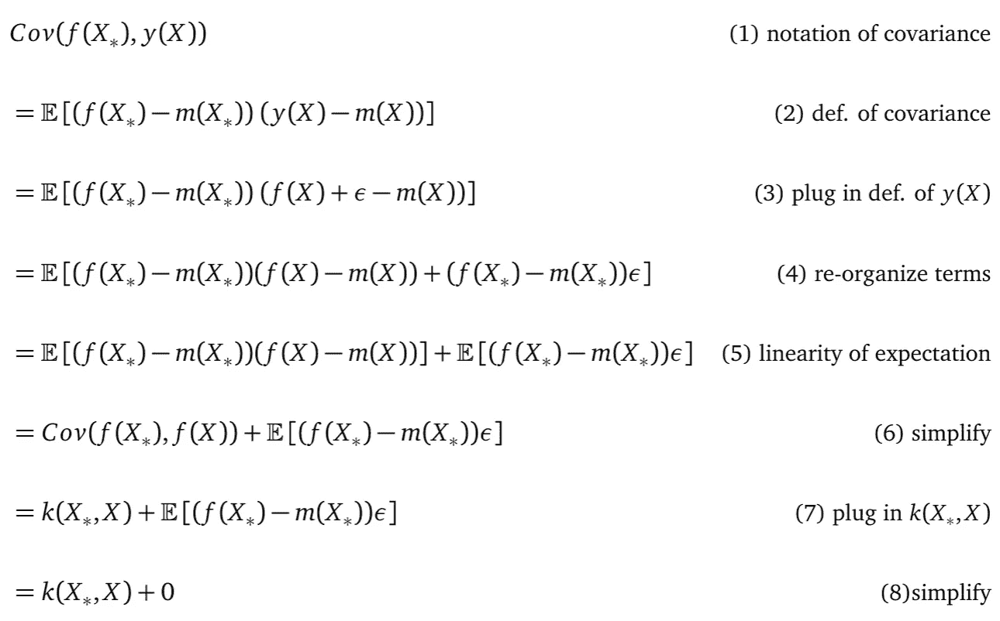*

*线(2)示出了在给定它们的平均值 *m(X_*)* 和 *m(X)的情况下 *f(X_*)* 和 *y(X)* 之间的协方差的定义。**

*第(3)行插入 *y(X) = f(X)+ε* 的定义。这里我们忽略了恒等式矩阵 *Iₙ* 前面的 *f(X)* 作为 *Iₙ* 不改变向量 *f(X)。**

*第(4)行重新组织了项，因此我们可以通过使用期望的线性属性在第(5)行将单个期望分成两个期望:和的期望等于操作数的两个期望的和。*

*第(6)行认识到第一个期望是 *f(X_*)* 和 *f(X)* 之间的协方差的定义。并且线(7)插入这个已知的量 *k(X_*，X)* 。*

*第(8)行识别出随机变量 *f(X_*)-m(X_*)* 和随机变量 *ε* 是独立的。所以它们的乘积的期望等于这两个随机变量的乘积，即*E[(f(X _ *)—m(X _ *))ε]*=*E[f(X _ *)—m(X _ *)]E[ε]*。由于*E【ε】*为 0 因为 *ε* 是均值为 0 的随机变量，所以整个乘积为 0。*

*所以现在我们可以在 *f(X_*)* 和 *y(X)* 之间有一个完全指定的联合分布:*

**

*现在距离后验概率 p(f(X_*)|y(X)) 只有一步之遥，我们应用多元高斯条件规则来计算它。我们之所以要写下 *f(X_*)* 和 *y(X)* 之间的联合分布，是想应用这个规律。*

*多元高斯的条件规则是:*

**

*该规则给出了当 *p(x，y)* 为多元高斯时，从联合 *p(x，y)* 得到 *p(x|y)* 的公式。让我们将该规则中的术语与我们在 *f(X_*)* 和 *y(X)* 之间的联合分布中的术语进行匹配:*

*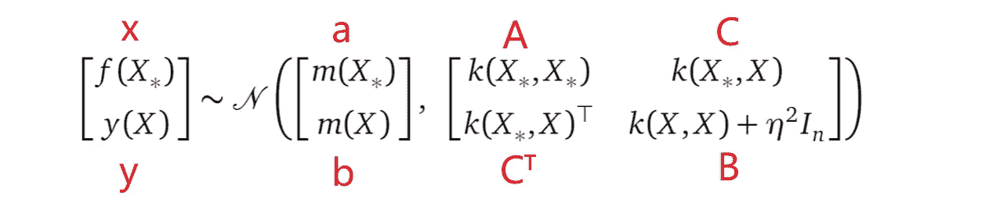*

*应用这条规则后，我们得到后验分布:*

**

*有了后验均值和后验协方差:*

*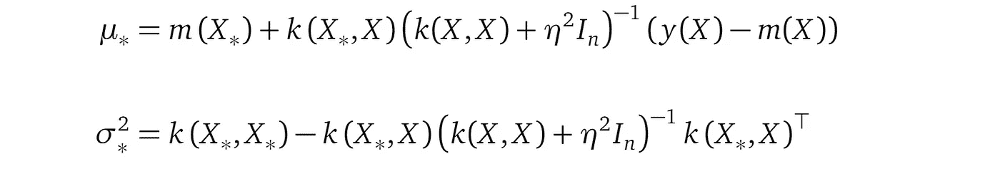*

*哇，这两个量是不是很复杂！但是不要担心，我们将研究它们的结构来回顾它们的直觉。直觉很有道理。请继续读下去。*

*但在我忘记之前，我需要指出这些步骤:*

1.  *将我们的高斯潜在随机变量和非潜在观测随机变量组织成联合高斯分布；*
2.  *应用多元高斯条件规则推导后验概率密度。*

*这两个步骤是贝叶斯学习中反复出现的模式。这里我们用它来计算高斯过程模型的后验概率。另一个著名的例子是卡尔曼滤波算法。参见我的另一篇文章[揭开 Tensorflow 时间序列的神秘面纱:局部线性趋势](/demystifying-tensorflow-time-series-local-linear-trend-9bec0802b24a)、*卡尔曼滤波器*部分，尤其是卡尔曼滤波器算法的总结。*

*你可能会想，为什么我们不用通常的贝叶斯法则来计算后验概率:*

*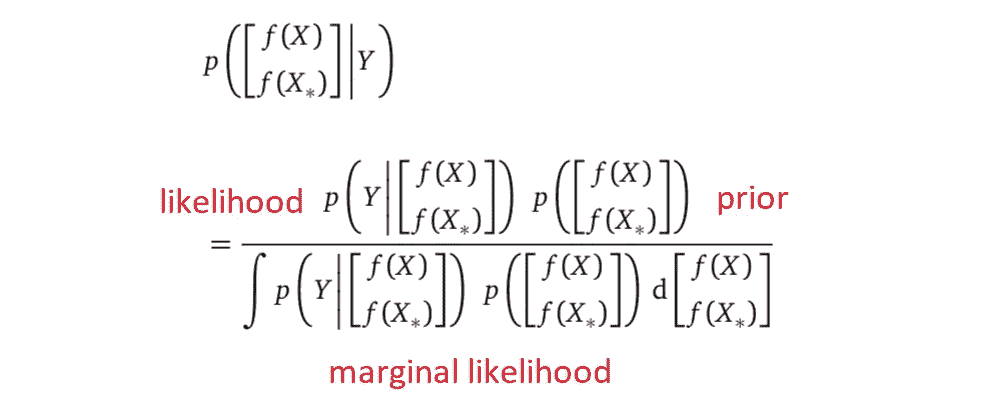*

*我们可以，我会提供一篇关于它的文章。得到的后验概率和这里一样，但是推导过程比这里复杂得多。原因是当一切都是高斯分布时，使用多元高斯分布的性质和规则是贝叶斯规则的捷径。*

*现在让我们研究后验均值和后验协方差的结构。*

## *后验均值和协方差的结构*

*首先，你可以验证后验均值 *μ_** 是一个长度为 *n_** 的向量。并且后验协方差 *σ_** 是大小为 *n* _* *×n_*的矩阵。*下面我把每个分量矩阵的大小用红色表示(记住 *n* 是 *f(X)* 的长度，或者说是训练数据点的个数)。 *n_** 为 *f(X_*)* 的长度，或测试位置的数量):*

*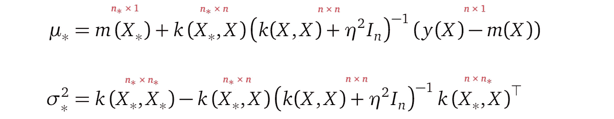*

*后验均值和协方差是*符号* c 表达式——它们是提到模型参数 *{l* 、 *σ、* *η }的数学表达式。*我们不知道这些模型参数的值。所以即使我们把已知的量:训练地点 *X* ，测试地点 *X_** 和观测 *Y* 代入 *y(X)* 之后，我们还是有一个符号表达式。只有在我们使用参数学习为我们的模型参数找到最优值之后，我们才能将这些符号表达式评估为具体的真实值。*

*让我们从后验的意思开始:*

**

*为了便于研究，我们假设均值函数 *m* 为 0，因此 *m(X)=0* ，并且 *m(X_*)=0* 。现在让我扩展这个公式。事实上，通常你可以通过展开向量和矩阵来帮助自己理解线性代数表达式。*

*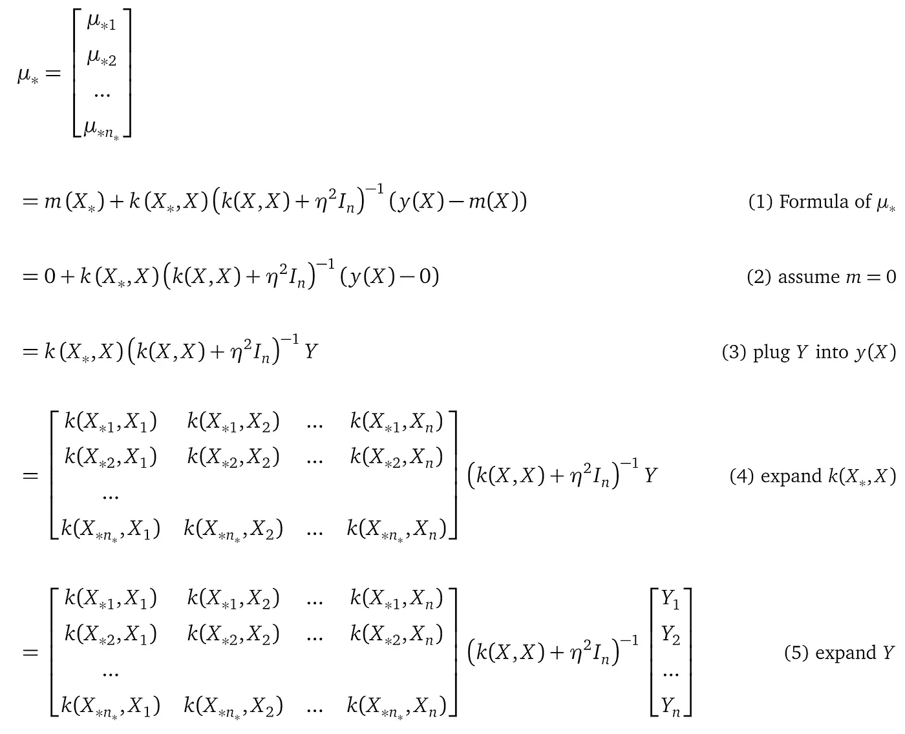*

*第(1)行是我们之前推导的 *μ_** 的公式。*

*第(2)行用 0 代替了 *m(X_*)* 和 *m(X)* 以便于我们的研究。*

*第(3)行将我们的部分观察数据 *Y* 插入 *y(X)* 。*

*第(4)行扩展了 *k(X_*，X)* 的定义。*

*第(5)行将 Y 扩展为实际矢量。*

*第(5)行的公式揭示了关键信息:*

1.  *单个测试位置的平均值，比如说 *x_*1* ，是所有观察值 *Y* 的加权和。权重由测试位置 *x_*1* 和 *X* 中所有训练位置之间的内核定义。即使先验函数的均值为零，后验均值也不一定为零。这个公式显示了我们之前提到的内容——后验权重函数来自于先验，使得它们与训练数据更加一致。并且这种重新加权导致非零均值的后验概率。*
2.  *中间的部分 *(k(X，X) + η Iₙ)⁻* 没有提到 *x_*1* ，所以相对于 *x_*1* 是常数。你可以想象一下，幂 *⁻* 把项 *k(X，X) + η Iₙ* 放入一个分数的分母，其中分子是 *k(x_*1，X)* 乘以 *Y* 。那么你就可以理解后验均值确实是观测值的加权和 *Y* ，权重 *k(x_*1，X)* 。并且这个加权和通过( *k(X，X) + η Iₙ)⁻* 归一化。*

*我在[这段代码](https://github.com/jasonweiyi/understanding_gaussian_process/blob/master/gp.py)中实现了高斯过程。我用[这个代码](https://github.com/jasonweiyi/understanding_gaussian_process/blob/master/plot_posterior.py)来绘制后验均值和方差。GP 的代码是将上述公式直接翻译成 NumPy 语法。阅读时，注意使用 assert 语句检查矩阵形状。当编写机器学习算法时，确保矩阵具有正确的形状可以防止大量错误的发生——记住这一点。如果你想了解更多关于编写断言来帮助你开发机器学习代码的知识，这是一本好书:[将 Tensorflow 调试时间减少 90%](/reducing-tensorflow-debugging-time-by-90-percent-41e8d60f9494)。*

*让我们看看后验均值是如何表现的。以下是一个非常重要的数字。我使用 0 到 2π之间的 50 个等距位置作为我们的测试位置 *X_** ，并计算这 50 个位置的后验均值和方差*。*在该图中，红点代表这些测试位置的后验平均值。连接所有红点的红色曲线是 matplotlib.plot 效果。蓝色条带表示后验方差，即后验协方差矩阵主对角线上的值。我将在下一节解释后验协方差。训练数据点用蓝色十字“x”标记。我用了 lengthscale *l=0.4* ，信号方差 *σ=1，*噪声方差 *σ=0.01。**

*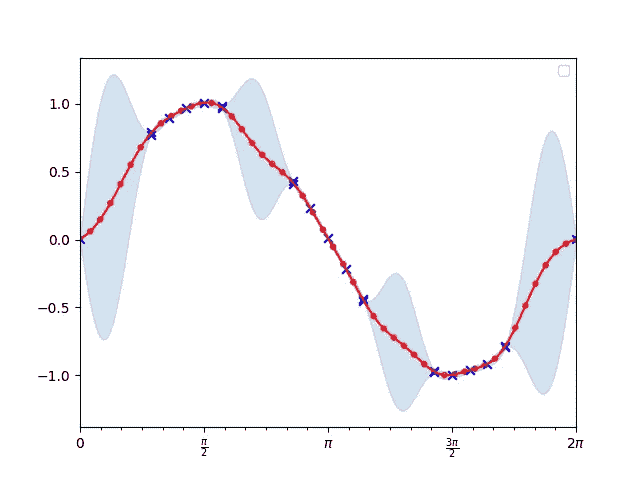*

*Posterior mean and variance for test locations. Blue crosses are training points, red dots are testing points.*

*我们首先关注后验均值。第一个印象是，连接所有后均值的红色曲线有点类似于正弦波。不完美，但很接近。*

*为了查看后验均值后面的“**加权**Y 之和”解释，在下图中，我用一个大红点突出显示了一个单独的测试位置。我用蓝色标记画出训练数据点，蓝色标记的大小与大红点的后验均值中的权重成比例。*

*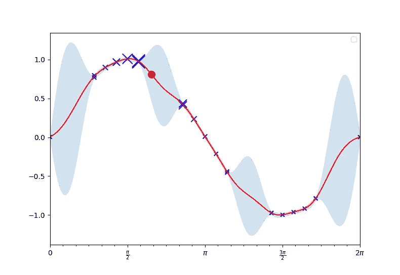*

*现在，您可以验证训练点离突出显示的测试点越近，相应观察值的权重就越大，因此蓝色标记就越大。随着训练点远离高亮显示的测试点，蓝色标记的大小会减小。*

***重新审视定义功能的映射视图***

*在理解了后验均值是观察值的加权和之后， *Y，*现在我们理解了为什么定义函数的映射视图对于高斯过程是重要的。*

*高斯过程不会像线性回归给你的那样，找到一个传统意义上的 *f(x)=ax+b* 只需要一个新的 *x* 并返回一个 *y* 的函数体。相反，它给出了每个测试位置 *x_** 到函数平均值(当然还有它的方差)之间的**映射**。该映射不仅涉及测试位置 *x_** ，还涉及所有训练数据 *X* 和 *Y* 。注意即使你可以有一个无限数量的测试位置的映射，实际上，你只需要做有限数量的预测，所以你只需要计算有限数量的这样的映射。*

*我们意识到这种差异非常有趣:使用线性回归，一种所谓的**参数模型**，在您使用训练数据来确定 *f(x)= ax+b* 中参数 *a* 和 *b* 的值(这称为参数学习)之后，您可以丢弃训练数据。因为对新的 *x* 进行预测不需要训练数据。但是用高斯过程，一个所谓的**非参数**模型，即使在参数学习之后，你仍然需要保留训练数据，因为训练数据出现在后验均值和方差中，高斯过程依靠后验进行预测。*

*您可能想知道高斯过程是否能够节省空间来进行预测。它不是。前面我们已经说过，你通常需要更多的空间来写下一个通过输入输出映射定义的函数。这是从数学的角度来看。现在让我们从计算机科学的角度来看看这种空间非效率:*

*   *在参数模型中，如形式为 *f(x) = ax+b* 的线性回归。在参数学习找到参数 *a* 和 *b* 的值后，您只需要存储这两个数字的空间来预测新的测试位置 *x_** 。也就是说，参数学习后，就可以扔掉训练数据了。*
*   *在非参数模型中，例如高斯过程，在参数学习以找到模型参数的值之后，您仍然需要保留所有训练数据 *(X，Y)* ，因为模型参数和训练数据都出现在后验中。所以如果 *(X，Y)* 由一百万个数据点组成，准备好为它们分配内存。*

## *后验协方差*

*现在让我们来看看后验协方差矩阵:*

*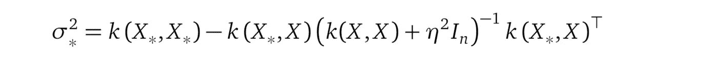*

*它是描述 *f(X_*)|y(X):* 的后验概率中每对随机变量之间协方差的矩阵*

*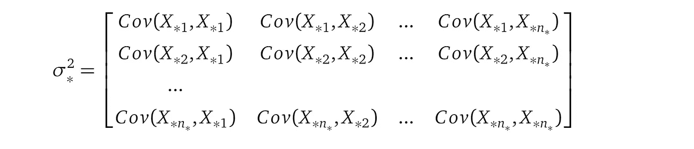*

*注意，该矩阵中的条目不是 *k(X_*i，X_*j)* ，因为这是后验协方差，并且 *k(X_*i，X_*j)* 用于定义先验。所以我使用符号 *Cov(X_*i，X_*j)* 来表示后验协方差矩阵中的条目。*

*主对角线上的条目是 *f(X_*) —* 中每个随机变量的方差，一个随机变量与其自身之间的协方差称为方差。*

*让我在下面再次展示后验均值和方差的图。*

**

*Posterior mean and variance for test locations. Blue crosses are training points, red dots are testing points.*

*在该图中，蓝色带代表 95%的置信区间。提醒我们自己，我们生成了非等间距的训练点。所以有的地区训练点多，有的少。后验方差代表模型的不确定性水平。我们可以看到，在附近有训练数据点的区域中，条带很薄，这意味着后验方差很小。换句话说，模型更确定函数值应该出现在测试位置的什么地方。在附近没有训练数据的地区，差异很大。换句话说，模型是相当不确定的。这是常识。这就是为什么人们说“训练数据解释了不确定性”。*

*现在我们来看看这个常识是如何体现在数学上的。但首先，你可能会想，后验方差是方差，它应该是非负的。后验均值公式总是非负的吗？*

*是的，它是。让我们在只有一个训练数据点和一个测试数据点的情况下说服自己。由于只有一个测试点，所以 *f(X*)* 中只有一个随机变量。后验协方差矩阵成为后验方差。我们进一步假设没有观测噪声，换句话说， *η =0* ，所以 *η Iₙ* =0。所以后验方差变成了:*

*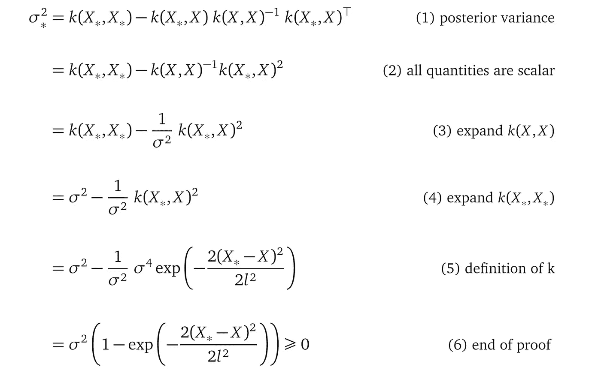*

*第(1)行是无观测噪声的后验协方差公式，所以矩阵求逆中没有 *η Iₙ* 。注意，在这个公式中，所有的 *k* 项都计算为一个标量数，因为我们只有一个训练数据点和一个测试点。*

*第(2)行简化了公式，因为标量的转置是它本身。*

*线(3)扩展和减少 *k(X，X)* 。*

*第(4)行扩展并减少 *k(X_*，X_*)* 。*

*第(5)行扩展了 *k* 的定义。*

*第(6)行显示后验协方差是非负的，因为指数函数的输入是负的量，所以指数函数具有最大值 1。所以整个公式的计算结果为非负值。*

## ***训练数据解释不确定性***

*同样从上面的公式，第(6)行，我们可以看到为什么当测试点离训练点越近时，后验协方差变得越小。随着 *X_** 越来越接近 *X* ，两者的平方距离趋近于 0；指数计算出这个最大值 1。因此总体后验方差评估为其最小值。*

*另一方面，当 *X_** 离 *X* 非常远时，指数评估为 0，因此总体后验方差评估为其最大值 *σ* 。这是一个有趣的行为，意味着后验方差以 *σ* 为界，它不会无限大，最终会达到最大。稍后您将看到一张显示这种最大化行为的图片。*

## *先验的后验权重函数*

*让我们重温一下我们在 GP 先验部分的*采样中开发的视图:后验概率为接近训练数据的函数提供更高的概率。**

*为了验证这一点，我们研究当我们将 *X_** 设为 *X* 时，后验概率 *p(f(X_*)|y(X))* 是什么样子。也就是说，我们想知道在等于 *X* 的位置，即训练位置，函数的后验分布是什么。我们希望看到的是后验赋予函数 *X⟼Y* 一个大概率，其中 *X* 和 *Y* 是我们的训练数据。*

***后验均值** 我们继续使用零均值函数，假设没有观测噪声，那么 *η Iₙ=0* 。并且我们设置 *X_* = X* 。后验均值公式变为:*

*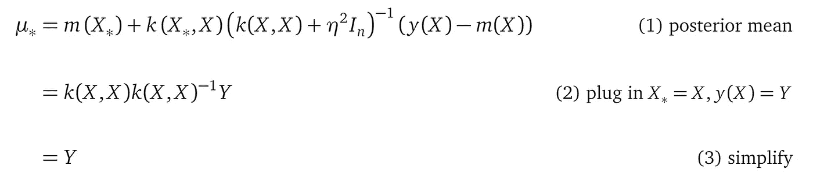*

*第(1)行是原始的后验均值公式。*

*第(2)行使用零均值并插入训练数据:将 *X_* *替换为 *X* ，将 *y(X)* 替换为 *Y* 。*

*第(3)行显示后验均值与我们的观察数据 *Y* 完全相同。注意这里 *k(X，X)* 和 *k(X，X)⁻* 相消，因为我们假设 *η Iₙ=0.*当 *η Iₙ≠0* 时，这两项不会互相抵消，所以后验均值不会等于 *Y* 。*

***后验协方差** 后验协方差公式变为:*

*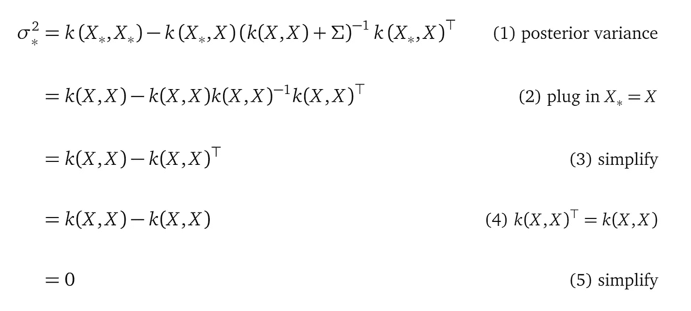*

*第(1)行是原始的后验协方差公式。*

*第(2)行插入训练数据:将 *X_** 替换为 *X* 。在这里，类似于后验均值的情况 *k(X，X)* 和 *k(X，*被取消，因为我们假设 *η Iₙ=0.但是他们不会互相抵消，如果 Iₙ≠0。**

*第(3)行简化了公式。*

*第(4)行表明，由于 *k(X，X)* 是对称矩阵，所以等于它的转置。*

*线(5)简化了公式，以显示训练数据位置 *X* 处的后验协方差为 0。*

*以上两个推导表明，当 *X_* = X* 时，后验分布具有均值 *Y* 和协方差零*。* **如果**你把观测值 *Y* 代入这个概率密度函数，你会得到最高的概率，因为高斯概率密度函数在均值的位置有最大值。事实上，你不能把 *Y* 代入这个后验分布，因为协方差为零，后验分布不再是有效的高斯分布。它只是一个平均向量，等于 *Y* 和一个零协方差矩阵，您可以将其解释为选择一个通过所有训练数据点的单一函数。*

## *做预测*

*后验分布 *p(f(X_*)|y(X))* 为潜变量 *f(X_*)* 。但是请记住，我们将观察值建模为潜在变量的线性变换，并添加高斯噪声。所以观测随机变量的后验 *y(X_*)|y(X)* 为:*

*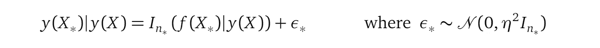*

*在哪里*

**

*由于我们从上一节知道了 *f(X_*)|y(X)* 的分布，即后验分布，通过应用多元高斯线性变换规则，我们可以推导出 *y(X_*)|y(X)* 的分布:*

**

*这是我们需要预测测试位置 *X_** 函数值的分布。类似于 *f(X_*)|y(X)* 的后验均值和方差， *y(X_*)|y(X)* 的后验均值和方差也是具有单个自变量的函数，即测试位置 *X_** 。该预测是具有均值和方差的高斯分布的形式。有了这两个量，你就可以画出均值曲线和置信区间。*

*我们可以看到，在测试位置预测新函数值的高斯过程机制只是潜在随机变量 *f(X_*)* 的后验均值和方差上面的一层薄薄的东西。*

## *高斯过程以有原则的方式模拟不确定性*

*上述用于进行预测的公式揭示了一个非常重要的事情:高斯过程模型以高斯分布的形式进行预测。它的平均值告诉我们一个预测的平均值或期望值，它的方差告诉我们模型对于这个预测的不确定性。*

*先验的不确定性(由协方差矩阵测量)和似然的不确定性通过我们用来导出后验的多元高斯条件规则(以及等价的贝叶斯规则)传播到后验的不确定性中。这就是为什么我们说高斯过程以一种有原则的方式模拟不确定性。*

*你可能会想，这种不确定性是主观的吗？这意味着我们主观上决定对 GP 先验和似然性都使用多元高斯分布，而不确定性来自这两个分布的不确定性。如果我们选择不同的分布(比如，我们选择了 student-t 分布并设计了一个“student-t 过程”模型)，我们可能会有不同的不确定性特征。是的，你是对的。不确定性对我们选择的分布是主观的。由于我们不直接观察不确定性，这总是一个主观的选择，在模型表达能力和计算简便性之间进行平衡。*

*我们已经通过了相当多的材料，唯一剩下的事情是我们需要为我们在建模期间引入的三个参数找到好的值，长度尺度 *l* ，信号方差 *σ* 和噪声方差 *η。*为它们寻找好值的过程叫做*参数学习*。但是在我们开始描述参数学习之前，我想为您总结一下高斯过程模型。*

# *高斯过程模型摘要和模型参数*

## ***高斯过程模型***

*我们把 GP 先验和似然一起称为高斯过程模型。事实上，所有的贝叶斯模型都由这两部分组成，先验和似然。*

*先验是两个随机变量向量 *f(X)* 和 *f(X_*)* 之间的联合高斯分布。它们分别代表训练位置 X 和测试位置 *X_** 的可能函数值。先验未提及的观察值 *Y.* 其公式为:*

**

*其中 *m* 是通常为零的函数，而 *k* 是核函数:*

**

*先前引入了两个模型参数:长度尺度 *l* 和信号方差 *σ* 。*

*可能性是一个多元高斯分布，将我们的观察随机变量 *y(X)* 与潜在随机变量 *f(X)* 联系起来:*

**

*似然性引入了一个额外的模型参数:高斯观测噪声的方差 *η* 。*

*就是这样，一个简单的模型。这个模型引入了三个随机变量(每个都是一个随机变量向量):*

```
****f(X)*: latent random variables that represent possible values at 
      training locations *X*.*****f(X_*)*: latent random variables that represent possible values at 
        testing locations *X_**.*****y(X)*: random variables that represent possible values for 
      observations at training location *X*. We model our actual 
      observations *Y* as a sample from *y(X)*.**Note: the above three are random variables, so when you see the expression *f(X)*, *f(X_*)*, and *y(X)*, don't interpret them as function applications. They are random variable names.Note: the expression *m(X)* is a function application. It represents the mean function we use in the prior. It is a function application, and not the name of a random variable.*
```

*该模型定义了先验和似然。这两个部分在模型中，因为它们需要人的参与:我们需要确定均值是一个零函数；我们需要决定平方指数核，我们需要决定我们的观察随机变量是我们的潜在随机变量的线性变换。一旦我们决定了这些部分，计算后验概率和做出预测都是机械的，遵循概率论和高斯分布的规则。*

*现在我想更多地谈谈这三个模型参数。*

## ***模型参数***

*总之，高斯过程模型引入了三个模型参数。让我们讨论一下他们的直觉。*

***长度刻度*l****

*正如我们已经从 GP prior 部分的*采样中看到的，lengthscale 极大地改变了我们的 GP prior 可以建模的函数的外观。让我们通过查看其公式来了解 lengthscale 是如何做到这一点的:**

**

*我们可以看到，长度比例的倒数控制着两个随机变量在(*x-x’)*的意义上需要有多远，以便它们变得不相关。它是 lengthscale 的倒数，因为 *l* 出现在指数函数的分母中。下图显示了对于固定信号方差 *σ* =1，两个核函数是什么样子。一个是红色的长度刻度 *l=0.01π* ，另一个是蓝色的长度刻度 *l=0.5π* 。*

*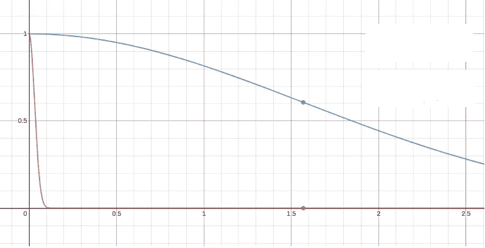*

*Kernel function values with different lengthscales, l=0.5*π* in blue, and l=0.01*π* in red.*

*在该图中，x 轴是 x 和*x’之间的距离。*我们来看距离(*x*-*x’)*= 0.5*π*≈1.57。也就是图中的蓝点和红点。当 *l* 为 0.5 *π，*相距 0.5 *π* 距离的两个随机变量仍然相当相关，协方差约为 0.6。相反，当 *l* 为 0.01 *π* 时，相距 0.5 *π* 距离的两个随机变量几乎不相关，协方差值约为 0。*

*当试图理解改变函数参数的影响时，我发现分析极端情况是有用的。在我们的内核示例中:*

1.  *当 lengthscale *l* 趋近于 0 时，内核值趋近于 0；我们的模型认为，任何两个不同的随机变量都是不相关的，不管它们有多接近。*
2.  *当 lengthscale *l* 趋近于∞，核值趋近于 1；我们的模型认为，任何两个随机变量都是 100%相关的，无论它们相距多远。*

*随机变量协方差的这种变化如何影响我们的 GP prior 可以建模的函数的外观和感觉？让我们看两个样本，每个样本来自一个 prior。红色样本来自长度为 0.01π的先验样本，蓝色样本来自长度为 0.5π的先验样本:*

*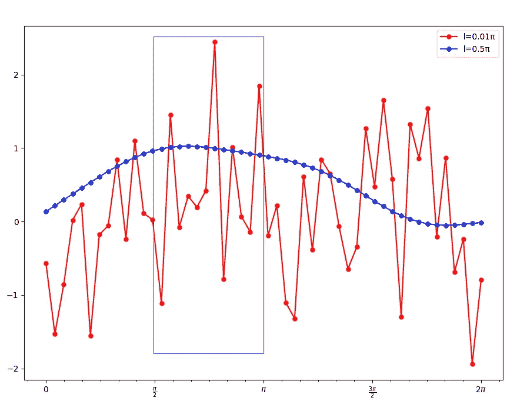*

*Samples from the GP prior with different lengthscales*

*在该图中，数据位置被有意选择为均匀间隔 0.04 *π* ，因此两个相邻数据点之间的距离大于长度刻度 0.01π，但小于长度刻度 0.5π。*

*我们先来看一下 *l=0.5π的蓝色曲线。l=0.5π* 意味着 0.5π*π*窗口内的随机变量(即蓝点)应该是高度相关的。我用绿色矩形突出显示了这样一个窗口。所以一条平滑的曲线，比如蓝色，与这些协方差特征是一致的。*

*“一致”是什么意思？记住所有的随机变量:*

1.  *具有相同的均值 0，因为我们使用的是均值为 0 的函数。具有相同的平均值意味着平均而言，来自那些随机变量的样本应该出现在相同的 y 轴水平上。*
2.  *具有相同的方差，因为它们的方差定义在协方差矩阵的主对角线上。它们都有方差 *σ。*具有相同方差的随机变量表明来自它们的样本应该在相同的水平范围内变化。*
3.  *随机变量是正相关的。这表明，如果来自随机变量 *f(x₁)* 的样本大于均值 0，则在 *l=0.5π* 纵向尺度距离 *f(x₂)* 内的另一个随机变量的样本也更有可能大于 0。这是我们期望从正相关随机变量中看到的行为——它们在同一个方向上变化。*

*突出显示的绿色窗口中的蓝点是先前随机变量的样本(每个随机变量一个样本)，长度标度为 *l=0.5π* ，符合这些特征。*

*另一方面，绿色窗口中的红点不符合这些特征。红点显然来自不同的方式，它们在 y 轴的不同范围内变化。事实上，对于红点，它们的长度尺度是 *l=* 0.01π，小于每两个数据点之间的距离 0.04π。所以任何两个红色数据点都来自实际上不相关的随机变量。这就是连接红点的红色曲线上下跳动的原因。*

***信号方差*σ****

*模型参数为 *σ* ，但通常我们写为 *σ* 是为了强调它是一个方差。正如我们在 GP prior 部分的*采样中已经看到的，不同的 *σ* 值缩放我们的 GP prior 可以在 y 轴维度上建模的函数。这是这个模型参数的直觉——它反映了你希望你的全科医生能够优先处理的功能范围。**

***观测噪声**的方差 *η**

*同信号方差，我们写 *η* 强调 *σ* 定义一个方差。我们有 *η* ，因为我们假设我们的观测值 *Y* 是来自随机变量 *y(X)* 的样本，并添加了高斯噪声。高斯噪声的均值为 0，其方差为 *η* 。*

*我们不知道这三个模型参数*的值。*我们使用参数学习为它们找到好的值。*

# *参数学习*

*模型参数的良好值有助于我们的模型更好地解释训练数据。参数学习是调整那些模型参数值直到它们能够足够好地解释训练数据的过程。*

*在高斯过程中，这种模型参数值的调整是通过优化完成的。我们首先提出一个目标函数，量化我们的模型如何解释训练数据。该目标函数将并且仅将所有模型参数作为自变量，并返回一个实数。当模型更好地解释训练数据时，我们从目标函数中解释更大的数字。参数学习试图找到具体的模型参数值，以最大化目标函数。*

## *选择目标函数*

*这个目标函数看起来应该是什么样子，以便“解释训练数据”？“解释训练数据”是什么意思？嗯，至少，它需要提到训练数据 *X* 和 *Y* 。*

*在我们的高斯过程模型中，我们有两个公式提到了完整的训练数据 *X* 和 *Y* 。可能性 *p(y(X)|f(X))* 和边际可能性 *p(y(X))* 。*

***可能性***

*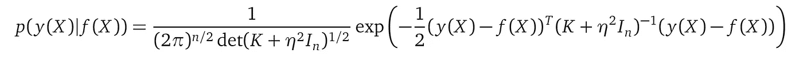*

*当我们将 *Y* 代入上述公式时，我们得到一个具有两个参数的函数，即模型参数集和潜在随机变量 *f(X)* ，如下所示。该函数将模型参数作为参数，因为它提到了观察噪声方差 *η* 以及长度标度 *l* 和信号方差 *σ* 到 *K* 。它有自变量 *f(X)* ，因为在指数函数中提到了 *f(X)* 。其他都是不变的。*

*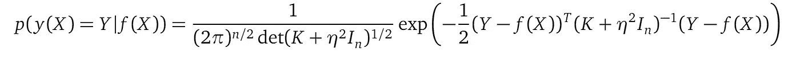*

*不同的模型参数值会导致观察到我们的观察数据的概率不同 *Y.* 我们可以把一个高概率解释为“更好地解释了训练数据”。因此，似然函数可能是目标函数的候选。*

*似然函数的问题是除了提到所有的模型参数，还提到了随机变量 *f(X)。这违反了我们的要求，即目标函数应该是只提及模型参数而不提及其他未知量的函数。我们有这个要求，因为优化算法——梯度下降——只对标量未知的函数有效，对随机变量未知的函数无效。**

***边际可能性***

*所以让我们看看边际可能性 *p(y(X))* :*

**

*这是一个只有一个参数的函数，即模型参数集。这是因为(1)即使 *y(X)* 是一个随机变量，我们也可以代入 *Y* 将其移除。(2) *m(X)* 不是一个随机变量，它是一个给定 *X.* 我们可以计算的量，我们通常设 *m(X)=0* 。(3)我们知道 *X* 。(4)提到了所有的模型参数。其他都是不变的。*

*我们仍然可以将高边际似然值解释为我们的模型能够更好地解释训练数据。说到底，边际似然的意义就是期望似然 *p(y(X)|f(X))* 相对于来自先验的随机变量*f(x)*:*f(x)~ 𝒩(0，k(X，X)):**

*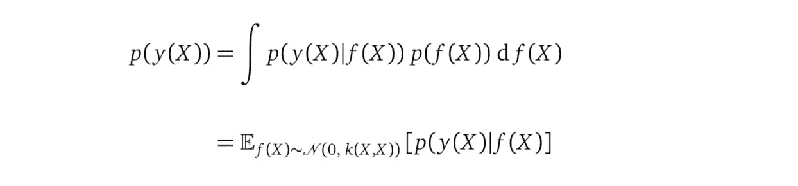*

*注意，即使我们使用高斯线性变换规则来推导边际可能性的公式，而不是上述积分，变换规则只是上述积分的捷径。*

*我们可以理解，边际可能性是我们的模型在以下意义上解释训练数据的程度的度量:*

1.  *我们的模型对观察数据的解释有多好 *Y* 是用我们代入 Y 时的似然值来衡量的——*p(Y(X)= Y | f(X))*。这个量依赖于 *f(X)* 是因为它的公式，也就是多元高斯概率密度函数，提到了 *f(X)* 。*
2.  **f(X)* 是来自先验 *p(f(X))的随机变量。*不同的样本 *f(X)* 导致我们的训练数据 *p(y(X)=Y|f(X)的可能性不同。*为了用一个数字量化 *Y* 的总体可能性，我们看所有这些可能性的平均值，也就是边际可能性。*

*好消息是边际可能性公式满足了我们对目标函数的要求。所以我们选择它作为我们的目标函数。*

*我们想要最大化关于模型参数的边际似然性，因为我们想要找到那些模型参数的具体值，使得观察数据 *Y* 可以由我们的具有最大似然性的模型生成。*

*由于边际可能性是一个指数函数，我们可以取它的对数来抵消指数。 *log* 函数是严格递增的，因此最大化 *log p(y(X))* 会产生与最大化 *p(y(X))* 相同的最佳模型参数值。*

## *理解目标函数*

*目标函数将我们对模型质量的定义嵌入到一个数字中。理解这个函数的行为是很重要的。让我们写下它的公式:*

*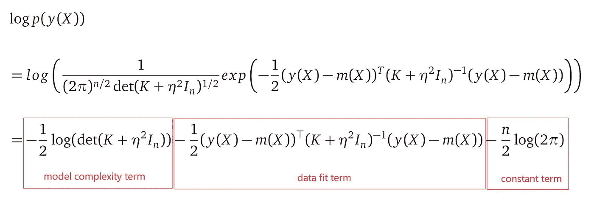*

*目标函数中有三项。我用红框突出显示了它们——模型复杂性术语、数据拟合术语和常数术语。我们可以忽略常数项，因为它不会改变优化的结果。我们将仔细研究数据拟合项和模型复杂性项。*

*请注意数据拟合术语和模型复杂性术语前面包含减号“-”。我们想最大化目标函数。忘记这两个负号会让你觉得下面所有的分析都应该是反方向的。*

## *重新审视空间效率*

*数据拟合项和模型复杂性项包含矩阵 *k(X，X)* 。它是一个大小为 *n⨉ n* 的矩阵，其中 *n* 是训练数据点的数量。如果你有一百万个数据点， *k(X，X)* 的大小是百万乘百万，需要很多内存来保存。与线性回归中的批量学习相比，在线性回归中，您只需要在内存中保存一小部分(一个小批量)训练数据，高斯过程方式并不节省空间。*

*更糟糕的是，我们需要在数据拟合项中对这个矩阵进行矩阵求逆。矩阵求逆是一种缓慢的操作，并且可能存在数值稳定性问题。所以高斯过程做参数学习既不节省空间也不节省时间。*

*如果你看[我实现高斯过程的代码](https://github.com/jasonweiyi/understanding_gaussian_process/blob/master/gp.py)，我用了 NumPy 的逆运算来求 *k(X，X)* 。只有当你有一个小的训练数据集时，这才有效。在实践中，你会用更聪明的方法，比如[乔莱斯基分解](https://en.wikipedia.org/wiki/Cholesky_decomposition)求 *k(X，X)* 的逆，利用它是一个正定对称矩阵的优势。在以后的文章中会有更多的介绍。*

*你可能会想，模型复杂度项中行列式运算符的空间和时间复杂度呢？与求逆 *k(X，X)* 相比，行列式的时间要少得多。 *k(X，X)* 的反演是高斯过程参数学习的时空分析中的主导因素。*

# *如何理解目标函数中的术语*

*由于对数运算符应用于边际可能性，数据拟合项和模型复杂性团队出现在目标函数中。我们没有决定将它们加入目标函数:*

*   *我们没有决定包括数据拟合项来捕捉我们的模型解释训练数据的程度。*
*   *我们没有决定包括模型复杂性术语来控制和鼓励简单模型。*

*这两个术语的存在是因为目标函数 *log(p(Y(X))，*的结构，这是贝叶斯机器学习的一个特征。*

*这不同于我们对带有正则化的线性回归中的目标函数所做的，其中目标函数是欧几里德距离项和 L2 正则化项之和:*

**

*其中 *w* 为模型参数， *(X，Y)* 为训练数据， *λ* 为 L2 正则项前的超参数权重。*

*在这个线性回归目标函数中:*

*   *欧几里德距离项(第一项)负责衡量模型预测与训练数据 *Y* 的接近程度。*
*   *正则项(第二项)负责通过 L2 范数鼓励具有小系数的简单模型。*

*这里，我们明确决定使用欧几里德距离来量化我们的模型与训练数据的拟合程度，并且我们明确决定使用 L2 范数正则化项来控制模型的复杂性。*

*回到我们的高斯过程设置，在下一节中，我们将弄清楚 *log(p(y(X))* 目标函数中数据拟合项和模型复杂性项的语义。你会明白:*

*   *数据拟合项不能衡量我们的模型对训练数据的解释程度。这与线性回归设置中的不同。*
*   *然而，模型复杂性项通过鼓励更简单的模型来控制模型复杂性。这类似于线性回归设置中的正则项。*

## *数据拟合术语*

*我们来思考一下为什么 *- (y(X)-m(X))ᵀ (k(X，X)+η Iₙ)⁻ (y(X)-m(X))* 被称为数据拟合项。我认为“数据术语”比数据拟合术语更好。我想称之为数据项，因为在目标函数中，这一项是唯一提到观察值 *Y* 到 *y(X)* 的项。我不喜欢“数据拟合项”这个名称，因为当我们听到“数据拟合”这个词时，我们往往会想到一个术语，它测量训练位置 *X* 的模型预测值与这些位置*的实际观测值 *Y* 之间的距离。这是很重要的一点，我来澄清一下。**

*例如，在线性回归中，数据拟合项是模型预测 *aX+b* 与观测*y*:*(ax+b-y)(ax+b-y)ᵀ*)之间的欧氏距离。但是在高斯过程目标函数中，所谓的“数据拟合项”*-【y(x)-m(x))ᵀ(k(x，x)+ηiₙ)⁻(y(x)-m(x))】*并不能代表模型预测与观测之间的这样一个距离。*

*首先，在高斯过程中，预测的形式是具有均值和协方差的后验分布。无论如何，还不清楚如何计算观察值和分布之间的欧几里得距离。*

*另一方面，即使我们忽略协方差，只看后验平均值(当我们在位置 *X* 设置 *m(X)=0* )也就是 *k(X，X)(k(X，x)+ηiₙ)⁻y。*它和观测值 *Y* 之间的欧几里得距离是:*

*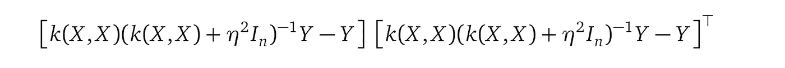*

*我们可以看到最小化这个量不同于在前面没有 *-* 的情况下最小化数据拟合项 *: Yᵀ (k(X，X)+η Iₙ)⁻ Y.**

*在高斯过程中，数据拟合项只是出现在对数边际似然中的一个项。就这样。*

*但你可能想知道，高斯过程中一定有某种机制来确保 *X* 位置的模型预测值与观测值 *Y* 接近，对吗？答案是贝叶斯法则，它给了我们后验概率。贝叶斯规则利用观测数据 *Y* 将先验分布更新为后验分布，使得后验分布产生 *Y* 的概率高于先验分布。*

*你可能会问，如果贝叶斯规则已经给了我们后验分布，根据定义，后验分布应该比先验分布更好地解释观测数据 *Y* ，为什么我们仍然需要最大化我们的目标函数，即对数边际似然？这是因为:*

*首先，前 *p(f(X))* 和后 *p(f(X)|y(X))* 的概率密度函数是模型参数的函数。它们是象征性的表达。只有当我们确定了这些模型参数的一些具体值时，后验概率密度函数才变得可评估。因此，我们需要找到模型参数的具体值的方法。*

*第二，并不是所有具体模型参数值的选择都一样好。即使先验、似然和后验的结构保持不变，插入不同的模型参数值将会得到不同的先验、似然和后验概率密度。不同的后验概率意味着它们对同一观测数据 *Y* 的解释概率不同。正如您在*过拟合*和*欠拟合*部分所看到的，这些模型参数值的错误选择会导致模型无法很好地解释我们的观测数据 *Y* 。显然，我们想要以非常高的概率解释 *Y* 的后验。目标函数最大化是选择合理的模型参数值的一种方法。*

***数据如何适应术语变化***

*当我们改变长度尺度 *l* 时，数据拟合项如何变化？如果我们将观测噪声 *η Iₙ* 设置为 0，将均值函数 *m(X)* 设置为 0，并将信号方差 *σ* 设置为 1，则该趋势很容易证明。我们进一步假设只有两个训练点 *(X₁，Y₁)* 和 *(X₂，Y₂)* 。在此设置中，数据拟合项变为:*

*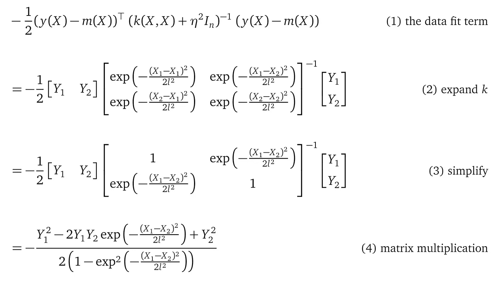*

*现在，让我们改变长度比例 *l* ，看看数据拟合项如何变化。当 *l* 接近 0 时，数据拟合项评估为以下限值:*

*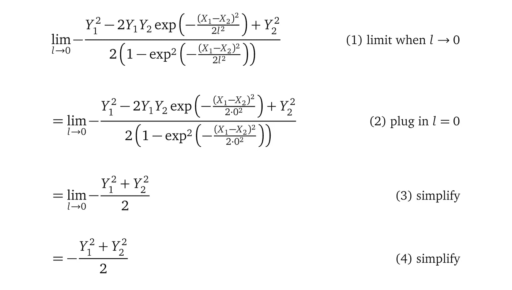*

*当 l 接近 *∞* 时，数据拟合项评估为以下限值:*

*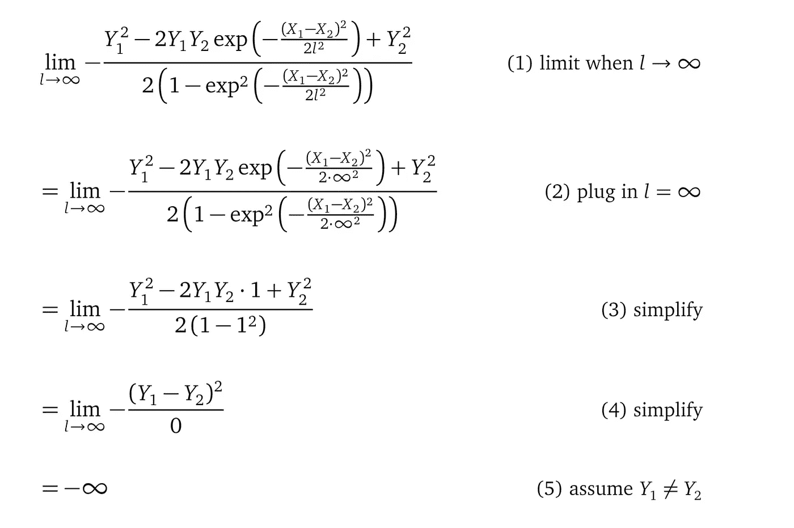*

*现在我们看到，当我们将 lengthscale *l* 从 0 增加到 *∞* 时，数据拟合项从*-【y₁+y₂】*减少到- *∞。**

*当信号方差和噪声方差具有不同的值时，这种数据拟合项减少的趋势仍然成立。但是这种减少不是单调的。*

*上述推导假设 *Y₁≠Y₂* ，意味着并非所有的训练 *Y* 都是相等的。我将在本节结束时分析 *Y₁=Y₂* 的情况。*

## *模型复杂性术语*

*我们来想一想为什么 *- log(det(k(X，X)+η Iₙ))* 被称为模型复杂度项。 *det(k(X，X)+η Iₙ)* 表示矩阵 *k(X，X)+η Iₙ* 的行列式。类似于数据拟合术语，让我们关注纵向尺度 *l* 。*

*正如我们已经从 GP previous 部分的*采样中看到的，较大的长度比例允许我们的 GP 在建模更平滑的函数之前，较小的长度比例允许我们的 GP 在建模更波动的函数之前。这里有两个来自两个 GP 先验的采样函数，蓝色的来自具有较大长度尺度 *l=0.5* π的先验，红色的来自具有较小长度尺度 *l=0.1π* 的先验。**

*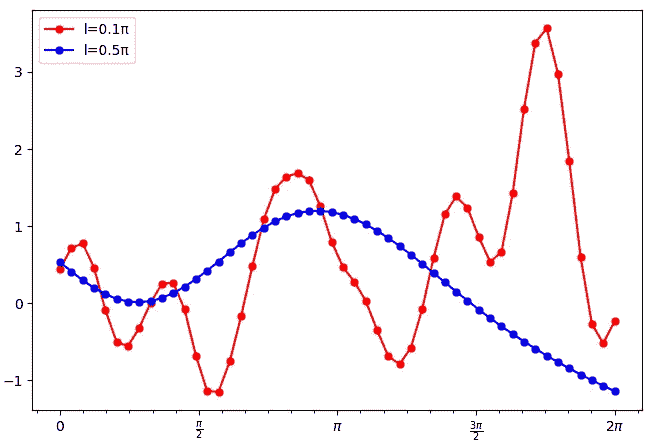*

*Samples from the GP prior with different lengthscales*

*蓝色曲线更平滑，红色曲线更起伏。更平滑的曲线让我们想起使用较低次数多项式的线性回归设置，换句话说，就是更简单的模型。一条更曲折的曲线提醒我们，在线性回归设置中，多项式的次数越高，换句话说，模型越复杂。*

*如果你对低次和高次多项式线性回归没有概念，我用[这个网站](https://arachnoid.com/polysolve/)在我们的训练数据上用不同次数的多项式尝试线性回归。以下是适合 3 度的情况:*

*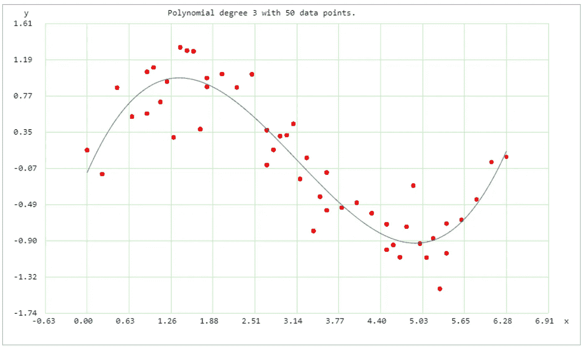*

*Polynomial linear regression with degree 3*

*这是 49 度的拟合度:*

*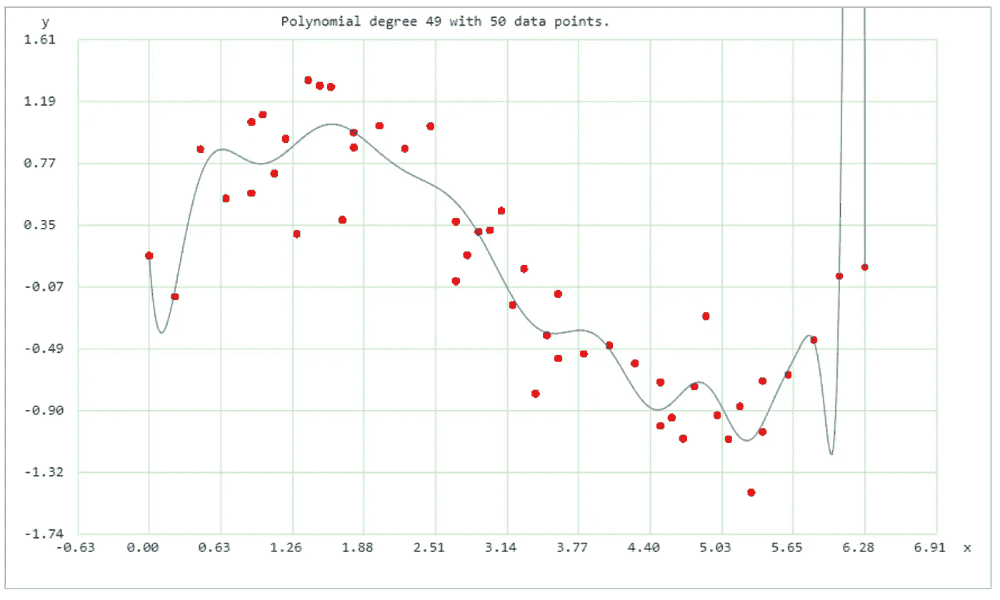*

*Polynomial linear regression with degree 49*

*我们可以看到，在线性回归设置中，较低的拟合度，或者更简单的模型，给出了更平滑的拟合曲线。更高的拟合度，或者更复杂的模型，给出了更扭曲的拟合曲线。*

*在高斯过程中，我们采用相同的模型复杂性概念。我们称之为 GP 先验，它允许更简单的平滑函数，而模型允许更复杂的波动函数。*

*在*来自 GP 先验*部分的采样中，我们已经表明 GP 先验可以建模的函数的光滑性取决于长度尺度参数，而不取决于观察值 *Y* 。术语 *- log(det(k(X，X) + η Iₙ))* ，通过不提 *Y* ，似乎是一个很好的衡量复杂度水平的候选。我们现在研究当 lengthscale *l* 从 0 变为∞时，该项的值如何变化。*

*类似于数据拟合项的研究，我们假设 *η Iₙ* 为 0，那么模型复杂度项为 *- log|K|* ，我们继续只使用两个训练位置 *X₁* 和 *X₂* 。*

*当 lengthscale *l* 接近 0 时，模型复杂度项变为:*

*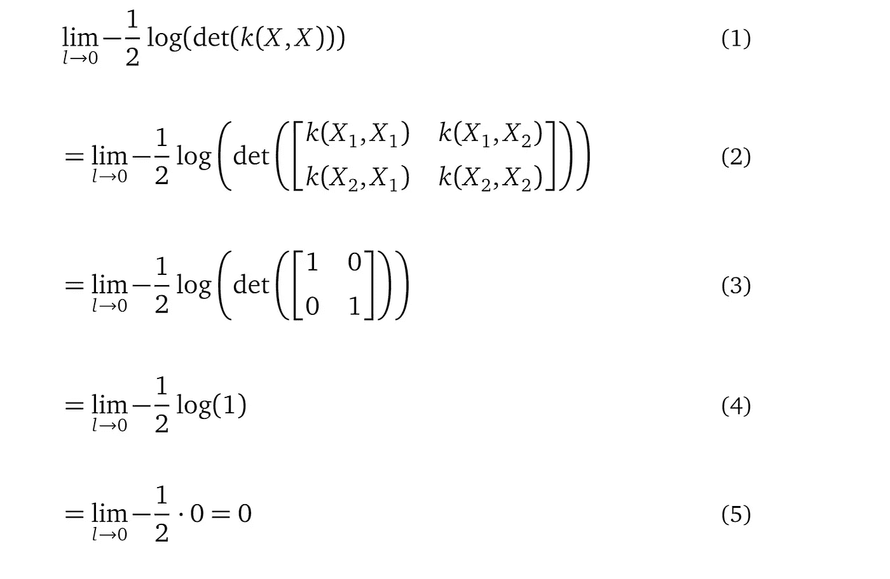*

*在第(3)行，方差项 *k(X₁，X₁)* 和 *k(X₂，X₂)* 评估为 1。并且当 *l* 接近 0 时，协方差项 *k(X₁，X₂)* 和 *k(X₂，X₁)* 评估为 0。于是 *k(X，X)* 就变成了一个单位矩阵。*

*在第(4)行，单位矩阵的行列式的值为 1。*

*在第(5)行，log(1)的计算结果为 0。*

*所以当 lengthscale *l* 趋近于 0 时，模型复杂度项趋近于 0。*

*当长度标尺 *l* 接近 *∞* 时，模型复杂度项变为:*

*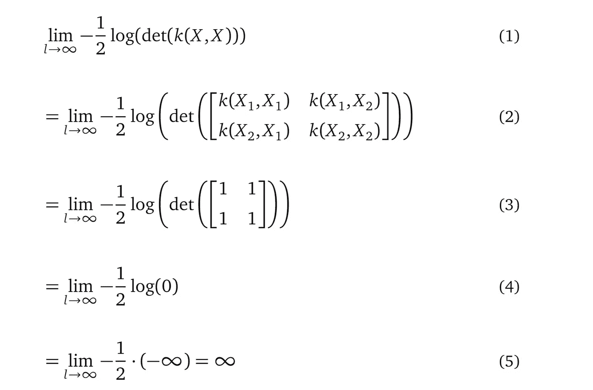*

*在第(3)行，当 *l* 接近 *∞* 时，协方差项 *k(X₁，X₂)* 和 *k(X₂，X₁)* 评估为 1。于是 *k(X，X)* 就变成了全 1 的方阵。*

*在第(4)行，全 1 矩阵的行列式计算结果为 0。*

*在第(5)行，log (0)的计算结果为- *∞。**

*因此，当长度尺度 *l* 接近 *∞时，模型复杂度项评估为∞。**

*这种变化的直觉从行列式运算符的意义上是很清楚的。矩阵的行列式度量矩阵的列向量所包围的空间的体积。例如，如果一个矩阵有三列*【a b c】*，那么它的行列式就是由 *a* 、 *b* 和 *c、*围成的体积，如下图所示(图片改编自[此处](https://www.quora.com/What-does-the-determinant-of-a-matrix-mean-physically-How-do-I-visualize-it)):*

*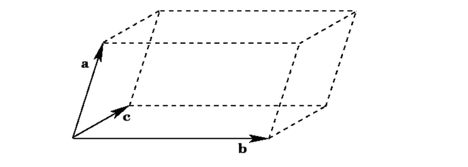*

*所以在我们的协方差矩阵 *k(X，X)* 的情况下:*

1.  *当 lengthscale 为 0 时，矩阵 *k(X，X)* 是单位矩阵。单位矩阵中的列向量相互垂直。所以它们围成的空间体积是最大的，1。*
2.  *当 lengthscale 趋近于∞， *k(X，X)* 越来越变成全 1 的矩阵，所以所有列都是 1 列。这些柱子指向同一个方向。所以它们围成的空间体积最小，为 0。*

*现在我们可以看到，模型复杂性项确实给了我们一个很好的模型复杂性度量。当模型很复杂时，模型复杂性项的计算结果是一个很小的值 0。当模型简单时，该项评估为大值 *∞* 。因为我们希望最大化目标函数，所以我们希望模型复杂性项更大。换句话说，这个术语表达了我们更喜欢简单模型的想法。*

***过拟合***

*现在我们有了模型复杂性的度量。我们暗示过，不必要的复杂模型是不好的。但是为什么呢？因为尽管在数据拟合术语的意义上，复杂模型可以很好地拟合训练数据，但是它没有能力对新的测试位置做出好的预测。这叫做过度拟合。下面是如何看到过度拟合的效果:*

1.  *正如我们已经从数据拟合项的分析中看到的，在数据拟合项评估其最大值的意义上，具有非常小的长度范围的复杂模型将为您提供最佳的数据拟合。*
2.  *但是，由于 lengthscale 非常小，因此对于任何两个不相等的位置，核函数的值都为 0。假设测试位置 *X_** 不同于训练位置 *X* ，那么 *f(X_*)* 中的随机变量将与 *f(X)* 中的随机变量零相关。*
3.  *正如我们在本文开头已经提到的，这意味着知道位置 *X* 处的值 *Y* 并不能给我们关于测试位置 *X_** 处的函数值应该如何的信息。换句话说，我们极其复杂的模型没有能力在测试位置做出预测，因为训练位置 *f(X)* 的随机变量独立于测试位置 *f(X_*)* 的随机变量。复杂的模型将无法推广到测试数据。这太合身了。*

*我们通过看后验均值和协方差来看看上面的分析在数学上是如何体现的。我们继续使用有两个训练数据点和一个测试点的设置。*

*当长度标度接近 0 时，后验均值为:*

*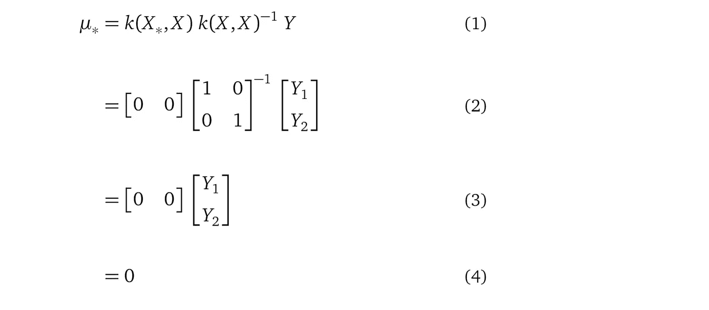*

*在第(2)行，由于 lengthscale 非常接近 0，所以当*x≠x′*时， *k(x，x′)*计算为 0。所以我们有几个 0 条目。*

*最后，后验平均值在第(4)行评估为 0。解释是:由于 *f(X_*)* 中的随机变量独立于 *f(X)* 中的随机变量，除了假设其均值为 0(在 GP 先验中定义)之外，模型不知道任何关于 *f(X_*)* 的信息。这就是模型给出 0 作为后验均值的原因。*

*现在，让我们看看后验协方差:*

*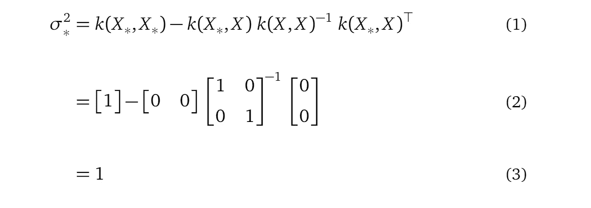*

*啊哈，在过度拟合的情况下，模型对其在测试位置的平均预测非常不确定，所以它报告了一个最大方差。*

*显然，我们不希望过度拟合。但是我们要不要用最简单的模型，长度接近 *∞* ？答案是否定的，因为那样我们就会有另一个问题——吃不饱。*

***欠配合***

*为了揭示欠拟合的问题，让我们用一个大的长度尺度比如说 *l* =100 来形成一个简单的模型。在这个设置中， *k(x，x’)*当*x≠x’*计算出一个非常接近 1 的值，比如说 0.999，而不管 *x* 和*x’*在哪里，因为内核的指数内部的分母占主导地位。让我们通过研究单个测试位置 *X_** 的后验均值和协方差，再次看看这个模型做出预测的能力。*

*后验均值是:*

*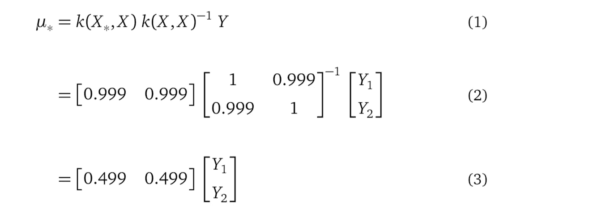*

*上述公式意味着无论 *X_** 在哪里，后验均值都等于训练观测值 *Y* 的等权和，这是一个常数。这种持续的预测显然是糟糕的。*

*最后，当纵向尺度较大时，我们来看看后验协方差:*

*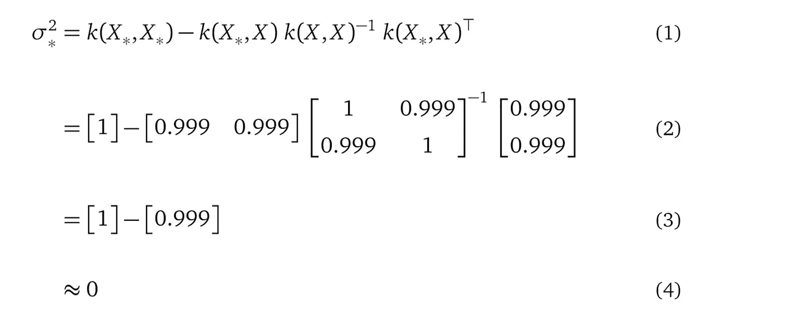*

*我们可以看到，当欠拟合时，模型对其预测非常有信心，不像过拟合时，模型非常不确定。*

*为什么在欠拟合的情况下，模型非常确定？这是因为 lengthscale 非常大，所以任意两个随机变量之间的协方差几乎为 1。这意味着根据我们的模型， *f(X)* 将包含关于 *f(X_*) — f(X_*)* 与 *f(X)* 百分之百协变的全部信息。一旦我们知道了 *f(X)* 的值，也就是我们的观测值 *Y* (既然我们假设没有观测噪声)，那么 *f(X_*)* 的值就没有变化的空间了。因此协方差为 0，这是绝对确定的。*

*正如您在过度拟合和欠拟合情况下所看到的，模型参数值的错误选择会导致模型无法很好地解释观察数据 *Y* 。好消息是，通过最大化关于模型参数的 *log(p(y))* ，我们可以找到避免欠拟合和过拟合的模型参数的合理的具体值。原因如下。*

## *战斗:数据拟合术语与模型复杂性术语*

*让我们在下表中总结一下数据拟合术语和模型复杂性术语的行为。*

*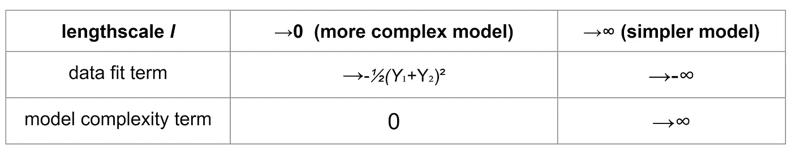*

*我们可以看到，随着 lengthscale *l* 从 0 增加到∞，数据拟合项和模型复杂性项以相反的方向变化——数据拟合项向负无穷大减少，而模型复杂性项向正无穷大增加。*

*这两项相互平衡，为我们提供了一个很好地适合训练数据，同时又不太复杂的模型。这种自动平衡的特性是可取的，因为我们不必设计单独的机制来控制模型的复杂性，例如线性回归中的 [R1 或 R2 正则化](/regularization-in-machine-learning-76441ddcf99a)。*

## *我们能平凡地解决参数学习吗？*

*答案是否定的。但让我们先试着理解这个问题。*

*看着上面的表格，一个有趣的问题可能会出现:因为我们想要最大化目标函数，而唯一有可能变得非常非常大的项是模型复杂性项 *- log(det(k(X，X)+η Iₙ))* 当长度标度接近无穷大时。为什么我们不简单地将长度比例设置为一个非常大的数字呢？当然，如果我们这样做，数据拟合项将减少，并驱动目标函数的整体值下降。哪一届会赢？*

*要回答这个问题，我们需要研究哪个项接近无穷大更快:是数据拟合项接近-∞更快还是模型复杂度项接近∞更快。我们用极限来研究它们的速度。我们继续使用有两个训练数据点 *(X₁，Y₁)* 和 *(X₂，Y₂)* 的设置，信号方差 *σ* 为 *1* 并且没有观测噪声，所以 *η Iₙ=0* 。*

*为了保持公式的单行性，我将引入符号 *r* (相关性的简称)来表示位置 *X₁* 和 *X₂.的内核值 *k(X₁，X₂)* 因为我们只有两个训练地点，我们只有一个 r**

**

*所以当 lengthscale *l* 趋近于无穷大时，也就是我们正在研究的情况， *r* 趋近于 1，因为指数函数的自变量趋近于 0。*

*新符号 *r* 就位后，模型复杂性项变为:*

**

*数据拟合项变为:*

*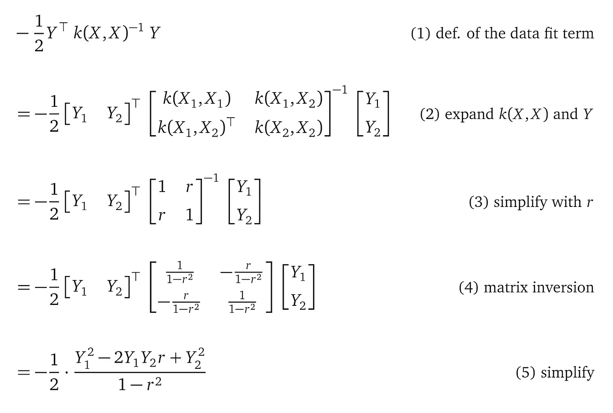*

*现在我们研究当长度比例 *l* 接近 *∞，*或者当 *r* 接近 1:*

*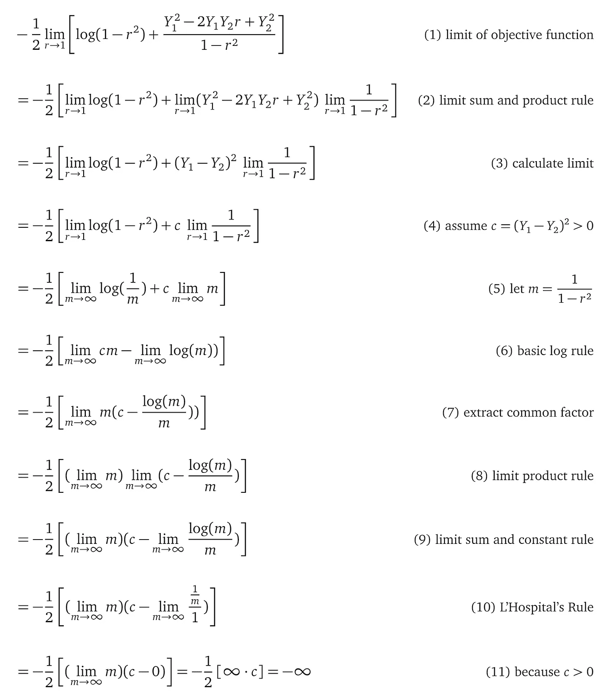*

*如第(4)行的解释所示，上述推导是针对 *Y₁ ≠Y₂* 的情况。在这种情况下，当长度标度接近∞，或者当相关性 *r* 接近 1 时，整个目标函数接近-∞。换句话说，即使模型复杂性项增加到∞，数据拟合项减少到-∞的速度更快。所以数据拟合项胜出。因此，我们不能轻易地将 lengthscale 设置为一个非常大的值，并宣布参数学习已经完成。*

*现在我们研究一下当 *Y₁ =Y₂:* 的情况*

*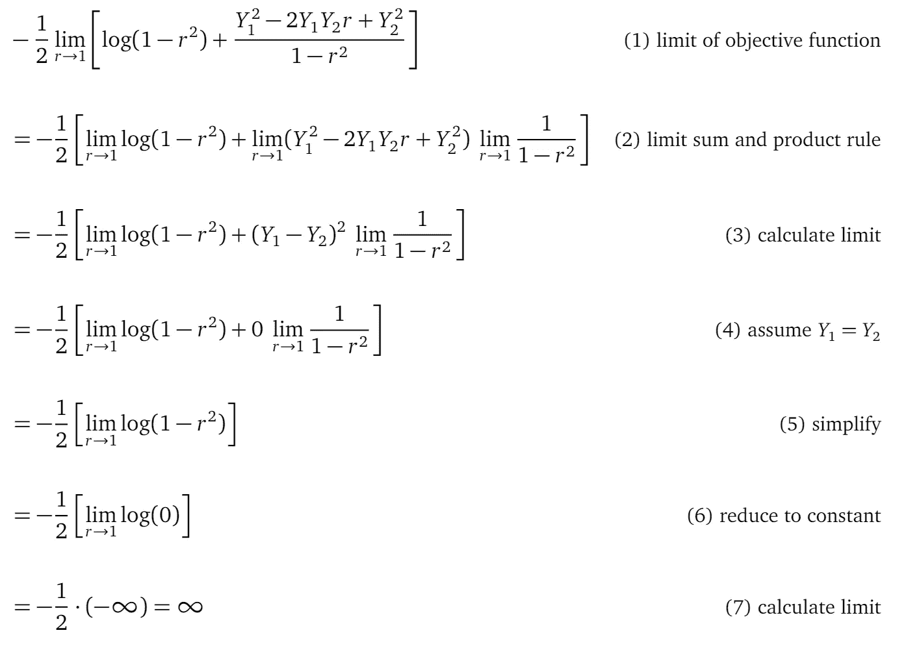*

*这个更简单。当 *Y* 中的所有观测值相等时，随着长度标度趋近于∞，或者相关度 r 趋近于 1，对象函数趋近于∞。所以在这种情况下，模型复杂度获胜。也就是说，在所有观测值都相同的异常情况下，我们可以通过选择非常大的长度尺度来轻松解决参数学习。*

*抛开输赢不谈，重要的是获得直觉，为什么在所有观测值 *Y* 相等的情况下，大的长度尺度更好。*

*直觉来自于测试位置的后验均值是所有训练观察值的加权和 *Y* 。在当前情况下，由于长度尺度较大，所有观测值 Y 与测试位置的函数值具有接近 1 的相关性。因为所有的观察值都是相等的，没有理由给任何一个特定的观察值比其他的观察值更大的权重，因为它们是相同的。所以模型给了他们同等的权重。相等的权重转化为大的长度标度，因此无论 *x* 和*x’*在哪里，k(x，x’)都计算为 1。*

*因为在大多数情况下，我们不能平凡地解决参数学习，让我们来解决它。*

## *寻找最佳模型参数值*

*为了找到最大化目标函数的长度尺度值，我以 0.01 为步长从 0 到 3 对其值进行了线搜索。我用[这个代码](https://github.com/jasonweiyi/understanding_gaussian_process/blob/master/optimize.py)通过线搜索进行参数学习。*

*下图绘制了 y 轴上的数据拟合项、模型复杂性项和目标函数的曲线，x 轴上具有不同的长度比例值。*

*随着长度尺度的增加，数据拟合项减少，这意味着我们得到了更差的数据拟合；模型复杂性增加了，这意味着我们得到了一个更简单的模型。这与我们上面的数学分析是一致的。*

*当 lengthscale *l=2.1* 时，目标函数有最大值。我用一个大红点突出了最大目标函数值。*

*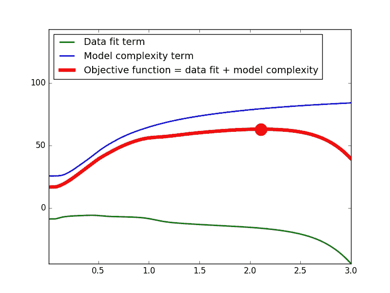*

*Data fit term, model complexity term and objective function curves*

*以下是最佳长度标度 *l=2.1* 的后验均值和方差:*

*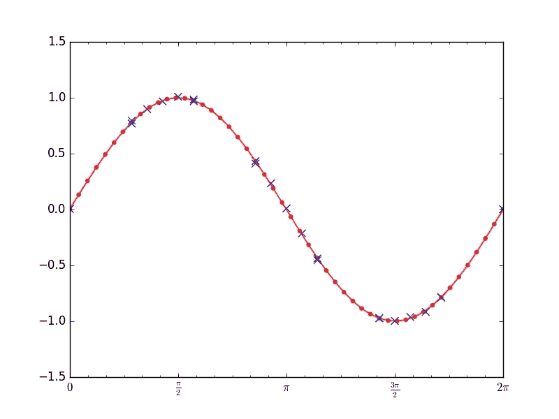*

*Posterior mean and variance with optimal lengthscale *l=2.1\.* Blue crosses are training points, red dots are testing points.*

*同样，蓝叉“x”是训练数据点，红点是测试数据点。我不得不说，这很像正弦波。而且 95%的置信区间很小，我们再也看不到了。*

## *梯度下降以优化目标*

*上面的网格搜索只是为了说明。在实践中，我们将使用梯度下降算法来寻找模型参数的最佳值。梯度下降的要求是目标函数相对于模型参数是可微的。这对我们的目标函数来说是正确的。我想指出的另一点是，我们的目标函数相对于模型参数不是凸的。梯度下降将找到局部最大值。*

*这样，我们就完成了参数学习。恭喜你！*

# *平方指数核的无能*

*让我们回顾一下我们最初的任务:我们想找到一个函数 *f:* ℝ ⟼ ℝ，它能很好地解释我们的训练数据。高斯过程模型的后验均值和方差确实给了我们这个函数。*

*但是，你可能想知道，函数 *f* 有域ℝ，但是我们只看了从 0 到 2π的域。“给我看 2π以上的预测”，你要求！这是从 0 到 6π的域:*

**

*Posterior mean and variance beyond 2π. Blue crosses are training points, red dots are testing points.*

*哇，我们可以看到，超过 2π，后验均值开始偏离“正确”值，从 4.5π左右的位置开始逐渐回落到 0。同时，后验方差开始增加，直到最终在位置 4.5π附近达到最大值。*

*预测质量的逐渐恶化是因为当我们到达 4.5π附近的位置时，训练位置和测试位置的随机变量之间的相关性基本上为 0。所以模型只能报告后验均值为均值 0。此外，代表不确定性水平的后验方差达到最大值。*

*你可能会抱怨，经过这么多的工作，我们还没有找到正弦波的正确回归函数。这是因为正弦是一个周期函数。正弦函数中的两个点相互关联的程度不仅取决于它们相距多远，还取决于它们是否出现在一个周期的同一位置。我们选择的核函数是平方指数核，不能模拟这种周期性效应。*

*在高斯过程中，除了平方指数核，还有许多其他核，其中一些模拟周期函数。您也可以通过将两个内核相加或相乘来形成新的内核。我将提供另一篇关于内核的文章。目前，理解已经为我们定义了不同的内核就足够了。不同的内核模拟不同种类的函数。而选择核函数是使用高斯过程中最重要的任务。*

# *结论*

*本文介绍了如何使用高斯过程来执行回归任务。它涵盖了高斯过程回归模型，如何使用后验均值和方差进行预测，以及如何进行参数学习。*

*本文仅涵盖了在进入更高级的主题之前需要掌握的最基本的知识。正如我在本文开头所说的，要在实际的应用程序设置中使用高斯过程，您可能需要另外两种技术:*

*   *[变分高斯过程——非高斯情况下该怎么办](/variational-gaussian-process-what-to-do-when-things-are-not-gaussian-41197039f3d4)引入变分推断，允许我们在高斯过程模型中使用非高斯可能性。*
*   *[稀疏和变化的高斯过程—当数据很大时该怎么办](/sparse-and-variational-gaussian-process-what-to-do-when-data-is-large-2d3959f430e7)引入了诱导变量，使我们能够将高斯过程模型扩展到大型数据集。*

*当然，高斯过程场包括更多。将来，我将为那些高级主题提供其他文章。*

# *请支持我*

*如果你喜欢我的故事，如果你考虑支持我，通过这个链接成为灵媒会员，我将不胜感激:【https://jasonweiyi.medium.com/membership。*

*我会继续写这些故事。*

# *感谢*

*我要感谢我的许多 Prowler.io 同事，他们帮助我撰写了这篇文章。特别是 [Nicolas Durrande](https://sites.google.com/site/nicolasdurrandehomepage/) 、 [Stefanos Eleftheriadis](https://www.linkedin.com/in/seleftheriadis/) 、 [Vincent Adam](https://www.linkedin.com/in/vincent-adam-5a195810/) 、 [Vincent Dutordoir](https://www.linkedin.com/in/vdutor/) 、 [ST John](https://www.linkedin.com/in/st-john-9a5379139/) 的想法和灵感，以及他们坐下来与我一起完成许多公式推导的好意。我还要感谢 [Sherif Akoush](https://www.linkedin.com/in/sherif-akoush-18855634/?originalSubdomain=uk) 和 [Andrew Liubinas](https://www.linkedin.com/in/andrewliubinas/?originalSubdomain=uk) 对本文的反馈。*