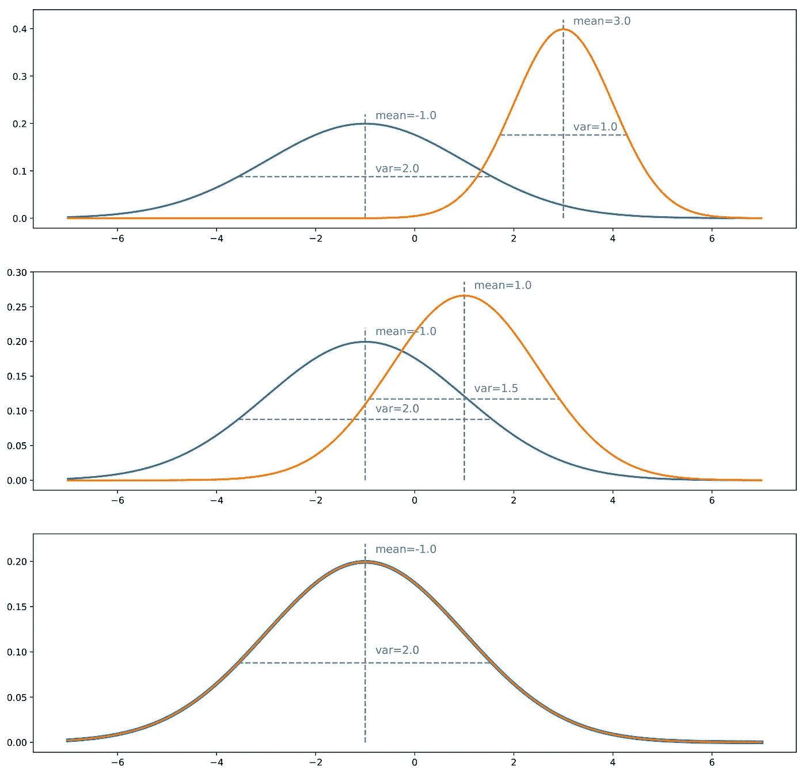

# 理解生成敌对网络(GANs)

> 原文：<https://towardsdatascience.com/understanding-generative-adversarial-networks-gans-cd6e4651a29?source=collection_archive---------0----------------------->

## 一步一步地建立导致 GANs 的推理。

Credit: [Devanath](https://pixabay.com/fr/users/devanath-1785462/) on [Pixabay](https://pixabay.com/)

*本帖与* [*巴蒂斯特·罗卡*](https://medium.com/u/20ad1309823a?source=post_page-----cd6e4651a29--------------------------------) *共同撰写。*

# 介绍

Yann LeCun 将其描述为“最近 10 年机器学习中最有趣的想法”。当然，来自深度学习领域如此杰出的研究人员的这种称赞对于我们正在谈论的主题来说总是一个很好的广告！事实上，自 2014 年 Ian J. Goodfellow 和合著者在文章[Generative Adversarial Nets](https://arxiv.org/abs/1406.2661)中提出以来，生成对抗网络(简称 GANs)取得了巨大的成功。

那么什么是生成性对抗网络呢？是什么让他们如此“有趣”？在这篇文章中，我们将看到对抗性训练是一个启发性的想法，简单而美丽，代表了机器学习，尤其是生成模型的真正概念进步(就像反向传播是一个简单但非常聪明的技巧，它使神经网络的基础思想变得如此流行和有效)。

在进入细节之前，让我们先快速概述一下 gan 的用途。生成对抗网络属于生成模型集。这意味着他们能够生产/产生(我们将看到如何)新的内容。为了说明“生成模型”的概念，我们可以看看一些众所周知的用 GANs 得到的结果的例子。

Illustration of GANs abilities by Ian Goodfellow and co-authors. These are samples generated by Generative Adversarial Networks after training on two datasets: MNIST and TFD. For both, the rightmost column contains true data that are the nearest from the direct neighboring generated samples. This shows us that the produced data are really generated and not only memorised by the network. (source: “Generative Adversarial Nets” paper)

自然，这种生成新内容的能力让 GANs 看起来有点“神奇”，至少乍一看是这样。在接下来的部分中，我们将克服 GANs 的明显魔力，以便深入这些模型背后的思想、数学和建模。我们不仅将讨论生成性对抗网络所依赖的基本概念，而且，我们将一步一步地从最开始开始建立导致这些概念的推理。

事不宜迟，我们一起重新发现甘氏吧！

> **注意**:虽然我们试图让这篇文章尽可能的自成一体，但是仍然需要一个机器学习的基础先验知识。然而，大部分的概念将会在需要的时候被保留，一些参考文献将会以其他方式给出。我们真的尽力让这篇文章读起来尽可能流畅。请不要犹豫，在评论栏中说出你想了解更多的内容(可能会有更多关于这个主题的文章)。

## 概述

在接下来的第一节中，我们将讨论从给定的分布中生成随机变量的过程。然后，在第 2 节中，我们将通过一个例子说明 GANs 试图解决的问题可以表示为随机变量生成问题。在第 3 节中，我们将讨论基于匹配的生成网络，并展示它们如何回答第 2 节中描述的问题。最后，在第 4 节，我们将介绍甘斯。更具体地说，我们将介绍具有损失函数的一般架构，并将与前面所有部分联系起来。

*   *本文已使用以下备忘单完成:*

[https://drive . Google . com/drive/folders/1 lhtjhq 8k 7 aemrqanymylrrwzp 6 bsqqgrb](https://drive.google.com/drive/folders/1lHtjHQ8K7aemRQAnYMylrrwZp6Bsqqrb)

*   *本文已部分用以下短视频说明:*

# 生成随机变量

在本节中，我们讨论生成随机变量的过程:我们提醒一些现有的方法，尤其是允许从简单均匀随机变量生成复杂随机变量的逆变换方法。尽管这一切似乎有点远离我们的主题，GANs，我们将在下一节看到与生成模型的深层联系。

## 均匀随机变量可以伪随机产生

计算机从根本上来说是决定性的。所以，理论上，不可能产生真正随机的数字(即使我们可以说“什么是随机？”是一个难点)。然而，可以定义算法来生成其性质非常接近理论随机数序列的性质的数字序列。特别地，计算机能够使用伪随机数发生器来生成近似遵循 0 和 1 之间的均匀随机分布的数字序列。统一情况是一个非常简单的情况，在此基础上可以用不同的方式建立更复杂的随机变量。

## 用运算或过程的结果表示的随机变量

存在不同的技术，旨在产生更复杂的随机变量。其中我们可以找到例如逆变换方法、拒绝采样、Metropolis-Hasting 算法等。所有这些方法都依赖于不同的数学技巧，主要在于将我们想要生成的随机变量表示为一个操作(对更简单的随机变量)或一个过程的结果。

[拒绝采样](https://en.wikipedia.org/wiki/Rejection_sampling)将随机变量表示为一个过程的结果，该过程不是从复杂分布中采样，而是从众所周知的简单分布中采样，并根据某些条件接受或拒绝采样值。重复这个过程，直到采样值被接受，我们可以表明，在正确的接受条件下，将被有效采样的值将遵循正确的分布。

在 [Metropolis-Hasting 算法](https://en.wikipedia.org/wiki/Metropolis–Hastings_algorithm)中，想法是找到一个马尔可夫链(MC ),使得这个 MC 的平稳分布对应于我们想要从中采样我们的随机变量的分布。一旦找到这个 MC，我们可以在这个 MC 上模拟足够长的轨迹，以认为我们已经达到稳定状态，然后我们以这种方式获得的最后值可以被认为是从感兴趣的分布中提取的。

我们不会进一步深入拒绝抽样和 Metropolis-Hasting 的细节，因为这些方法不会将我们引向 GANs 背后的概念(尽管如此，感兴趣的读者可以参考指向的维基百科文章和其中的链接)。然而，让我们更关注逆变换方法。

## 逆变换方法

逆变换方法的思想是简单地表示我们的复数——在本文中,“复数”应该总是从“不简单”的意义上理解，而不是从数学的意义上理解——随机变量是函数应用于我们知道如何生成的均匀随机变量的结果。

我们考虑下面的一维例子。设 X 是一个我们想要采样的复杂随机变量，U 是一个我们知道如何采样的在[0，1]上的均匀随机变量。我们提醒一个随机变量完全由它的[累积分布函数](https://en.wikipedia.org/wiki/Cumulative_distribution_function) (CDF)定义。随机变量的 CDF 是从随机变量的定义域到区间[0，1]的函数，并且在一维中定义为

在均匀随机变量 U 的特殊情况下，我们有

为简单起见，这里我们假设函数 CDF_X 是可逆的，它的逆表示为

(通过使用函数的广义逆，该方法可以很容易地扩展到不可逆的情况，但这确实不是我们在这里想要关注的要点)。那么如果我们定义

我们有

我们可以看到，Y 和 X 有相同的 CDF，然后定义了相同的随机变量。因此，通过如上定义 Y(作为均匀随机变量的函数),我们已经设法定义了具有目标分布的随机变量。

综上所述，逆变换法是一种通过使一个均匀的随机变量经过一个设计良好的“变换函数”(逆 CDF)，生成一个遵循给定分布的随机变量的方法。这种“逆变换方法”的概念实际上可以扩展到“变换方法”的概念，更一般地说，它包括产生作为一些更简单的随机变量的函数的随机变量(不一定是均匀的，然后变换函数不再是逆 CDF)。从概念上讲,“变换函数”的目的是使初始概率分布变形/整形:变换函数从初始分布与目标分布相比太高的地方开始，并将其放在太低的地方。

Illustration of the inverse transform method. In blue: the uniform distribution over [0,1]. In orange: the the standard gaussian distribution. In grey: the mapping from the uniform to the gaussian distribution (inverse CDF).

# 生成模型

## 我们试图生成非常复杂的随机变量…

假设我们对生成大小为 n 乘 n 像素的狗的黑白正方形图像感兴趣。我们可以将每个数据重新整形为 N=nxn 维向量(通过将列堆叠在彼此的顶部),这样狗的图像就可以用向量来表示。然而，这并不意味着所有的向量都代表一只曾经被整形回正方形的狗！因此，我们可以说，有效地给出看起来像狗的东西的 N 维向量根据非常特定的概率分布分布在整个 N 维向量空间上(该空间的一些点很可能代表狗，而对于其他一些点则极不可能)。本着同样的精神，在这个 N 维向量空间上，存在猫、鸟等图像的概率分布。

然后，生成狗的新图像的问题等价于在 N 维向量空间上生成遵循“狗概率分布”的新向量的问题。所以我们实际上面临着一个问题，关于一个特定的概率分布，产生一个随机变量。

在这一点上，我们可以提到两件重要的事情。首先，我们提到的“狗概率分布”是一个非常大的空间上的非常复杂的分布。第二，即使我们可以假设这种潜在分布的存在(实际上存在看起来像狗的图像和其他不像狗的图像)，我们显然不知道如何明确地表达这种分布。前面两点使得从这个分布中产生随机变量的过程相当困难。接下来让我们试着解决这两个问题。

## …因此，让我们使用以神经网络为功能的变换方法！

当试图生成我们的狗的新图像时，我们的第一个问题是 N 维向量空间上的“狗概率分布”是非常复杂的，并且我们不知道如何直接生成复杂的随机变量。然而，由于我们非常清楚如何生成 N 个不相关的均匀随机变量，我们可以利用变换方法。为此，我们需要将 N 维随机变量表示为一个非常复杂的函数应用于一个简单的 N 维随机变量的结果！

在这里，我们可以强调这样一个事实，即寻找变换函数并不像我们在描述逆变换方法时所做的那样，仅仅取累积分布函数的封闭形式的逆(我们显然不知道)。转换函数无法显式表达，因此，我们必须从数据中学习。

在大多数情况下，非常复杂的函数自然意味着神经网络建模。然后，想法是通过神经网络来模拟变换函数，该神经网络将简单的 N 维均匀随机变量作为输入，并且返回另一个 N 维随机变量作为输出，该另一个 N 维随机变量在训练之后应该遵循正确的“dog 概率分布”。一旦设计了网络的架构，我们仍然需要训练它。在接下来的两节中，我们将讨论两种训练这些生成网络的方法，包括 GANs 背后的对抗性训练思想！

Illustration of the notion of generative models using neural networks. Obviously, the dimensionality we are really talking about are much higher than represented here.

# 生成匹配网络

> **免责声明**:生成匹配网络的命名并不标准。然而，我们可以在文献中找到，例如，“生成矩匹配网络”或“生成特征匹配网络”。我们只是想在这里用一个稍微更通用的命名来描述下面的内容。

## 训练生成模型

到目前为止，我们已经表明，生成狗的新图像的问题可以被重新表述为在 N 维向量空间中生成遵循“狗概率分布”的随机向量的问题，并且我们已经建议使用变换方法，用神经网络来模拟变换函数。

现在，我们仍然需要训练(优化)网络来表达正确的变换函数。为此，我们可以建议两种不同的训练方法:直接训练法和间接训练法。直接训练方法包括比较真实的和生成的概率分布，并通过网络反向传播差异(误差)。这是支配生成匹配网络(GMNs)的思想。对于间接训练方法，我们不直接比较真实分布和生成分布。相反，我们通过使这两个分布通过选择的下游任务来训练生成网络，使得生成网络相对于下游任务的优化过程将强制生成的分布接近真实分布。这最后一个想法是我们将在下一节介绍的生成对抗网络(GANs)背后的一个想法。但是现在，让我们从直接方法和 GMNs 开始。

## 基于样本比较两种概率分布

如上所述，GMNs 的思想是通过直接比较生成的分布和真实的分布来训练生成网络。然而，我们不知道如何明确地表达真正的“狗概率分布”,我们也可以说生成的分布太复杂而不能明确地表达。因此，基于显式表达式的比较是不可能的。然而，如果我们有一种基于样本比较概率分布的方法，我们可以用它来训练网络。事实上，我们有真实数据的样本，并且我们可以在训练过程的每次迭代中产生生成数据的样本。

虽然在理论上，可以使用任何能够有效地比较基于样本的两个分布的距离(或相似性度量),但是我们可以特别提到最大平均差异(MMD)方法。MMD 定义了两个概率分布之间的距离，可以基于这些分布的样本来计算(估计)该距离。虽然这并没有完全超出本文的范围，但是我们决定不花太多时间来描述 MMD。然而，我们的项目将很快发表一篇文章，其中将包含更多的细节。现在想更多了解 MMD 的读者可以参考这些幻灯片、[这篇文章](http://www.gatsby.ucl.ac.uk/~gretton/papers/GreBorRasSchSmo07.pdf)或[这篇文章](http://www.jmlr.org/papers/volume13/gretton12a/gretton12a.pdf)。

## 分布匹配误差的反向传播

因此，一旦我们定义了基于样本比较两个分布的方法，我们就可以定义 GMNs 中生成网络的训练过程。给定一个均匀概率分布的随机变量作为输入，我们希望生成的输出的概率分布是“狗概率分布”。GMNs 的想法是通过重复以下步骤来优化网络:

*   生成一些统一的输入
*   让这些输入通过网络并收集生成的输出
*   比较真实的“狗概率分布”和基于可用样本生成的“狗概率分布”(例如，计算真实狗图像样本和生成图像样本之间的 MMD 距离)
*   使用反向传播进行一步梯度下降，以降低真实分布和生成分布之间的距离(例如 MMD)

如上所述，当遵循这些步骤时，我们在网络上应用梯度下降，损失函数是当前迭代中真实分布和生成分布之间的距离。

Generative Matching Networks take simple random inputs, generate new data, directly compare the distribution of the generated data to the distribution of the true data and backpropagate the matching error to train the network.

# 生成对抗网络

## “间接”训练法

当训练生成网络时，上面提出的“直接”方法直接比较生成的分布和真实的分布。支配 GANs 的绝妙想法在于用一种间接的比较来代替这种直接的比较，这种间接的比较采取对这两个发行版的下游任务的形式。然后，关于该任务完成生成网络的训练，使得它迫使生成的分布越来越接近真实分布。

GANs 的下游任务是区分真实样本和生成样本。或者我们可以说是“非歧视”任务，因为我们希望歧视尽可能地失败。因此，在 GAN 架构中，我们有一个鉴别器，它采集真实数据和生成数据的样本，并尝试尽可能好地对它们进行分类，还有一个发生器，它被训练成尽可能欺骗鉴别器。让我们看一个简单的例子，为什么我们提到的直接和间接方法在理论上应该导致相同的最优生成器。

## 理想情况:完美的发生器和鉴别器

为了更好地理解为什么训练生成器来欺骗鉴别器会导致与直接训练生成器来匹配目标分布相同的结果，让我们举一个简单的一维例子。我们暂时忘记了生成器和鉴别器是如何表示的，并将它们视为抽象概念(将在下一小节中详细说明)。此外，在不受任何(参数化)模型约束的意义上，两者都被认为是“完美的”(具有无限的容量)。

假设我们有一个真实的分布，例如一维高斯分布，并且我们想要一个从这个概率分布中采样的生成器。我们所谓的“直接”训练方法包括反复调整生成器(梯度下降迭代),以校正真实分布和生成分布之间的测量差异/误差。最后，假设优化过程是完美的，我们应该最终得到与真实分布完全匹配的分布。

Illustration of the concept of direct matching method. The distribution in blue is the true one while the generated distribution is depicted in orange. Iteration by iteration, we compare the two distributions and adjust the networks weights through gradient descent steps. Here the comparison is done over the mean and the variance (similar to a truncated moments matching method). Notice that (obviously) this example is so simple that it doesn’t require an iterative approach: the purpose is only to illustrate the intuition given above.

对于“间接”方法，我们还必须考虑一个鉴别器。我们现在假设这个鉴别器是一种 oracle，它确切地知道什么是真实的和生成的分布，并且能够基于这个信息来预测任何给定点的类(“真实的”或“生成的”)。如果这两种分布相差很远，鉴别者就能很容易地对我们提供给它的大多数点进行分类，并有很高的可信度。如果我们想欺骗鉴别器，我们必须使生成的分布接近真实的分布。当两个分布在所有点上都相等时，鉴别器将很难预测该类:在这种情况下，对于每个点来说，它“为真”或“生成”的机会是相等的，那么平均来说，鉴别器不会比在两个情况中的一个情况下为真做得更好。

Intuition for the adversarial method. The blue distribution is the true one, the orange is the generated one. In grey, with corresponding y-axis on the right, we displayed the probability to be true for the discriminator if it chooses the class with the higher density in each point (assuming “true” and “generated” data are in equal proportions). The closer the two distributions are, the more often the discriminator is wrong. When training, the goal is to “move the green area” (generated distribution is too high) towards the red area (generated distribution is too low).

在这一点上，怀疑这种间接的方法是否真的是一个好主意似乎是合理的。事实上，它似乎更复杂(我们必须基于下游任务而不是直接基于分布来优化生成器)，并且它需要一个鉴别器，我们在这里将其视为给定的预言，但实际上，它既不已知也不完美。对于第一点，基于样本直接比较两个概率分布的困难抵消了间接方法明显更高的复杂性。对于第二点，很明显鉴别器是未知的。不过，是可以学的！

## 近似:对抗性神经网络

现在让我们描述一下 GANs 架构中的生成器和鉴别器的具体形式。生成器是一个模拟转换函数的神经网络。它接受一个简单的随机变量作为输入，并且一旦被训练，必须返回一个遵循目标分布的随机变量。由于它非常复杂和未知，我们决定用另一个神经网络来建模鉴别器。这个神经网络模拟了一个判别函数。它将一个点(在我们的狗的例子中是一个 N 维向量)作为输入，并将这个点成为“真实”点的概率作为输出返回。

请注意，我们现在采用参数化模型来表示发生器和鉴别器(而不是上一小节中的理想化版本)的事实实际上对上面给出的理论论证/直觉没有很大影响:我们只是在一些参数化空间中工作，而不是在理想的全空间中工作，因此，我们在理想情况下应该达到的最佳点可以被参数化模型的精确能力视为“四舍五入”。

一旦被定义，这两个网络就可以以相反的目标被联合(同时)训练:

*   生成器的目标是欺骗鉴别器，因此生成神经网络被训练成最大化最终分类误差(真实数据和生成数据之间)
*   鉴别器的目标是检测虚假生成的数据，因此训练鉴别神经网络以最小化最终分类误差

因此，在训练过程的每次迭代中，生成网络的权重被更新以便增加分类误差(在生成器参数上的误差梯度上升)，而鉴别网络的权重被更新以便减少该误差(在鉴别器参数上的误差梯度下降)。

Generative Adversarial Networks representation. The generator takes simple random variables as inputs and generate new data. The discriminator takes “true” and “generated” data and try to discriminate them, building a classifier. The goal of the generator is to fool the discriminator (increase the classification error by mixing up as much as possible generated data with true data) and the goal of the discriminator is to distinguish between true and generated data.

这些相反的目标和两个网络的对抗性训练的隐含概念解释了“对抗性网络”的名称:两个网络都试图击败对方，这样做，它们都变得越来越好。它们之间的竞争使得这两个网络相对于它们各自的目标“进步”。从博弈论的角度来看，我们可以将这种设置视为一种 minimax 两人游戏，其中平衡状态对应于生成器从精确的目标分布中产生数据的情况，以及鉴别器对其接收的任何点以概率 1/2 预测“真”或“生成”的情况。

# 关于 GANs 的数学细节

> **注意**:本节更具技术性，对于全面理解 GANs 并非绝对必要。所以，现在不想读数学的读者可以暂时跳过这一部分。对于其他人，让我们看看上面给出的直觉是如何数学形式化的。
> 
> **免责声明**:以下等式不是伊恩·古德菲勒文章中的等式。我们在这里提出另一种数学形式有两个原因:第一，更接近上面给出的直觉，第二，因为原始论文的方程已经非常清楚，仅仅重写它们是没有用的。还要注意，我们绝对不考虑与不同的可能损失函数相关的实际问题(消失梯度或其他)。我们强烈鼓励读者也看看原始论文的方程:主要的区别是 Ian Goodfellow 和合著者用交叉熵误差而不是绝对误差工作(正如我们下面所做的)。此外，在下文中，我们假设一个生成器和一个具有无限容量的鉴别器。

神经网络建模本质上需要定义两件事:一个架构和一个损失函数。我们已经描述了生成敌对网络的架构。它由两个网络组成:

*   生成网络 G(.)获取密度为 p_z 的随机输入 z，并返回应遵循(训练后)目标概率分布的输出 x_g = G(z)
*   有区别的网络 D(。)获取输入 x，该输入可以是“真”输入(x_t，其密度表示为 p_t)或“生成”输入(x_g，其密度 p_g 是由穿过 G 的密度 p_z 引起的密度),并返回 x 为“真”数据的概率 D(x)

现在让我们仔细看看 GANs 的“理论”损失函数。如果我们以相同的比例向鉴别器发送“真实”和“生成”数据，那么鉴别器的预期绝对误差可以表示为

生成器的目标是欺骗鉴别器，鉴别器的目标是能够区分真实数据和生成的数据。因此，在训练发生器时，我们希望最大化这一误差，同时尽量减小鉴频器的误差。它给了我们

对于任何给定的生成器 G(以及诱导概率密度 p_g ),最好的可能鉴别器是最小化

为了最小化(相对于 D)这个积分，我们可以最小化 x 的每个值的积分内部的函数。然后，它定义了给定生成器的最佳可能鉴别器

(事实上，这是最好的方法之一，因为 x 值 p_t(x)=p_g(x)可以用另一种方法处理，但这与后面的内容无关)。然后我们搜索最大化的 G

同样，为了最大化(相对于 G)这个积分，我们可以最大化 x 的每个值的积分内部的函数。由于密度 p_t 独立于生成元 G，我们不能做得比设置 G 更好，使得

当然，由于 p_g 是一个概率密度，应该积分为 1，我们必须有最好的 G

因此，我们已经表明，在具有无限容量的发生器和鉴别器的理想情况下，对立设置的最佳点是这样的，即发生器产生与真实密度相同的密度，并且鉴别器在两种情况中的一种情况下不会比真实情况更好，正如直觉告诉我们的那样。最后，还要注意 G 最大化

在这种形式下，我们更好地看到 G 想要最大化鉴别器出错的期望概率。

# 外卖食品

这篇文章的主要观点是:

*   计算机基本上可以生成简单的伪随机变量(例如，它们可以生成非常接近均匀分布的变量)
*   存在不同的方法来生成更复杂的随机变量，包括“变换方法”的概念，其在于将随机变量表示为一些更简单的随机变量的函数
*   在机器学习中，生成模型试图从给定的(复杂的)概率分布中生成数据
*   深度学习生成模型被建模为神经网络(非常复杂的函数)，其将简单的随机变量作为输入，并返回遵循目标分布的随机变量(“变换方法”之类)
*   这些生成网络可以“直接”训练(通过将生成数据的分布与真实分布进行比较):这就是生成匹配网络的思想
*   这些生成网络也可以被“间接”训练(通过试图欺骗另一个同时被训练的网络来区分“生成的”数据和“真实的”数据):这就是生成对抗网络的思想

即使围绕甘斯的“炒作”可能有点夸张，我们可以说伊恩·古德菲勒和他的合著者提出的对抗性训练的想法确实是一个伟大的想法。这种扭曲损失函数从直接比较到间接比较的方式对于深度学习领域的进一步工作来说是非常鼓舞人心的。最后，假设我们不知道 GANs 的想法是否真的是“过去 10 年机器学习中最有趣的想法”…但很明显，它至少是最有趣的想法之一！

感谢阅读！

> **注**:我们强烈建议感兴趣的读者阅读最初的论文“对抗性神经网络”，这确实是一篇科学论文的清晰模型，并观看关于 Ali Ghodsi 的 GANs 的讲座视频，他确实是一位了不起的讲师/教师。额外的解释可以在 Ian Goodfellow 写的关于 GANs 的教程中找到。

与[巴蒂斯特·罗卡](https://medium.com/u/20ad1309823a?source=post_page-----cd6e4651a29--------------------------------)一起写的其他文章:

 [## 机器学习中不平衡数据集的处理

### 面对不平衡的班级问题，应该做什么，不应该做什么？

towardsdatascience.com](/handling-imbalanced-datasets-in-machine-learning-7a0e84220f28)  [## 整体方法:装袋、助推和堆叠

### 理解集成学习的关键概念。

towardsdatascience.com](/ensemble-methods-bagging-boosting-and-stacking-c9214a10a205)