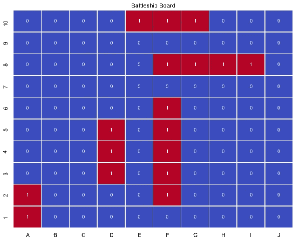
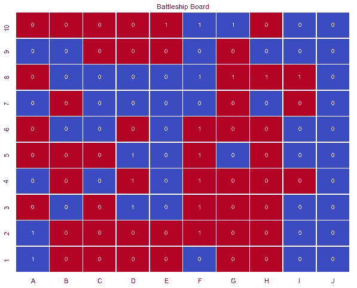
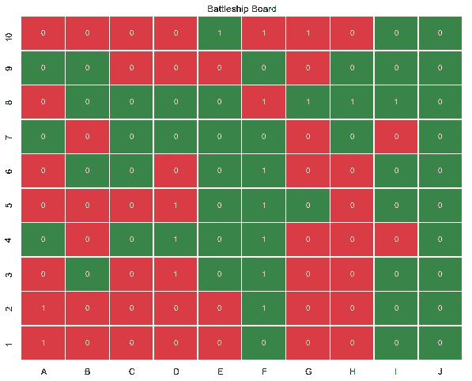
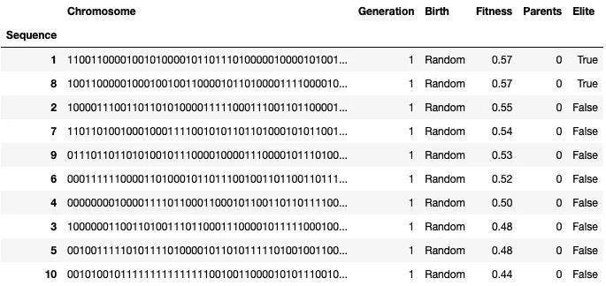
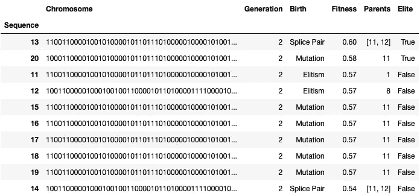
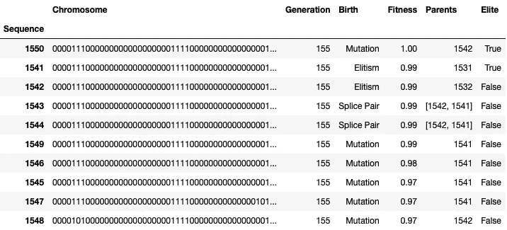
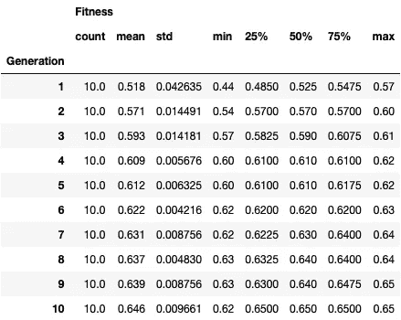
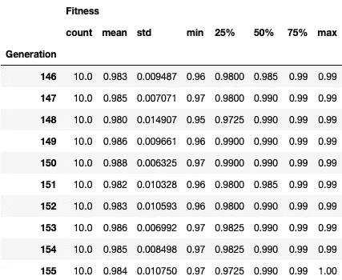
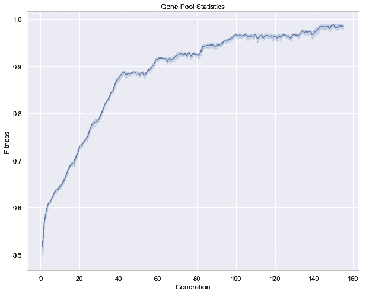
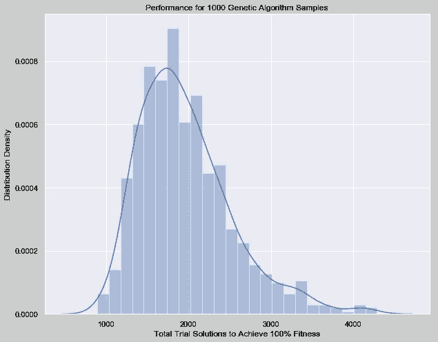

# 理解遗传算法

> 原文：<https://towardsdatascience.com/understanding-genetic-algorithms-cd556e9089cb?source=collection_archive---------15----------------------->

## 数据结构和算法

## 作为优化问题求解战舰棋盘游戏

The USS Intrepid in New York City. Photo: Author

一种*遗传算法*是技术模仿自然解决复杂问题的一个主要例子，在这种情况下，通过在一种*进化算法*中采用*自然选择*的概念。霍兰德在 1960 年引入的遗传算法扩展了艾伦·图灵的“学习机器”概念，最适合解决最优化问题，例如旅行推销员问题。

为了直观地理解采用遗传算法的实际实现和基本要求，我们可以设置一个玩具问题并解决经典猜谜游戏*的棋盘，该游戏由 Milton Bradley 于 1967 年首次发布。但是，让我们让我们的遗传算法对*整个棋盘*进行一系列猜测，而不是调用一系列单独的击球。*

# 设置董事会

遗传算法可以应用于那些解决方案可以用遗传表示法来表达的问题，遗传表示法就是简单的 1 和 0 的数组。每个二元元素被称为一个*基因*，而多个基因的阵列被称为一个*染色体*。给定问题的最佳解决方案是导致性能指标的最佳*适合度*分数的染色体。

一个*战列舰*棋盘由一个 10×10 的格子组成，我们可以在上面随意放置五艘不同长度的战舰。我们的舰队包括一艘航空母舰(5)，一艘战列舰(4)，一艘巡洋舰(3)，一艘潜艇(3)和一艘驱逐舰(2)。我们可以用二进制表示法来表达棋盘，只需将被我们的船占据的方格表示为 1，将未被占据的方格表示为 0。

我们可以通过几个简单的步骤随机定位我们的每艘船:

1.  用随机二维元组定位船首。
2.  用一个随机的基本方向来确定船的航向。
3.  根据船首的位置、方向和长度来定位船的尾部。
4.  检查船的尾部是否保持在棋盘的边界内。
5.  检查该船没有与任何先前定位的船重叠。
6.  如果船没有通过两个断言测试中的任何一个，重复这个过程。

Python functions to generate a random Battleship board and evaluate candidate fitness. Source: Author⁴

这就产生了一个二维的二进制矩阵，必须转换成符合遗传形式的一维数组。我们可以通过堆叠这些行来重塑棋盘，以创建一个由 100 个基因组成的染色体。由于棋盘解中的每个基因可以是 1，也可以是 0，我们的玩具问题可以用 2 ⁰⁰或 1.27e+30 种可能的方式来排列！

## 遗传形式的板解

*000011110000000000000000011110000000000001000100000000010000000010000000000100000000010000000100000001000000000010000000000000000001000000000000000*

Binary representation of Battleship board with 5 ships occupying 17 squares (red 1). Image: Author

# 猜测整个董事会

我们可以通过用 100 个基因的任意组合生成一条染色体来随机猜测整个棋盘。通过猜测每个基因被占据(红色)或未被占据(蓝色)的概率相等，随机样本应该预期包含 50 个被占据的正方形。通过叠加猜测和解决方案(1 和 0)，我们可以看到它们有多匹配。

Random chromosome with 51 occupied squares (red) and 49 unoccupied squares (blue). Image: Author

一条染色体的适合度可以通过计算有多少基因正确匹配遗传解(绿色)中的基因，然后除以基因总数(绿色和红色)来简单评估。我们随机染色体的这个*准确率*已经是 52%！即使只有 17 个被占据的正方形，任何二项式分布都将接近 50%的中值精度。

遗传算法现在可以从这个适应度度量中学习，以建议甚至更高性能的染色体。*健身功能*可以根据需要进行完善，以提供更多信息反馈。例如，我们可以计算分类问题中常用的混淆 matrix,⁶来解释假阳性和假阴性，以返回*精度*和*召回*。

Accuracy rate of random chromosome with 52 matches (green) and 48 mismatches (red). Image: Author

既然我们知道如何创建随机染色体并评估其适应性，让我们创建一个由 10 个随机猜测组成的*代*或*基因库*并观察它们的表现。我们可以根据健康水平对染色体进行分类，并将表现最好的(准确率为 57%)标记为精英。即使我们只有一个小样本，样本分布的中位适合度仍然是 52.5%。

Fitness of 10 random chromosomes in generation 1\. Image: Author

# 创造后代

既然我们已经建立了自己的基因库，我们就可以利用*适者生存*的自然选择概念，从老一代创造出新一代。第一步是*选择*老一代中的精英染色体作为新一代的*父母*。这些父母染色体然后可以通过两个流行的遗传操作符创造*孩子*，这两个操作符被称为*交叉*和*突变*。

## 精英主义

来自前一代的最适合的染色体，其被选择作为新一代中所有染色体的父代。

## 交叉

两条染色体可以在一个随机交叉基因上拼接，重组产生两个孩子，共享来自父母双方的基因链。

## 变化

一条染色体上的随机基因可以通过*位翻转*来反转，从而产生一个与其父母相比具有微小遗传变异的孩子。

让我们创建第二代 10 条染色体，精英率 20%(双亲)，交叉率 20%(一对拼接的孩子)，突变率 60%(六个突变的孩子)。我们的比特翻转率是 1%，这样，突变体与它们的父母相比，平均只有一个基因不同。我们可以再一次把我们这一代人按适合度排序，发现我们两个精英现在 58%和 60%适合！

Fitness of 2 elitism, 2 splice pair and 6 mutation chromosomes in generation 2\. Image: Author

如果我们反复重复这个过程来创造新的一代，会发生什么？随着每一代的发展，我们只保留最好的表现，放弃非最优的解决方案。通过传承精英，我们保证了一代人的最高表现可能会增加，而不会减少。155 代后，一条染色体达到 100%适合度的解！

Fitness of 2 elitism, 2 splice pair and 6 mutation chromosomes in generation 155\. Image: Author

# 收敛到基因解决方案

我们已经将每一代的大小固定为 10 条染色体，但遗传算法在许多领域都融入了随机性，从我们的随机染色体到交叉基因再到比特翻转率。前 10 代的统计数据显示了自然选择是如何逐渐提高种群适应度的，而离散度在第一个随机世代中最高。

Fitness distribution statistics for generations 1 to 10\. Image: Author

最近 10 代的统计数据显示，每个群体都非常适合，最不适合的染色体得分为 95%。随着高适应性染色体接近遗传解，它变得更有可能只能通过突变单个基因来提高其适应性。因此，高突变率和低比特翻转率给合适的世代实现目标解的最好机会。

Fitness distribution statistics for generations 146 to 155\. Image: Author

我们可以通过绘制跨代的适应度统计来可视化遗传算法的性能。任何随机二项分布将赋予第一代 50%的适合度。精英主义保证世代峰值性能将单调增加，而交叉促进实质性的初始改进，变异将它们推向顶端。

Convergence of the gene pool towards the optimal solution over 155 generations. Image: Author

# 调整模型参数

遗传算法的随机性意味着它的性能和效率会随着一系列重复试验而变化。通过求解 1，000 个游戏并绘制所有代中创建的总染色体的分布，我们看到我们的遗传算法通常会在 1.27e+30 种可能性中仅创建约 1，700 条染色体后找到最优解！

这种性能分布特定于我们的模型的超参数，即每代 10 条染色体，20%的精英率，20%的交叉率，60%的突变率和 1%的比特翻转率。将来，我们可以通过最小化这些特征参数的收敛速度来优化我们的遗传算法的效率。

Performance metric of a genetic algorithm with fixed model parameters over 1,000 samples. Image: Author

为该分析编写的源代码可以在 GitHub,⁶上获得，其中包括一个*战舰*板的随机生成器、一个遗传算法的实现以及本文中给出的示例。虽然掌握遗传算法还有很多细节，但我们应该有信心理解这种优化算法的基本原理。

# 参考

1.  J.H. Holland，《自然和人工系统中的适应:生物学、控制和人工智能应用的介绍性分析》，剑桥:麻省理工学院出版社，1992 年。
2.  A.m .图灵，“计算机器和智能”， *Mind* ，第 59 卷，第 236 期，第 433–460 页，1950 年。
3.  E.斯托尔茨，“推销员的进化:Python 的完整遗传算法教程”，*走向数据科学*，2018 年 7 月 17 日。
4.  A.C. Dick，《设置随机战舰棋盘游戏》，载于 GitHub，[https://gist . GitHub . com/AC Dick/11 D2 BC 2d 3c 046306 a 143 FD 5a 0 b 24 b 6 a 9](https://gist.github.com/acdick/11d2bc2d3c046306a143fd5a0b24b6a9)，2019。
5.  H.费雷拉，“机器学习中的混淆矩阵和其他度量”，*雨果·费雷拉的博客*，2018 年 4 月 4 日。
6.  A.C. Dick，“理解遗传算法”，载于 GitHub，[https://github.com/acdick/understanding_genetic_algorithms](https://github.com/acdick/understanding_genetic_algorithms)，2019。