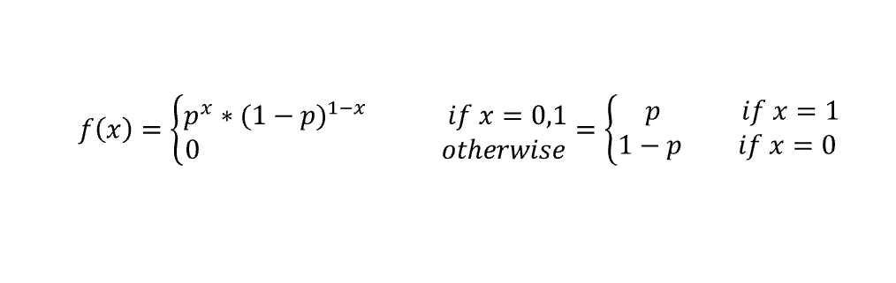
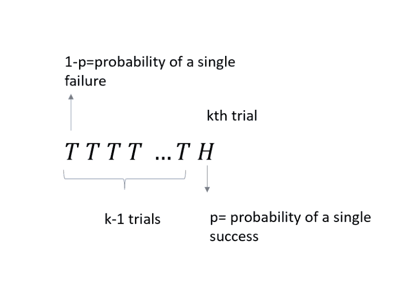
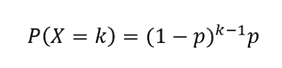
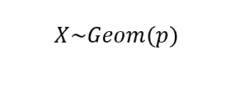
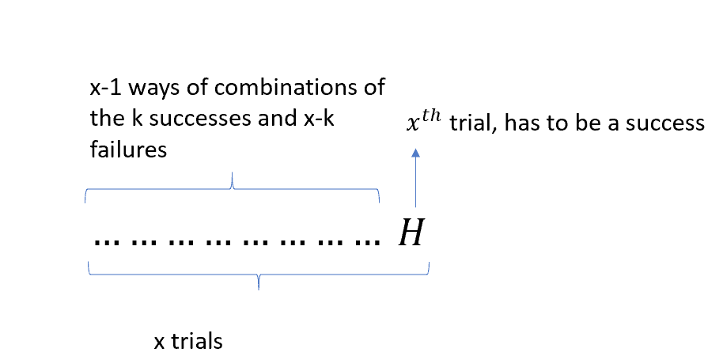
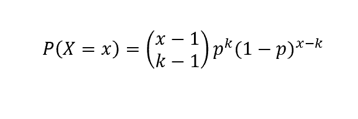
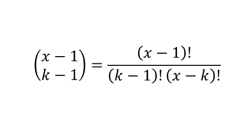
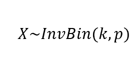
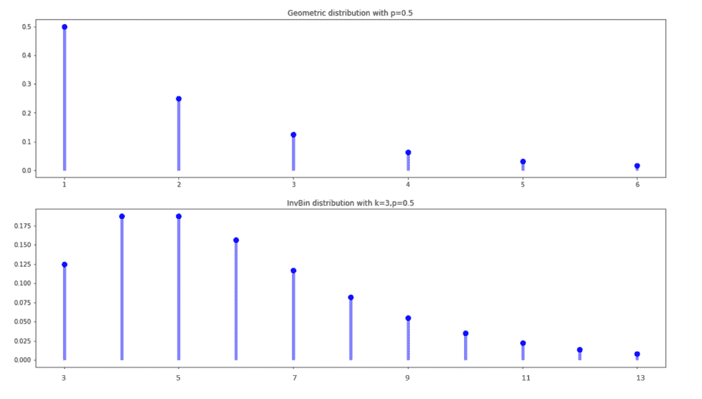

# 理解几何和逆二项式分布

> 原文：<https://towardsdatascience.com/understanding-geometric-and-inverse-binomial-distribution-ff30722e8bd1?source=collection_archive---------14----------------------->

## 逐步介绍

在我之前的[文章](/understanding-bernoulli-and-binomial-distributions-a1eef4e0da8f)中，我一直在谈论两种最流行的离散随机变量的概率分布:伯努利和二项式。在这里，我将详述他们所谓的“对应物”，即几何和逆二项式。

它们都涉及到伯努利试验序列的概念，因此当我们面对伯努利随机试验时，值得回忆一下。

伯努利分布是随机变量的离散概率分布，采用二进制布尔输出:1 表示概率 p，0 表示概率(1-p)。这个想法是，每当你在进行一个可能导致成功或失败的实验时，你可以将你的成功(标为 1)与概率 p 联系起来，而你的不成功(标为 0)将具有概率(1-p)。

与伯努利变量相关的概率函数如下:



成功概率 p 是伯努利分布的参数，如果离散随机变量 X 遵循该分布，我们写为:


现在，我们知道，如果我们运行多个伯努利试验，并且我们正在查询恰好有 k 个成功的概率，我们正在处理一个二项分布。

但是我们需要多少次*试验*才能获得一次(或多次)成功呢？

# 几何分布

几何分布的思想是模拟在获得第一次成功之前进行一定数量的伯努利试验(每次试验都有参数 *p* )的概率。当然，我们用 *k* 表示的试验次数的范围从 1(第一次试验成功)到可能的无穷大(如果你非常不幸)。

所以我们用下面的例子直观的推导一下概率函数。想象你正在抛硬币，你想获得头(H)。因此，H 将是你的成功。每次翻转都是一个伯努利随机变量，概率 p 为 H，概率(1-p)为 Tail (T)。

您的目标是计算获得第一个 h 所需的 k 次试验的概率。因此，我们的随机变量 X 将是:

*X = "获得第一次成功的伯努利试验次数"*

因此，这种情况可以建模如下:



我们希望计算前 k-1 次失败的概率，每次失败的概率为 1-p，然后在第 k 次试验中成功(概率为 p)。由于每个伯努利试验都是相互独立的，我们将:



我们写道:



说我们的随机变量 X 有一个几何概率函数。

# 逆二项式分布

如果几何分布计算第一次成功的试验次数，则逆二项式模型计算 x 次试验恰好获得 k 次成功的概率。

再一次，让我们用和之前一样的例子来模拟我们的逆二项式。然而，这一次，让我们假设我们想要计算进行 x 次试验的概率，以精确地得到 *k* 个头。这里的关键区别是，我们可以有这种情况的不同组合:我们必须考虑的唯一约束是我们的 x 次试验的最后结果必须是成功的，否则要有 k 次成功，较低的试验次数就足够了。

因此:



由于每一次失败都有概率(1-p ),每一次成功都有概率 p，我们得到在获得 k 次成功之前进行 x 次试验的概率由下式给出:



其中:



是二项式系数，用来计算所有可能的组合。此外，我们写道:



假设我们的随机变量 X 遵循一个参数为 k，p 的逆二项式。

最后，让我们看看这些分布的形状:

```
from scipy.stats import geom, nbinom
import matplotlib.pyplot as plt
import numpy as np
fig, ax = plt.subplots(2, 1)p = 0.5
k=3
x = np.arange(geom.ppf(0.01, p), geom.ppf(0.99, p)) #for the geometric
y = np.arange(nbinom.ppf(0.01, k, p),nbinom.ppf(0.99, k, p)) #for the inverse binomial
ax[0].plot(x, geom.pmf(x, p), 'bo', ms=8, label='geom pmf')
ax[0].set_title('Geometric distribution with p=0.5')
ax[0].vlines(x, 0, geom.pmf(x, p), colors='b', lw=5, alpha=0.5)
ax[1].plot(y, nbinom.pmf(y, k, p), 'bo', ms=8, label='nbinom pmf')
ax[1].set_title('Inverse Binomial distribution with k=3,p=0.5')
ax[1].vlines(y, 0, nbinom.pmf(y, k, p), colors='b', lw=5, alpha=0.5)
```



可以看到，在几何分布中，随着试验次数的增加，概率降低。另一方面，使用逆二项式，在前三次试验中获得三次成功的可能性小于在三次以上试验中获得成功的可能性。然而，在一定数量的试验(5)之后，概率再次降低。

*原载于 2019 年 8 月 31 日*[*【http://datasciencechalktalk.com*](https://datasciencechalktalk.com/2019/08/31/understanding-geometric-and-inverse-binomial-distribution/)*。*