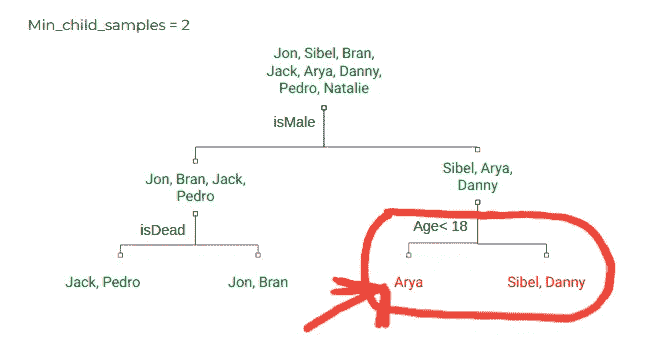

# 梯度增强机器入门—使用 XGBoost 和 LightGBM 参数

> 原文：<https://towardsdatascience.com/understanding-gradient-boosting-machines-using-xgboost-and-lightgbm-parameters-3af1f9db9700?source=collection_archive---------3----------------------->

“My only goal is to gradient boost over myself of yesterday. And to repeat this everyday with an unconquerable spirit”; Photo by [Jake Hills](https://unsplash.com/photos/bt-Sc22W-BE?utm_source=unsplash&utm_medium=referral&utm_content=creditCopyText)

***嘶..坦白地说:*** *在过去，我曾经使用和调整过模型，但并不真正了解它们的功能。我试着用梯度推进机器——light GBM 和 XGBoost——做同样的事情，结果是..令人沮丧！*

这种技术*(或者更确切地说是懒惰)*，适用于简单的模型，比如线性回归、决策树等等。它们只有几个超参数——`learning_rate`、`no_of_iterations`、`alpha, lambda` ——很容易知道它们的意思。

但是 GBM 是一个不同的世界:

1.  他们有大量的超参数——这些参数可以决定你的模型的成败。
2.  最重要的是，不像随机森林，他们的默认设置通常不是最佳的！

所以，如果你想用 GBMs 来建模你的数据，我相信，你至少要对内部发生的事情有一个高层次的了解。你不能把它当作一个完全的黑箱来使用。

这就是我想在这篇文章中帮助你的！

我要做的是，围绕梯度增强机器最流行的两种实现方式的参数—**light GBM**和 **XGBoost** ，对梯度增强机器*做一个非常简单的解释。这样你就能知道算法中发生了什么，以及你应该调整哪些参数来使它变得更好。我相信，这个实用的解释会让你在自己的分析中直接实现它们！*

您可能已经猜到了，在这篇文章中，我不打算深究数学。但是如果你感兴趣，我会张贴一些好的链接，如果你想跳的话，你可以跟随。

那我们就开始吧..

在这篇文章中，作者引用了他的同事迈克·金的话

> *我唯一的目标是超越昨天的自己。并以不可征服的精神每天重复这一点。*

你知道我们每天都在通过关注昨天的错误来提高自己。你知道吗？—GBM 也这样做！

让我们使用 [3 个简单部件](http://chrome-extension://oemmndcbldboiebfnladdacbdfmadadm/http://pages.cs.wisc.edu/~remzi/OSTEP/dialogue-threeeasy.pdf)来了解一下如何操作

## 1."预测者的集合"

GBM 通过创建一个**预测集**来做到这一点。一大群预测者。这些预测器中的每一个都是通过关注在它之前的预测器的错误而依次建立的。

> **你:**等等，你在说什么“预测器”？GBM 本身不是预测器吗？？
> 
> **我:**是的。这是你需要知道的关于梯度推进机器的第一件事——它是一个由许多更小的预测器组成的预测器。一组更简单的预测器。这些预测器可以是任何回归器或分类器预测模型。每个 GBM 实现，无论是 LightGBM 还是 XGBoost，都允许我们选择一个这样简单的预测器。哦嘿！这就引出了我们的第一个参数—

LightGBM 的 sklearn API 提供了一个参数-

*   `**boosting_type**` (LightGBM) **，**`**booster**`**(XGBoost):**选择该预测算法。它们都提供了选项供您选择——gbdt、dart、goss、rf (LightGBM)或 gbtree、gblinear 或 dart (XGBoost)。****

****但是请记住，决策树，几乎总是比其他选择好得多。好的一面是它是这个参数的默认设置；所以你不用担心！****

## ******2。“改进先前预测者所做的预测”******

****现在，我们来看看这些预测器是如何构建的。****

> ****我:是的，你猜对了——在这篇文章中，我们看到了 GBM 如何通过“关注昨天的错误”来提高自己！****

****所以，一个 GBM 基本上创造了许多独立的预测者，他们每个人都试图预测真正的标签。然后，它通过平均所有这些单独的预测给出它的最终预测。****

****但是我们不是在这里谈论我们正常的三年级平均水平；我们指的是**加权平均值**。GBM 为每个预测值分配一个权重，该权重决定了预测值对最终结果的贡献大小——权重越高，其贡献越大。****

> ******你**:它为什么要那样做？****
> 
> ****因为不是所有的预测者都是平等的..****

****集合中的每个预测器都是按顺序建立的**，一个接一个——**和，每个预测器都更关注其前任的错误。****

****每次训练一个新的预测器时，该算法(从一组新的权重中)为先前的预测器出错的训练实例分配更高的权重。所以，这个新的预测者，现在，有更多的动机去解决更困难的预测。****

> ****你:但是，嘿，“平均许多预测者所做的预测”..那不是随机森林吗？****
> 
> ******我:**啊哈..接得好。“平均许多预测者的预测”实际上是一种集合技术。随机森林和梯度推进机器是两种集成技术。****
> 
> ****但与 GBM 不同，随机森林中建立的预测器是相互独立的。它们不是顺序构建的，而是并行构建的。因此，随机森林中的预测因子没有权重。他们生来平等。****
> 
> ****你应该看看 [**装袋**和**助推**](https://quantdare.com/what-is-the-difference-between-bagging-and-boosting/) 的概念。随机森林是一种装袋算法，而梯度推进树是一种推进算法。****

****简单吧？****

****模型如何决定要放入的预测因子的数量？
—通过超参数，当然:****

*   ****`**n_estimators**`:我们传递我们希望 GBM 在`*n_estimators*`参数中构建的预测器的数量。默认数字是 100。****

> ******你:**但是我还有一个问题。重复构建新模型来关注标签错误的例子——这难道不是过度拟合的方法吗？****
> 
> ****我:哦，那才是开悟！如果你在想这个..你猜对了！****
> 
> ****事实上，这是使用梯度增压机的主要问题之一。但是像 LightGBM 和 XGBoost 这样的现代实现很擅长通过创建**弱预测器**来处理这个问题。****

## ****3.“弱预测”****

****一个**弱预测器**是一个简单的预测模型，它的表现比随机猜测要好。现在，我们希望 GBM 内部的单个预测器是弱的，这样整个 GBM 模型就可以是强的。****

> ******你**:嗯，这个好像反了！****
> 
> ******我**:嗯，这听起来可能有点倒退，但这就是 GBM 创建强大模型的方式。这有助于防止过度拟合。请继续阅读，了解如何操作..****

****由于每个预测器都将关注前一个预测器出错的观察值，当我们使用弱预测器时，这些错误标记的观察值往往具有一些可学习的信息，下一个预测器可以学习这些信息。****

****然而，如果预测值已经很强，那么错误标记的观察值很可能只是样本数据的噪声或细微差别。在这种情况下，模型将简单地过度适应训练数据。****

> ****还要注意的是，如果预测因子太弱，甚至不可能从它们中构建出一个强大的集合。****

****所以，“创造一个弱预测器”..这似乎是一个很好的超参数化领域，对吗？“让我们把真正的问题留给开发者去解决吧！”😛****

****这些是我们需要调整以做出正确预测的参数(如前所述，这些简单的预测是决策树):****

*   ****`**max_depth**`**(XGBoost 和 LightGBM) **:** 这提供了每个决策树允许拥有的最大深度。*较小的值表示较弱的预测值。*******
*   ****`**min_split_gain**` (LightGBM)，`**gamma**` (XGBoost):在树的一个叶节点上做进一步划分所需的最小损失减少。*值越低，树越深。*****
*   ****`**num_leaves**` (LightGBM):基础学习者的最大树叶数。值越高，树越深。****
*   ****`**min_child_samples**` (LightGBM):子(叶)节点中所需的最小数据点数。根据 LightGBM 文档，这是防止过度拟合的一个非常重要的参数。****

********

****The subtree marked in red has a leaf node with 1 data in it. So, that subtree can’t be generated as 1 < `**min_child_samples**` for the above case****

******注意:这些是您可以调整以控制过度拟合的参数。******

******注 2:** 弱预测值对强预测值——这是 GBMs 和随机森林的另一个不同点。随机森林中的树都很强壮，因为它们彼此独立建造。****

****就是这样。现在您对 GBM 如何工作的整个故事有了一个很好的概述！****

****但是在我离开你之前，我想让你知道更多的参数。这些参数并不完全符合我刚刚缝在上面的故事，但它们被用来在性能上挤出一些效率。****

****我还将讨论如何调优这些超参数。最后，我会给你一些链接，让你更深入地了解 GBMs 背后的数学和理论。****

## ****【号外】。二次抽样****

****即使在正确调整了所有上述参数之后，也可能只是发生系综中的一些树高度相关。****

> ******你:请解释一下你说的“高度相关的树”是什么意思。******
> 
> ****我:当然。我指的是结构相似的决策树，因为基于相同特征的相似分裂。当集合中有这样的树时，这意味着集合作为一个整体将存储比树不同时所能存储的更少的信息。所以，我们希望我们的树尽可能的不相关。****

****为了解决这个问题，我们在每次迭代之前对数据行和列进行子采样，并在这个子采样上训练树。这意味着将在整个数据集的不同子样本上训练不同的树。
不同的数据*->不同的树*****

****这些是需要注意的相关参数:****

*   ****`**subsample**`(XGBoost 和 LightGBM):指定在每个子采样阶段要考虑的行数比例。默认情况下，它被设置为 1，这意味着没有二次采样。****
*   ****`**colsample_bytree**`(XGBoost 和 LightGBM):指定在每个子采样阶段要考虑的列的比例。默认情况下，它被设置为 1，这意味着没有二次采样。****
*   ****`**subsample_freq**` (LightGBM):这指定了应该在每`k`次迭代之后进行打包。默认情况下，它设置为 0。因此，如果要启用二次采样，请确保将其设置为某个非零值。****

## ****【号外】。学习率****

*   ****`**learning_rate**`(XGBoost 和 LightGBM 都有):
    也叫缩水。使用它的效果是学习变慢，反过来需要更多的树被添加到集合中。这给了模型一个正则化的效果。它减少了每棵树的影响，并为未来的树留下了改进模型的空间。****

## ****【号外】。类别权重****

*   ****`**class_weight**` (LightGBM):
    当我们有不平衡的类时，这个参数对于多类分类任务极其重要。我最近参加了一个 Kaggle 比赛，在比赛中，只要将这个参数的值设置为`balanced`，我的解决方案就会从排行榜的前 50%跃升到前 10%。****

****你可以在这里查看 LightGBM [的 sklearn API，在这里](https://lightgbm.readthedocs.io/en/latest/Python-API.html#scikit-learn-api)查看 XGBoost [的 sk learn API。](https://xgboost.readthedocs.io/en/latest/python/python_api.html#xgboost.XGBRegressor)****

# ****寻找最佳超参数集****

****即使在理解了所有这些超参数的用法之后，为您的模型找到一组好的超参数也是极其困难的。他们人太多了！****

****因为我的整个故事是围绕这些超参数展开的，所以我想简单地告诉你如何进行[超参数调整](/hyperparameter-tuning-the-random-forest-in-python-using-scikit-learn-28d2aa77dd74)。****

****你可以使用 sklearn 的`**RandomizedSearchCV**`来找到一组好的超参数。它将随机搜索超参数的所有可能组合的子集，并返回最佳的可能超参数集(或至少接近最佳的东西)。****

****但是如果您希望更进一步，您可以查看使用`**GridSearchCV**`返回的超参数集。网格搜索将使用每个可能的超参数组合来训练模型，并返回最佳集合。请注意，因为它尝试了每一种可能的组合，所以运行起来会很昂贵。****

# ****那么，在哪里可以使用算法呢？****

****GBM 擅长有效地建模任何类型的结构化表格数据。Kaggle 竞赛的多个获奖解决方案使用它们。****

****[以下是](https://github.com/Microsoft/LightGBM/blob/master/examples/README.md#machine-learning-challenge-winning-solutions)Kaggle 竞赛的获奖模型中使用 LightGBM 的列表。****

****它们比许多其他堆叠回归技术实现起来更简单，并且也很容易给出更好的结果。****

****谈到使用 GBMs，我想告诉你更多关于随机森林的信息。我在上面简单地谈过——随机森林是一种不同类型的(基于树的)集合技术。****

****它们很棒，因为它们的默认参数设置非常接近最佳设置。因此，与需要调优的 XGBoost 和 LightGBM 不同，它们会用默认的参数设置给你一个足够好的结果。但是一旦调优，XGBoost 和 LightGBM 可能会表现得更好。****

# ****关于梯度增强的更多信息****

****正如我所承诺的，这里有几个链接，你可以通过它们来理解梯度推进背后的理论和数学(按照我喜欢的顺序)****

*   ****[**【如何解释梯度推进】作者*泰伦斯·帕尔*和*杰瑞米·霍华德***](http://explained.ai/gradient-boosting/index.html)这是一个非常冗长、全面和优秀的系列文章，试图向没有数学知识或其背后理论的人解释这个概念。****
*   ****[**【一个 Kaggle 大师讲解渐变提升】由*本戈尔曼***](http://blog.kaggle.com/2017/01/23/a-kaggle-master-explains-gradient-boosting/)非常直观的介绍渐变提升。****
*   ****[**【关于机器学习的梯度推进算法的温和介绍】作者*Jason Brownlee***](https://machinelearningmastery.com/gentle-introduction-gradient-boosting-algorithm-machine-learning/)它有一点历史，有很多链接要跟进，温和的解释再一次，没有数学！****

******我是自由撰稿人。你可以雇我为你公司的博客写类似的深入、热情的文章，解释 ML/DL 技术。给我发电子邮件到** `**nityeshagarwal[at]gmail[dot]com**` **来讨论我们的合作。******

****请在下面的评论区告诉我你的想法。也可以在 [LinkedIn](https://www.linkedin.com/in/nityeshaga/) 或者 [Twitter](https://twitter.com/nityeshaga) ( *关注我那里；我不会滥发你的饲料*；) )****