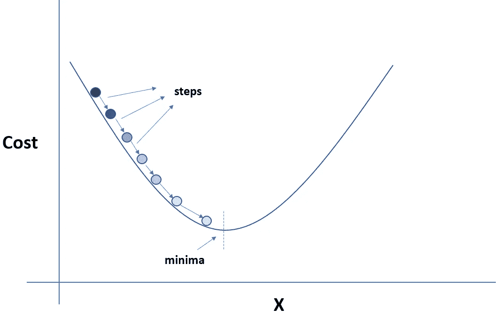

# 理解梯度下降及其变体

> 原文：<https://towardsdatascience.com/understanding-gradient-descent-and-its-variants-cf0df5c45478?source=collection_archive---------7----------------------->

## 简要了解优化算法如何支持机器学习模型中的学习过程

机器学习模型很神奇；他们可以识别视频中的物体；它们可以自动为图像生成字幕，并对猫狗图片*(有时)进行准确分类。*

Image from [https://www.kaggle.com/c/dogs-vs-cats](https://www.kaggle.com/c/dogs-vs-cats)

本文将提供对机器学习模型下发生的事情的表面理解。更具体地说，我们将探索使这些机器学习模型能够学习的“主干算法”。

“骨干算法”被称为优化算法。下面是你在这篇文章中会遇到的一些关键词的定义，优化算法也在提供的描述中。

*   **优化算法**:执行预定次数的算法，用于寻找问题的最优解，在数学术语中，这些“问题”被称为函数。
*   **梯度下降**:该优化算法被用来寻找降低成本函数的值。这是通过梯度值的计算来完成的，该梯度值用于在找到成本函数的局部最小值的每一步选择值。梯度的负值用于寻找局部最小值。
*   **成本函数**:这是一种量化机器学习模型执行“有多好”的方法。量化是基于一组输入的输出(成本)，这些输入被称为参数值。参数值用于估计预测，而“成本”是预测值和实际值之间的差异。
*   **全局最小值**:这是位于成本函数整个域内的最小参数值。您可能会遇到局部最小值，它是指位于成本函数的设定范围内的最低参数值。
*   **收敛**:这描述了在机器学习环境中使用时向最佳参数值或全局最小值移动的概念

本文底部是一些标准机器学习术语及其定义的链接。*把它当成圣诞礼物*😊。

我们将在本文中探索的优化算法是**梯度下降。**

# 梯度下降

梯度下降是一种非常常见的优化算法，很可能是许多机器学习工程师和数据科学家引入的第一种优化算法。

让我们画一幅画。我们有一个成本函数，我们需要找到最优解来求解成本函数。接下来是梯度下降，这是一种算法，它通过改变模型中的参数值来工作，所有这些都是为了最小化成本函数。成本函数的一个例子是[均方差](https://en.wikipedia.org/wiki/Mean_squared_error)。

梯度下降固有功能的工作原理是，根据从误差函数获得的关于特定数据点的参数的计算梯度，找到朝向局部最小值的方向。

这可能有助于理解一些图像和可视化梯度下降。

让我们使用一个包含一条碗形曲线和一个球的图形，球放在曲线的左上方。球表示最初随机选择的参数空间中的某个点(值)，曲线表示相对于参数值范围绘制的成本值。目标是达到提供最低成本值的参数值。

在图的 X 轴上是代表成本的值，在 y 轴上是由‘X’表示的值，其代表我们用来求解成本函数的参数值的范围。

Image of a cost function curvature

最小值(单数)/极小值(复数)是斜率中存在最小化成本函数的最佳值的点，梯度下降是在几个步骤(迭代)中将我们的球导向最小值的算法。

为了求解成本函数，我们寻找曲线的最低点，这是梯度为零或接近零的点。

> **快速提示**:成本函数曲线并不总是具有一个局部最小值的碗形。在上图中使用的示例中，成本函数只有一个输入参数(一维参数空间)，但实际上，参数空间往往有更多的维度。

# 批量梯度下降

我们了解梯度下降是如何工作的，现在可以将其应用于我们的训练数据。梯度下降算法对训练数据的应用有多种形式。一种形式叫做**批量梯度下降(BGD)** 。

在上图中，我们朝着局部最小值前进。在 BGD，我们实际上利用我们掌握的每一个训练数据来决定我们向哪个方向移动以及移动多少。我们在每一步都使用所有的训练数据。

对于大量的训练数据，训练过程可能会延长，但在计算上是高效的，因为我们不像梯度下降的其他变体那样经常对我们的模型参数进行任何改变。

尽管 BGD 的内存效率不高，但你可以想象，在训练模型时，我们需要内存中所有可用的数据集。

# 随机梯度下降

在 BGD 硬币的另一面，我们有**随机梯度下降** (SGD)。

与遍历训练集中的每个数据，然后向局部最小值前进相反，SGD 的工作方式是从训练集中实际选取一个数据点，并基于这个数据点计算梯度。

您可能会发现，在 BGD 和 SGD 之间，SGD 是更快的算法，因为您是基于数据的单个实例而不是整个数据集来计算梯度的，但代价是什么。

使用 SGD 时，梯度下降期间在参数空间内进行的更新可能会有噪声。SGD 的噪声特性是其随机特性的结果，当从训练集中选择数据点来计算每一步的梯度时，会出现这种随机特性。

为了适应 SGD 的噪声性质，并确保我们达到最佳参数值，我们必须对训练数据迭代一定次数，并确保在梯度下降过程的开始，训练数据被打乱。

噪声导致求解成本函数的模糊参数值，尽管给定足够的时间，SGD 将接近局部最小值。SGD 的噪声和随机性也是有益的。当算法陷入不是全局最小值的局部最小值时，这很有用。

与 BGD 相比，SGD 在每一步分配参数值时，由于其随机和不稳定的性质，具有避开局部最小值和找到全局最小值的优点。

但是与 SGD 相比，BGD 参数值更接近全局最小值和最优值。当面临在梯度下降算法的两个变型之间进行选择时，在速度和最优性之间有一个折衷。

# 小批量梯度下降

如何利用新加坡元和 BGD 的优点？

小批量梯度下降基于训练集中随机选择的数据计算梯度，就像 SGD 一样，但在计算梯度时不包括整个数据集，所以它也不完全是 BGD。你可以说它是一个混合体。

Mini Batch GD 在计算梯度时使用少量数据；与 BGD 相比，它更快，但与新加坡元相比，它仍然较慢。

相对于 SGD，小批量 GD 的优势在于降低了参数空间内的噪声。这意味着利用小批量 GD，意味着更容易达到最佳参数值。

唷，这还不算太糟，接下来，你可以在网上寻找关于每种算法的代码实现的资源。

我应该会发布一篇中型文章，概述如何实现本文中提到的一些梯度下降算法。

**关注我，获取更多类似的文章。**

正如承诺的那样，下面是一些常见机器学习术语定义的链接。

 [## 机器学习初学者的 30 个袖珍术语

### 你在数据科学或机器学习职业生涯中会遇到的有用的机器学习术语列表。

towardsdatascience.com](/30-pocket-sized-terms-for-machine-learning-beginners-5e381ed93055)