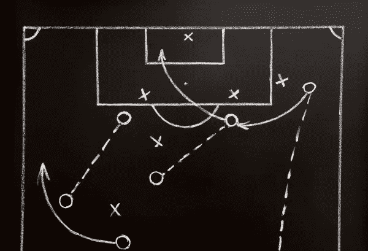
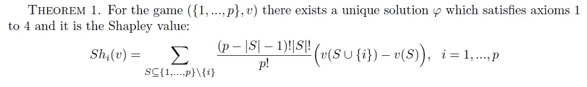
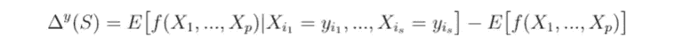
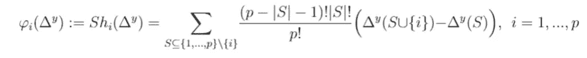
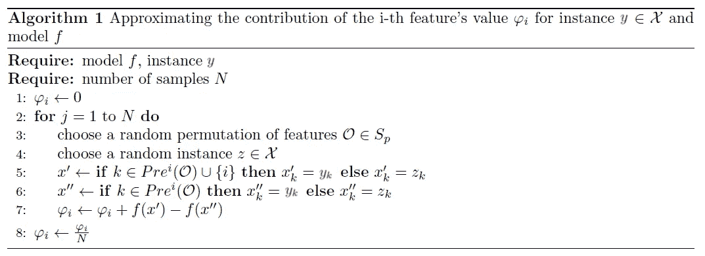
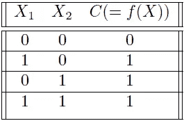
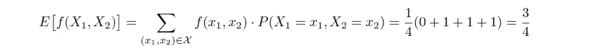
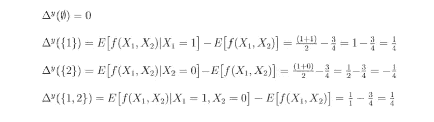
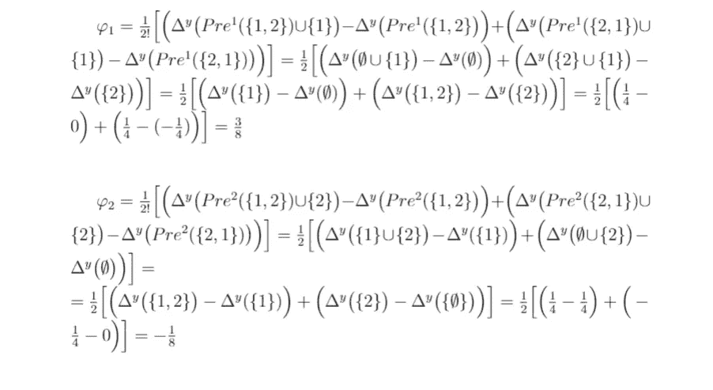

# 理解 IME (Shapley 值)如何解释预测

> 原文：<https://towardsdatascience.com/understanding-how-ime-shapley-values-explains-predictions-d75c0fceca5a?source=collection_archive---------13----------------------->

[在最近的一篇文章](https://medium.com/@pferrandohernandez/interpretable-machine-learning-an-overview-10684eaa1fd7)中，我介绍了三种现有的方法来解释**任何**机器学习模型的个体预测。在[的帖子关注了 LIME](https://medium.com/@pferrandohernandez/understanding-how-lime-explains-predictions-d404e5d1829c) 之后，现在轮到了 **IME(基于交互的解释方法)**，这是一种由 Erik Strumbelj 和 Igor Kononenko 在 2010 年提出的方法。最近这种方法也被称为 **Shapley 值**。

## IME 背后的直觉

当一个模型为一个观察值给出一个预测时，所有的特征并不扮演相同的角色:它们中的一些可能对模型的预测有很大的影响，而另一些可能是不相关的。因此，人们可能认为每个特征的影响可以通过检查如果该特征不存在时的预测来测量；模型输出的变化越大，特性就越重要。

但是，一次只观察一个特征意味着没有考虑特征之间的依赖关系，这可能会对模型的决策过程产生不准确和误导性的解释。因此，为了避免错过特征之间的任何交互，我们应该观察每个可能的特征子集的预测如何变化，然后组合这些变化以形成每个特征值的唯一贡献。

Source: [https://www.ingenioustechnologies.com/blog/are-you-using-the-right-attribution-model-for-your-business/](https://www.ingenioustechnologies.com/blog/are-you-using-the-right-attribution-model-for-your-business/)

确切地说，IME 基于这样一种思想，即实例的特征值共同作用，导致模型的预测相对于模型的预期输出发生变化，并且它以一种对所有可能的特征子集的贡献“公平”的方式在特征之间划分预测的总变化。

## 合作博弈论基础

一个*合作*(或联盟)*博弈*是一个元组({1，…，p}， *v* ，其中{1，…，p}是一个有限的 *p* 玩家的集合， *v* : 2ᵖ → ℝ是一个特征函数使得 *v* (∅)=0.

玩家 S⊂{1,…,p}的子集是*联盟*，所有玩家{1，…，p}的集合称为*大联盟*。特征函数 *v* 描述了每个联盟的价值。我们通常假设大联盟形成，目标是以“公平”的方式在参与者之间分配其价值(由特征函数定义)。因此，解是一个算子φ，它给博弈({1，…，p}， *v* )分配一个支付向量φ=(φ₁,φ₂,…,φₚ).

对于每一个至少有一个玩家的游戏，都有无限的解决方案，其中一些比另一些更“公平”。以下四个性质是对解φ的“公平性”概念的公理化尝试:

*   公理 1:效率

φ₁(*v*)+φ₂(*v*)+…+φₚ(*v*)=*v*({ 1，…，p})

*   公理 2:对称

如果对于两个玩家 *i* 和 *j* ，*v*(s ∨{ I })=*v*(s ∨{ j })对每一个 *S* 成立，其中 S⊂ {1，…，p}和 i,j∉ S，那么φᵢ( *v* )=φⱼ( *v* 。

*   公理 3:假人

如果*v*(s ∨{ I })=*v*(s)对每个 *S* 成立，其中 S⊂ {1，…，p}和 i∉ S，那么φᵢ(v)=0.

*   公理 4:可加性

对于任意一对游戏 *v* ，*w*:φ(*v+w*)=φ(*v*)+φ(*w*)，其中(*v+w*)(*S*)=*v*(*S*+*w*(*S*

**Shapley 值**是一种将总收益 *v* ({1，…，p})分配给 *p* 玩家的“公平”方式，从某种意义上说，这是唯一一种具有前面四个期望属性的分配。

此外，Shapley 值有一个等价公式:

其中 Sₚ是有限集合{1，…，p}的对称群(即，玩家集合{1，…，p}的所有置换的集合)，Pre^i(O 是置换 O∈ Sₚ中玩家 *i* 的前辈玩家的集合(即，在置换 O∈ Sₚ).中出现在编号 *i* 之前的数字)

## 方法

设 X = X₁× X₂×…× Xₚ是 *p* 特征的特征空间，用集合{1，…，p}表示。

设 *f* 为被说明的模型。在分类中， *f(x)* 是 *x* 属于某一类的概率(或二元指标)。对于多个类，IME 分别解释每个类，因此 *f(x)* 是相关类的预测。在回归中， *f(x)* 是回归函数。

最后，让 y=(y₁,…,yₚ)∈X 的例子从特征空间的预测，我们要解释。

Strumbelj 和 Kononenko 将特定情况下特征值子集的*预测差异*定义为通过观察这些特征值引起的期望值变化。形式上:

让 *f* 做个模特。让 S={i₁,i₂,…,iₛ}⊆{1,…,p}成为特征的子集。实例 y=(y₁,…,yₚ)∈X 中的特征子集 S⊆{1,…,p}的预测差δʸ(s 是:

注意，δʸ从所有可能的特征子集集合到ℝ定义了一个满足δʸ(∅)=e[f(x₁,…,xₚ)]-e[f(x₁,…,xₚ)]=0.的函数δʸ:2ᵖ→ℝ因此，对于以 *p* 为参与者的合作博弈，δʸ是一个有效的特征函数。因此，({1，…，p}，δʸ)形成了前面定义的合作博弈。换句话说，IME 认为特征是游戏的参与者，其中联盟的价值是由δʸ定义的模型预测的变化，因此 IME 的目标是以“公平”的方式在特征之间分割预测δʸ({1,…,p}的总差异。

对于解释 *y* 的预测，第 *i* 个特征的建议贡献是合作博弈({1，…，p}，δʸ):)的*沙普利值*

设{1，…，p}是特征集，δʸ是如上定义的预测差。第 *i* 个特征对解释 *y* 的预测的贡献是:

或者，等效地，使用 Shapley 值的替代公式:

其中 Sₚ是特征集合{1，…，p}的所有排列的集合，而 Pre^i(O 是在排列 O∈ Sₚ.中特征 *i* 的前身的特征集合

请注意，贡献的定义并不随意:联盟博弈({1，…，p}， *v* )的 Shapley 值$φ$是一种将总收益分配给 *p* 玩家的“公平”方式。在我们的例子中，公理 1 到 3 成为 IME 作为解释方法的三个可取的性质:

1.效率公理:φ₁(δʸ)+φ₂(δʸ)+…+φₚ(δʸ)= δʸ({1,…,p})=e[f|y]-e[f]=f(y)-e[f]

也就是说，在一个观察的解释中，所有 *p* 贡献的总和等于模型对实例的预测与模型的预期输出之间的差值，在没有关于实例特征值的信息的情况下。这一特性使得不同观测值和不同模型之间的贡献更容易比较。

2.对称公理:

如果对于两个玩家来说，{ t20 } I 和 *j* ，δʸ(s∪{i})=δʸ(s∪{ j })适用于每一个 *S* ，其中 S⊂ {1，…，p}和 i,j∉ S，那么φᵢ(δʸ)=φⱼ(δʸ).

换句话说，如果两个特征对预测具有相同的影响，则它们被赋予相同的贡献。

3.虚拟公理:

如果δʸ(s∪{i})=δʸ(s)对每一个 *S* 成立，其中 S⊂ {1，…，p}和 i∉ S，那么φᵢ(δʸ)=0.

也就是说，如果某个特征对预测没有影响，则该特征的贡献值为 0。

贡献的大小和符号都很重要。首先，如果一个特征比另一个特征具有更大的贡献，那么它对感兴趣的观察的模型预测具有更大的影响。其次，贡献的符号指示该特征是有助于增加(如果为正)还是减少(如果为负)模型的输出。最后，在没有任何关于特性值的信息的情况下，生成的贡献总和为模型的输出预测和模型的预期输出之间的差。总之，我们可以辨别模型的输出因观测的特定特征值而改变了多少，哪些特征负责这种改变，以及每个特征的影响大小。

在实践中，该方法的主要挑战是指数时间复杂度，因为贡献的计算需要使用所有可能的特征子集。为了避免这一问题，Strumbelj 和 Kononenko 开发了一种高效的采样程序，通过扰动实例的输入要素来估算要素贡献:

注意*f(x’)*和*f(x’)*是分类器对两个观察值的预测，它们只是在第 *i* 个特征的值上不同。它们是这样构建的:取实例 *z* ，然后将出现在第 *i* 个特征之前的每个特征的值按顺序 *O* (对于*x’，*第 I 个特征也被更改)更改为我们要解释的 *y* 观察中的那个特征的值。

## 例子

设 X₁，X₂是两个二元特征，C={0，1}一个二元类，X={0，1}×{0，1}我们的特征空间。我们假设所有特征值组合都是等概率的，如下表所示。

假设该类由析取 C=X₁∨ X₂定义，也就是说，如果 X₁=1 或 X₂=1，C=1，否则为 0。设 f: X →[0，1]是一个(理想的)分类器。

A simple data set used for illustrative purposes. All combinations of features are equally probable.

我们将计算由 IME 产生的解释，以从类值 1 的角度解释观察值 y=(1，0)的预测。在这种情况下，我们可以分析计算每个特征的贡献。具体来说，我们将使用 Shapley 值的替代公式。

首先，我们需要计算有限集{1，2}的对称群 S₂，它有 2！=2 个元素:S₃={{1,2},{2,1}}

第二，我们必须计算所有特征子集的*预测差异*，因此如果没有已知的特征值，我们首先计算预期预测:

现在我们可以计算预测差异:

最后，我们可以计算特征的贡献:

第一特征的贡献为正，而第二特征的贡献为负，这是合理的。因为当至少一个特性为 1 时，类为 1，我们实例的第一个特性使模型预测为 1，所以这个值决定了模型预测为 1。相反，第二个特征使得 1 不太可能是预测类，因此它对模型的决策有负面影响。此外，第一个贡献的绝对值大于第二个贡献的绝对值，这意味着第一个特征对于预测是决定性的。最后，注意，当特征值未知时，这两个贡献总计为该实例的预测和预期预测之间的初始差异:φ₁+φ₂=3/8–1/8=1/4=1–3/4=f(1,0)-e[f(x₁,x₂]，这由公理 1 保证。

总之，IME 对实例(1，0)预测的解释是，模型的决策受两个特征的影响，第一个特征比第二个特征更有利于(正确地)预测类 1，第二个特征的值与该决策相反。

这是一个非常简单的例子，我们已经能够分析计算，但这些在实际应用中是不可能的，因为我们需要算法的近似解。在以后的文章中，我将解释如何使用 R 和 Python 解释带有 Shapley 值的预测。