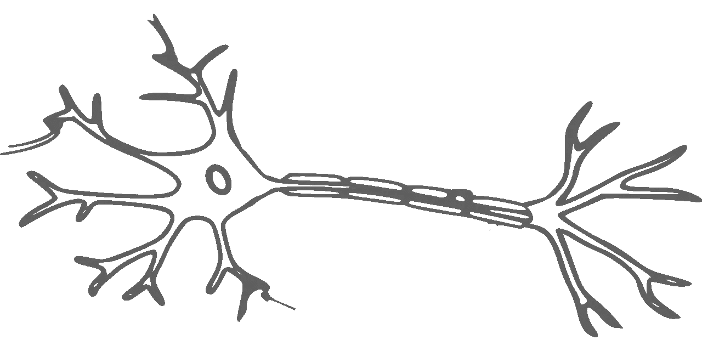
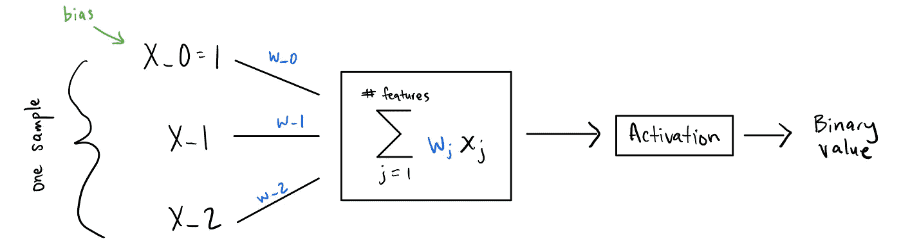
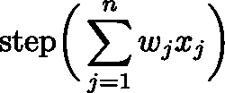
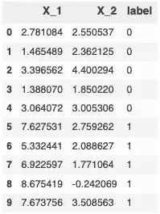
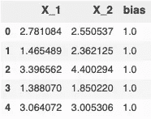
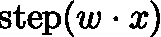
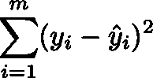
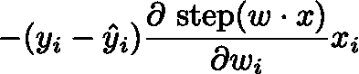
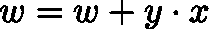
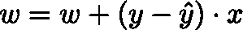

# 理解感知机是如何工作的

> 原文：<https://towardsdatascience.com/understanding-how-the-perceptron-really-works-234b1b7cf44b?source=collection_archive---------15----------------------->

 [## 想在数据科学方面变得更好吗？

### 当我在我发布独家帖子的媒体和个人网站上发布新内容时，请单击此处获得通知。](https://bobbywlindsey.ck.page/5dca5d4310) 

感知器模型是一种二元分类器，其分类基于线性模型。所以，如果你的数据是线性可分的，这个模型会找到把它分开的超平面。该模型是这样工作的:



本质上，对于一个给定的样本，你把每个特征， *x_i* ，乘以它自己的权重， *w_i* ，然后求和。然后取这个和，应用激活函数。这将是你的预测。但是你用哪个激活功能呢？

# 激活功能

二元分类标签一般出现为 *{-1，1}* 或 *{0，1}* 。感知器模型中使用的激活函数将取决于您选择哪组二进制标签。如果您选择 *{0，1}* ，您将需要使用 [Heaviside 阶跃函数](https://en.wikipedia.org/wiki/Heaviside_step_function)作为您的激活函数，因为它接受任何实数并输出 0 或 1。否则，您将使用[符号功能](https://en.wikipedia.org/wiki/Sign_function)。

Sign and heaviside step functions

# 获取数据

假设你的二进制标签是 *{0，1}* 。感知器模型预测将是



Equation 1

产生 0 或 1。让我们来看看一个快速的例子，其中一些数据来自 Jason Brownlee 的博客[机器学习大师](https://machinelearningmastery.com/implement-perceptron-algorithm-scratch-python/)。



The data

让我们将数据帧分成训练数据和标签。



Features of the data

# 感知器推理

要从感知器模型获得预测，您需要实现等式 1。回想一下，等式 1 的矢量化等价物就是



Vectorized Equation 1

权重向量 *w* 和特征向量 *x* 的点积。

所以你有 *x* ，它代表一个样本，其中 *x_i* 是该样本的一些特征(比如`has_scales`或`has_fur`，如果你试图预测哺乳动物与爬行动物)。但是你从哪里得到重量呢？这就是感知器模型需要从你的标记样本中学习的东西。开始时，你不知道这些值应该是什么，所以你可以让它们全是零。

尝试预测第一个样本:

```
Prediction: 1.0, Label: 0, Error: -1.0
```

不出所料，这个模型做得并不太好。让我们看看你是否能想出一种方法，让感知器模型学习它需要什么样的权重才能输出预期的标签。

# 教感知机学习

首先，你需要指定一个损失函数来告诉你你的模型做得有多差。损失越低越好。对于我们的示例，您可以使用误差平方和作为损失函数:



Sum of squared errors (our loss function)

其中 *yhat_i* 是感知器模型的预测，而 *y* 是预测应该是什么(即标签)。该函数简单地确定预测值和真实值之间的平方距离，并将所有这些距离相加。

与大多数现代机器学习方法一样，您现在可能会尝试使用梯度下降法，即获取上述损失函数相对于权重的梯度，并使用该梯度在最小化损失的方向上更新权重。产生的梯度将是:



Gradient of the loss function, but there’s a problem…

但是你看到这里的问题了吗？阶跃函数的导数在任何地方都是 0，除了在没有定义的 *x = 0* 处。这将迫使整个梯度为 0，权重永远不会更新。感知器模型永远不会学习。同样的问题也困扰着 sign 函数。

那么如何更新权重呢？事实证明，如果您的数据是线性可分的，那么下面的权重更新规则可以保证(通过[收敛定理证明](http://www.cs.ubbcluj.ro/~csatol/kozgaz_mestint/4_neuronhalo/PerceptConvProof.pdf))在有限的步骤中收敛到一组权重，从而将数据线性分成两个不同的类。此更新规则定义为:



Weight-update rule for the perceptron

并且仅在 *x* 被感知器模型错误分类时应用。

但是这个更新规则是在假设二进制标签是 *{-1，1}* ，而不是 *{0，1}* 的情况下推导出来的。如果您的标签是 *{-1，1}* ，那么更新规则中的 *y* 将是-1 或 1，从而改变权重更新的方向。

但是因为你的二进制标签是 *{0，1}* ，这就出现了一个问题，因为 *y* 可能是 0。这意味着如果一个 *x* 被错误分类，并且它的真实值是 0，那么 *w = w + 0 x = w* 并且权重永远不会被更新。

幸运的是，您可以通过修改更新规则来解决这一问题，该规则仍然保证收敛，但同时适用于作为二进制标签的**{-1，1}* 和 *{0，1}* :*

**

*The more flexible weight-update rule*

*请注意，如果您的二进制标签是 *{0，1}* ， *(y - yhat)* 如果感知器模型预测正确(从而保持权重不变)，则为 0，如果预测不正确，则为 1 或-1(这将确保权重在正确的方向上更新)。如果你的二进制标签是 *{-1，1}* ， *(y - yhat)* 如果感知器模型预测正确就是 0，如果预测错误就是 2 或者-2。这个修正的权重更新规则确保了正确的方向变化，无论你选择哪组二进制标签。*

*现在您已经知道如何更新权重，试着取一个样本，预测它的标签，然后更新权重。对每个样品重复上述步骤。*

```
*SSE: 2.0
Weights: [4.84644761, 0.20872523, 0.]*
```

*看起来感知器模型还没有找到完美区分这两个类别的权重。不如你给它更多的时间来学习，通过多次通过数据。让我们试三次传球。*

```
*SSE: 2.0
SSE: 1.0
SSE: 0.0
Weights: [ 2.06536401, -2.34181177, -1.]*
```

*不错！误差平方和为零，这意味着感知器模型在分离数据时不会产生任何误差。*

# *适用于不同二进制标签的感知器*

*现在说你的二进制标签是 *{-1，1}* 。使用上面相同的数据(用-1 替换标签的 0)，可以应用相同的感知器算法。这一次，你会看到 *w = w + y x* 和 *w = w + (y - yhat) x* 都找到了一组权重来正确分离数据(即使权重不同)。*

*以下是感知器模型，其更新规则为 *w = w + y x* :*

```
*SSE: 5.0
SSE: 4.0
SSE: 0.0
Weights: [ 2.06536401, -2.34181177, -1.]*
```

*现在用 *w = w + (y — yhat) x* 作为更新规则:*

```
*SSE: 5.0
SSE: 8.0
SSE: 0.0
Weights: [ 3.98083288, -6.85733669, -3.]*
```

*两者融合！*

# *包扎*

*在这篇文章中，你已经学习了什么是感知机模型，它可以应用于什么样的数据，模型背后的数学和它如何学习，以及用 Python 实现你的所有发现！*

*当然，在现实环境中，您会希望交叉验证您的模型，并且最好使用 scikit-learn 等库中可用的模型的可靠实现。但我希望这种感知机模型下的窥视有所帮助，如果你有任何问题，请随时通过[bobbywlindsey.com](https://www.bobbywlindsey.com)联系我，或者通过[媒体](https://medium.com/@bobbylindsey)或[推特](https://twitter.com/bobbywlindsey/)关注我。*

**原载于 2019 年 10 月 7 日*[*https://www.bobbywlindsey.com*](https://www.bobbywlindsey.com/2019/10/06/understanding-the-perceptron/)*。**