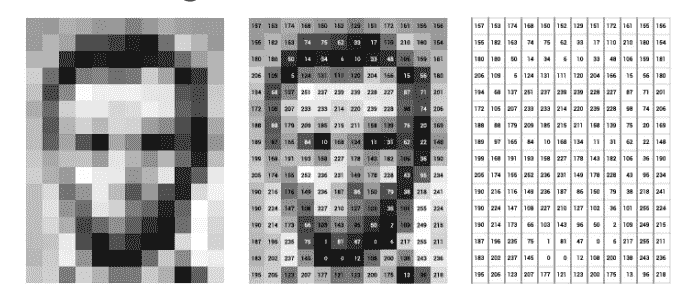
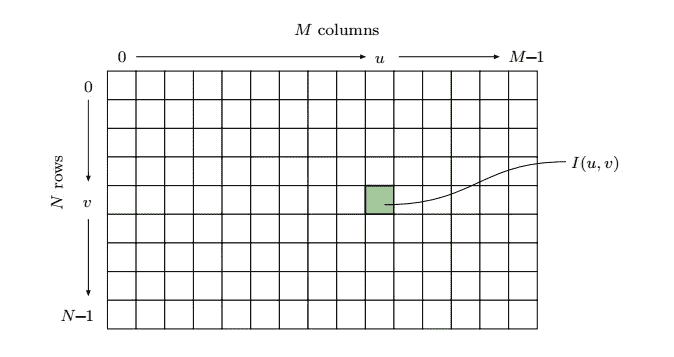
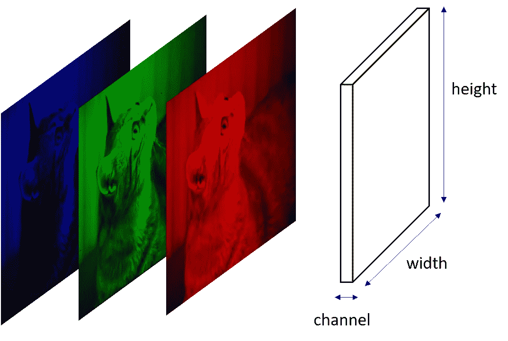

# 用 skimage-Python 理解图像

> 原文：<https://towardsdatascience.com/understanding-images-with-skimage-python-b94d210afd23?source=collection_archive---------11----------------------->

计算机视觉是当今的热门词汇。通过将计算机视觉技术与人工智能和人工智能相结合，许多有用的应用和系统正在出现

图像处理是每个计算机视觉专业人员工具箱中应该有的重要工具。图像处理是使用算法对数字图像执行各种操作。比如，

*   增强图像
*   提取有用的信息
*   分析图像

图像处理用于各种领域，如医学图像分析、人工智能、图像恢复、地理空间计算、监控、机器人视觉、汽车安全等。

我将撰写一系列文章，让您对使用 Python 中的 skimage 进行数字图像处理的一些关键操作有一个实际的了解。在这第一篇文章中，让我们了解如何捕捉数字图像并以数字格式表示。

# 如何捕捉图像？

这一切都始于穿过照相机镜头的光线。通过镜头，它被聚焦在照相机的像平面上。图像平面通常以正方形或矩形容纳传感器(像素)。根据相机的构造，有时它们可以是六边形或圆形传感器。光在这个平面上投射的是一个二维的、依赖于时间的、连续的光能分布。该模拟信号的数字快照分三步捕获，



1.  **空间采样**-这是将连续模拟信号转换为离散信号的步骤。
2.  **时间采样**——这是测量每个传感器定期入射光量的步骤。
3.  **像素值的量化** -以上两个样本是我们数字图像的数据。但是为了存储和处理它，我们需要将它们转换成一系列整数值。(示例 256 = ⁸)

转换后的像素值稍后将以二维有序整数矩阵的格式存储。

# 尺寸和分辨率

假设“I”是我们图像的矩阵格式。图像的**大小**就是 I 的宽度和高度。

```
from skimage import io#replace the path of image
image = io.imread('~/Desktop/Lenna.png')print(image.shape)
print(type(image))Output:
(512, 512, 3)
<class 'imageio.core.util.Array'>
```

在上面的例子中，输出(512，512，3)表示图像中通道的宽度、高度和数量。看看我们的图像是以数组的形式表示的。

另一方面，**分辨率**是现实世界中图像的空间维度，通常以每次测量的图像元素数量给出(例如 dpi，每英寸点数)。

# 图像坐标系

在图像处理中，坐标系在垂直方向上翻转。轴的原点将在左上角。



坐标平面中的每个正方形被称为一个**像素**。每个像素将保存捕获图像时获得的量化值。像素值通常以 k 的二进制字给出(例如⁸)

```
from skimage import ioimage = io.imread('~/Desktop/Lenna.png')
print(image[0][0])Output:
[226 137 125]
```

输出有一个三个不同整数的列表，因为这里我加载了一个彩色图像。通常，彩色图像使用三个通道(RGB)来表示。这里 255、137、125 是红色、绿色、蓝色通道的强度值。

# 颜色通道

通道是指图像中颜色的数量。基于通道，图像通常分为两类。

**灰度图像**

灰度图像使用黑色及其变体的单一颜色通道来表示。在这里，如果是 8 位表示，每个像素将获得 0-255 之间的值。但是像素值的范围可能基于 k 位表示而不同。


```
from skimage import ioimage = io.imread('~/Desktop/Lenna_gray.png')print(image.shape)
print(type(image))
print(image[0][0])Output:
(256, 256)
<class 'imageio.core.util.Array'>
161
```

正如您在上面的例子中看到的，我们的图像数组的第一个位置只保存了一个值 161。

**彩色图像**

通常，彩色图像使用 RGB 三色通道来表示。将有三个通道，每个通道中的像素值将根据每个红色、绿色和蓝色的强度在 0-255 之间。



```
from skimage import ioimage = io.imread('~/Desktop/Lenna.png')print(image.shape)
print(type(image))
print(image[0][0])Output:
(512, 512, 3)
<class 'imageio.core.util.Array'>
[226 137 125]
```

注意:您可以在 image[0][0]中传递 0 到 width-1，0 到 height-1 之间的任何值。

这里它打印了一个包含三个值的列表，R = 256，G=137，B=125 是强度值。

我希望您已经对图像以及如何加载和获取图像属性有了一些基本的了解。让我们在图像处理的下一个主题中再次相遇。