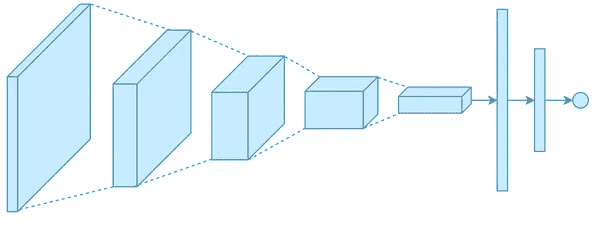
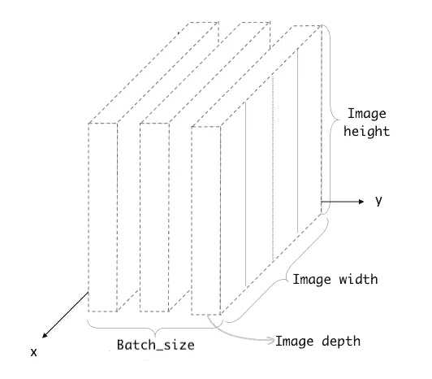
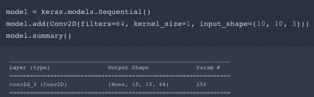
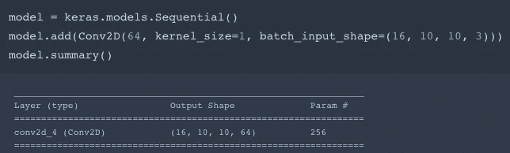
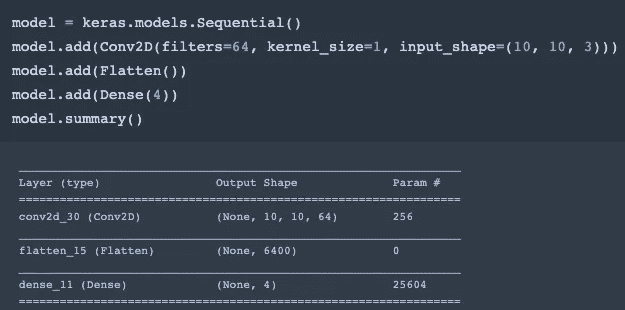

# 了解卷积神经网络中的输入输出形状| Keras

> 原文：<https://towardsdatascience.com/understanding-input-and-output-shapes-in-convolution-network-keras-f143923d56ca?source=collection_archive---------0----------------------->

即使我们从理论上理解了**卷积神经网络**，但在将数据拟合到网络时，我们中的很多人仍然会对其**输入**和**输出**的形状感到困惑。本指南将帮助您理解卷积神经网络的输入和输出形状。

让我们看看输入形状是什么样的。输入到 **CNN** 的数据将如下图所示。我们假设我们的数据是图像的集合。

ConvNet Input Shape

## 输入形状

你总是需要给 CNN 一个 4D 数组作为输入。因此输入数据的形状为 *(batch_size，height，width，depth)* ，其中第一维表示图像的**批量大小**，其他三维表示图像的维度，即高度、宽度和深度。对于那些想知道图像深度是什么的人来说，它只不过是颜色通道的数量。例如， **RGB** 图像的深度为 3，而**灰度**图像的深度为 1。

## 输出形状

CNN 的输出也是一个 4D 阵列。其中**批次大小**将与输入批次大小相同，但是图像的其他 3 个维度可能会根据过滤器**、**内核大小和我们使用的填充的值而改变。

让我们看看下面的代码片段。

Snippet-1

不要被这里的 **input_shape** 论点所欺骗。虽然它看起来像我们的输入形状是三维的，但你必须在拟合数据时通过一个 4D 数组，应该像 *(batch_size，10，10，3)* 。因为在 **input_shape** 参数中没有批量值，所以我们可以在拟合数据时使用任何批量值。

你可以注意到**输出**的形状是*(无，10，10，64)* 。第一维表示批量大小，目前为**无**。因为网络事先不知道批量大小。一旦您拟合了数据， **None** 将会被您在拟合数据时给出的批量所取代。

让我们看看另一个代码片段。

Snippet-2

这里我用**批处理输入形状**替换了**输入形状**参数。顾名思义，该参数会提前询问您批次大小，在拟合数据时您可以不提供任何其他批次大小。例如，您必须使 16 个批次中的数据仅适合网络。

现在，您可以看到输出形状的批量大小也是 16，而不是 **None** 。

## 在卷积层上附加密集层

我们可以简单地在另一个卷积层的顶部添加一个卷积层，因为卷积的输出维度与其输入维度相同。

我们通常在**卷积**层的顶部加上**密集**层，对图像进行分类。然而输入数据到密集层 2D 数组的形状 *(batch_size，units)* 。卷积层的输出是 4D 阵列。因此，我们必须将从卷积层接收的输出的维度改变为 2D 阵列。

Snippet-3

我们可以在**卷积**层的顶部插入一个**展平**层。展平图层将图像的三维压缩为一维。现在我们只有一个形状为 *(batch_size，squaded _ size)*的 2D 数组，对于密集层来说是可以接受的。

# 摘要

*   你总是需要将一个形状为 *(batch_size，height，width，depth)* 的 4D 数组输入到 **CNN** 中。
*   来自 **CNN** 的输出数据也是一个形状为 *(batch_size，height，width，depth)的 4D 数组。*
*   要在 **CNN** 图层上添加**密集**图层，我们必须使用**展平**图层将 CNN 的 4D 输出更改为 2D。

阅读我的下一篇文章，了解 **LSTM** 中的**输入**和**输出**形状。

 [## 了解 LSTM | Keras 中的输入和输出形状

### 当我开始研究 LSTM 网络时，我对输入和输出的形状感到非常困惑。这篇文章将…

medium.com](https://medium.com/@shivajbd/understanding-input-and-output-shape-in-lstm-keras-c501ee95c65e)