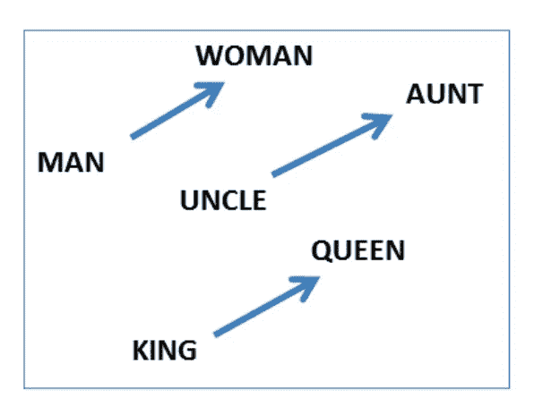
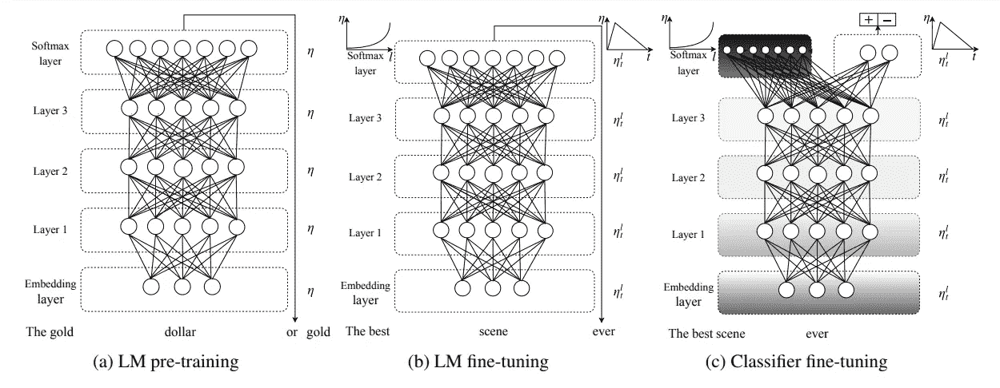
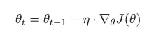
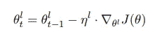
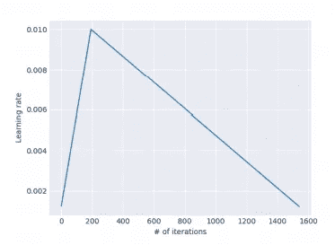
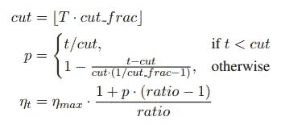

# 理解语言建模(NLP)和使用 ULMFIT

> 原文：<https://towardsdatascience.com/understanding-language-modelling-nlp-part-1-ulmfit-b557a63a672b?source=collection_archive---------9----------------------->

## 使用带代码的 ULMFIT 进行文本分类

语言模型是单词序列的概率分布。这种语言模型被用作各种自然语言处理任务的基础模型，包括文本分类、摘要、文本生成等等。

建议先对深度学习和迁移学习有一个基本的认识，再继续这个博客。

LMs 使得映射上下文更加容易。男人对女人的映射相当于叔叔对阿姨，国王对女王。这种映射被转换成词汇间的联合概率分布。这被称为统计 LM。

**给定这样一个序列，比如长度为 *m* ，LM 给整个序列分配一个概率 P{w1，w2，…，wm }。**

由于词汇表的长度，统计 LMs 面临数据稀疏的问题。而神经语言模型(NLM)仅将单词序列作为输入，这解决了数据稀疏的问题。

在不深入语言模型数学的情况下，让我们理解 ULMFIT 是如何工作的，这将给出一个关于神经语言模型的想法。

通用语言模型微调(ULMFIT)是一种迁移学习技术，可以帮助完成各种 NLP 任务。很长一段时间以来，它一直是最先进的 NLP 技术，但后来它被 BERT(最近在文本分类方面被 XLNet 取代)取代了。我们将在博客的下一部分详细研究 BERT。

> 乌尔菲特的优点

深度学习需要大量数据集。具体来说，在进行迁移学习时，我们有一个大型数据集，我们的基础模型就是在这个数据集上构建的，我们将学习神经网络的参数迁移到我们的领域特定数据集。当我们有一个更小的特定领域数据集时，模型会过拟合。为了解决这个问题，杰瑞米·霍华德和塞巴斯蒂安·鲁德在他们的论文《关于文本分类的通用语言模型微调的**中提出了 3 种不同的技术，用于针对 NLP 特定任务的迁移学习 LMs 中的微调**

*   ****区别微调****
*   ****倾斜三角形学习率****
*   ****逐步解冻****

**让我们了解使用 ULMFiT 创建文本分类器的各个阶段，通过它我们将了解作者建议的 3 种新技术。**

****

**ULMFiT 包括 3 个主要阶段:LM 预训练、LM 微调和分类器微调。**

**该方法是通用的，因为它满足这些实用标准:**

1.  **它适用于不同文档大小、数量和标签类型的任务。**
2.  **它使用单一的架构和培训流程。**
3.  **它不需要定制的特征工程或预处理。**
4.  **它不需要额外的域内文档或标签。**

**AWD-LSTM 是一个 [*最先进的*](https://arxiv.org/abs/1708.02182) 语言模型，一个常规的 LSTM(没有关注、快捷连接或其他复杂的添加)，具有各种调整过的丢失超参数。作者使用 AWD-LSTM 作为他们建筑中的 LM。**

# **(a)法律硕士职前培训**

**LM 在一个**通用领域语料库**上接受训练，以捕获不同层次语言的一般特征**

**我们在大型通用领域语料库上预先训练 LM，并使用新技术在目标任务上对其进行微调。因此，作者们使用了 Wikitext-103，这是一个由 2.8 万篇预处理文章组成的数据集，包含 1.03 亿个单词。一般来说，数据集应该非常大，以至于 LM 可以学习语言的所有属性。就计算资源和时间而言，这也是最昂贵的。因此我们只做一次。**

# ****(b) LM 微调****

**在几乎所有情况下，目标任务数据集相对于一般领域语料库将具有不同的分布。在这个阶段，我们通过使用 ***判别微调和倾斜三角形学习率，在目标任务数据集上微调模型以学习其分布。*****

**由于不同的层次掌握不同的信息，作者建议对每一层进行不同程度的微调。**

**在随机梯度下降中，我们在每个时间步长 t 更新θ。**

****

**Regular SGD**

**在区别微调中，我们使用θ1、θ2、… θL，而不是各个 L 层的单个θ值。**

****

**Discriminative Learning rate**

> **U 在整个培训过程中保持相同的学习率(LR)或一个稳定的学习率并不是实现这种行为的最佳方式。相反，我们提出倾斜的三角学习率(STLR)**

****

**The slanted triangular learning rate schedule used for ULMFiT as a function of the number of training iterations.**

**在 STLR，作者建议线性增加学习速率，并以下列方式衰减它。**

****

**在哪里，**

*   ****T** 是训练迭代次数**
*   ****cut_frac** 是迭代的分数**
*   ****cut** 是我们从增加 LR 切换到减少 LR 时的迭代**
*   **p 是我们分别增加或减少 LR 的迭代次数的分数**
*   ****比率**指定最低 LR 比最大 LR ηmax 小多少**
*   ****ηt** 是迭代 t 时的学习率**

*****STLR 曾经用*** [***达到最先进的***](https://arxiv.org/abs/1608.03983) ***成绩 CV*****

# ****(c)选粉机微调****

**微调是迁移学习的最重要的状态，需要尽最大的努力。因为过于激进的微调会使我们的模型过拟合，反之也会使我们的模型欠拟合。作者建议采用逐步解冻的方法来解决这一重大问题。**

**我们从解冻最后一层开始，因为它包含了最基本的知识。在微调一个时期的未冻结层之后，我们继续下一个较低层，并重复直到我们完成所有层，直到在最后一次迭代中收敛。**

**用于文本分类的****(BPT3C)语言模型通过时间反向传播(BPTT)来训练，以实现大输入序列的梯度传播。为了使针对大文档的分类器的微调变得可行，作者提出了用于文本分类的**BPTT(BPT3C):**将文档分成大小为 b 的固定长度的批次，在每个批次开始时，用前一批次的最终状态来初始化模型；跟踪平均池和最大池的隐藏状态；梯度被反向传播到其隐藏状态对最终预测有贡献的批次。在实践中，作者建议使用可变长度反向传播序列。******

******所以，现在我们完成了压倒性的理论。让我们深入研究代码！！******

******我们将在 quora 的问题文本上实现文本分类，找出不真诚的问题。数据集在 [*kaggle*](https://www.kaggle.com/c/quora-insincere-questions-classification/overview) 可用。******

******代码即将发布。在此之前，请亲自尝试。******