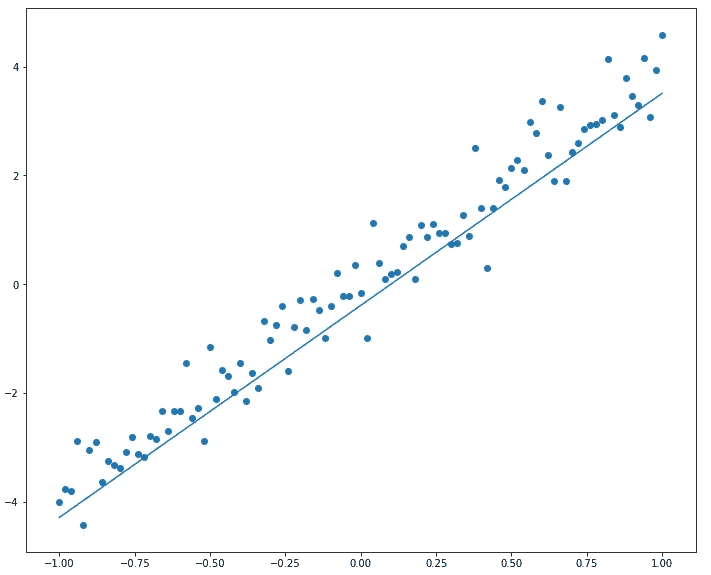

# 理解线性回归和梯度下降的必要性

> 原文：<https://towardsdatascience.com/understanding-linear-regression-and-the-need-for-gradient-descent-2cc0f25763d5?source=collection_archive---------21----------------------->

## 从头开始实现线性回归

在这里，我将从头开始用 python 实现一元线性回归，以更好地理解算法和梯度下降的需要。在我们开始之前，这里有一个线性回归算法的快速概述。

## 线性回归:概述

假设我们有所有朋友的身高和体重。假设一个人的体重只是身高的函数，没有其他因素，如果我们知道一个新人的身高，我们如何预测他的体重呢？这就是我们使用一元线性回归的地方。当要预测的值或目标变量是连续的时，我们采用线性回归。线性回归是一种机器学习算法，它试图将给定的一组点拟合到一条直线上，y = ax + b。


在我们的示例中，因变量 y 将是身高，自变量 x 将是体重，线性回归算法的工作是找到 **a** 和 **b** 的值，这样 **ax + b** 将绘制一条符合所有(体重、身高)坐标的直线，即给出相应的体重。现在我们来谈谈它是如何做到这一点的。

## 该算法

线性回归算法通过最小化预测点和实际点之间距离的均方误差(MSE)来找到 **a** 和 **b** 的正确值。

这本质上是一个优化问题，其中需要确定 **a** 和 **b** 的值，这是通过找到某个损失函数的最小值来确定的。该算法从 **a** 和 **b** 的一些初始值开始，并计算 y。然后找到实际点(y_actual)和由预测 y 值(y_pred)给出的点之间的距离。该算法计算距离的平方和及其平均值。这个平均值或 MSE 是需要通过优化问题最小化的损失函数。


Finding the distance between the predicted points and the actual points

## Python 实现

现在我们知道了算法是如何工作的，让我们试着用 python 来实现它。

让我们导入一些我们需要的库，matplotlib 来绘制我们的线，numpy 来处理我们的数据。

```
import matplotlib.pyplot as plt
import numpy as np
```

现在让我们为 x 和 y 取一些值，

```
x = np.array([0, 1, 2, 3, 4, 5, 6, 7, 8, 9]) 
y = np.array([1, 3, 2, 5, 7, 8, 8, 9, 10, 12])
```

x 和 y 都具有(10)的形状，绘制时看起来如下图所示，

```
plt.scatter(x, y)
```


让我们初始化 a 和 b，并定义计算 y_pred 和 mse 的方程。

```
a = b = 0y_ = a * x + bmse = np.mean((y — y_)**2)print(mse)>>54.1
```

对于给定的 x 和 y 值，mse 的初始值为 54.1。我们现在的目标是使其尽可能接近零。

让我们选择一个方向来遍历并更新 a 和 b 的值，直到我们的 mse 为零。我要把 a 和 b 都增加随机值，每一步 0.01，看看会得到什么。

```
while mse > 0:

  a = a+0.01
  b = b+0.01
  y_ = a * x + b

  if np.mean((y — y_)**2) < mse :
   mse = np.mean((y — y_)**2)

  else :
   print (a,b,mse)
   break>>>1.1900000000000008 1.1900000000000008 0.5634000000000003
```

当我们的 a 和 b 都是 1.19 时，我们的 mse 值下降到 0.563。

让我们画出结果线，看看它与我们的实际点是如何吻合的。

```
y_pred = a * x + bplt.figure(figsize = (12, 10))plt.plot(x, y_pred, label = ‘Predicted’)
plt.scatter(x, y, label = ‘Actual’)plt.show()
```



我们的路线似乎符合要点，但并不那么好。让我们将这个结果与成熟的线性回归模型(如 sklearn 模型)产生的结果进行比较。

```
x = x.reshape(-1,1)
y = y.reshape(-1,1)from sklearn.linear_model import LinearRegressionreg_model = LinearRegression().fit(x, y)y_pred = reg_model.predict(x)plt.figure(figsize = (12, 10))plt.plot(x, y_pred, label = ‘Predicted’)
plt.scatter(x, y, label = ‘Actual’)plt.show()
```


sklearn 回归器生成的直线似乎完全符合这些点。让我们看看 a 和 b 的值是多少。

```
reg_model.intercept_>> array([1.23636364])reg_model.coef_>> array([[1.16969697]])
```

接近但不相同。显然，他们采取了不同的路线来最小化他们的 mse，并以不同的值结束。

让我们用一组不同的 x 和 y 再试一次。

```
x = np.linspace(-1, 1, 101)
y = 4 * x + np.random.randn(101) * 0.44
print (x.shape , y.shape)>> (101,) (101,)
```


我们现在的初始 mse 是 5.79788117428826。让我们再运行一次同样的代码，看看我们得到的 a 和 b 的值是多少，在我们的探索中得到这个 5.7 到 0。

```
while mse > 0:

  a = a+0.01
  b = b+0.01
  y_ = a * x + b

  if np.mean((y — y_)**2) < mse :
   mse = np.mean((y — y_)**2)

  else :
   print (a,b,mse)
   break>>>1.0300000000000007 1.0300000000000007 4.4175244648874
```

很明显，我们选择的路线是条死胡同。当我们尝试将 a 和 b 都增加 0.01 时，我们的 mse 停留在 4.4，离 0 很远。没关系，让我们试试不同的路线。

```
while mse > 0:

 a=a+0.1
 b=b-0.01
 y_ = a * x + b

 if np.mean((y — y_)**2) < mse :
 mse = np.mean((y — y_)**2)

 else :
 print (a,b,mse)
 break>> 4.000000000000002 -0.4000000000000002 0.34416766289398254
```

那似乎更好。让我们试着画出来，看看这条线有多吻合。


再次，接近，但可以更好。很明显，需要改变的是我们上下遍历数轴寻找 a 和 b 的正确值的方式，但是我们如何知道是减少还是增加，如果是，增加多少？有一百万条不同的路径可供我们选择，但没有一条路径适用于每一个数据集。

这个问题的答案是**梯度下降**。我们通过在损失负梯度的最陡下降方向上迭代行进来最小化损失。

称为学习率的模型超参数决定步长。学习率 x 梯度给出了我们更新 a 和 b 的值。我们将在以后的帖子中更深入地研究梯度下降算法。