# 了解逻辑回归系数

> 原文：<https://towardsdatascience.com/understanding-logistic-regression-coefficients-7a719ebebd35?source=collection_archive---------1----------------------->

Photo by [Franki Chamaki](https://unsplash.com/@franki?utm_source=medium&utm_medium=referral) on [Unsplash](https://unsplash.com?utm_source=medium&utm_medium=referral)

## 或者更好地从证据的角度思考概率

逻辑回归有一个共同的缺点:系数很难解释。如果你符合逻辑回归模型，你可能会说“如果变量 X 增加 1，那么因变量发生的概率增加？？?"但是“？？?"有点难以填写。

诀窍在于将“概率”一词改为“**证据**”在这篇文章中，我们将了解如何量化证据。利用这一点，我们将讨论如何**解释逻辑回归系数**。

最后，我们将在此背景下简要讨论**多类**逻辑回归，并将其与[信息论](https://en.wikipedia.org/wiki/Information_theory)联系起来。

这篇文章假设你有解释*线性*回归系数的经验，并且之前至少看过一次[逻辑回归](https://en.wikipedia.org/wiki/Logistic_regression)。

# 第 1 部分:思考概率的另外两种方式

## 几率和证据

我们习惯于把概率想成 0 到 1 之间的数字(或者等价地，0 到 100%)。但这只是“似是而非程度”的一种特殊数学表示

还有你所熟悉的第二种“似是而非程度”的表示法:优势比。比如我告诉你“一个观测被正确分类的几率是 2:1”，你可以查一下正确分类的概率是三分之二。同样，“偶数”的意思是 50%。

我的目标是说服你采用第三种方法:对数赔率，或赔率的对数。为了解释，我们将把对数几率称为**证据。这是继 E.T. [杰恩斯](https://en.wikipedia.org/wiki/Edwin_Thompson_Jaynes)2003 年的巨著[概率论](https://www.cambridge.org/core/books/probability-theory/9CA08E224FF30123304E6D8935CF1A99#):科学的逻辑之后。**

一般来说，使用数学表示法时有两个考虑因素。首先，它应该是可解释的。第二，数学性质要方便。

## 解释证据:哈特利的测量

为了让你相信证据是可以解释的，我会给你一些数字来校准你的直觉。

首先，证据可以用许多不同的单位来衡量。我们先从一个开始，哈特利号。哈特利有很多名字:艾伦·图灵称它为“ban ”,是以 T2 布莱切利公园附近的一个城镇的名字命名的，二战期间，英国人在这里破译了纳粹的通讯。它也被称为“dit”，是“十进制数字”的缩写

寻找哈特利事件中概率为 *p* 的证据的公式非常简单:

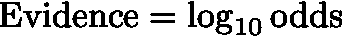

Computing the evidence, in Hartleys

其中几率为 p/(1-p)。这一点用下面的表格来解释要容易得多。请注意，为了使概率看起来更好，已经明智地使用了舍入。通过这种仔细的舍入，很明显 1 哈特利大约是“1[9](https://en.wikipedia.org/wiki/List_of_unusual_units_of_measurement#Nines)”

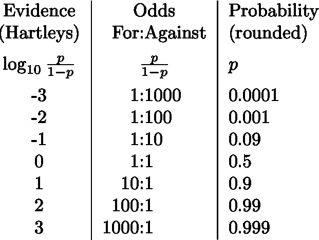

Table of Evidence, Odds, and Probability

请注意，1 哈特利是一个事件相当多的证据。一个更有用的度量单位可能是十分之一哈特利。一个“德西-哈特利”听起来很可怕，所以更常见的名字是“**德西班**”或**分贝**。这是另一个表格，这样你就可以了解一个决策的信息量。希望你能看到这是一个衡量证据的合适尺度:不太大也不太小。

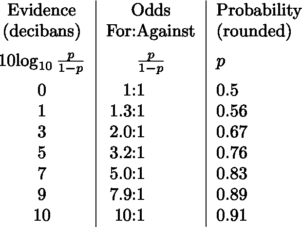

## 使用证据:贝叶斯法则

我也说过证据应该有方便的数学性质。事实证明，证据自然出现在贝叶斯统计中。

假设我们希望将一个观察结果分为真或假。我们可以写:

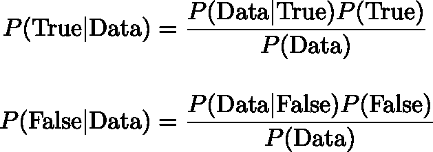

Bayes’ Law for Binary Classification

在贝叶斯统计中，每个等式的左侧被称为“后验概率”，是在看到数据后分配的概率**。右手边的 P(真)和 P(假)分别是我们在**看到数据之前**的“先验概率”。我们认为这些概率是信念的状态，贝叶斯法则告诉我们如何从信念的前一状态进入后一状态。如果你不喜欢花哨的拉丁词，你也可以称之为“信念”。**

更多关于我们先前的信仰状态。这里的标准方法是计算每个概率。这可能是你曾经被迫做的一件苦差事。巧妙的方法是从考虑**几率**开始。如果我们把前面的两个等式分开，我们得到一个“后验概率”的等式

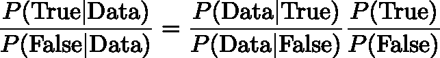

The Posterior Odds

然后我们将考虑**证据**，我们将把它记为 Ev。因此 Ev(True)是真实分类的先验(“之前”)证据。而 Ev(True|Data)是后验(“after”)。我们以哈特利为单位，取 10 为基数的对数:

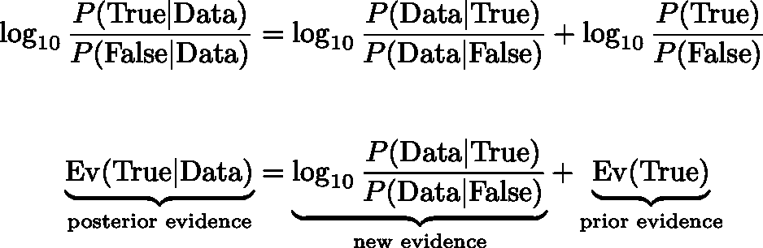

The Data Science process, quantified

在二元分类的背景下，这告诉我们，我们可以将数据科学过程解释为:收集数据，然后对你已经拥有的假设证据进行加减。通过量化证据，我们可以使这相当字面:你增加或减少数量！

## 其他单位系统

衡量证据有三种常见的单位约定。我们见过一个，它使用 Hartley/bans/dits(或 decibans 等。).当我们取以 10 为底的对数时，就出现了这种单位的选择。

下一个单元是“ [nat](https://en.wikipedia.org/wiki/Nat_(unit)) ”，有时也被称为“nit”简单的取以 *e.* 为底的对数就可以算出来，回想一下 *e* ≈2.718 就是[欧拉数](https://en.wikipedia.org/wiki/E_(mathematical_constant))。

最后一个常见单位是“位”，通过以 2 为底的对数来计算。它有时也被称为[香农](https://en.wikipedia.org/wiki/Shannon_(unit))，以信息论的传奇贡献者[克劳德·香农](https://en.wikipedia.org/wiki/Claude_Shannon)命名。

在计算机发明之前，哈特利是最常用的证据和信息单位，因为它比其他两个更容易计算。(注意，信息与证据略有不同；更多见下文。)

随着计算机的出现，转向比特是有意义的，因为信息理论通常涉及在使用物理比特的计算机上传输和存储信息。

最后，根据数学家的说法，自然对数是最“自然”的。因此，这是许多软件包的默认选择。在物理学中也很常见。

我相信，我也鼓励你相信:

*   Hartley 或 deciban(基数为 10)是最容易解释的，应该由对量化证据感兴趣的数据科学家使用。
*   对量化信息感兴趣的计算机科学家应该使用这种比特。
*   物理学家应该使用 nat，例如计算物理系统的熵。

请注意，对于数据科学家来说，这涉及到从默认选项(nat)转换模型输出。

最后，这里有一个单位换算表。我凭经验发现，许多人知道他们头顶上的第一行。0.69 是 72 的[法则的基础，常见于金融学。3.01 ≈ 3.0 是很多电气工程师都熟知的(“3 分贝是功率的两倍”)。](https://en.wikipedia.org/wiki/Rule_of_72)

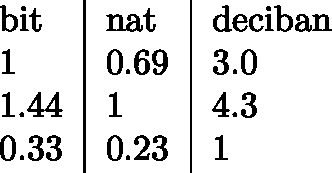

Unit Conversion Table for Evidence

## 将证据转化为赔率和概率

刚刚说了我们应该用 decibans 代替 nats，我将在 nats 中做这一部分，这样如果你以前见过它们，你就能认出它们。让我们将证据(在 nats 中)表示为 *S* 。公式是:

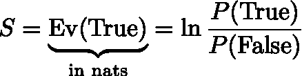

Formula for the Evidence *S in nats*

假设真的证据是 s，那么几率和概率可以计算如下:

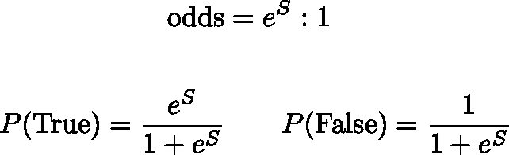

Converting evidence S to odds or a probability

如果最后两个公式看起来令人困惑，只要计算出你的马赢的概率，如果赔率是 2:3。首先将 2 和 3 相加，然后将 2 除以它们的和。

# 第 2 部分:理解逻辑回归

如果你相信我，证据是思考问题的好方法，那么希望你开始看到一个解释逻辑回归的非常清晰的方法。首先，记住[逻辑 s 形函数](https://en.wikipedia.org/wiki/Sigmoid_function):

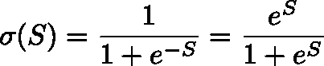

希望你看到的不是复杂混乱的符号，而是将信息转化为概率的函数。和上面的一模一样！

让我们把因变量看作一个 0/1 值的指标。所以在上面的语言中 0 =假，1 =真。逻辑回归模型是

其中 X 是观测值的向量(包括常数)，β是系数的向量，σ是上面的 sigmoid 函数。

这直接告诉我们，我们可以将一个系数解释为相关预测因子的每次变化所提供的证据量。

例如，假设我们正在为在线视频分类“**会不会火起来**”，我们的预测指标之一是视频中有一只猫(“猫”)的时长。

*   如果这个“猫”变量的系数达到 3.7，这告诉我们，猫的存在每增加一分钟，我们就有 3.7 个国家(16.1 分位数)的证据证明视频会像病毒一样传播。
*   将来自所有预测者的所有证据(以及先前的证据——见下文)相加，你会得到一个总分。
*   如果总证据为正，则分类为“真”或 1，如果总证据为负，则分类为“假”或 0。但更关键的是，看看你有多少证据就知道了！

## 混合物

我选择了几个不深入探讨的要点。

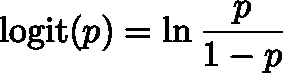

The logit function is the inverse of the logistic function

1.  逻辑 sigmoid 函数的逆函数是上面给出的 **logit，**。许多作者用 logit 来定义逻辑回归。逻辑函数将证据转换为概率，它的逆函数将概率转换为证据。
    此外，像往常一样，数学是以纳特为单位的，但是如果你想要不同的单位，你当然可以自由地使用不同的对数基数。
2.  前**后**没什么可怕的。默认情况下，您选择了“无论如何都没有证据”的优先选项，换句话说，0 个证据。希望这看起来合理。改变你的先验就相当于改变了分类的门槛。这是一个思考如何构建 [ROC 曲线](https://en.wikipedia.org/wiki/Receiver_operating_characteristic)的好方法。
3.  你可以检查一下**交叉熵损失**(也称为对数损失或偏差)可以描述如下。让模型给出支持错误预测的证据。然后，在限制为 *S* 较大时，损失为 *S* 。反之，如果 *S* 是给出的有利于正确预测的证据，那么，在 *S* 较大的限度内，交叉熵损失为 *exp(-S)* 。

# 第 3 部分:多类逻辑回归

考虑到上面的讨论，在多类的情况下，直观的做法是**量化有利于每个类的信息**，然后(a) **将**分类到具有最多有利信息的类；和/或(b) **预测每个类别的概率**，使得任意两个类别之间的对数优势比是它们之间的证据差异。

我们可以通过 [softmax 函数](https://en.wikipedia.org/wiki/Softmax_function)来实现(b)。在总共 n 个类别中观察到类别 k 的概率是:

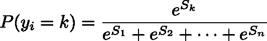

Softmax: Probability of observing class k out of n possibilities given the information in favor of each

将其中的任意两个(比如 k 和ℓ)相除，可以得到合适的对数概率。

我们如何估计有利于每一类的信息？有两种明显的选择:

1.  (**多项式**)注意，从数学上来说，将整个信息列表向有利于每一类的方向移动一定数量的哈特利不会改变概率分布。这是因为我们只关心类之间的信息差异。因此，我们不妨选择一个类，比如⭑类，并将其信息设置为 0。然后估计每个其他类相对于⭑.类的证据
2.  (**一对其余**)对于每个类别，比如类别 k，运行简单的逻辑回归(二元分类)以确定“是否是观察类别 k。”

在 n = 2 的情况下，方法 1 最明显地再现了上面的逻辑 sigmoid 函数。方法 2 也证明是等价的。

**警告**:对于 n > 2，这些方法是 [**不一样的**](https://scikit-learn.org/stable/auto_examples/linear_model/plot_logistic_multinomial.html) 。(好消息是，在选项 1 中选择⭑类别不会改变回归的结果。)

我不打算在这里深入讨论这个问题，因为我没有太多好的参考资料。如果你想阅读更多，可以考虑从 [scikit-learn 文档](https://scikit-learn.org/stable/modules/multiclass.html)开始(其中也谈到了 1v1 多类分类)。如果你有/找到一个好的推荐人，请告诉我！这里的重点更多的是看证据视角如何延伸到多类案件。

# 第四部分:信息论

这将是非常简短的，但我想指出这是如何符合经典信息论的。信息论开始于研究写下一条信息需要多少位以及发送信息的特性。1948 年，Claude Shannon 能够[推导出](https://en.wikipedia.org/wiki/Entropy_(information_theory)#Rationale)发生概率为 *p* 的事件的信息(或熵或惊奇)是:

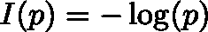

给定概率分布，我们可以计算每个样本的预期信息量，并获得熵 S:

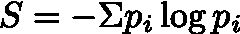

这里我选择了省略对数的底数，它设置了单位(以位、NAT 或 ban 为单位)。物理上，信息是这样实现的，即不可能无损压缩低于其信息内容的消息。

这种联系对我们来说有些松散，但是在二进制的情况下，真的证据是

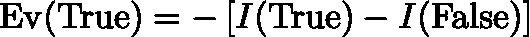

负号是非常必要的，因为在信号分析中，总是发生的事情没有惊奇或信息内容；对我们来说，总是发生的事情有相当多的证据。

# 结论

> 信息是不确定性的解决方案 *——克劳德·香农*

概率是大多数人类共有的共同语言，也是最容易交流的语言。但是它并不是对每种情况都是最好的。在这篇文章中:

*   我们看到计算证据很简单:你只需添加它；
*   我们校准了你对“大量”证据(10-20+分贝)、“一些”证据(3-9 分贝)或“不多”证据(0-3 分贝)的感觉；
*   我们看到了在解释逻辑回归系数和贝叶斯语境中证据是如何自然产生的；和
*   我们看到了它是如何引导我们正确考虑多类情况的

我希望你能养成习惯，把你的系数转换成分贝/分位数，并根据证据而不是概率来思考。

拉维

## 参考/建议

我强烈推荐上面提到的 E.T. Jaynes 的[书](https://www.cambridge.org/core/books/probability-theory/9CA08E224FF30123304E6D8935CF1A99)。

就背景而言，E.T. Jaynes 就是你所谓的激进贝叶斯理论。

*   我在这里提出的“证据”的观点可归因于他，正如所讨论的，在贝叶斯语境中自然产生。
*   这本书的另一大特点是它派生了(！！)概率法则来自于对“似真程度”的定性考虑我发现这在哲学上很有趣。

还有:如果你不想要硬拷贝，谷歌上似乎有很多这本书的 pdf 文件。