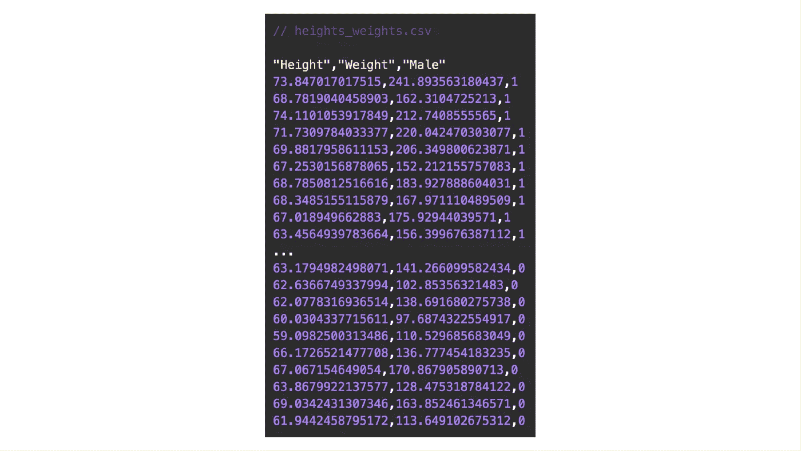

# 逐步理解逻辑回归

> 原文：<https://towardsdatascience.com/understanding-logistic-regression-step-by-step-704a78be7e0a?source=collection_archive---------4----------------------->

## 训练逻辑回归分类器，根据人们的体重和身高预测他们的性别。


逻辑回归是一种流行的用于二元分类的统计模型，即用于类型*这个或那个*、*是或否*、 *A 或 B* 等的预测。然而，逻辑回归可用于多类分类，但这里我们将集中讨论其最简单的应用。

作为一个例子，考虑**根据某人的**体重**和**身高**预测其性别**(男/女)的任务。

为此，我们将*从一万个人的体重和身高样本的数据集训练*一个机器学习模型。数据集取自[Conway&Myles Machine Learning for Hackers 一书第二章](https://amzn.to/2Xjkuqa)，可以直接下载[这里](https://raw.githubusercontent.com/johnmyleswhite/ML_for_Hackers/master/02-Exploration/data/01_heights_weights_genders.csv)。

这是数据的预览:



每个样本包含三列:*身高*、*体重*和*男性*。

*   *高度*英寸
*   以磅为单位的重量
*   *男性:* 1 表示测量对应男性，0 表示测量对应女性。

有 5000 个来自男性的样本，5000 个来自女性的样本，因此数据集是平衡的，我们可以继续进行训练。

Python 的 scikit-learn 代码训练逻辑回归分类器并做出预测非常简单:

一般的工作流程是:

1.  获取数据集
2.  训练分类器
3.  使用这种分类器进行预测

# 逻辑回归假设

逻辑回归分类器可以通过类比 ***线性回归假设*** *得出，即*:


Linear regression hypothesis.

然而，逻辑回归假设*从线性回归假设中概括出*，因为它使用了 ***逻辑函数*** :


结果是逻辑回归假设:


Logistic regression hypothesis.

函数 **g(z)** 是**逻辑函数**，也称为*s 形函数*。

逻辑函数在 0 和 1 处有渐近线，它在 0.5 处穿过 y 轴。


Logistic function.

# 逻辑回归决策边界

由于我们的数据集有两个特征:身高和体重，逻辑回归假设如下:


逻辑回归分类器将预测“男性”,如果:


这是因为逻辑回归“*阈值*”被设置为 g(z)=0.5，请参见上面的逻辑回归函数图进行验证。

对于我们的数据集，θ值为:


要获得 scikit-learn 计算的θ参数，可以:

```
**# For theta_0:**print( fitted_model.intercept_ )**# For theta_1 and theta_2:**print( fitted_model.coef_ )
```

有了这些系数，一个*手动*预测(也就是说，不使用函数 **clf.predict()** )将只需要计算向量积


并检查结果标量是否大于或等于零(预测男性)，否则(预测女性)。

**以**为例，假设我们想要预测某个身高***= 70 英寸******体重= 180 磅*** 的人的性别，就像上面脚本 LogisticRegression.py 的第 14 行一样，我们可以简单地做:


Making a prediction using the Logistic Regression parameter θ.

由于乘积的结果大于零，分类器将预测男性。

这里可以看到 ***决策边界*** 和完整数据集的可视化:


正如你所看到的，在决策边界的上方是大多数对应于男性类别的**蓝色点，在它的下方是所有对应于女性类别**的**粉色点。**

此外，只看数据你就能知道预测不会完美。这可以通过包括更多的特征(除了体重和身高)以及潜在地使用不同的判定边界来改进。

逻辑回归决策边界也可以是非线性函数，例如高次多项式。

# 计算逻辑回归参数

scikit-learn 库在抽象逻辑回归参数θ的计算方面做得很好，它是通过解决一个优化问题来完成的。

我们先来定义两个兴趣点的逻辑回归代价函数:y=1，y=0，也就是假设函数预测男性或女性的时候。


然后，我们在这两项的 **y** 中取一个凸组合，得出逻辑回归成本函数:


Logistic regression cost function.

逻辑回归成本函数是凸的。因此，为了计算θ，需要解决以下(无约束)优化问题:


有多种方法可用于解决这种无约束优化问题，例如一阶方法 ***梯度下降*** 需要逻辑回归成本函数的梯度，或者二阶方法例如 ***牛顿法*** 需要逻辑回归成本函数的梯度和 Hessian 这是上述 scikit-learn 脚本中规定的方法。

对于梯度下降的情况，搜索方向是逻辑回归成本函数相对于参数θ的负偏导数:


Partial derivative of the logistic regression cost function.

在其最基本的形式中，梯度下降将沿着θ的负梯度方向迭代(称为*最小化序列*)，直到达到收敛。


Prototype of gradient descent.

注意，常数α通常被称为*学习速率*或*搜索步骤*，它必须被仔细调整以达到收敛。算法如 [*回溯线搜索*](https://en.wikipedia.org/wiki/Backtracking_line_search) 辅助确定α。

总之，这是您下次使用或实现逻辑回归分类器时应该记住的三个基本概念:

> 1.逻辑回归假设
> 
> 2.逻辑回归决策边界
> 
> 3.逻辑回归成本函数

对于应用于具有更多特征的数据集的逻辑回归分类器的讨论(也使用 Python ),我推荐 [Susan Li](https://medium.com/u/731d8566944a?source=post_page-----704a78be7e0a--------------------------------) 的这篇[中期文章](/building-a-logistic-regression-in-python-step-by-step-becd4d56c9c8)。

## 参考资料和进一步阅读:

*   [https://github . com/gchave z2/code _ machine _ learning _ algorithms](https://github.com/gchavez2/code_machine_learning_algorithms)
*   [吴恩达关于逻辑回归的讲座](https://www.coursera.org/learn/machine-learning)
*   [scikit-learn 的逻辑回归类](https://scikit-learn.org/stable/modules/generated/sklearn.linear_model.LogisticRegression.html)

我是劳伦斯·伯克利国家实验室的博士后研究员，我在机器学习和高性能计算的交叉领域工作。

*如果你觉得这篇文章很有意思，可以随意在*[*LinkedIn*](https://www.linkedin.com/in/guschavezcs/)*打个招呼，我总是很乐意与该领域的其他专业人士联系。*

*一如既往:欢迎评论、提问和分享！❤️*

[](http://eepurl.com/giSKB9)

No Spam, ever.