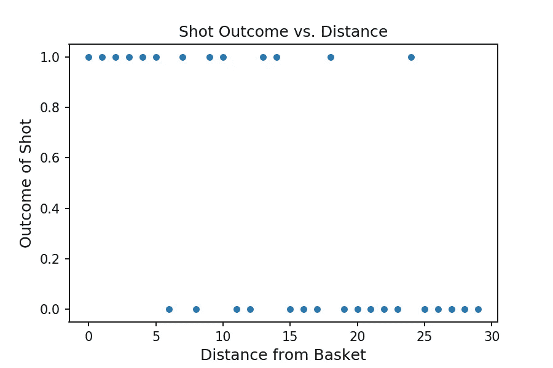
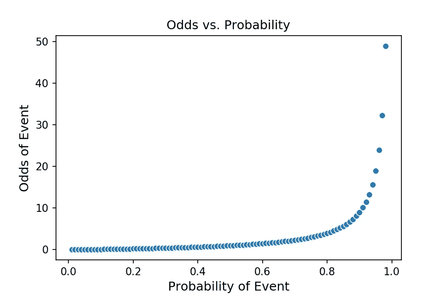
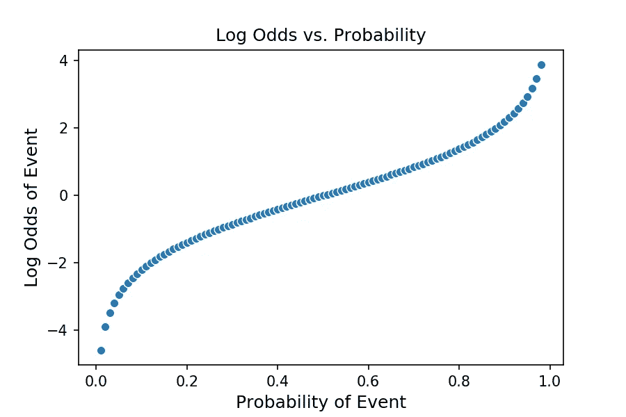
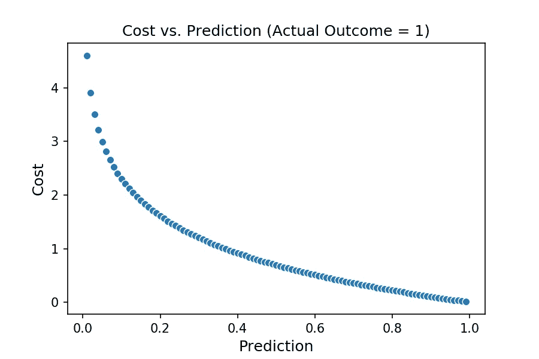
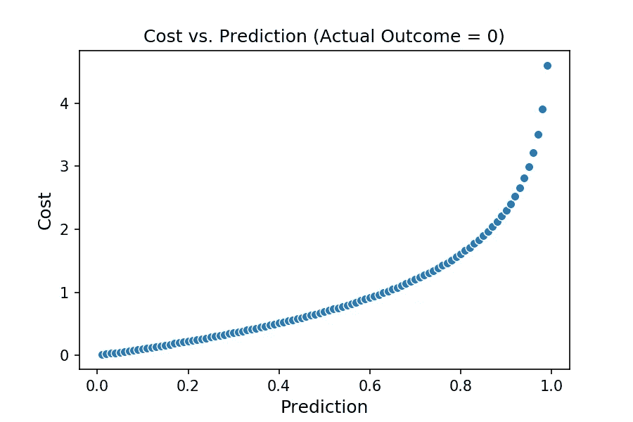
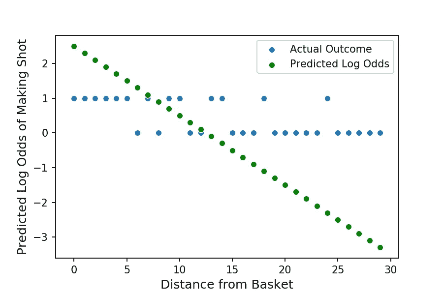
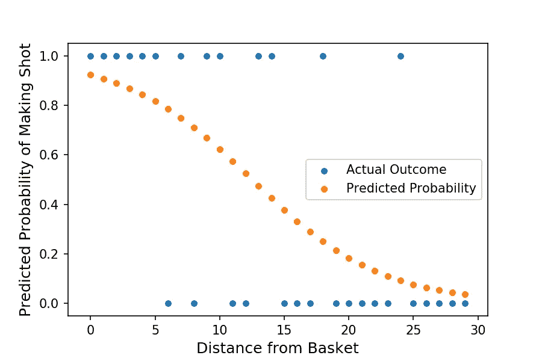

# 理解逻辑回归

> 原文：<https://towardsdatascience.com/understanding-logistic-regression-using-a-simple-example-163de52ea900?source=collection_archive---------2----------------------->

## 通过简单的端到端示例建立直觉

> 如果你有兴趣运行我在这个分析中使用的代码，请查看我的 [GitHub](https://github.com/yiuhyuk/Basketball_Logit_Blog) 。

逻辑回归是进行分类的基本工具之一。作为一名未来的数据科学家，我希望做大量的分类工作。所以我想我更好地理解了逻辑回归在更深层次上的作用(不仅仅是来自 sklearn . linear _ model import logistic regression)。

下面的例子从头到尾介绍了一个非常基本的逻辑回归，这样我(希望你，读者)可以对它的工作原理有更多的直觉。

# 投篮篮

比方说，我想检查我的篮球投篮准确性和我投篮距离之间的关系。更确切地说，我想要一个模型，它以英尺为单位计算“离篮筐的距离”,并计算出我投篮的概率。

首先我需要一些数据。所以我出去从各种距离投篮，同时记录每个结果(1 表示成功，0 表示失败)。在散点图上绘制时，结果如下所示:

一般来说，我离篮筐越远，投篮就越不准。因此，我们已经可以看到我们的模型的大致轮廓:当给定一个小距离时，它应该预测高概率，当给定一个大距离时，它应该预测低概率。

在高层次上，逻辑回归的工作方式很像传统的线性回归。因此，让我们从熟悉的线性回归方程开始:

> ***Y = B0 + B1*X***

在线性回归中，输出 ***Y*** 与目标变量(您试图预测的事物)的单位相同。然而，在逻辑回归中，输出 ***Y*** 是对数概率。除非你花很多时间在体育博彩或赌场上，否则你可能对赔率不太熟悉。赔率只是事件发生概率的另一种表达方式， ***P(事件)*** 。

> ***赔率= P(事件)/【1-P(事件)】***

继续我们的篮球主题，假设我投了 100 个罚球，投进了 70 个。基于这个样本，我罚球的概率是 70%。我罚球的几率可以计算为:

> ***赔率= 0.70/(1–0.70)= 2.333***

因此，如果他们基本上告诉我们同样的事情，为什么麻烦呢？概率被限制在 0 和 1 之间，这成为回归分析中的一个问题。如下图所示，赔率范围从 0 到无穷大。

如果我们取概率的自然对数，那么我们得到的对数概率是无界的(范围从负到正无穷大),并且在大多数概率上大致是线性的！由于我们可以通过逻辑回归估计对数概率，我们也可以估计概率，因为对数概率只是概率的另一种表述方式。

Notice that the middle section of the plot is linear

我们可以写出我们的逻辑回归方程:

> z = B0+B1 *距离篮子
> 
> 其中 Z = log(投篮命中率)

为了从对数赔率中的 ***Z、*** 得到概率，我们应用了 sigmoid 函数。应用 [sigmoid 函数](https://en.wikipedia.org/wiki/Sigmoid_function)是描述以下转换的一种奇特方式:

> 投篮命中率= 1/[1+e^(-z]

既然我们已经了解了如何从对数赔率的线性估计到概率，那么让我们检查一下系数 ***B0*** 和 ***B1*** 在我们用来计算 ***Z*** 的逻辑回归方程中是如何实际估计的。这里有一些在幕后进行的数学计算，但是我将尽我所能用简单的英语解释它，这样你(和我)都可以对这个模型有一个直观的理解。

# 成本函数

像大多数统计模型一样，逻辑回归寻求最小化成本函数。所以我们先来思考一下什么是成本函数。成本函数试图衡量你的错误程度。因此，如果我的预测是正确的，那么应该没有成本，如果我只是有一点点错误，应该有一个小成本，如果我是严重错误，应该有一个高成本。这在线性回归世界中很容易想象，因为我们有一个连续的目标变量(我们可以简单地将实际结果和我们的预测之间的差平方，以计算每个预测对成本的贡献)。但是这里我们处理的是一个只包含 0 和 1 的目标变量。不要绝望，我们可以做一些非常类似的事情。

在我的篮球例子中，我从篮筐的正下方第一次投篮——也就是 ***【投篮结果= 1 |距离篮筐= 0】***。耶，我篮球打得并不差。我们如何将此转化为成本？

*   首先我的模型需要给出一个概率。假设它估计值为 0.95，这意味着它预计我 95%的投篮都是从 0 英尺外命中的。
*   在实际数据中，我只从 0 英尺处拍摄了一次，所以我从 0 英尺处拍摄的实际(采样)精度是 100%。带上那个愚蠢的模特！
*   所以这个模型是错误的，因为根据我们的数据，答案是 100%，但它预测的是 95%。但是这只是一个小小的错误，所以我们只想罚一点点。这种情况下的惩罚是 0.0513(见下面的计算)。请注意，它与实际概率和预测的差值有多接近。还有，我要强调的是，这个误差不同于分类误差。假设默认截止值为 50%，该模型将正确预测 1(因为其预测值为 95% > 50%)。但是这个模型不能 100%确定我会成功，所以我们对它的不确定性进行了一点惩罚。

> -log(0.95) = 0.0513

*   现在让我们假设我们建立了一个蹩脚的模型，它吐出的概率是 0.05。在这种情况下，我们大错特错，我们的代价是:

> -log(0.05) = 2.996

*   这个成本要高很多。模型非常确定我会错过，这是错误的，所以我们要强烈惩罚它；我们之所以能够做到这一点，要感谢我们采用了天然原木。

下面的曲线图显示了成本与我们的预测之间的关系(第一个曲线图描绘了当 ***实际结果=1*** 时，成本相对于我们的预测如何变化，第二个曲线图显示了当 A ***实际结果= 0*** 时，成本如何变化)。

因此，对于给定的观察，我们可以将成本计算为:

*   如果 ***实际结果= 1*** ，那么 ***成本= -log(pred_prob)***
*   否则如果 ***实际结果= 0*** ，那么 ***成本= -log(1-pred_prob)***
*   其中 ***pred_prob*** 是跳出我们模型的预测概率。

对于我们的整个数据集，我们可以通过下式计算出 ***总成本*** :

1.  使用上述程序计算每个观察的个体成本。
2.  将所有单项成本相加得到 ***总成本*** 。

这个 ***总成本*** 是我们想要最小化的数字，我们可以通过[梯度下降](https://en.wikipedia.org/wiki/Gradient_descent)优化来实现。换句话说，我们可以运行优化来找到最小化总成本*的 ***B0*** 和 ***B1*** 的值。一旦我们搞清楚了这一点，我们就有了我们的模型。激动人心！*

# *把这一切联系在一起*

*综上所述，首先我们用最优化来搜索使我们的代价函数最小的 ***B0*** 和 ***B1*** 的值。这给了我们一个模型:*

> *Z = B0 + B1*X*
> 
> *其中 B0 = 2.5，B1 = -0.2(通过优化确定)*

*我们可以看一下我们的斜率， ***B1*** ，它衡量的是距离对我射击精度的影响。我们估计**B1T7 为-0.2。这意味着距离每增加 1 英尺，我投篮的几率就会减少 0.2。 ***B0*** ，y 轴截距，值为 2.5。这是我从 0 英尺(就在篮筐旁边)投篮时，模型的对数赔率预测。通过 sigmoid 函数我们得到了 92.4%的预测概率。在下面的图中，绿点描绘了 ***Z*** ，我们预测的对数几率。***

**

*Almost there!*

*我们快完成了！由于 ***Z*** 是对数赔率，我们需要使用 sigmoid 函数将其转换成概率:*

> *投篮命中率= 1/[1+e^(-z]*

****投中概率，*** 我们所追求的最终输出在下图中用橙色的点来描绘。注意曲率。这意味着我的特征(距离)和我的目标之间的关系不是线性的。在概率空间中(不像对数赔率或线性回归)，我们不能说我投篮的距离和我投篮的概率之间有恒定的关系。相反，距离对概率的影响(连接橙色点的线的斜率)本身就是我目前站在离篮子多远的函数。*

**

*Nice! We have our probabilities now*

*希望这有助于你更好地理解逻辑回归(写它肯定帮助了我)。*

*如果你总体上喜欢这篇文章和我的写作，请考虑通过我的推荐链接注册 Medium 来支持我的写作。谢谢！*