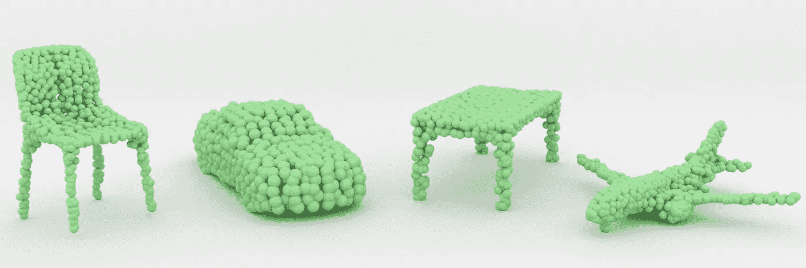
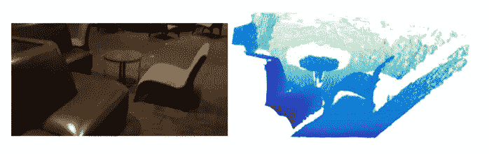
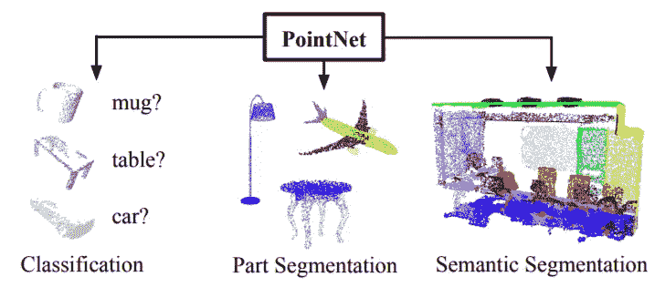
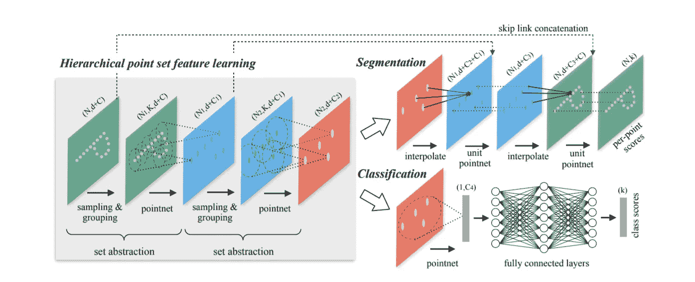
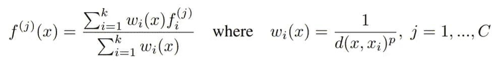
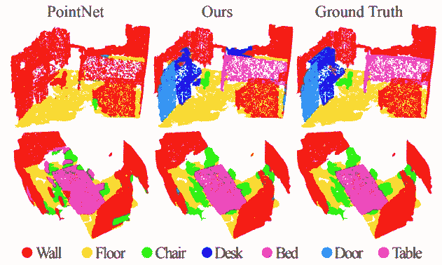

# 通过 PointNet++理解点云上的机器学习

> 原文：<https://towardsdatascience.com/understanding-machine-learning-on-point-clouds-through-pointnet-f8f3f2d53cc3?source=collection_archive---------3----------------------->

# 介绍

数据可以采用多种形式。对于处理视觉信息，图像是非常常见的。图像存储二维像素网格，通常代表我们的三维世界。机器学习中一些最成功的进步来自涉及图像的问题。然而，对于直接在 3D 中捕获数据，具有表示整个体积的三维像素阵列是不常见的。

在 3D 中检索空间数据的最简单且最具成本效益的方法之一是通过点云。令人惊讶的是，针对点云的机器学习工作做得并不多，大多数人对这个概念并不熟悉。

在本文中，我将:

1.  定义点云及其所在的空间。
2.  了解机器学习中涉及点云的问题。
3.  打开一篇关于点云机器学习的开创性研究论文——point net++。

# 什么是点云？

顾名思义，点云是空间中数据点的集合。收集 3D 数据的一种流行方式是通过扫描仪，扫描仪通过一系列坐标检测物体的表面。将信息存储为空间坐标的集合可以节省空间，因为许多对象不会占据很多环境。

An image and a 3D point cloud representation detected by a scanner.

然而，点云并不局限于 3D。任何高维物体的集合都可以被认为是点云。即使信息本质上不是可视的，将数据解释为点云也有助于理解多个变量之间的关系。

本质上，点云只是一个数学集合的花哨名称，它是一个无序的对象集合。通常，我们认为这些物体是空间中一堆孤立的点，松散地描述了一些固体结构或表面，但这只是直觉。只要我们有计算两点间距离的方法，这就够了。带有距离概念的空间被称为*度量空间*，这是点云最通用的设置之一。

# 点云上的机器学习

## 动机

The types of problems we’d like to solve on point clouds.

首先，我们想在点云上执行哪些任务？在点云上做机器学习常见的有两大类问题:**分类**和**分割**。

分类提问:*这是什么类型的物体？*目标是用一个标签对整个点云进行分类。可以有两个标签(即这是猫的数据还是狗的数据？)或多个(即，这是汽车、飞机、船还是自行车的数据？).

分割提问:*你能把这个物体分割成可分辨的部分吗？*如果我们有一个描述自行车的点云，也许我们想分离车轮、把手和座位(零件分割)。分割还用于处理描述整个环境而不是单个对象的复杂点云。例如，我们可能有一个描述交通路口的点云，并希望区分每辆车、人和交通灯(语义分段)。

## 如何解决它们？

与其他视觉问题不同，我们不能只是在这个问题上扔一个像卷积神经网络这样的东西。记住:点云没有固定的结构，所以我们不能简单地应用典型的工具来处理图像。

基本思想是这样的:我们有一个度量，它告诉我们点与点之间的距离。这使得我们可以将彼此靠近的点组合在一起，放入小口袋中，然后压缩成一个点。我们可以重复应用这一原理来总结几何信息，并最终标记整个点云。

# PointNet++:点云上的深度学习

PointNet++是在点云上应用机器学习的开创性工作。该架构由多个组件组成，这些组件聚合本地信息并将其传递给下一步。

由于点云是无序的，聚合步骤不能依赖于输入的顺序。机器学习算法怎么可能不依赖于其输入的顺序？

这里有一个原则，不管数据类型或问题类型如何，都有帮助:机器学习的本质问题是函数逼近。寻找一个输入不变的函数听起来令人生畏，所以你能想到任何简单的吗，即使是一个只接受三个数字的函数 *f(x，y，z)* ？这样的函数叫做对称函数。

以下是一些常见的对称函数:

> f(x，y，z)= XYZ *f(x，y，z) = x + y + z
> f(x，y，z) = *max* (x，y，z)*

PointNet++中的组件实际上利用了最后一个函数！对于每一小组点，经过几次初始变换后，会有一个组合所有内容的最大值运算。

## PointNet++的架构

The architecture for PointNet++, broken up into multiple stages.

PointNet++的架构有许多阶段，但是每个部分都有明确的目标。从整个点云开始，点被分组为一些簇，并浓缩为携带新信息的单个点。除了它的 *d* 空间坐标，每个点还携带 *C* 条信息。

这个过程继续进行，获取新的点并将它们分组到更多的簇中。根据问题的不同，这个过程会反向进行，并尝试重建原始结构。特别是当我们想要对每个原始点进行分类时，网络有一系列从一个点到一组的插值步骤。这些步骤都依赖于利用距离函数。插值步骤使用反距离加权平均值，定义如下。

Inverse distance weighted average for interpolation (quite a mouthful).

这里 *f(x)* 是坐标 *x* 处的插值， *C* 是类的数量， *k* 是使用的邻居数量(如*k*-最近邻居)。

## 结果:PointNet++做的怎么样？

PointNet++构建了同一个组的前一个迭代，称为 PointNet。对于语义分割的任务，显示了扫描厨房的结果。

PointNet is the original model, and PointNet++ is the new one (“Ours”).

除了房间布局之外，还标识了椅子、门和桌子等单独的对象。对于空间识别的任务，PointNet++是一个很好的基线。

## 结论

点云可以有效地描述各种情况下的空间数据集。其中一篇开创性的论文 PointNet++演示了复杂环境下的点云可以解决语义分割问题。许多较新的论文旨在将这些原则应用于更具体的问题，例如为医学成像分割血管中的分支。

如果你想了解更多关于这篇文章的内容，在下一节中有描述这项工作的网站链接。

感谢阅读！我很有兴趣听到其他关于机器学习的点云论文，这是一个相对未探索的话题。随时添加任何问题或评论，我真的很喜欢阅读你的想法！

## 参考

> [1] Qi，Charles R 和 Su，Hao 和 Mo，Kaichun 和 Guibas，Leonidas J. PointNet:用于 3D 分类和分割的点集的深度学习。arXiv 预印本 arXiv:1612.00593，2016。
> 
> [http://stanford.edu/~rqi/pointnet/](http://stanford.edu/~rqi/pointnet/)
> 
> [2]齐，易，李，苏，郝，吉巴斯，J. PointNet++:度量空间点集的深度层次特征学习.arXiv 预印本 arXiv:1706.02413，2017。
> 
> [http://stanford.edu/~rqi/pointnet2/](http://stanford.edu/~rqi/pointnet2/)