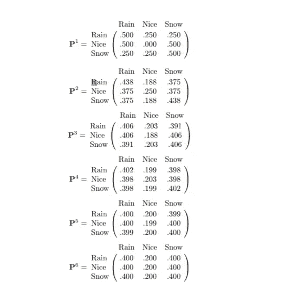

# 理解马尔可夫决策过程

> 原文：<https://towardsdatascience.com/understanding-markov-decision-processes-b5862c192ddb?source=collection_archive---------11----------------------->

从高层次的直觉来看，马尔可夫决策过程(MDP)是一种数学模型，对于机器学习，特别是强化学习非常有用。该模型允许机器和代理确定特定环境内的理想行为，以便最大化模型在环境中实现某个状态甚至多个状态的能力，这取决于您想要实现什么。这个目标是由我们称之为策略的东西决定的，这个策略根据环境应用于代理的行为，MDP 试图优化实现这样一个解决方案所采取的步骤。这种优化是通过奖励反馈系统来完成的，其中不同的行为根据这些行为将导致的预测状态来加权。

# 分解它

为了理解 MDP，我们应该首先看看这个过程的独特组成部分。它包含:

*   存在于我们指定环境中的一组状态:S
*   在我们指定的环境中，一个或多个代理可以执行的一组可能的操作
*   每个动作对当前状态的影响的描述
*   给定期望的状态和动作，给出回报的函数:R(s，a)。
*   寻求解决 MDP 问题的政策。你可以把它看作是从状态到我们行为的映射。用更简单的术语来说，它表示在状态 s 时要采取的最佳行动 a。

Image overview of MDP

# 了解模型:

从上图可以看出，我们有 T(S，a，S') ~ P(S'|S，a)。

该模型通常被称为过渡模型。如果你把事情分解开来，理解起来就变得简单了。t 代表了我们行为的概念化。我们从某个状态 S 开始，我们采取行动 a，我们的代理发现自己处于一个新的状态 S’。(这里不要让我的措辞把你搞糊涂了。我们采取的行动完全有可能会让代理处于同样的状态。)

接下来，我们定义 P，或者我们在先前状态下采取行动达到新状态的概率。

# 让我们看看数学:马尔可夫性质

p[**S***t+1***|**a， **S0** ，…..、***S****t**=*P[**S***t+1****| a、* S** *t*

上面的公式是马尔可夫属性状态的定义。还是那句话，我们来分解一下。

St+1 可以解释为未来的状态，或者我们打算走向的状态和[ **S** *1* ，…..，***S****t*]表示状态历史中存在的所有相关信息的历史。当然，a 仍然代表正在采取的行动。但是，新状态仅依赖于以前的状态。它不依赖于各国过去的历史。

# 给定马尔可夫状态，定义转移概率。

假设我们的代理处于某个状态 s，有一个概率进入第一个状态，另一个概率进入第二个状态，以此类推，对于每个现有的状态。这是我们的转移概率。

我们可以把这些概率输入一个状态矩阵！让我们定义一个三态天气问题的例子。这是规则

1.  你住在桑尼镇，但可悲的是，桑尼从来没有连续两天的好天气。永远不会。
2.  如果你有一个好天气，第二天很可能会下雪或下雨。
3.  如果下雪或下雨，第二天有 50%的可能会有同样的天气。
4.  如果天气由下雪或下雨转变，也只会有一半时间转变为晴天。

使用这个假的环境信息，我们可以构建一个状态矩阵，如下所示:

其中矩阵的第一行表示给定雨天的下几天天气的概率。第二行代表正常天气的概率，第三行，正如你可能已经理解的，代表下雪天的概率。这个转移概率矩阵被称为转移矩阵。

现在，让我们从我们的矩阵中尝试一个真实问题的模型，其中 p (ij)。
设 I 代表当前状态，j 代表未来状态。

我们想知道今天下雨的可能性有多大，两天后下雪的可能性有多大？假设正在下雨，我们可能的状态是什么？

唯一的限制是不能连续两天天气都很好。从现在到那时的所有其他状态都是可能的。所以可能明天下雨，第二天下雪，可能明天天气好，第二天下雪，也可能明天下雪，第二天下雪。

用方程式表示:

P (Rain⁰Snow ) = P(下雨)*P(下雨+下雪)+ P(正常下雨)*P(正常下雪)+ P(下雨+下雪)*P(下雪)

现在我意识到这看起来很伤人，但是你可能已经意识到这本质上是向量和矩阵数学。我们取第 1 行和第 3 行的点积。

# 视觉化让生活更简单

假设我们希望预测给定 6 天时间周期或 6 个状态转换的 P。我们没有一开始就定义一个单一的状态，我们只是希望在给定初始概率的情况下，找到我们的状态在一个过渡时期的概率。这就是所谓的正规马尔可夫链。如你所见，我们继续使用矢量数学，通过点积来计算每个州的概率。

# 好的，但是我们如何确定初始状态呢？它将如何影响我们对概率的计算，或者我如何创建马尔可夫链:

我很高兴你问了！我们可以这样定义:u^(n) = uP^(n)

其中 u 是表示初始状态分布的向量，P 是马尔可夫链的转移矩阵。

我们知道我们有三个状态，所以让我们把它代入。u =向上

让我们求解第三天的概率。我们制作一个 1×3 的向量来表示初始分布，并取点积来找出给定一个随机起始状态的第三天每个状态的可能性。

# 太好了。对于一个期望的结果，我如何找到这么多状态的最优解？这就是我想在这里使用强化学习的原因。

为了理解如何计算我们的状态和动作的最优化，我们需要给它们赋值。为了理解价值，我们需要定义一个政策，为了定义一个政策，我们需要理解回报和回报。

# 奖励和回报值

强化代理寻求最大化未来报酬的总和。他们想预测能获得最大回报的行动。这被称为 ***返回*** ，我们可以这样建模，R 代表奖励，R 代表返回，下标 t 代表时间步长，在我们的例子中是状态转换。

现在，正如你所看到的，这个等式允许你趋向于无穷大，但是对于处理很多问题来说，它没有意义。我们希望奖励的总和结束。我们把结束的任务称为情节性的。想一个大富翁棋盘游戏。这一集是垄断游戏，从给所有人分配相同的值开始，给定一系列可能的状态和行为，这一集最终以赢家结束。新的一集可以通过创建游戏的新实例开始。我承认垄断游戏有时会让人觉得它们会变得无穷无尽…

比较常见的处理返回值的方法是一种叫做*未来累计* ***贴现*** *奖励*的方法

其中奖励前面的折扣表示 0 到 1 之间的值。这种方法的好处是，回报现在可以更好地模拟无限奖励，并且它给予更直接的奖励更大的权重。该模型现在关心的是更快到来的回报，而不是未来的回报。这个我们可以自己掂量。我们选择的折扣越小，我们就越重视早期奖励。正如您可能想象的那样，折扣 1 成为我们最初的奖励等式，折扣 0 创建一个只关心第一个奖励的模型。这在某种意义上是有用的，因为代理人会知道在那个确切的时刻做什么是绝对最好的，但它对自己的未来缺乏任何洞察力。有点像婴儿对成人。嗯，有些成年人。婴儿只知道在那一刻他需要一件特定的东西，一个成年人可以计划并试图预测他的未来。

# 更多关于政策

π(s，a)是我们的策略函数。它描述了一种行为方式。它获取当前状态和代理动作，并返回在该状态下采取该动作的概率。有点像我们上面演示的，不是吗？

如果你想一想这意味着什么，所有状态的集合，给定所有动作，等于概率 1，这一定是真的。

我们的政策应该描述在每个州如何行动。

想想乔希·格里夫斯创造的这个政策

大家可以看到，我们吃饱了有奖励，饿了吃了有奖励，吃饱了不吃也有奖励。如果饥饿，我们会受到极其严重的惩罚；如果吃饱了，我们会受到惩罚；如果吃饱了，我们会受到惩罚；如果饿了，我们也会受到惩罚。很容易看出，在这个非常简单的例子中，最优策略是总是在饥饿时进食。

# 价值函数:

强化学习中的两类价值函数是状态价值函数 V(s)和动作价值函数 Q(s，a)。

状态值函数解释给定特定策略的状态值。当我们从初始状态 s 开始并在我们的政策规则范围内行动时，它是对回报的计算。

当遵循我们指定的策略时，action value 函数返回在给定状态下采取某个操作的值。

现在，假设当选择一个动作时，环境是返回下一个状态的东西，我们必须记住，如果我们的策略改变，那么价值函数也会改变。我们期望看到这些函数的一个给定的返回值，然而，在到达一个特定的状态时会有很大的随机性，转移函数也会影响我们的状态。我们可能没有 100%的概率！

# 给定环境，我们如何解释返回状态的随机性？

好吧，我们将在下一篇博文中讨论这个话题，但简而言之，我们可以使用贝尔曼方程。这些方程允许我们将状态的值表示为其他状态的值。意思是如果我们知道某个状态的值，我们可以用它来计算其他状态的值。

我们可以用这些方程，推导出状态值和动作值的贝尔曼方程，我保证我们下次会这么做，等我再研究一些:D 之后

直到那时！

# 来源:

达特茅斯概率正文:[http://www . Dartmouth . edu/~ chance/teaching _ AIDS/books _ articles/probability _ book/book . html](http://www.dartmouth.edu/~chance/teaching_aids/books_articles/probability_book/book.html)

麻省理工学院发表论文:【http://www.mit.edu/~jnt/Papers/J083-01-mar-MDP.pdf 