# 了解蒙特卡罗模拟

> 原文：<https://towardsdatascience.com/understanding-monte-carlo-simulation-eceb4c9cad4?source=collection_archive---------5----------------------->

## 从头开始实施强大的统计工具

蒙特卡洛模拟是一种强有力的工具，可以在很难获得精确分布的情况下近似计算。当对随机变量(RV)应用复杂的变换时，可能会出现这种情况，因为我们知道它的分布。它有多种应用；从[期权定价](https://en.wikipedia.org/wiki/Monte_Carlo_methods_for_option_pricing)到[缩小海岸警卫队搜救工作的地理焦点](https://en.wikipedia.org/wiki/Search_and_Rescue_Optimal_Planning_System#Applications_outside_of_search_and_rescue)。但是它是如何工作的呢？

## 概率分布

每个 RV 都有其独特的分布特征。对于连续 RV，概率密度函数(PDF)显示了给定值下连续 RV 的密度。任何给定值出现的概率为零，因此必须对一系列值进行积分，以找到 RV 落在指定范围内的概率。对于离散 RVs，该函数称为概率质量函数(PMF ),它返回特定值出现的概率。它们描述了我们观察随机变量的模式和频率。

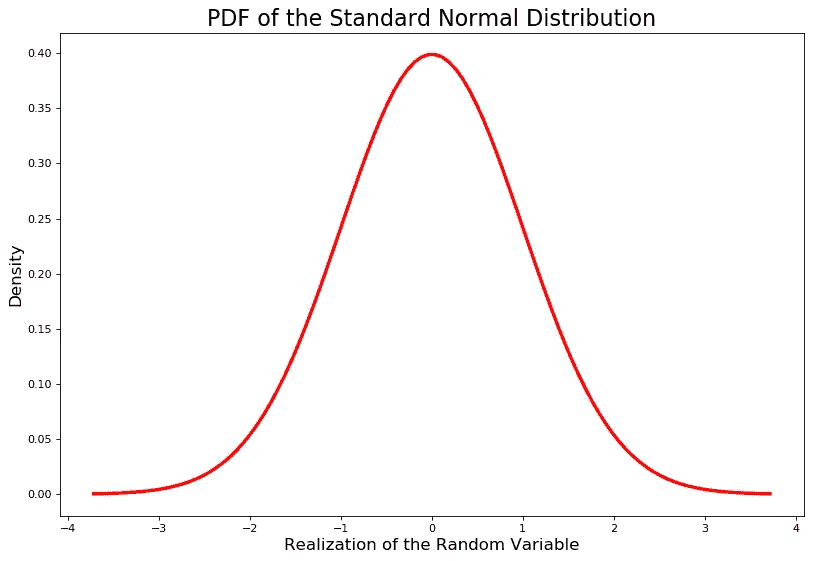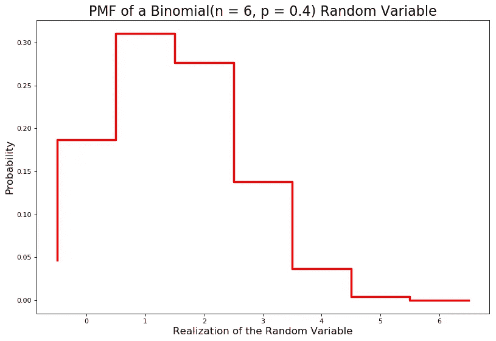

CDF 就是 PDF 或 PMF 的累积值。它是随机变量取值小于或等于曲线/阶跃函数正下方值的概率。概率必须介于 0 和 1 之间，因此 CDF 的范围介于 0 和 1 之间。用**T5 FT7 表示。**

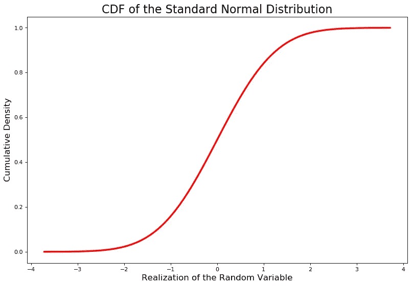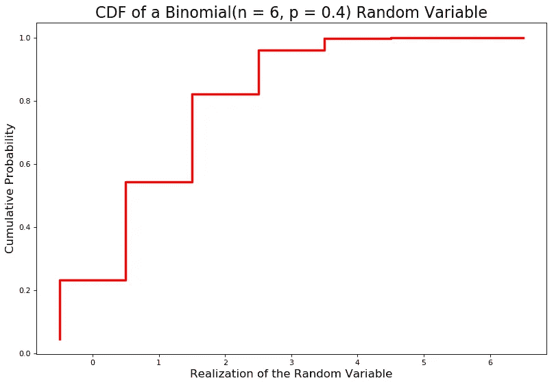

## 逆变换采样

除了是概率论的基础知识之外，这些与蒙特卡罗模拟有什么关系？通过下面的命题(注意:大写字母表示 RVs，小写字母表示 RV 的实现)。

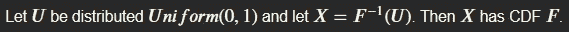

> **这意味着我们可以将最小值为 0、最大值为 1 的均匀分布中的随机变量输入到 X 的逆 CDF 中，以生成 X 的随机值。**

让我们取一个指数分布的 CDF。它在下面。

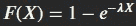

CDF of an Exponential(lambda) Distribution

通过定义 *U* 为 *F(X)* 和 *s* 求解 *X* ，我们可以找到 CDF 的逆。

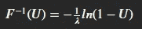

Inverse CDF of an Exponential(lambda) Distribution

我们现在可以将 *U~Uniform(0，1)* RVs 输入到这个逆 CDF 中，从指数分布中生成随机抽取。我选择 1 作为我的 lambda 参数。我使用的代码如下。(注意:这是低效的，可以通过矢量化来加速，或者使用 **scipy.stats** 模块来加速。我这样做是为了清楚地演示逆变换采样是如何工作的)。

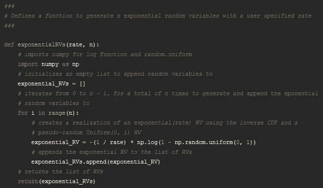

The code used to generate Exponential(lambda) RVs

在 10，000 个模拟随机变量时，模拟与理论分布非常接近。

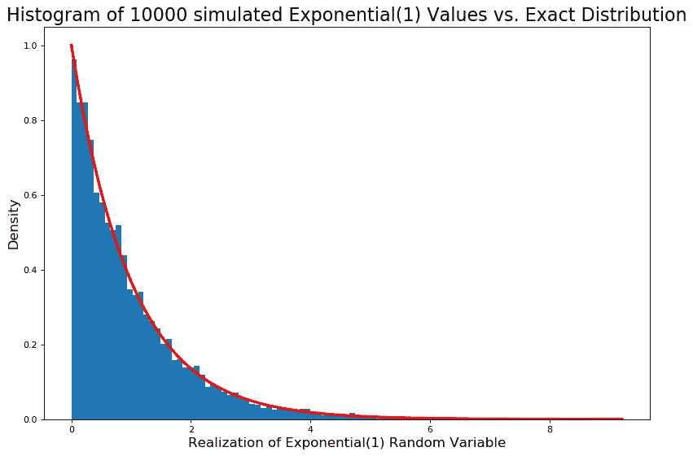

现在让我们尝试一个转换。

## 近似 RV 的变换

现在让我们生成标准正态随机变量的平方。这实际上是一个*卡方(1)* RV，它允许我们通过检查精确分布来轻松检查我们的近似有多好。

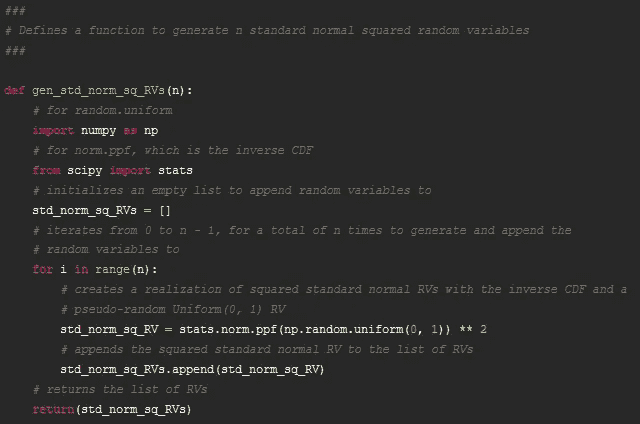

The code used to generate Chi-Square(1) RVs by squaring standard normal RVs

如你所见，这个近似值相当不错。

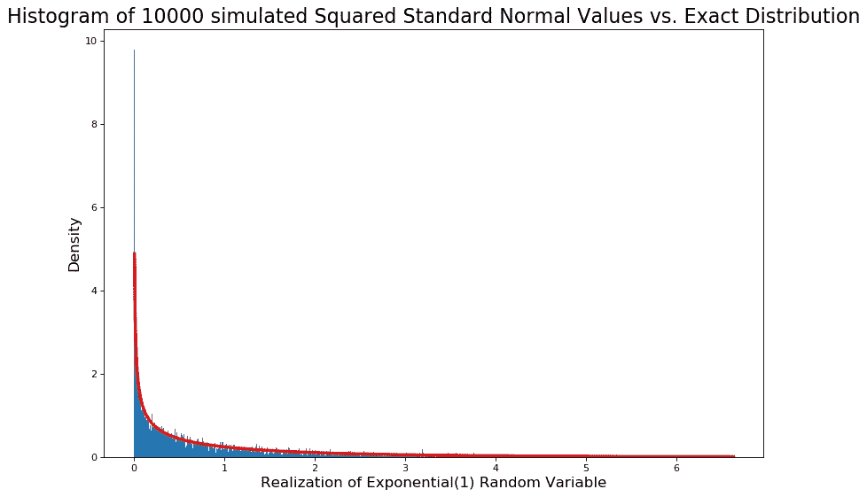

在绘制了这些 RVs 之后，我计算了低于 1 的比例(近似概率)为 0.6857。然后，我通过使用评估为 1 的*卡方(1)* CDF，将这与确切的概率进行比较。准确的概率是 0.6826894921370859。这种近似在 10，000 次模拟中表现得非常好

现在让我们用这个来近似 RV 的分布，它的精确分布需要一点求解。

## 逼近我的任意 RV

我定义了一些任意的 RV。姑且称之为 *A* ，定义如下。

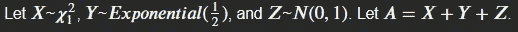

找到一个精确的分布需要一些工作，我不喜欢工作。幸运的是，我可以写一个函数来逼近 *A* 的分布。

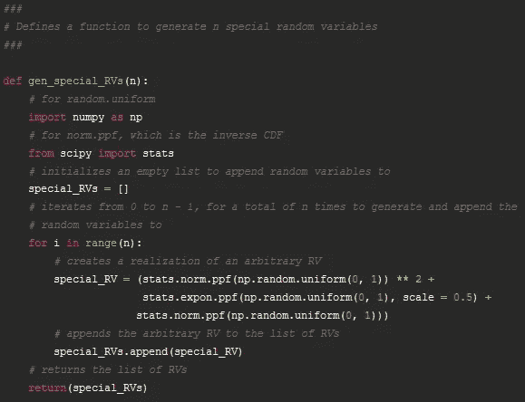

现在我们有了一个 *A* 分布的近似值，并且可以找到用于推断目的的近似概率。

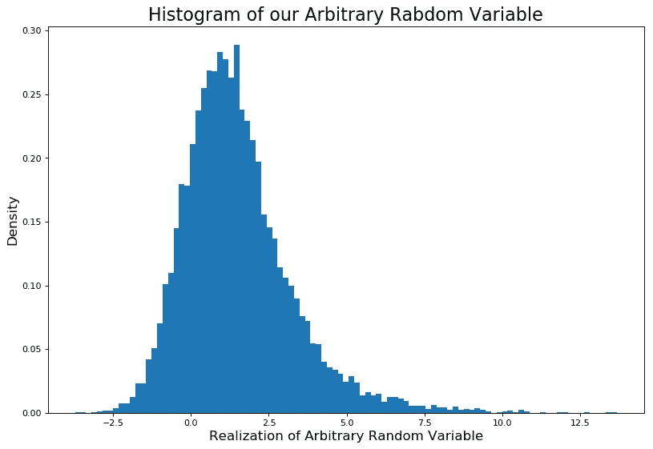

既然我们已经完成了对我的任意 RV 的近似，让我们来看一个假设的用例。

## 正回报的概率

假设我们知道一些证券的收益分布为𝐿𝑎𝑝𝑙𝑎𝑐𝑒 *(0.05，0.07)* ，下一期的收益不依赖于本期的收益(这是一个随机游走的例子)。我们在第 5 期的投资回报率为正的概率是多少？

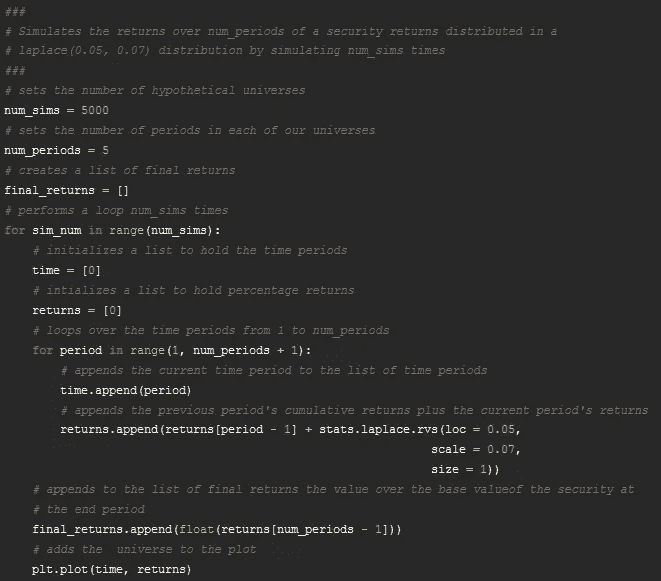

The code I used to generate simulated returns and the spaghetti plot (make sure to load in stats from scipy)

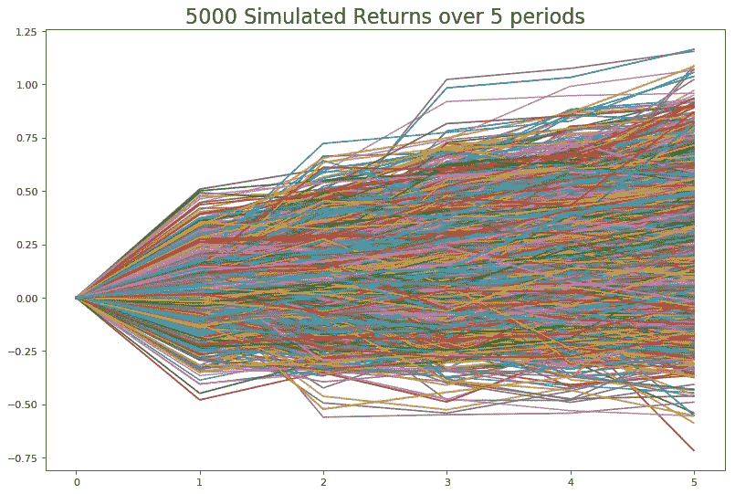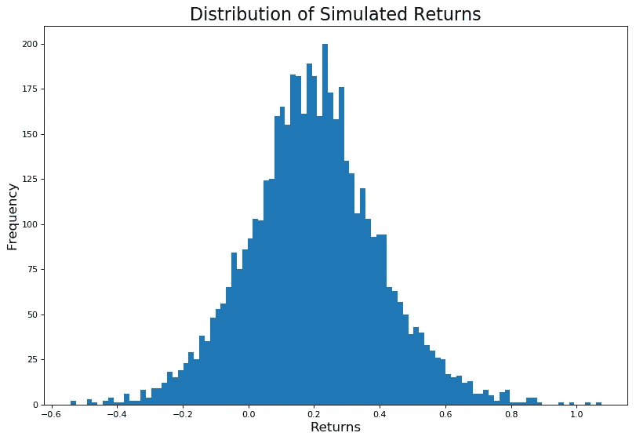

5000 Random Walks of our hypothetical security and the distribution of final returns

通过计算最终收益大于 0 的比例并除以模拟次数，我们发现该证券在 5 期结束时增值的概率约为 0.85。在构建投资组合时，这是有用的信息(尽管我们在现实生活中从未遇到过这样干净的案例)。

## 奖金申请:蒙特卡罗积分

除了近似分布之外，蒙特卡罗模拟可以用于数值近似难以或不可能解析求解的定积分。这被称为蒙特卡罗积分。它是通过在从 *𝑈𝑛𝑖𝑓𝑜𝑟𝑚* ( *𝑎* ， *𝑏* )产生的随机变量的实现上评估函数来执行的，其中 a 是定积分的下限，b 是上限。这些结果然后被平均并乘以*𝑏*—*𝑎*，以获得从 *𝑎* 到 *𝑏* 的积分近似值。

取下面的函数:

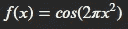

它的积分不能解析地导出，所以让我们在 0 到 1 的区间上近似它。

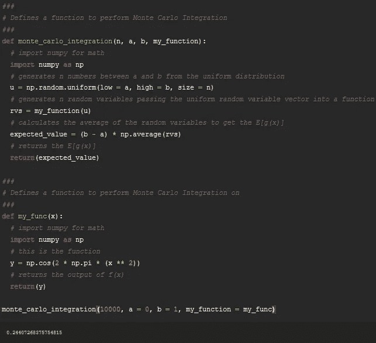

运行 10，000 次模拟后，我得到了大约 0.244 的近似值，这与 Wolfram 给出的大约 0.244 的近似值非常接近，因此该函数按预期工作。

## 结论

如果你逗留了这么久，感谢你的阅读。我希望你了解了一些蒙特卡洛模拟的工作原理。希望这些知识能帮助你继续学习蒙特卡罗模拟的应用，比如马尔可夫链蒙特卡罗。只是另一个提醒使用优化的**。来自 **scipy.stats** 的 rvs()** 方法，适用于您感兴趣的任何分布。这比重复追加到列表中要快一个数量级。