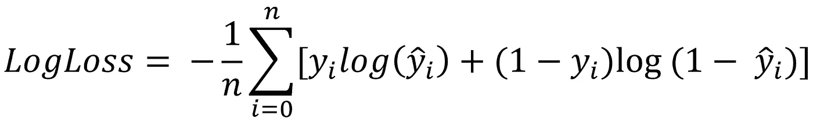
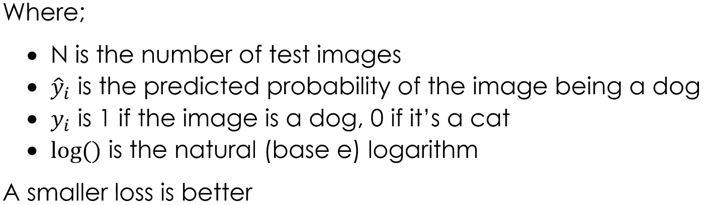
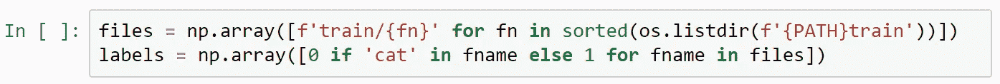
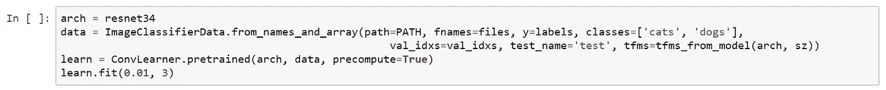
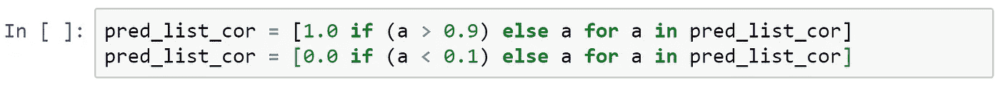
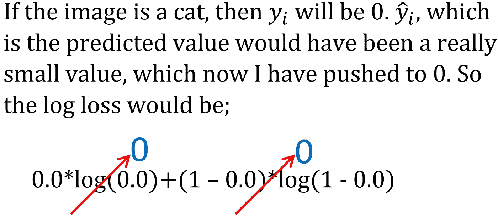

# 更好地理解负对数损失

> 原文：<https://towardsdatascience.com/understanding-negative-log-loss-8c3e77fafb79?source=collection_archive---------6----------------------->

在学习 [fast.ai](https://www.fast.ai/) 的时候，我决定在一些数据集上测试“3 行代码”,而不是在课程中使用的数据集。 [fast.ai](https://www.fast.ai/) 的[维基页面](http://wiki.fast.ai/index.php/Image_Datasets)有一些推荐，我决定尽可能多地尝试。

简单类别下的第一个推荐数据集是[狗对猫 Redux: Kernels Edition](https://www.kaggle.com/c/dogs-vs-cats-redux-kernels-edition) 。虽然这个和课程里的很像，但我觉得不妨试试。

该数据集包含 25000 幅训练图像和 12500 幅测试图像。使用的评估指标是 LogLoss，描述如下:

这个实验的参考是 github 中的 [lesson-1](https://github.com/fastai/fastai/blob/master/courses/dl1/lesson1.ipynb) 笔记本

下载文件，启动 Jupiter 笔记本，导入依赖项，设置路径，我们就可以开始了…嗯，不完全是。在我们开始我们的 3 行深度学习之前，我们还需要几行代码。这场比赛提供数据的方式与在 [fast.ai](https://www.fast.ai/) 服务器上提供的[数据](http://files.fast.ai/data/dogscats.zip)略有不同。有多种方法可以处理这个问题，我发现最简单的方法是使用函数；

> *图像分类器数据。*来自 _ 名称 _ 和 _ 数组(…)

而不是；

> *image classifierdata . from _ paths(…)*

在我们这样做之前，我们需要 2 行额外的代码；

现在我们可以开始我们的 3 行代码了。

这导致验证损失 *0.029175* 。禁用预计算、解冻层、添加丢失并再训练 7 个历元会使损失降至 *0.024749* 。

我在测试集上运行了预测，该模型给了我一个公共排行榜分数 *0.06614* 。我的验证分数严重下降，但对(几乎)标准化代码来说还不算太坏。现在，我必须缩小我的分数与排名 1 的持有者的分数 *0.03302* 之间的差距。

## 震惊

在这一点上，我决定表现得厚脸皮一点。如果图像是猫，实际值为 0，如果图像是狗，实际值为 1。softmax 函数的输出只能是接近 0 或 1 的值，它永远不会是 0 或 1。我想，如果我把预测值推近 0 或 1，那么它可能会帮助我摆脱一些误差。我期待着第三位小数的变化，如果我真的很幸运，也许是第二位小数的变化。

所以我编写了简单的代码来检查我的预测中的每个值。如果该值大于 0.9，则设为 1，如果该值小于 0.1，则设为 0，否则保持不变。生成并上传了一个新的提交文件，并急切地等待着看我的鬼把戏为我赢得了多少位置。令我惊讶的是，我的分数恶化到了 *0.19683* 。

我的第一个想法是，我一定是在代码中出错了。但是代码非常简单，只有两行，如下所示。

*pred_list_cor* 包含原始预测值，即 12500 个测试图像中每一个的 softmax 的输出。嗯，卡格尔不可能错，所以我必须错。但是我相信我的逻辑是正确的。所以我试着在纸上算出来。

两项的结果都是 0。第一个是因为实际值，第二个是因为对数函数。这给出了 0 的理想损耗。当图像是狗的图像时，该逻辑也是有效的。

我现在怀疑的是术语 ***log(0)*** ，当然，它是未定义的。值不能为 0 或 1，因为这将导致两个术语中的一个变得不确定。对此，显而易见的解决方案是用' *epsilon'* '替换' 0 '，用' *1- eplison'* '替换' 1 '。这将误差略微改善至 *0.14109* 。进展，但我仍然不知道发生了什么解释。

如果你把预测值和实际值相匹配，损失应该会下降！但是我看到了相反的效果。我下一次试图理解观察到的行为是使用一个足够高和足够低的值，但不要像 *epsilon* 那样剧烈。我选择了*0.99999*&*0.00001*。使用这些，我的损失下降到 0.12065 。有所改善，但仍比我未改变的预测高很多。

## 敬畏

很明显，我的修改恶化了错误，而不是改善了错误，但我还不明白为什么。从数学上来说，它应该有所改善。

我觉得，获得更多清晰的唯一方法是检查我的预测到底发生了什么。因为我使用的是 Kaggle 数据集，所以我没有测试集的标签。我煞费苦心地手工标记了前 500 张图片。然后根据我的预测计算损失。损失为 *0.00960* ，成绩优秀。然后我用我修改后的预测计算了损失，它是 *0.01531* 。显著增加，但这一次，我有数据来确定问题的根源。

在仔细检查我的预测和实际标签后，我注意到我的模型在预测中有一个错误。它给一只狗贴上了猫的标签，通过对 *0.03824* 的预测，它很有把握这张图片确实是一只猫。我的提升逻辑已经将这个值推至接近 0。这就是问题的根源。

> 测井损失误差会严重影响不正确的预测

我 1 次不正确的预测已经让我损失惨重，但我对预测的修改加剧了误差，导致误差增加了 0.0057。关于这一点的一个很好的解释在这个[博客](https://www.r-bloggers.com/making-sense-of-logarithmic-loss/)中，我在下面提到了其中的摘录。

> 比方说，实际值是 1。
> 
> 如果你的模型是不确定的，预测值为 0.5，那么损失就是；
> 
> 损失=-(1 * log(0.5)) = 0.69314
> 
> 如果你的模型被正确地置信和预测为 0.9，损失将是；
> 
> 损失=-(1 * log(0.9)) = 0.10536
> 
> 当预测值更接近实际值时，损耗下降
> 
> 如果你的模型是不正确的，但也有信心和预测 0.1，损失将是；
> 
> 损失= -(1 * log(0.1)) =2.30258
> 
> 损失变得更加严重

在处理对数损失函数时，与其自信地错了，不如怀疑自己的预测。这是我对我的模型的疏忽。我假设当我的模型自信地预测时，它总是正确的。如果它得到了一些错误的图像，它必须预测在 0.5 左右。我完全忽略了我的模型自信地错误预测的情况。