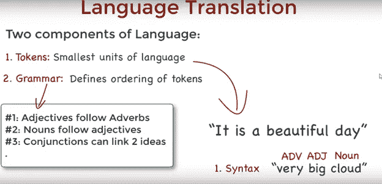
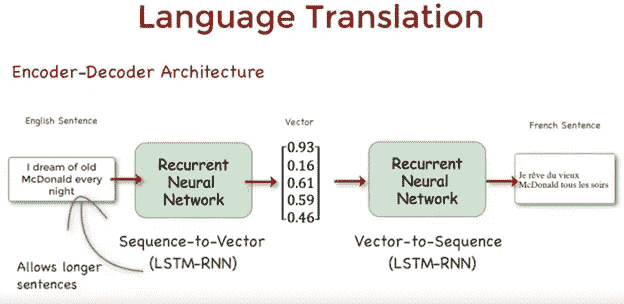
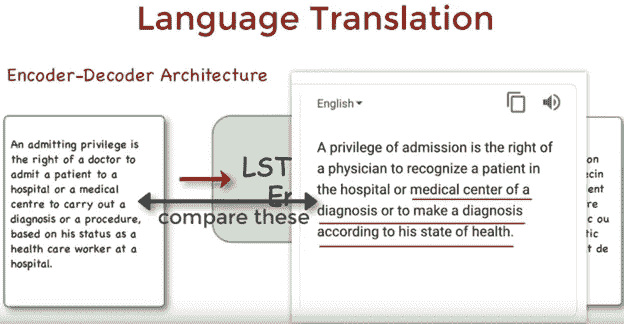
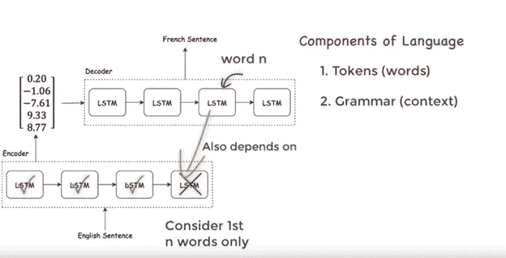
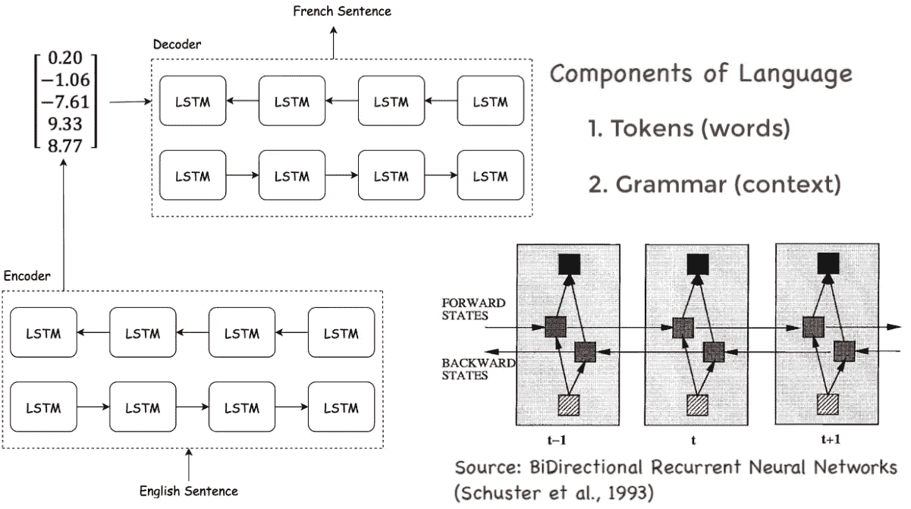
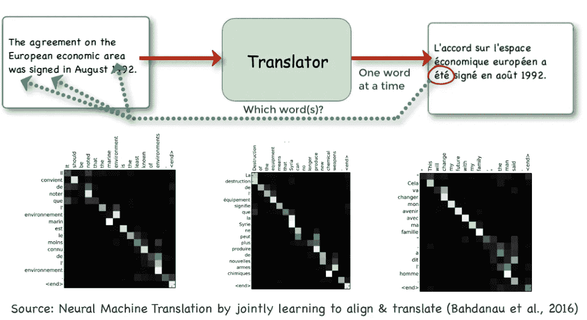
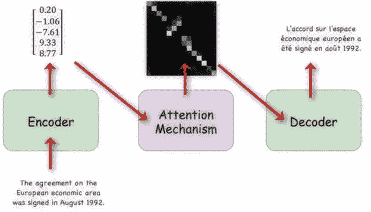
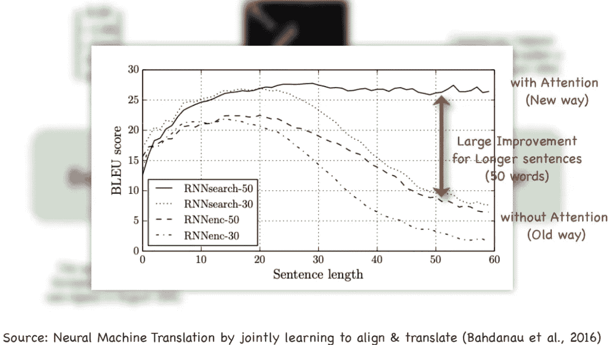

# 理解神经机器翻译:编码器-解码器架构

> 原文：<https://towardsdatascience.com/understanding-neural-machine-translation-encoder-decoder-architecture-80f205643ba4?source=collection_archive---------13----------------------->

机器翻译的技术水平已经利用了使用编码器-注意力-解码器模型的递归神经网络(RNNs)。在这里，我将尝试从一个高层次的角度来介绍它是如何工作的。

# 语言翻译:组件

我们可以把翻译分成两个部分:单个单位和语法:

为了在神经网络中进行计算，我们需要将单词序列编码到向量空间中。因为单词也具有有意义的序列，所以递归神经网络适合于这项任务:

# 问题是

然而，这种编码器-解码器架构在大约 20 个以上单词的句子之后就崩溃了:

为什么？较长的句子说明了单向编码器-解码器结构的局限性。

因为语言由记号和语法组成，这个模型的问题是它没有完全解决语法的复杂性。

具体来说，当翻译源语言中的第 n 个单词时，RNN 只考虑源句子中的第一个 n 个单词，但从语法上来说，一个单词的含义取决于句子中**之前和**之后的单词的顺序:

# 一个解决方案:双向 LSTM 模型

如果我们使用双向模型，它允许我们输入过去和未来单词的**的上下文，以创建准确的编码器输出向量:**

但是，接下来的挑战就变成了，**在一个序列中，我们需要关注哪个单词？**

2016 年，巴赫达瑙等人。艾尔。发表了一篇论文，表明我们可以通过存储 LSTM 细胞以前的输出，然后根据每个输出的相关性对它们进行排序，并选择得分最高的单词，来学习要关注源语言中的哪些单词:

下面，您可以在图表中看到这种情况:最终的架构将这种注意力机制嵌入编码器和解码器之间:

可以看到，与之前的编码器-解码器架构相比，性能有所提升:

简而言之就是这样，这也是谷歌翻译的 NMT 的工作方式，尽管编码器 LSTMs 的层数更多。

简单来说，就是这样:

1.  编码器获取源语言中的每个单词，并将其编码到向量空间中
2.  然后，单词的这些矢量表示被传递到注意机制，该机制确定在为期望的语言生成一些输出的同时关注哪些源单词。
3.  这个输出通过一个解码器，将向量表示转换成目标语言

来自 [CS 道场社区](https://www.youtube.com/watch?v=AIpXjFwVdIE&t=405s)的插图