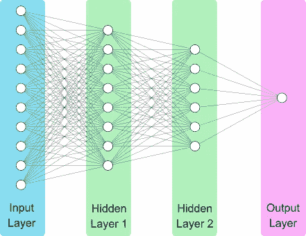

# 理解神经网络

> 原文：<https://towardsdatascience.com/understanding-neural-networks-a12c999f821f?source=collection_archive---------26----------------------->

神经网络产生了很多兴趣。然而，机器学习社区之外的人并不总是清楚它们适合解决什么问题，它们是什么，或者它们是如何构建的。我们将在这篇博文中讨论这些话题，旨在让所有读者都能接触到神经网络。对于那些有编程经验的人，我在最后附加了一个 Jupyter 笔记本，你可以按照它来构建你自己的神经网络。

神经网络的大多数商业上成功的应用是在监督学习领域。在监督学习中，我们试图建立一个将输入映射到输出的模型。一些例子包括:

我们可以将这些模型表示为接受输入并产生输出的函数:

y = F(x)

其中 x 是输入，y 是输出，F()是我们的模型。神经网络是为许多类问题建立模型(即 F())的特别有效的方法。

让我们简单地考虑一下构建许多模型的传统方法。通过将我们对微积分的理解应用于特定领域的知识，我们可以推导出描述许多现象的模型。在物理学中，这将包括牛顿运动定律，或守恒定律，即在封闭系统中质量、能量和动量守恒。这种方法让我们成功地建立了各种各样的重要模型，例如告诉我们火箭到达太空需要多少燃料的理想火箭方程，或者让我们模拟海岸波浪的 Boussinesq 方程。

对于那些我们对基本动力学没有直觉的问题呢？假设您正在制造一辆自动驾驶汽车，并希望使用来自仪表板摄像头的视频流来识别道路上的其他汽车。尽管事实上我们都很擅长识别汽车，但我们还不能用物理原理来描述汽车的样子。我们不能指出组成汽车的轮子、门和窗户的组合。神经网络为我们提供了一种技术，我们可以用它来有效地解决这类问题。

神经网络通过直接从数据中学习从输入到输出的映射来工作。让神经网络学习这种映射的过程称为训练。训练需要一组训练示例，这些示例是成对的输入和相应的输出(x 和 y)。为了使训练有效，我们需要一个大的数据集，通常是数万到数千万个训练样本。

在训练期间，我们优化神经网络的权重(或参数)。对于每个训练示例，我们对输入运行模型，并使用损失函数将模型输出与目标输出进行比较。使用一种称为反向传播(或简称为反向传播)的算法，我们更新网络中的所有权重，以使模型输出更接近目标输出。权重根据它们对任何不匹配的贡献程度成比例地更新。我们继续循环我们的训练集，迭代更新模型，直到性能不再增加。

让我们来看一个直观的神经网络的可视化。在左手边，我们有输入层。这是我们的数据，比如一个图像的像素，或者某个词在一封邮件中出现了多少次。接下来，我们有两个隐藏层。隐藏层是一个术语，我们指的是输入层和输出层之间的层。最后，我们有输出层。当输入通过神经网络的每一层时，它经历一系列的计算。隐藏层和输出层中的每个“单元”(或“神经元”)包含一组要优化的权重，这些权重控制这些计算。

设计神经网络需要选择控制网络结构和训练过程的超参数。我们使用术语超参数，因为术语参数是权重的替代。与架构相关的超参数包括层数、每层的宽度(即单元数)，以及在单元中选择称为激活函数的东西。训练尤其受优化算法的选择、算法使用的学习速率以及是否实现称为正则化的技术的影响。

不幸的是，没有办法预先知道对于你的问题什么是最好的架构，或者训练那个架构的最佳参数是什么。从业者由来自社区的经验、直觉和最佳实践的组合来指导。由于这个领域发展迅速，这就需要不断跟上时代的步伐。通常，从一个问题开始的最佳方式是查看机器学习文献，看看是否有人已经解决了与你类似的问题，并将他们的解决方案作为起点。获得特定问题的解决方案通常需要查看数据、实现想法、修改模型代码和测试的多次迭代。

任何神经网络的一个关键问题是，它能够对以前从未见过的数据执行得有多好。因此，在训练神经网络之前，通常称为测试集的数据中会留出一小部分。在训练神经网络之后，我们比较了神经网络在训练集和测试集上的性能。一种可能的情况是，该模型即使在接受训练的数据上也表现不佳。万一，我们说模型有高偏差。当模型不能很好地拟合其观察到的数据时，超参数应该被重新评估。另一个结果是，该模型在训练集上表现良好，但在测试集上表现不佳。在这种情况下，我们说模型具有高方差，即神经网络已过度适应训练数据。相当于，网络还没有很好地学习概括数据的特征，并且可能已经记住了特定于训练集的特征。为了解决高方差问题，我们通常采用一种称为正则化的技术。在可行的情况下，获取额外的数据也是有益的。

一个重要的细节是，训练神经网络的数据必须与应用神经网络的数据相似。从统计学上来说，您希望您的训练和测试数据来自同一个分布。直观地说，这意味着如果你训练你的自动驾驶汽车只在晴天驾驶，你就不能指望它在降雪期间留在路上。在实践中，这意味着如果你开发一个神经网络来预测客户行为，你将需要随着你的产品、客户和竞争等重要因素的发展定期更新你的模型。

这些是理解如何应用神经网络以及如何与经常使用神经网络的人交流的主要概念。读完这篇文章后，你应该能够自信地运用神经网络进行对话。

**总结一下关于神经网络的要点:**

1.  它们是直接从训练数据集构建从输入到输出的模型映射的有效方法。
2.  神经网络有很多超参数，设计一个好的网络是一个迭代的过程。
3.  您的训练和测试数据应该来自同一个发行版。

最后，我交谈过的许多软件开发人员都渴望知道神经网络的实现细节。以下 Jupyter 笔记本详细信息是根据您的需求设计的，实现了一个神经网络来识别手写数字，准确率高达 98%。我们假设您已经用 PyTorch 设置了 python 环境。如果您不知道，Anaconda 是推荐的包管理器，并且非常容易上手。

你可以下载 jupyter 笔记本在你自己的机器上运行[这里](https://inletlabs.com/assets/blog/mnist/mnist.ipynb)，以及跟随预计算版本[这里](https://inletlabs.com/2019/01/14/mnist.html)。

【https://inletlabs.com】最初发表于**。**