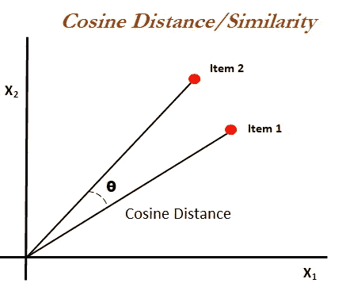
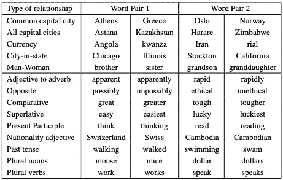
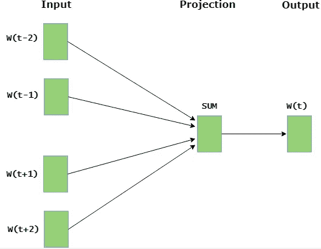
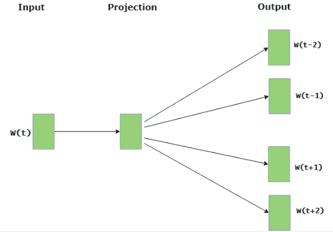

# 理解 NLP 单词嵌入—文本矢量化

> 原文：<https://towardsdatascience.com/understanding-nlp-word-embeddings-text-vectorization-1a23744f7223?source=collection_archive---------2----------------------->

处理自然语言文本并从给定的单词中提取有用的信息，使用机器学习和深度学习技术的句子需要将字符串/文本转换为一组实数(向量)——单词嵌入。

单词嵌入或单词向量化是 NLP 中的一种方法，用于将单词或短语从词汇表映射到相应的实数向量，该向量用于查找单词预测、单词相似性/语义。

> 将单词转换成数字的过程称为矢量化。

单词嵌入在以下用例中有所帮助。

*   计算相似的单词
*   文本分类
*   文档聚类/分组
*   用于文本分类的特征提取
*   自然语言处理。

在将单词转换成向量后，我们需要使用一些技术如[欧氏距离](https://en.wikipedia.org/wiki/Euclidean_distance)、[余弦相似度](https://en.wikipedia.org/wiki/Cosine_similarity)来识别相似的单词。

## **为什么余弦相似**

计算常用词或欧几里德距离是用于匹配相似文档的一般方法，其基于计算文档之间的常用词的数量。

即使常用词的数量增加，但文档谈论不同的主题，这种方法也不起作用。为了克服这个缺陷，使用“余弦相似度”方法来寻找文档之间的相似度。



Figure 1: Cosine Distance. Ref: [https://bit.ly/2X5470I](https://bit.ly/2X5470I)

在数学上，它测量两个向量(item1，item2)在 N 维向量空间中投影的角度的余弦值。余弦相似度的优点是，即使欧氏距离是距离，它也能预测文档的相似度。

> “角度越小，相似度越高”——余弦相似度。

让我们看一个例子。

1.  朱莉爱约翰胜过琳达爱约翰
2.  简爱约翰胜过朱莉爱约翰

```
John  2   2
Jane  0   1
Julie 1   1
Linda 1   0
likes 0   1
loves 2   1
more  1   1
than  1   1
```

这两个向量是，

`Item 1: [2, 0, 1, 1, 0, 2, 1, 1]
Item 2: [2, 1, 1, 0, 1, 1, 1, 1]`

两个向量值之间的余弦角(角度越小)为 0.822，最接近 1。

现在我们来看看把句子转换成向量的方法都有哪些。

来自预训练方法的单词嵌入，

*   Word2Vec —来自谷歌
*   快速文本—来自脸书
*   手套——来自斯坦福

在这个博客中，我们将看到最流行的嵌入式架构 Word2Vec。

**Word2Vec**

Word 2 vec——由托马斯·米科洛夫和谷歌的一个研究团队在 2013 年开发的向量空间中的单词表示。

*word 2 vec 技术产生的原因:*

大多数 NLP 系统将单词视为原子单位。现有系统的局限性在于没有单词之间相似性的概念。此外，该系统适用于较小、较简单的数据，并且在只有几十亿数据或更少的数据上表现优异。

为了用具有复杂模型的更大数据集进行训练，现代技术使用神经网络架构来训练复杂的数据模型，并且对于具有数十亿单词和数百万单词词汇的巨大数据集来说表现更好。

这种技术有助于测量结果矢量表示的质量。这适用于相似的单词，这些单词倾向于接近具有多种相似度的单词。

**句法规则:**指符合语法的句子纠正。

**语义规律:**指词汇符号在那个结构中排列的意义。



Figure 2: Five Syntactic and Semantic word relationship test set. Ref: [https://arxiv.org/pdf/1301.3781.pdf](https://arxiv.org/pdf/1301.3781.pdf)

所提出的技术被发现，单词表示的相似性超出了句法规则，并且对于单词向量的代数运算惊人地有效。举个例子，

> 向量(“国王”)—向量(“男人”)+向量(“女人”)=词(“女王”)

其中“Queen”是单词表示的最接近的结果向量。

以下单词表示的模型架构的目标是最大化准确性和最小化计算复杂度。这些模型是，

*   前馈神经网络语言模型(NNLM)
*   递归神经网络语言模型

上述所有模型都使用[随机梯度下降](https://en.wikipedia.org/wiki/Stochastic_gradient_descent)和[反向传播](https://en.wikipedia.org/wiki/Backpropagation)进行训练。

**前馈神经网络语言模型(NNLM)**

NNLM 模型由输入、投影、隐藏和输出层组成。由于投影层中的值密集，这种架构对于投影和隐藏层之间的计算变得复杂。

**递归神经网络语言模型**

与浅层神经网络相比，RNN 模型可以有效地表示更复杂的模式。RNN 模型没有投影图层；只有输入、隐藏和输出层。

应该使用名为 [DistBelief](https://papers.nips.cc/paper/4687-large-scale-distributed-deep-networks.pdf) 的大规模分布式框架为庞大的数据集训练模型，这将给出更好的结果。在 Word2Vec 中提出了两个新的模型，

*   连续词袋模型
*   连续跳格模型

使用分布式架构，尽量降低计算复杂性。

**连续词袋模型**

我们把这个模型称为 CBOW。CBOW 架构类似于前馈 NNLM，其中非线性隐藏层被移除，并且投影层被所有单词共享；因此所有的单词都被投射到相同的位置。



Figure 3: CBOW architecture. Ref: [https://bit.ly/2NXbraK](https://bit.ly/2NXbraK)

> CBOW 架构基于上下文预测当前单词。

**连续跳格模型**

跳格模型类似于 CBOW。唯一的区别是，它不是根据上下文来预测当前单词，而是试图根据同一句子中的另一个单词来最大化一个单词的分类。



Figure 4: Skip-gram architecture. Reference — [https://bit.ly/2NXbraK](https://bit.ly/2NXbraK)

> 给定当前单词，跳格结构预测周围的单词。

**Word2Vec 架构实现— Gensim**

Gensim 库将使我们能够通过在自定义语料库上训练我们自己的 word2vec 模型来开发单词嵌入，或者使用跳格算法的 CBOW。

实现库可以在这里找到——https://bit.ly/33ywiaW。

**结论**

*   自然语言处理需要将文本/字符串转换成实数，称为单词嵌入或单词向量化
*   一旦单词被转换为向量，余弦相似性是用于实现大多数使用 NLP、文档聚类、文本分类、基于句子上下文预测单词的用例的方法
*   余弦相似性—“角度越小，相似性越高
*   最著名的架构，如 Word2Vec、Fasttext、Glove，有助于转换单词向量，并利用余弦相似性作为单词相似性特征
*   NNLM，RNNLM 优于巨大的词数据集。但是计算复杂度是一个很大的开销
*   为了克服计算复杂性，Word2Vec 使用 CBOW 和 Skip-gram 结构，以便最大化精度和最小化计算复杂性
*   CBOW 架构基于上下文预测当前单词
*   给定当前单词，跳格结构预测周围的单词
*   详细解释了关于 Word2Vec 架构的论文。

参考资料:

*   [https://arxiv.org/pdf/1301.3781.pdf](https://arxiv.org/pdf/1301.3781.pdf)
*   [https://www.machinelearningplus.com/nlp/cosine-similarity/](https://www.machinelearningplus.com/nlp/cosine-similarity/)
*   [https://medium . com/@ adriensieg/text-similarities-da 019229 c 894](https://medium.com/@adriensieg/text-similarities-da019229c894)