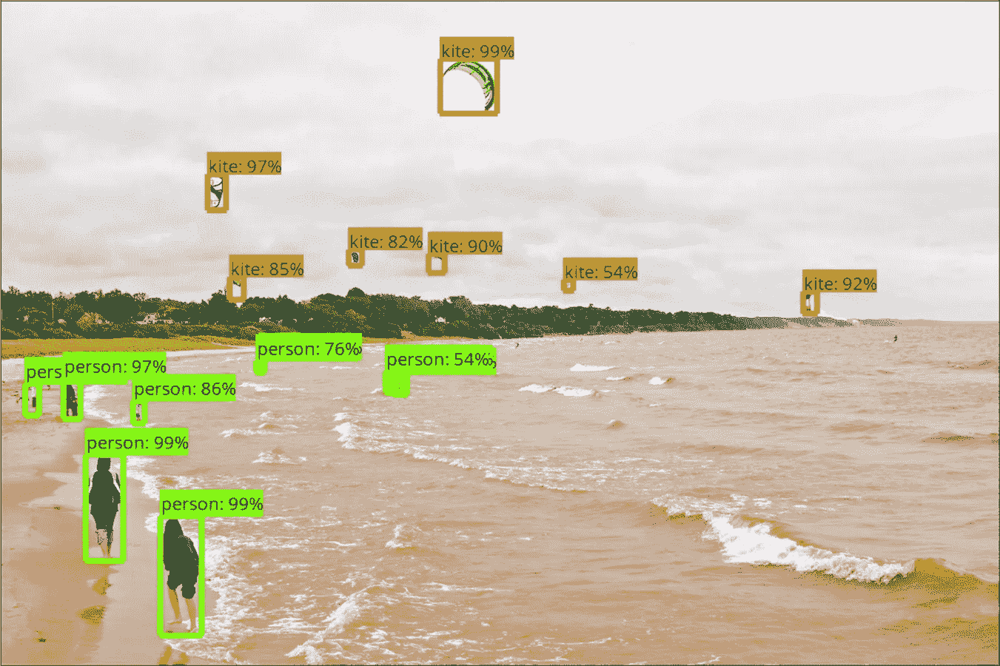
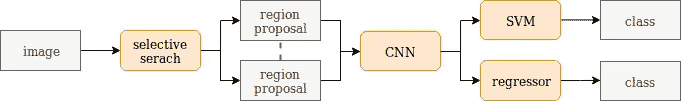
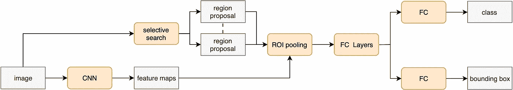
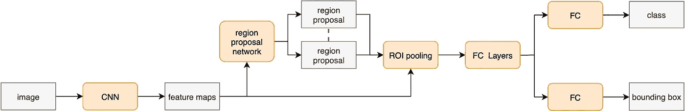
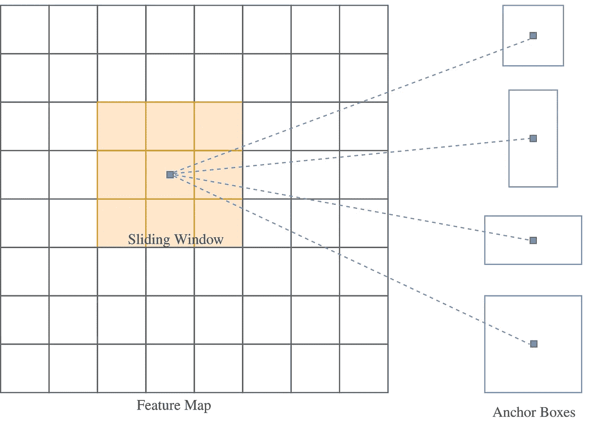
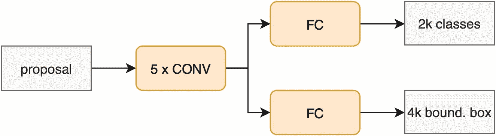

# 了解对象检测

> 原文：<https://towardsdatascience.com/understanding-object-detection-9ba089154df8?source=collection_archive---------7----------------------->

## [内部 AI](https://medium.com/towards-data-science/inside-ai/home)

## 从物体探测的历史到著名的 fast-RCNN 的内部工作原理

Object detection combines the task of object localization and classification. [Source](https://github.com/tensorflow/models/blob/master/research/object_detection/g3doc/img/kites_detections_output.jpg)

在这篇文章中，我想给你一个对象检测器的历史概述，并解释如何发展到目前最先进的检测器架构。此外，我将详细介绍更快的 R-CNN 的内部工作原理，因此它被广泛使用，也是 [Tensorflow 对象检测 API](https://github.com/tensorflow/models/tree/master/research/object_detection) 的一部分。

# **物体探测器简史**

目标检测结合了目标分类和定位的任务。当前的对象检测器可以分为两类:将确定对象的位置和它们的分类的任务分开的网络，其中更快的 R-CNN 是最著名的网络之一，以及立即预测边界框和类别分数的网络，其中 YOLO 和 SSD 网络是著名的架构。

第一个用于物体检测的深度神经网络是 over feet[1]。他们介绍了一种使用 CNN 的多尺度滑动窗口方法，并表明对象检测也改善了图像分类。他们很快就被 R-CNN:具有 CNN 特征的区域[2]。作者提出了一个模型，该模型使用选择性搜索通过将相似像素合并到区域中来生成区域提议。每个区域都被输入到一个 CNN 中，产生一个高维特征向量。这个向量然后被用于最终的分类和包围盒回归，如图 1 所示。

*Figure 1 The standard architecture of a R-CNN network consisting of a region proposal method, mostly selective-search, followed by a CNN for each proposal. The final classification is done with an SVM and a regressor.*

它比 Overfeat 网络好得多，但也非常慢，因为使用选择性搜索生成提议非常耗时，而且需要通过 CNN 提供每一个提议。一种更复杂的方法，快速 R-CNN [3]，也通过选择性搜索生成区域建议，但通过 CNN 提供整个图像。区域提案通过 ROI pooling 直接汇集在特征图上。汇集的特征向量被输入到一个完全连接的网络中进行分类和回归，如图 2 所示。类似于 R-CNN，快速 R-CNN 通过选择性搜索产生区域建议。

*Figure 2: The standard architecture of a Fast R-CNN network. The region proposals are generated by selective-search, but pooled directly on the feature map, followed by multiple FC layers for final classification and bounding box regression.*

快速 R-CNN [4]通过提出一种新颖的区域提议网络解决了这一问题，该网络与快速 R-CNN 架构相融合，大大加快了进程，我们将在下一节对此进行更详细的解释。另一种检测图像中对象的方法是 R-FCN [5]，区域完全卷积网络，它使用位置敏感得分图而不是预区域子网。

YOLO [6]网络彻底改变了目标探测网络的设计。它遵循与上述模型完全不同的方法，并且能够立即预测类分数和边界框。所提出的模型将图像分成网格，其中每个单元预测具有相应边界框坐标的对象的置信度得分。这使得 YOLO 能够进行实时预测。作者还发布了另外两个版本，YOLO9000 [7]和 YOLOv2，前者能够预测 9000 多个类别，后者能够处理更大的图像。另一个可以同时预测类别和包围盒的网络是单次检测器 SSD [8]。它与 YOLO 相当，但每个网格单元使用多个纵横比和更多的卷积层来提高预测。

# **更快的 R-CNN**

*Figure 3: The standard architecture of a Faster R-CNN network, where the region proposal are generated using a RPN, that works directly on the feature map. The last layers are fully connected for classification and bounding box regression.*

快速 R-CNN 和 R-CNN 的主要问题是区域提议的时间和资源密集型生成。快速 R-CNN 通过融合快速 R-CNN 和区域提议网络(RPN)解决了这一问题，如图 3 所示。RPN 使用 CNN 的输出作为输入，并生成区域提议，其中每个提议由对象性分数以及对象的位置组成。RPN 可以与检测网络联合训练，从而加快训练和推断时间。更快的 R-CNN 比快速 R-CNN 快 34 倍。在下面的段落中，更详细地解释了更快的 R-CNN 的每个步骤。

## **主播**

更快的 R-CNN 的目标是检测作为矩形边界框的对象。这些矩形可以有不同的大小和比例。当以前的工作试图考虑不同大小和比例的对象时，他们要么创建图像金字塔，其中考虑图像的多个大小，要么创建过滤器金字塔，其中应用多个不同大小的卷积过滤器[1，9，10]。这些方法对输入图像起作用，而更快的 R-CNN 对 CNN 输出的特征图起作用，因此创建了锚的金字塔。锚点是一个固定的边界框，由中心点、特定的宽度和高度组成，并引用原始图像上的边界框。从特征图上的滑动窗口中为每个位置生成一组锚，该组锚由大小和比例的不同组合的多个锚组成。图 4 显示了一个例子，其中大小为 3x3 的窗口生成了 *k 个*锚点，其中每个锚点在原始图像中具有相同的中心点。这是可能的，因为卷积运算对于平移是不变的，并且可以将特征图上的位置计算回图像中的区域。

*Figure 4: Generation of k anchors per position by sliding a 3x3 window over the feature map.*

## **地区提案网**

RPN 是一个完全卷积的网络，直接作用于特征地图，以生成区域建议，如图 5 所示。它将锚点作为输入，预测客观分数并执行盒回归。前者是锚作为对象或背景的可能性，后者对应于从锚到实际框的偏移。因此，对于 *k* 主播，RPN 预测 2 个 *k* 分数和 4 个 *k* 盒子回归值。锚的初始数量不需要小于来自任何其他区域提议方法的锚的初始数量，因为 RPN 通过仅考虑具有高客观性分数的区域来显著减少锚的数量。训练 RPN 并不简单。由于这是一种监督学习方法，每个锚点必须被标记为前景或背景。因此，每个锚点都必须通过计算它们在并集上的交集(IoU)来与每个地面真实对象进行比较。如果存在具有大于 0.7 的 groundtruth 对象的 IoU，则锚被认为是前景和正的。如果每个接地真值盒的 IoU 低于 0.3，则认为它是背景和负的。IoU 在 0.3 和 0.7 之间的所有锚都被忽略。积极和消极建议的分布是非常不平衡的，因为每个基础事实箱的消极建议比积极建议多得多。因此，具有固定数量阳性和阴性的迷你批次被取样用于训练过程。如果没有足够多的积极建议，则该批将被填入在各自的基础事实框中具有最高 IoU 的建议。如果仍然没有足够的积极建议，就会用消极的建议来填补。RPN 采用多任务损失同时优化两个目标。对于分类，使用二元交叉熵损失，对于包围盒回归，使用平滑 L1 损失。区域建议网络的架构，这是一个完全卷积的网络。

Figure 5: Standard architecture of a region proposal network

回归损失仅针对正锚点进行计算。在预测之后应用非最大抑制(NMS ),以移除与其他区域提议具有高于某个值的 IoU、但是具有较低的客观性分数的区域提议。NMS 之后，前 *N* 个方案被选为最终区域方案。

## **利息集中区域**

RPN 之后的下一步是使用区域建议来预测对象类别和定位。与 R-CNN 的方法不同，在 R-CNN 中，每个建议都是通过分类网络提供的，更快的 R-CNN 利用特征图来提取特征。因为分类器期望固定大小的输入，所以从特征图中为每个区域提议提取固定大小的特征。在现代实现中，特征地图被区域提议裁剪，并被调整到固定大小。Max pooling 随后提取最显著的特征，为每个区域提议确定一个固定的大小，然后输入到最终阶段。

## **分类和回归**

快速 R-CNN 的最后一步是对提取的特征进行分类。因此，合并的要素被展平并输入到两个完全连接的图层，这两个图层处理分类和回归。分类层输出 N+1 个预测，N 个类中的每一个都有一个预测，外加一个背景类。回归层输出 4N 个预测，其中每个预测代表 N 个类中每个类的回归边界框。R-CNN 模块的培训与 RPN 模块的培训相当。IoU 大于 0.5 的每个 groundtruth 框都分配有一个建议。IoU 在 0.1 和 0.5 之间的提案被视为负面和背景，IoU 低于 0.1 的提案被忽略。培训期间的随机抽样创建了一个包含 25%前景和 75%背景建议的小批量。分类损失是使用小批量中所有建议的多类交叉熵损失，而定位损失仅使用正建议。为了消除重复，应用基于类的 NMS。最终输出是概率高于特定阈值(通常为 0.5)的所有预测对象的列表。

## 结论

有许多不同的方法来检测图像中的对象。这篇博文展示了从使用选择性搜索生成区域建议的慢速网络到更复杂的网络(如更快的 R-CNN)的历史。如果你想从物体检测入手，我推荐 Tensorflow 的[物体检测 API，它主要以更快的 R-CNN 和 SSD 架构为特色。感谢阅读！](https://github.com/tensorflow/models/tree/master/research/object_detection)

## 来源

[1] P. Sermanet，D. Eigen，X. Zhang，M. Mathieu，R. Fergus，Y. LeCun， [Overfeat:使用卷积网络的集成识别、定位和检测](https://arxiv.org/pdf/1312.6229.pdf)， *CoRR* ，第 abs/1312.6229 卷，2014 年。

[2] R. B. Girshick，J. Donahue，T. Darrell 和 J. Malik，[精确对象检测和语义分割的丰富特征层次](https://arxiv.org/pdf/1311.2524.pdf)， *2014 年 IEEE 计算机视觉和模式识别会议*，第 580–587 页，2014 年。

[3] R. B. Girshick， [Fast r-cnn](https://arxiv.org/pdf/1504.08083.pdf) ，2015 IEEE 计算机视觉国际会议(ICCV)，第 1440–1448 页，2015。

[4] S. Ren，K. He，R. B. Girshick，和 J. Sun，[更快的 r-cnn:用区域提议网络实现实时对象检测](https://arxiv.org/pdf/1506.01497v3.pdf)， *IEEE 模式分析和机器智能汇刊*，第 39 卷，第 1137-1149 页，2015 年。

[5]戴，李，何，孙，R-fcn: [基于区域的全卷积网络目标检测](https://arxiv.org/pdf/1605.06409.pdf)，NIPS*，2016。*

*[6] J. Redmon，S. K. Divvala，R. B. Girshick，a .法尔哈迪，[你只看一次:统一的、实时的物体检测](https://arxiv.org/pdf/1506.02640.pdf)， *2016 年 IEEE 计算机视觉和模式识别大会(CVPR)* ，第 779–788 页，2016 年。*

*[7] J .雷德蒙和 a .法尔哈迪， [Yolo9000:更好、更快、更强](https://arxiv.org/pdf/1612.08242.pdf)，2017 年 IEEE 计算机视觉和模式识别大会(CVPR)，第 6517–6525 页，2017。*

*[8] W. Liu，D. Anguelov，D. Erhan，C. Szegedy，S. E. Reed，C.-Y. Fu，A. C. Berg， [Ssd:单次多盒探测器](https://arxiv.org/pdf/1512.02325.pdf)，载于*2016 年。**

**[9] D. A. Forsyth，[基于区分性训练的部件模型的物体检测](https://ieeexplore.ieee.org/document/5255236)， *IEEE 计算机*，第 47 卷，第 6–7 页，2014。**

**[10] K. He，X. Zhang，S. Ren，和 J. Sun，[用于视觉识别的深度卷积网络中的空间金字塔池](https://arxiv.org/pdf/1406.4729.pdf)， *IEEE 模式分析与机器智能汇刊*，第 37 卷，第 1904–1916 页，2014 年。**