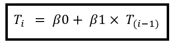
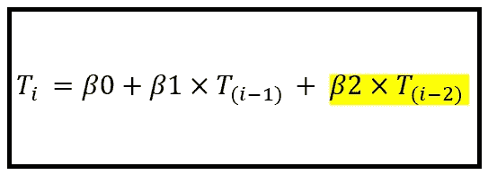
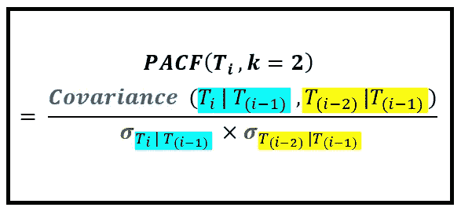
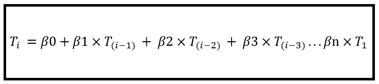
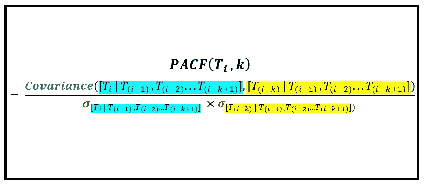
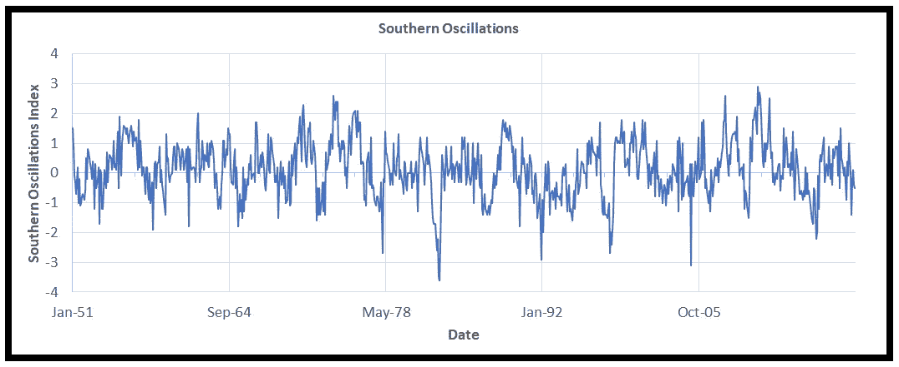
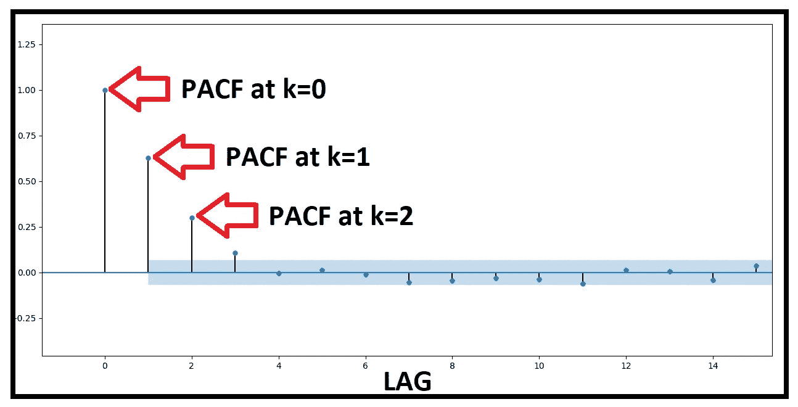
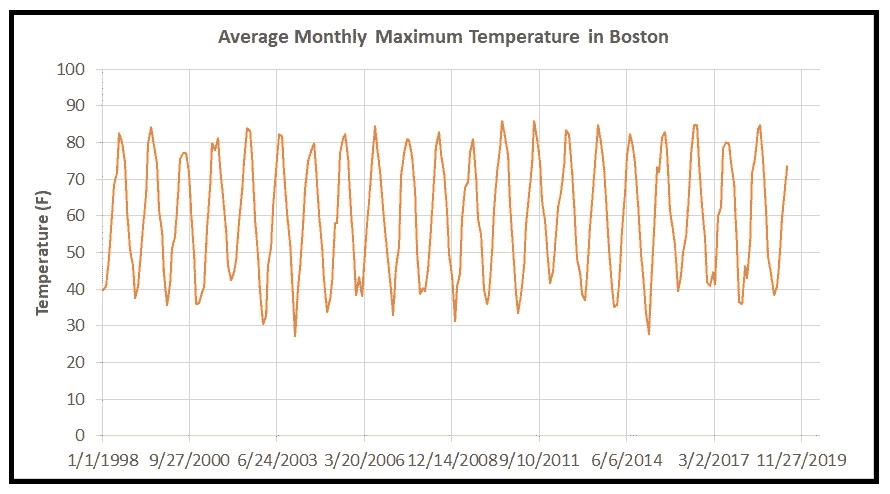
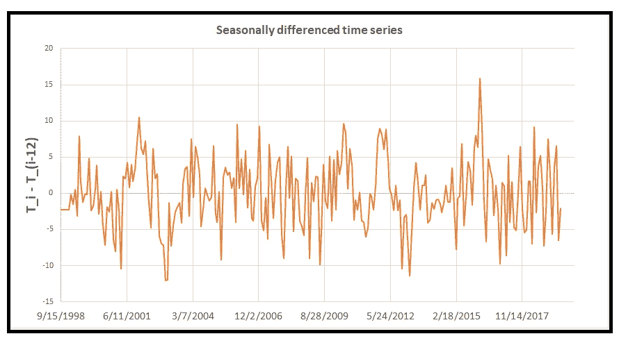
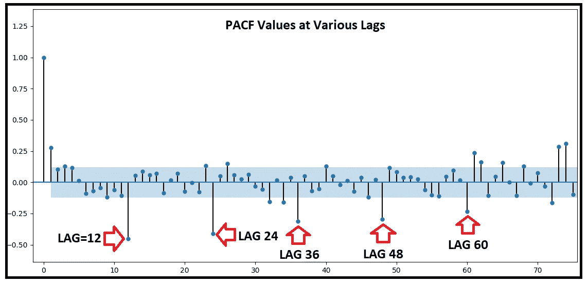

# 理解部分自相关

> 原文：<https://towardsdatascience.com/understanding-partial-auto-correlation-fa39271146ac?source=collection_archive---------6----------------------->

## 它是什么，如何计算，何时使用

本文将部分自相关置于透镜之下。

我们将回顾推动创建**P**artial**A**uto-**C**or relation**F**function(PACF)的概念，我们将看到这些概念如何导致部分自相关定义和 PACF 公式的发展。

我将根据基本原理演示如何计算 PACF，并将结果与由*stats models . TSA . stat tools . pacf()*返回的值进行比较。

最后，我们将了解如何在时间序列预测中使用 PACF。

## 为 PACF 奠定基础:自回归时间序列


[Bouncing ball in strobe light](https://en.wikipedia.org/wiki/File:Bouncing_ball_strobe_edit.jpg)

过去影响现在的现象很多。昨天的事件可以用来预言今天将会发生什么。当这种现象被表示为时间序列时，它们被认为具有自回归特性。在自回归时间序列中，当前值可以表示为前一个值、前一个值等的函数。换句话说，当前值与来自同一时间序列的先前值相关联。

如果时间序列是自回归的，通常情况下，当前值的预测可以计算为仅**前一值和一个常数的线性函数，如下所示:**



(Image by [Author](https://sachin-date.medium.com/))

这里的 *T_i* 是在第*和第*时间步由方程预测的值。 *Beta0* 是模型的 Y 截距，它对预测应用恒定量的偏差。它还规定了如果前一时间步 *T_(i-1)* 的值恰好为零，那么 *T_i* 的预测值是多少。*β1*告诉我们 *T_i* 改变 w.r.t. *T_(i-1)* 的速率。

这个简单等式背后的关键假设是， *T_(i-1)* 中的方差能够解释时间序列中比 *T_(i-1)* 更老的所有值所表示的所有方差。这就好像 *T_(i-1)* 捕获了与比它自身更老的值相关联的所有信息。

但是如果这个假设不成立呢？如果 *T_(i-1)* 中的方差不能解释 *T_(i-2)* 中包含的所有方差怎么办？在这种情况下，上述等式将无法将来自 *T_(i-2)* 的这部分未解释的方差输入到 *T_i* 中，从而导致 *T_i* 的预测出现偏差。

幸运的是，很容易解决这个问题，在上面的等式中添加一项，如下所示:



(Image by [Author](https://sachin-date.medium.com/))

在这个等式中，额外的项*β2 * T _(I-2)*试图捕捉包含在比 *T_(i-1)* *更老的值中的方差，该方差不能由 T_(i-1)* 中的方差来解释。它将这个余额数量的信息*直接*输入到今天的值 *T_i* 的预测中。

背景建立后，让我们建立部分自相关函数的定义和公式。

## 构建 PACF 的定义

让我们复制上面的等式以供参考:


(Image by [Author](https://sachin-date.medium.com/))

了解 *T_(i-2)* 中方差的余额在预测今天的值 *T_i* 中有多重要是非常有用的。为什么？因为它告诉我们是否需要在我们的 *T_i* 预测模型中添加 *T_(i-2)* 作为变量。如果 *T_(i-2)* 中的余额方差在统计上不显著，我们可以有把握地假设，比 *T_(i-2)* 更早的值中的所有方差要么对预测今天的值不显著，要么它们的显著性已经在 *T_(i-1)* 中被捕获。无论哪种方式，它都给了我们一个理由，让我们回到更早的更简单的方程，它只包含 *T_(i-1)* 。

那么我们如何发现 *T_(i-2)* 中的这个差额量在预测今天的价值 *T_i* 中有多重要呢？很简单，我们计算两者之间的相关系数。等等，但是 *T_i* 不也和 *T_(i-1)* 相关吗？毕竟这是上面两个方程的全部基础！当然是了。因此，我们实际上想要找出的是以下两个变量之间的相关性:

***变量 I:*** 用 *T_(i-1)* 中的方差解释**以外的 *T_i* 中的方差，以及**

***变量 II:***T _(I-2)中的方差是**未用 *T_(i-1)* 中的方差解释**的量。

这种相关性称为 *T_i* 与 *T_(i-2)* 的**部分自相关**。

变量 II 的定义似乎有悖直觉。昨天的价值如何解释前天的价值？为了理解这一点，回想一下在自回归时间序列中，前天的值**中的一些信息被结转**到昨天的值中。这个事实——以一种听起来很奇怪的方式——使得昨天的价值成为前天价值的预测器！

对上述论证进行归纳，得出 PACF 的如下定义:

> **T _ I 与其自身的 k 滞后版本即 T_(i-k)的部分自相关是以下两个变量之间的相关:**
> 
> **变量 1:**T _ I 中未被 T_(i-1)、T_(i-2)…T_(i-k+1)中的方差所解释的方差的量，并且
> 
> **变量 2:**T _(I-k)中未被 T_(i-1)，T_(i-2)…T_(i-k+1)中的方差所解释的方差的量。

## 为 PACF 制定方案

让我们依靠我们的滞后=2 的例子来发展 PACF 公式。稍后，我们将把它推广到 LAG=k。要知道 *T_(i-2)* 中有多少方差没有被 *T_(i-1)* 中的方差解释，我们做两件事:

1.  **步骤 1:** 我们用线性回归模型(即直线)拟合 *T_i* 对 *T_(i-1)* 的分布。这个线性模型将让我们从 *T_(i-1)* 预测 *T_i* 。从概念上讲，这个线性模型允许我们将 *T_i* 的方差解释为 *T_(i-1)* 的方差的函数。但是像所有最佳拟合的模型一样，我们的模型不能解释 *T_i* 的所有变化。这个事实把我们带到了第二步。
2.  **第二步:**在这一步中，我们计算在第一步中建立的线性模型的残差。残差是 *T_i* 的观测值与模型预测值之差。我们对 *T_i* 的每个值进行残差计算，以获得残差的时间序列。这个残差时间序列给了我们想要的东西。它给出了 *T_i* 中的方差，这无法用 *T_(i-1)* 中的方差来解释，当然还有一些噪声。

为了计算相关性中的第二个变量，即 *T_(i-2)* 中无法用 *T_(i-1)* 中的方差来解释的方差，我们在 *T_(i-2)* 和 *T_(i-1)* 的上下文中执行上面的步骤 1 和 2，而不是分别在 *T_i* 和 *T_(i-1)* 的上下文中执行。这给了我们寻找变量 2 的残差序列。

最后一步是将皮尔逊相关系数公式应用于这两个残差时间序列。

这是 PACF(T_i，k=2)的结果公式:



(Image by [Author](https://sachin-date.medium.com/))

*T_i|T_(i-1)* 是我们在将线性模型拟合到 *T_i* 对 *T_(i-1)* 的分布后，从步骤 1 和 2 中创建的残差时间序列。

*T_(i-2)|T_(i-1)* 是我们在将线性模型拟合到 *T_(i-2)* 对 *T_(i-1)* 的分布后，从步骤 1 和 2 中创建的第二个残差时间序列。

等式的分子计算这两个剩余时间序列之间的**协方差，而**分母使用各自的标准偏差标准化协方差**。**

所以你有它。这就是我们如何计算滞后=2 的 PACF。

## PACF 的一般公式(X，lag=k)

在一般情况下，早于一个或两个期间的值也会对当前期间值的预测产生直接影响。因此，可以将预测 T_i 的自回归方程的一般形式写为:



The general auto-regression equation (Image by [Author](https://sachin-date.medium.com/))

我们同样可以推广导致发展滞后=2 的 PACF 公式的论点。PACF 在滞后= *k* 时的公式为:



Formula for PACF at lag=k (Image by [Author](https://sachin-date.medium.com/))

***T_i|T_(i-1)，T_(i-2)…T_(i-k+1)*** 是对 *T_(i-1)，T_(i-2)…T_(i-k+1)* 拟合多元线性模型得到的残差时间序列，用于预测 *T_i* 。它代表在去除了 *T_(i-1)，T_(i-2)…T_(i-k+1)的影响后，在 *T_i* 中的剩余方差。*

***T_(i-k)|T_(i-1)，T_(i-2)…T_(i-k+1)*** 是用多元线性模型拟合 *T_(i-1)，T_(i-2)…T_(i-k+1)* 得到的残差时间序列，用于预测 *T(i-k)* 。它代表去除 *T_(i-1)，T_(i-2)…T_(i-k+1)的影响后，在 *T_(i-* k 中的剩余方差。*

## 通过一个例子

让我们说到做到。我们将*手动曲柄*使用上述步骤在真实世界的时间序列上推出 PACF。当然，在实践中，你不必从第一原理计算 PACF。但是知道如何从头开始会让你对 PACF 的机器有一个有价值的了解。

我们将使用的真实世界时间序列是[南方振荡](https://www.ncdc.noaa.gov/teleconnections/enso/indicators/soi/)数据集，它可以用来预测厄尔尼诺或拉尼娜事件。



Data source: [NOAA](http://www.cpc.ncep.noaa.gov/data/indices/soi) (Image by [Author](https://sachin-date.medium.com/))

我们将从设置导入开始，并将数据读入 pandas 数据帧。

```
**import** pandas **as** pd
**from** sklearn import linear_model
**import** matplotlib.pyplot **as** pltdf = pd.**read_csv**('southern_osc.csv', header=0, infer_datetime_format=True, parse_dates=[0], index_col=[0])
```

接下来，我们将向包含数据的滞后=1 和滞后=2 版本的数据框添加两列。

```
df['T_(i-1)'] = df['T_i'].**shift**(1)df['T_(i-2)'] = df['T_i'].**shift**(2)#drop the top two rows as they contain NaNs
df = df.**drop**(df.index[[0,1]])
```

现在，让我们在 *T_i* 和 *T_(i-1)* 上拟合一个线性回归模型，并将模型的预测作为一个新列添加回数据框中。

```
lm = linear_model.**LinearRegression**()df_X = df[['T_(i-1)']] #Note the double brackets! [[]]df_y = df['T_i'] #Note the single brackets! []model = lm.**fit**(df_X,df_y)df['Predicted_T_i|T_(i-1)'] = lm.**predict**(df_X)
```

接下来，让我们创建与该模型预测相对应的残差时间序列，并将其添加到数据框中。该时间序列为我们提供了计算滞后=2 时 *T_i* 的 PACF 所需的两个数据序列中的第一个。

```
#Observed minus predicted
df['Residual_T_i|T_(i-1)'] = df['T_i'] - df['Predicted_T_i|T_(i-1)']
```

让我们重复上述过程来计算第二个残差时间序列，这一次使用列: *T_(i-2)* 和 *T_(i-1)* 。

```
lm = linear_model.**LinearRegression**()df_X = df[['T_(i-1)']] #Note the double brackets! [[]]df_y = df['T_(i-2)'] #Note the single brackets! []model = lm.**fit**(df_X,df_y)df['Predicted_T_(i-2)|T_(i-1)'] = lm.**predict**(df_X)#Residual = Observed - predicted
df['Residual_T_(i-2)|T_(i-1)'] = df['T_(i-2)'] - df['Predicted_T_(i-2)|T_(i-1)']
```

最后，让我们将皮尔逊 r 公式应用于两个残差时间序列，以获得滞后=2 时的 PACF 值。

```
print(df.**corr**(method='pearson')['Residual_T_i|T_(i-1)']['Residual_T_(i-2)|T_(i-1)'])
#prints: 0.29612303554627606
```

如前所述，在实践中我们作弊！:=)像这样:

```
**from** statsmodels.tsa.stattools **import** pacfprint(**pacf**(df['T_i'], nlags=2)[2])
#prints: 0.2996545841351261
```

以下是完整的代码片段:

这里是[链接](https://gist.github.com/sachinsdate/27416fbce595e5ea7a557085641de034)到南方涛动数据集。

## 如何在时间序列预测中使用 PACF

您可以在以下方面非常有效地利用 PACF:

1.  确定在自回归模型的预测方程中要包括多少个过去的滞后。这被称为模型的自回归(AR)阶。
2.  确定或验证在季节性时间序列的基于移动平均的预测模型的预测方程中包括多少季节性滞后。这就是所谓的季节性移动平均线(SMA)的顺序过程。

让我们看看如何用 PACF 计算这些项。

## 利用 PACF 确定 AR 过程的阶数

让我们绘制不同滞后的南方涛动数据集的 PACF:



PACF plot for the Southern Oscillations data set (Image by [Author](https://sachin-date.medium.com/))

这个情节引出了以下几点:

1.  滞后 0 时的 PACF 为 1.0。情况总是如此。一个值总是与自身 100%相关！
2.  滞后 1 时的 PACF 为 0.62773724。该值只是滞后 0 值和滞后 1 值之间的常规自相关。
3.  滞后 2 时的 PACF 值为 0.29965458，这与我们手动计算的值基本相同。
4.  在滞后 3 时，该值刚好在 95%置信区间之外。它可能重要，也可能不重要。

因此，南方涛动数据集具有 AR(2)，或者可能具有 AR(3)特征。

下面是生成图表的代码片段:

```
**import** pandas **as** pd
**from** statsmodels.graphics.tsaplots **import** plot_pacf
**from** statsmodels.tsa.stattools **import** pacf
**import** matplotlib.pyplot **as** pltdf = pd.**read_csv**('southern_osc.csv', header=0, infer_datetime_format=True, parse_dates=[0], index_col=[0])plot_pacf(df['T_i'], title='PACF: Southern Oscillations')print(pacf(df['T_i']))
```

## 使用 PACF 确定形状记忆合金过程的顺序

考虑下面的季节性时间序列图。



Average monthly max temperature in Boston,MA from 1998- 2019 (Image by [Author](https://sachin-date.medium.com/))

人们很自然地会认为去年一月份的最大值与今年一月份的最大值相关联。所以我们猜测季节周期是 12 个月。基于这一假设，让我们将 12 个月的单一季节差异应用于该时间序列，即我们将得出一个新的时间序列，其中每个数据点是原始时间序列中相隔 12 个周期的两个数据点的差异。这是季节性差异时间序列:



Seasonally differenced time series (Image by [Author](https://sachin-date.medium.com/))

接下来，我们计算这个季节性差异时间序列的 PACF。这是 PACF 的地图:



PACF values of the seasonally differenced time series at various lags (Image by [Author](https://sachin-date.medium.com/))

PACF 图显示了 12、24、36 个月的显著部分自相关，从而证实了我们的猜测，即季节周期为 12 个月。此外，这些尖峰为负的事实指向 SMA(1)过程。SMA(1)中的“1”对应于原始序列中的周期 12。因此，如果您要为此时间序列构建一个季节性 ARIMA 模型，您应该将 ARIMA 的季节性部分设置为(0，1，1)12。第一个“1”对应于我们应用的单一季节差异，第二个“1”对应于我们注意到的 SMA(1)特征。

以下是生成这些图的代码片段:

```
**import** pandas **as** pd
**from** statsmodels.graphics.tsaplots **import** plot_pacf
**import** matplotlib.pyplot **as** plt #load the data set
df = pd.**read_csv**('data\\boston_daily_wx_1998_2019.csv', header=0, infer_datetime_format=True, parse_dates=[0], index_col=[0])#plot it
df['Monthly Average Maximum'].**plot**()
plt.**show**()#created the LAG 12 column
df['T_(i-12)'] = df['Monthly Average Maximum'].**shift**(12)#create the differenced column
df['T_i-T_(i-12)'] = df['Monthly Average Maximum'] - df['T_(i-12)']#plot the differenced series
df['T_i-T_(i-12)'].**plot**()
plt.**show**()#drop the first 12 rows as they contain NaNs in the differenced col
df = df[12:]#plot the pacf of the differenced column
**plot_pacf**(df['T_i-T_(i-12)'], title='PACF: Seasonal Time Series')
plt.**show**()
```

这里是[链接](https://gist.github.com/sachinsdate/edde9188b8648b378bd8ed521117d14f)到数据集。

所以你有它。PACF 是一个强大的工具，是预测者工具箱中的必备工具。既然你已经知道了它的工作原理和如何解释结果，请一定要使用它，尤其是在构建 AR、MA、ARIMA 和季节性 ARIMA 模型时。

预测快乐！

## 相关阅读

[](/the-intuition-behind-correlation-62ca11a3c4a) [## 相关性背后的直觉

### 两个变量相关到底意味着什么？我们将在本文中回答这个问题。我们还将…

towardsdatascience.com](/the-intuition-behind-correlation-62ca11a3c4a) 

*如果你喜欢这篇文章，请关注我的*[***Sachin Date***](https://timeseriesreasoning.medium.com)*获取回归、时间序列分析和预测主题的技巧、操作方法和编程建议。*