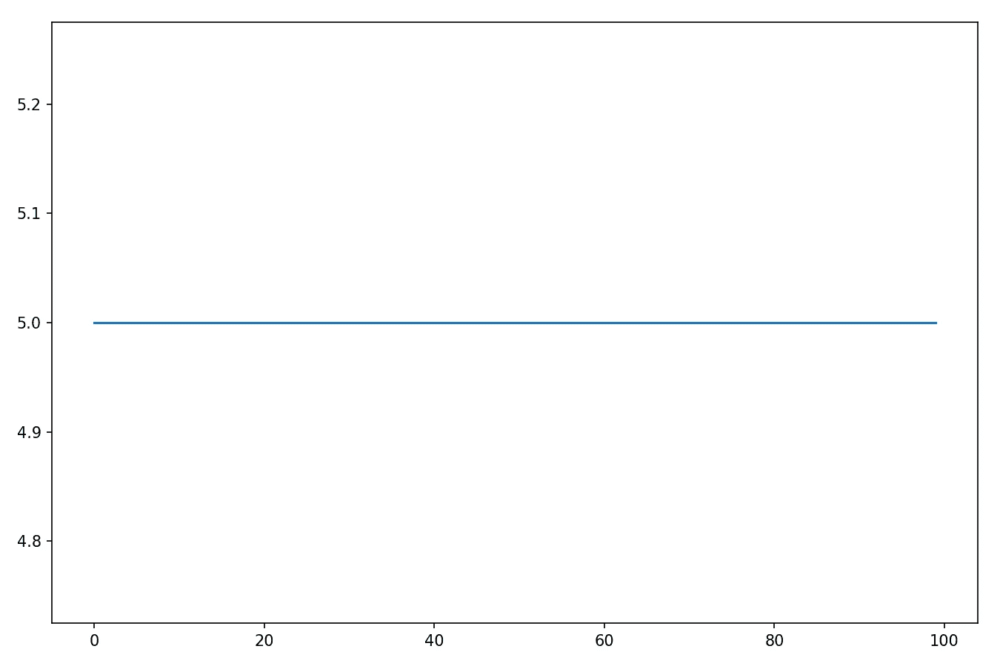
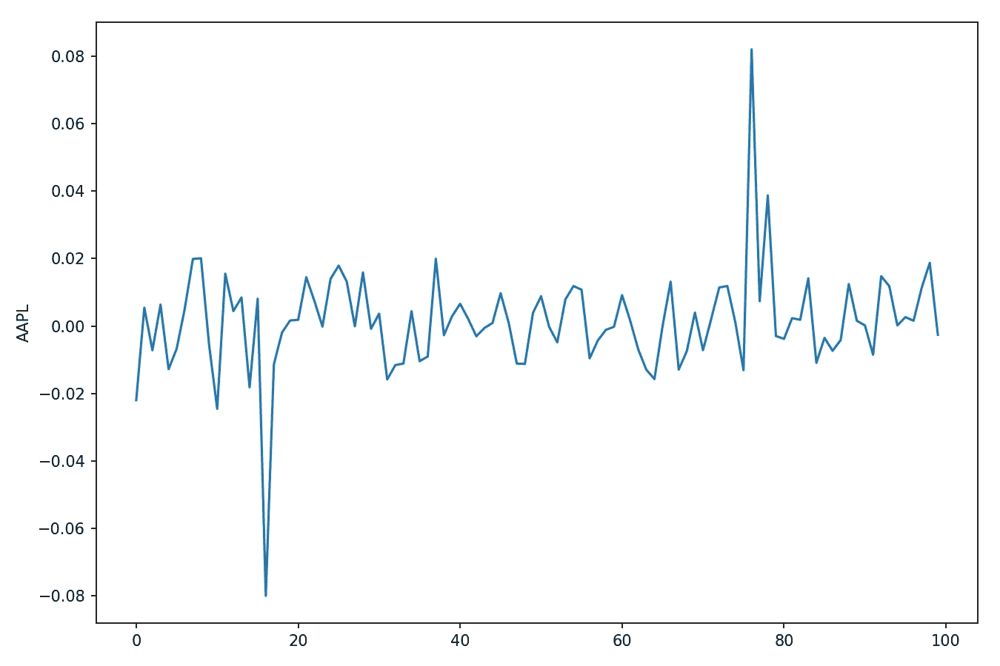
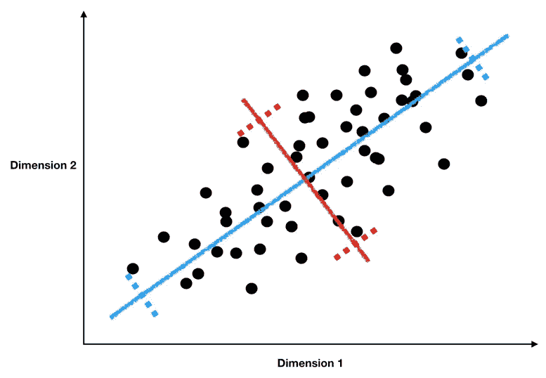
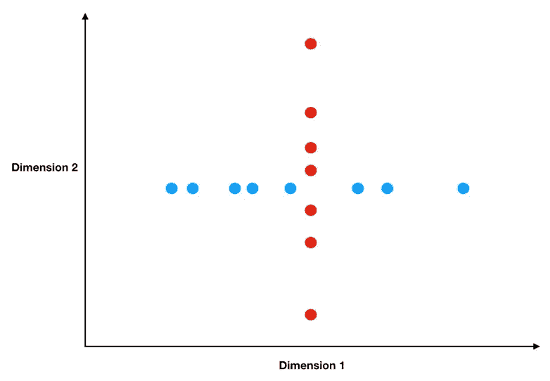
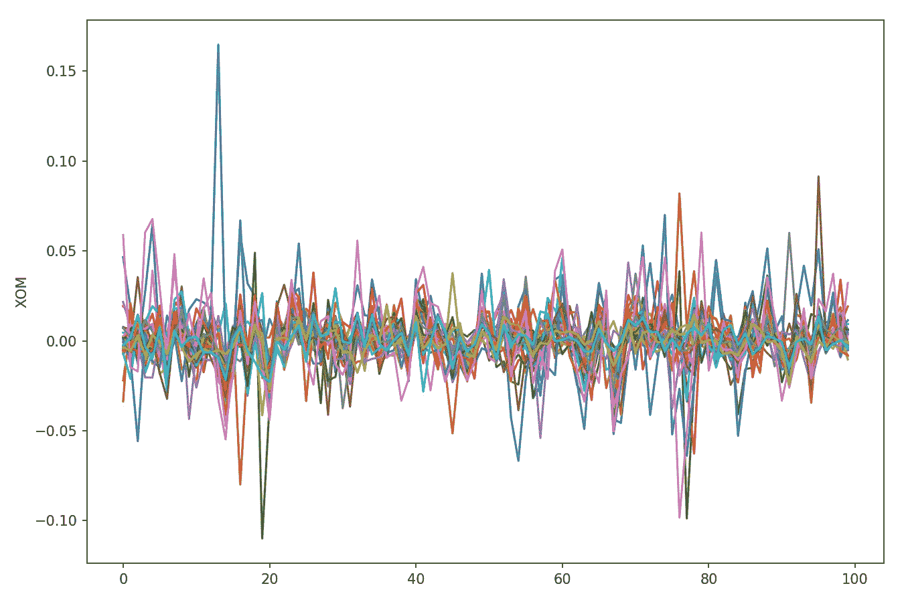
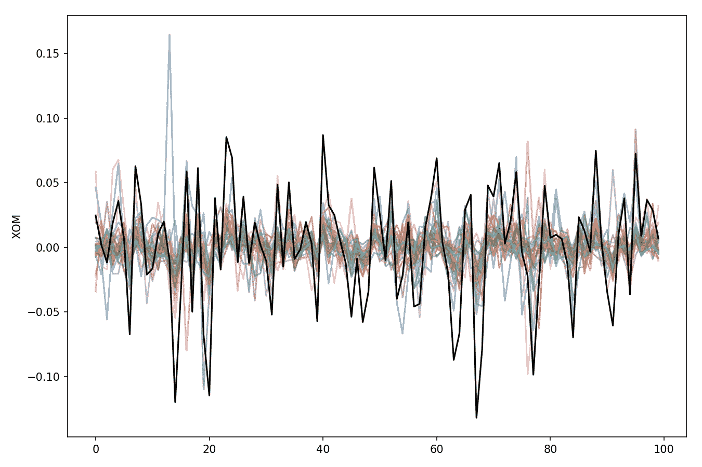
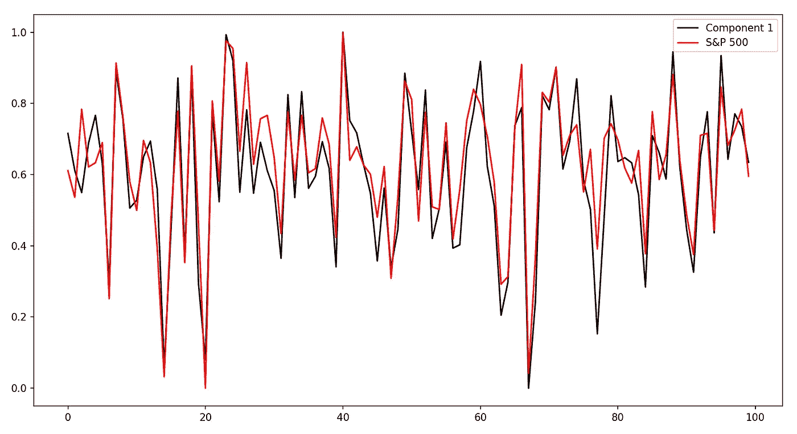
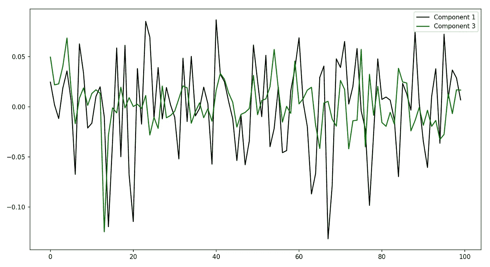

# 理解 PCA(主成分分析)

> 原文：<https://towardsdatascience.com/understanding-pca-fae3e243731d?source=collection_archive---------1----------------------->

Photo by [Margaret Weir](https://unsplash.com/@margotd1?utm_source=unsplash&utm_medium=referral&utm_content=creditCopyText) on [Unsplash](https://unsplash.com/search/photos/data?utm_source=unsplash&utm_medium=referral&utm_content=creditCopyText)

## 我们发现主成分分析如何帮助我们揭示数据中的潜在趋势

在数据科学和金融(以及几乎任何定量学科)中，我们总是在大量噪音中寻找信号。现在，如果有一个算法可以为我们做到这一点…

有！今天，我们将探索 **PCA(主成分分析)如何帮助我们发现隐藏在数据中的潜在驱动因素——这是一个非常有用的功能，因为它允许我们仅使用几个主成分来总结庞大的功能集。**

*如果你对我用来生成下面图表的代码感兴趣，你可以在我的 GitHub 上找到它* [*这里*](https://github.com/yiuhyuk/PCA) *。*

# 变化既是我们的敌人，也是我们的朋友

如果你花了一些时间阅读统计学或数据科学教科书，你会注意到，我们费尽周折建立模型的主要原因是为了解释方差。

但是这到底意味着什么呢？让我们一步一步地解开这个。首先，我们所说的方差实际上指的是什么？想象我们的数据是这样的:

A Flat Line Has Zero Variance

你在想，“托尼，你为什么给我看一条直线？这太无聊了。”这正是问题的关键。如果我们的数据只是一条平坦的线，那么预测起来会非常容易(只是一直预测五条)，但也完全没意思。扁平线是零方差数据的一个例子，数据中绝对没有垂直变化。

现实生活中有什么零方差数据的例子？这听起来很荒谬，但是让我们假设你的老板让你预测一栋五层楼的楼层数。所以在 100 天的每一天，你都要测量这个建筑的层数，最后你会得到上面的图表，一条直线。当你的老板回来问你的预测时，你自信地说“我预测明天大楼仍然有五层楼高！”火箭科学对吗？

除非发生灾难，否则你有 100%的可能是正确的。但是你的所作所为毫无意义——没有方差的**数据没有不确定性，所以我们没有什么可以预测或解释的**，它就是这样。如果我们试图使用方差为零的变量作为模型中的 X 变量(以预测方差非零的目标变量)，我们会因为特征集中信号的绝对缺乏而变得非常沮丧。

那么有方差的数据是什么样的呢？以下是苹果股票 100 天的每日价格回报(百分比):

100 Days of AAPL Daily Returns

现在我们有东西可以利用了。不出所料，我们的苹果股票回报数据中存在大量的方差— **方差基本上就是数据上下波动的幅度。它越有弹性，就越难预测或解释。**苹果的日回报率大幅反弹，在正值和负值之间来回波动，包括一些大幅飙升。

但是在这些噪音中，有弹性的数据也包含信号(也就是信息)。

> 与没有方差的数据相比，弹性数据作为模型的目标变量比**有趣得多，作为模型内部的特征变量**比**有用得多。**

这就是为什么我说变化既是我们的敌人也是我们的朋友:

*   它是我们的敌人，因为我们的目标变量中更多的变化会产生不确定性，使目标更难预测或解释。
*   但它也是我们的朋友，因为正如我们上面看到的，没有方差的特征是完全没有意思的，根本不包含任何信号。因此，为了有机会建立一个好的模型，我们需要具有信号的特征，或者换句话说，具有方差的特征(实际上，更具体地说，我们想要与目标具有非零协方差的特征)。

# 用主成分捕获信号

我们生活在一个信息太多而不是太少的世界。数据科学也是如此——几乎总是有一大堆潜在特征可供我们用来做出预测。

尽管我们很想这样做，但我们不可能把它们都用上。我们只是没有足够的观察值-当我们只有目标变量的 5000 个观察值时，使用 10，000 个特征来拟合模型将是一个可怕的想法。我们最终会得到一个严重过度拟合的模型，一旦我们试图在真实世界中运行该模型(基于真正的样本数据)，该模型就会崩溃。

但是如果没有领域专业知识和建模经验(有时即使有)，也很难决定哪些特性真正值得保留在我们的模型中。现在，如果有一种算法可以将我们的 10，000 个特征转换成一组理想的特征就好了。

## 理想的功能集

如果我们可以从头开始创建一个理想的特性集，这个集将具有什么属性？我建议它具有以下三个特性:

1.  **方差大:**方差大的特征包含了大量的潜在信号——信号(又称有用信息)是建立好模型的基本要求。
2.  **不相关:**彼此高度相关的特征用处不大，在某些情况下甚至是有害的(当相关性高到导致[多重共线性](https://en.wikipedia.org/wiki/Multicollinearity))。要明白为什么会这样，假设你雇佣了一屋子有才华的股票交易者。你希望他们都以相似还是不同的方式投资？如果是我，我更希望他们彼此尽可能不同——这创造了一种多样化的效果，交易者互相保护，避免犯错，你几乎不会遇到所有人同时犯错的情况。
3.  **没有那么多:**相对于我们的目标变量观测值，我们希望有少量的特征。相对于观察值的太多特征将导致过度拟合模型，该模型在样本外表现不佳。

PCA(主成分分析)给了我们一套理想的特征。**它创建一组按方差排序的主成分**(第一个成分比第二个成分方差大，第二个成分比第三个成分方差大，依此类推)**、不相关、数量少**(我们可以丢弃排序较低的成分，因为它们包含的信号很少)。

# PCA 是怎么做到的？

那么它是如何产生如此神奇的效果的呢？有线性代数的解释或者直觉的解释。我们在这里会选择直观的，但是如果你想检查数学，[这篇博文很棒](/a-one-stop-shop-for-principal-component-analysis-5582fb7e0a9c)。

PCA 通过反复询问和回答以下问题来发挥其魔力:

1.  在该过程的最开始，PCA 询问特征集中最强的潜在趋势是什么(我们称之为组件 1)？我们将在后面以多种方式形象化这一点，所以如果现在还不清楚，请不要担心。
2.  接下来，PCA 询问特征集中第二强的潜在趋势是什么，它恰好与组件 1(我们称之为组件 2)不相关？
3.  然后 PCA 询问特征集中第三强的潜在趋势是什么，它恰好与成分 1 和成分 2 都不相关(我们称之为成分 3)？
4.  诸如此类…

它是如何发现这些潜在趋势的？如果你曾经谷歌过 PCA，你很可能看到过类似下图的东西:

PCA Simple Example

在图中，我们的数据是黑点。那么最强的潜在趋势是什么呢？我们可以把它当作一个线性回归问题来处理，最强的趋势是最佳拟合线(蓝线)。所以蓝线是组件 1。你可能会问为什么蓝线是分量 1 而不是红线？记住，分量 1 是具有最高方差的主分量(因为最高方差等于最高潜在信号)。

**线性回归连接很有用，因为它帮助我们认识到每个主成分都是单个特征的线性组合。**就像线性回归模型是与我们的目标变量最接近的特征的加权和一样，主成分也是我们特征的加权和。**除了在这种情况下，它们是最能表达我们特征集中潜在趋势的加权和。**

回到我们的例子，我们可以直观地看到，蓝线比红线捕捉到更多的差异，因为蓝色勾线之间的距离比红色勾线之间的距离长。标记线之间的距离是我们的主成分捕获的方差的近似值-黑点越多，我们的数据沿着主成分的轴变化，它捕获的方差就越多。

现在对于成分 2，我们想要找到第二强的潜在趋势，附加条件是它与成分 1 不相关。在统计学中，相互正交的趋势和数据是不相关的。

Orthogonal Data

看看左边的那块地。我绘制了两个特征，一个用蓝色，另一个用红色。如你所见，它们是相互垂直的。蓝色特征的所有变化都是水平的，而红色特征的所有变化都是垂直的。因此，当蓝色要素改变(水平)时，红色要素完全保持不变，因为它只能垂直改变。

很好，所以为了找到分量 2，我们只需要找到一个方差尽可能大的分量，它也和分量 1 正交。由于我们之前的 PCA 示例非常简单，只有两个维度，因此对于组件 2，我们只有一个选项，即红线。事实上，我们可能有大量的功能，所以当我们搜索组件时，我们需要考虑许多方面，但即使这样，过程也是一样的。

# 一个将这一切联系在一起的例子

让我们回到之前的股票例子。除了苹果股票，我还下载了代表多个行业的 30 只不同股票的数据。如果我们画出他们所有的日收益(100 天，同上)，我们会得到下面这张混乱的图表:

100 Days of Stock Returns for 30 Different Stocks

每只股票都在做自己的事情，除了每天的股票回报是嘈杂和不稳定的之外，从这张图表中没有太多可以收集的信息。让我们[使用 sci-kit learn](https://scikit-learn.org/stable/modules/generated/sklearn.decomposition.PCA.html#sklearn.decomposition.PCA.transform) 来计算主成分 1，然后绘制它( **PCA 对你的特征的相对比例很敏感**——因为我的所有特征都是每日股票回报，我没有缩放数据，但在实践中，你应该考虑使用[标准缩放器](https://scikit-learn.org/stable/modules/generated/sklearn.preprocessing.StandardScaler.html)或[最小最大缩放器](https://scikit-learn.org/stable/modules/generated/sklearn.preprocessing.MinMaxScaler.html))。下图中的黑线是组件 1:

Stock Returns with PCA Component 1 (In Black)

所以黑线代表了我们股票回报中最强的潜在趋势。“这是什么？”，你问？好问题，不幸的是，没有一些领域的专业知识，我们不知道。这种解释的损失是使用类似 PCA 的东西来将我们大得多的特征集减少到一个更小的关键底层驱动集的主要缺点。除非我们运气好，或者仅仅是数据专家，否则我们不会知道每一个主成分分析的成分意味着什么。

在这种情况下，我会猜测第一部分是标准普尔 500——在我们所有的股票回报数据中，最强的潜在趋势可能是整体市场，其涨跌会影响每只股票的价格。让我们通过绘制标准普尔 500 的每日收益与第一部分的对比来验证这一点。考虑到数据的噪音，这几乎是完美的匹配！**标准普尔 500 指数的日收益率和主成分 1 的相关性为 0.92。**

The S&P 500 and Component 1 are Extremely Correlated

**所以就像我们猜测的那样，我们股票数据中最重要的潜在趋势是股票市场。**PCA 的 scikit-learn 实现还告诉我们每个组件解释了多少差异——组件 1 解释了我们特征集中总差异的 38%。

让我们来看看另一个主成分。下面，我绘制了组件 1(黑色)和 3(绿色)。正如所料，它们之间的相关性很低(0.08)。与组件 1 不同，组件 3 仅解释了我们特征集中 9%的差异，远低于组件 1 的 38%。不幸的是，我不知道成分 3 代表什么——这就是 PCA 缺乏解释来咬我们的地方。

Principal Components 1 and 3

# 结论

在这篇文章中，我们看到了 PCA 如何帮助我们揭示数据中的潜在趋势——这是当今大数据世界中一种非常有用的能力。PCA 很棒，因为:

1.  它将潜在信号隔离在我们的特征集中，以便我们可以在我们的模型中使用它。
2.  它将大量的特征简化为一组更小的关键潜在趋势。

然而，缺点是当我们通过 PCA 运行我们的特征时，我们失去了许多可解释性。如果没有领域专业知识和大量猜测，我们可能不知道除了前一两个组件之外的任何组件代表什么。

但一般来说，这不是一个交易破坏者。如果您确信在您的大量特征中有充足的信号，那么 PCA 仍然是一种有用的算法，它允许您提取大部分信号用于您的模型，而不必担心过度拟合。

[***如果你总体上喜欢这篇文章和我的写作，请考虑通过我在这里的推荐链接注册 Medium 来支持我的写作。谢谢！***](https://tonester524.medium.com/membership)