# 理解概率。终于！

> 原文：<https://towardsdatascience.com/understanding-probability-finally-576d54dccdb5?source=collection_archive---------6----------------------->

## 数据科学家概率概念图解实用指南

虽然您已经使用随机森林、逻辑回归、K-means 聚类、支持向量机甚至深度学习解决了日常生活中的实际问题，但在本次复习结束时，您将能够自信地谈论概率。

[source](https://sloanreview.mit.edu/article/from-the-archives-managing-in-a-time-of-uncertainty/)

本文温和地介绍了数据科学和机器学习背后的概率概念。每一个概念都通过真实的例子被小心地介绍和说明，同时尽可能地避免数学和定理。

作为一名数据科学家，你将最终确定结果、事件、随机变量、概率分布、期望、均值和方差等概念。

> 本杰明·富兰克林曾经说过，生命中有两件事是确定的:死亡和纳税。

许多人可能会进一步扩展这一主张，断言这些是唯一确定的事情。生活的其余部分是最不可预测的。

然而，我们可以争辩说，即使是不可避免的死亡也可能不像我们想象的那样确定，因为我们并不总是知道它将在何时、何地以及如何发生。

> 我们如何处理随机现象？凭信念还是凭理智？

**信念**是对不需要任何证据且被认为无法通过任何经验或理性手段证明的事情的真实性的绝对信念。

**理性**是思维的能力，通过它我们可以逻辑地得出理性的结论。

虽然信念是冷静处理随机现象的好工具，但理性给了我们学习我们观察到的范围、平均值或可变性的方法。

理性允许我们从更大范围的观察中推断出结构、变化和关系。我们还可以尝试预测未来、可能性，并保证我们对结果有多确定。

推理方法带来了一些好处，比如理解潜在的观察结果，提前计划事情如何变化，以及构建提供最确定结果的东西。

# 打破不确定性

当我们观察周围的世界并收集数据时，我们正在进行一项实验。一个简单的例子是**抛硬币**，同时观察它是正面还是反面落地。一个更复杂的例子是试用一个软件，观察我们愿意为它的完整版本支付多少钱。这些实验的所有可能结果构建了所谓的**样本空间**，表示为ω。

[source](https://courses.edx.org/courses/course-v1:UCSanDiegoX+DSE210x+3T2019/course/)

在硬币的例子中，样本空间有两个元素:头部和尾部。这是一个**离散样本空间**，与软件示例中的**连续样本空间**形成对比。在后一种情况下，为软件支付的金额可以是任何正实数。在这两种情况下，我们都在进行一个概率实验，结果未知 *X* ，也称为**随机变量**。

在抛硬币实验中，如果硬币正面落地， *X* 将得到值 *h* ，否则将得到值 *t* 。如果实验重复多次，我们通常将随机变量 *X* 得到小 *x* 的概率**定义为小 *x* 发生的次数的分数。**

# 概率作为一个函数

在抛硬币的情况下，如果我们用一枚公平的硬币进行足够长时间的实验，几乎无数次，我们将期望正面或反面落地的概率是 1/2。头部或尾部着地的概率都是非负的，总和为 1。

因此，我们可以将概率视为一个函数，它获取一个结果，即样本空间中的一个元素，并将该结果映射到一个非负实数，使得所有这些数字的总和等于 1。我们也把这个叫做**概率分布函数**。

当我们知道了样本空间和概率分布，我们就有了实验的完整描述，我们可以对不确定性进行推理。

在**均匀概率分布**中，样本空间中的所有结果将具有相同的发生概率。我们的抛硬币案例就是这样一个例子。另一个例子是纸牌游戏，从一副标准的 52 张牌中挑出一张给定牌的概率是 1/52。

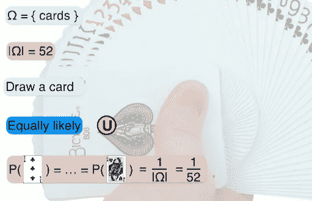

[source](https://courses.edx.org/courses/course-v1:UCSanDiegoX+DSE210x+3T2019/course/)

**非均匀分布**将不同的概率映射到不同的结果或一组结果。下面的饼图展示了一个很好的例子，其中每个类别代表一个结果，比例代表概率。

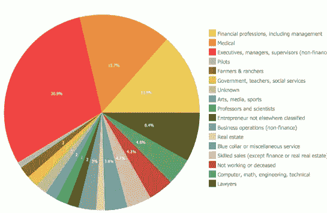

[source](https://courses.edx.org/courses/course-v1:UCSanDiegoX+DSE210x+3T2019/course/)

# 当出现多种结果时

一组结果也被称为**概率事件**。比如我们掷骰子，所有偶数的集合就是一个事件。如果包含已发生的结果，则发生事件。因此，如果我们掷出数字 4，事件就发生了。

当实验重复多次时，事件的**概率将是事件发生次数的分数。例如，如果我们投掷骰子 10 次，我们得到以下数字 5，3，2，3，2，1，4，6，5，2，那么，奇数事件的概率是 5/10=1/2。**

如果我们重复掷骰子无数次，则事件的概率将是我们得到偶数的次数的分数，这是 2、4 或 6 次发生的分数之和，这给出了 1/6+1/6+1/6=3/6=1/2。

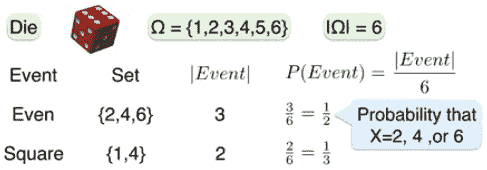

[source](https://courses.edx.org/courses/course-v1:UCSanDiegoX+DSE210x+3T2019/course/)

# 替换或不替换的采样

有时我们可能想多次重复同样的经历，就像抛硬币一样。当**重复实验**时，一个常见的假设是一个实验的结果对其他实验的结果没有任何影响。换句话说，这些实验是独立的。

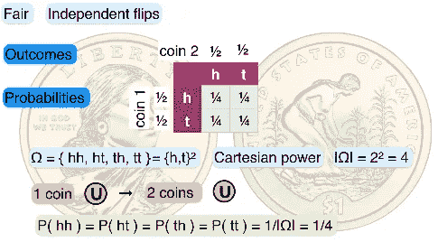

[source](https://courses.edx.org/courses/course-v1:UCSanDiegoX+DSE210x+3T2019/course/)

在现实生活中，我们经常从更大的人群中选择事物并进行分析。有以下两种方法:带替换的采样，不带替换的采样。

当我们用替换顺序**选择时，结果可以重复，实验是独立的。**

在下面的例子中，我们从一个装有两个球的瓶子中取出两个球，一个是黄色的，另一个是蓝色的。

[source](https://courses.edx.org/courses/course-v1:UCSanDiegoX+DSE210x+3T2019/course/)

如果我们**从罐子里选择了没有替换的**，结果就不会重复，实验也是相互依赖的。

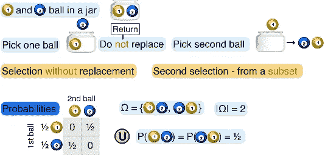

[source](https://courses.edx.org/courses/course-v1:UCSanDiegoX+DSE210x+3T2019/course/)

在迄今为止的所有例子中，顺序确实很重要。有时候**顺序并不重要**，我们只关心集合。我们不是处理可能结果的元组，而是处理可能结果的集合。

例如，如果我们抛硬币两次，我们可以得到(正面，反面)或(反面，正面)的结果。当顺序无关紧要时，两种结果都会构建事件{(head，tail)，(tail，head)}。

现在让我们看看另一种情况，我们从一副有 6 张替换牌的牌中选择 2 张。当顺序很重要时，我们有一个均匀分布，这意味着所有可能的元组(1，1)，(1，2)，…，(6，6，)都有相同的出现概率 1/36。

然而，当顺序无关紧要时，分布不再均匀，如下图所示。

[source](https://courses.edx.org/courses/course-v1:UCSanDiegoX+DSE210x+3T2019/course/)

让我们重复同样的实验，这次不用替换。现在，分布是均匀的，如下所示。顺序和抽样方法会对概率产生重大影响。

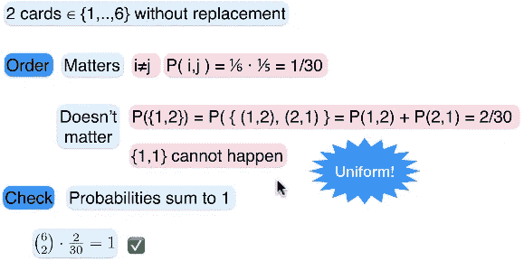

[source](https://courses.edx.org/courses/course-v1:UCSanDiegoX+DSE210x+3T2019/course/)

# 当结果是数字时

一个**随机变量**将是一个随机结果，其值是数字。研究数字(随机变量)而不是结果有几个好处。

我们可以控制头的数量、尾的数量或者两者之和，而不是把头和尾看作事件。此外，随机变量的概率可以显示在图中，也可以表示为具有特定属性的函数。

随机变量从样本空间中取值。如果样本空间是有限的，比如一组数{1，2，3}，那么我们处理的是一个**离散随机变量**。

当样本空间是无限的，比如ℝ，那么我们就有了一个**连续随机变量**。下面你可以看到一个离散随机变量的例子，它描述了在一个投掷三枚公平硬币的实验中的人头数。

[source](https://courses.edx.org/courses/course-v1:UCSanDiegoX+DSE210x+3T2019/course/)

上面的表格和图表描述了一个离散随机变量的**概率质量函数(PMF)** ，它也可以用直方图表示。

在连续随机变量的情况下，显然 PMF 不可能是一致的，也不可能是增函数。然而，它可以是一个递减函数或双无限函数。

# 区间概率

有时我们对计算随机变量的概率感兴趣，这个随机变量的值小于或等于某个阈值。

**累积分布函数(CDF)** 允许我们操纵区间概率，如下例所示。

[source](https://courses.edx.org/courses/course-v1:UCSanDiegoX+DSE210x+3T2019/course/)

# 我们应该期待什么

为了研究随机变量的不确定性，我们还对可能值的范围、最小值和最大值、范围平均值、元素平均值和样本平均值感兴趣。

特别是，样本均值是我们将来可能观察到的平均值的期望值。样本均值或**期望值**是一个随机变量的平均值，按概率加权。

下面我们有一个温度分布，大多数时间观察到 0 度。在 10 个温度值的样本中，我们获得样本平均值 19 度，这告诉我们可能观察到的平均温度的概念。

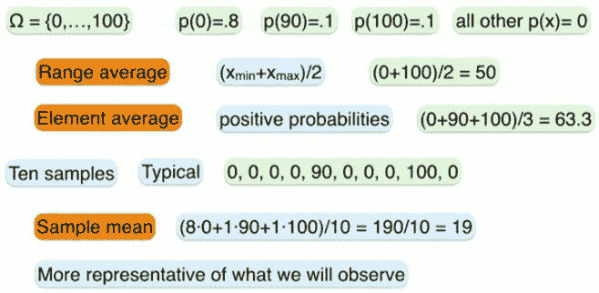

[source](https://courses.edx.org/courses/course-v1:UCSanDiegoX+DSE210x+3T2019/course/)

当样本数量趋于无穷大时，我们期望看到一个称为随机变量的**期望值**或**均值**的值，如下所示。也表示为 **μ** 。

预期寿命实际上是期望的一个很好的例证。下面我们可以看到发达国家人口统计数字的预期在 50 年内是如何变化的。

[source](https://www.mirror.co.uk/) (2017)

# 与期望值的差异

在我们知道期望什么之后，我们现在可以看看随机变量将如何不同于期望值或均值。具有相同平均值的两个样本可能看起来非常不同。

这些变化由随机变量的**方差**捕获，该方差被定义为随机变量 *X* 与其均值 *μ* 之间的绝对差的期望值。

因为绝对值不容易分析，尤其是它的微分在零处是不可能的，所以方差是使用差的平方来计算的。

标准偏差被定义为方差的平方根。

# 当所有事情同时发生时

在现实生活中，样本空间是多个变量的组合。如果我们要向学生发送广告，我们可能要考虑他们的年级、学习年份和专业，以便向每个特定的受众传递正确的信息。

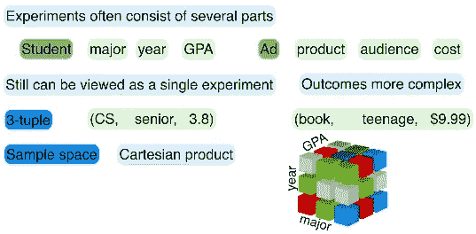

[source](https://courses.edx.org/courses/course-v1:UCSanDiegoX+DSE210x+3T2019/course/)

因此，给定 2 个或更多随机变量，我们考虑所谓的**联合分布**，其给出变量在样本空间中可以取的每个可能的值元组的概率。

联合分布足以计算边际概率，即单个变量取特定值的概率。

# 我们应该知道什么

随机变量通常属于流行的分布的**族，它们被很好地研究过，并给我们的生活带来便利。**

与连续分布相比，离散分布描述了具有可数结果的随机变量。

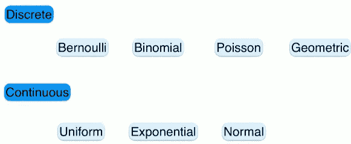

最简单的非平凡随机变量将取两个可能的值，例如 1 和 0，代表成功和失败，或头和尾。**伯努利分布**定义了成功概率 *p* ，以及失败概率 *q=1-p* 。当进行几个这样的独立二元实验时，给定结果序列的概率很容易计算为各个概率的乘积。

[source](https://courses.edx.org/courses/course-v1:UCSanDiegoX+DSE210x+3T2019/course/)

**二项式分布**定义了 *n 次*独立伯努利试验中特定次数成功的概率，其中成功概率为 *p* 。它可用于研究临床试验中的阳性应答者数量，或成功转化为付费客户的营销线索数量。

**泊松二项式分布**是二项式分布的变体，其中成功的概率是不固定的。

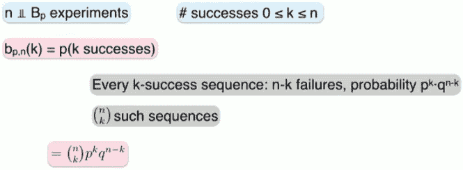

[source](https://courses.edx.org/courses/course-v1:UCSanDiegoX+DSE210x+3T2019/course/)

**泊松分布**近似二项式分布，表示成功的小概率 *p* 对于大量的试验 *n.* 例如，研究患有罕见疾病感染的人数、点击广告的网站访问者人数、垃圾邮件回复数、每日紧急呼叫数、全市人口中逛商店的人数、购买画作的画廊访问者人数非常有用。

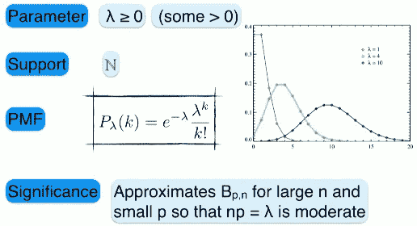

[source](https://courses.edx.org/courses/course-v1:UCSanDiegoX+DSE210x+3T2019/course/)

当我们以成功概率 *p* 重复独立的伯努利试验时，直到我们观察到成功的试验次数 *n* 遵循**几何分布**。例如，侵入计算机系统之前所需的黑客攻击次数和成功开展业务之前的创业公司数量将呈几何分布。

[source](https://courses.edx.org/courses/course-v1:UCSanDiegoX+DSE210x+3T2019/course/)

在许多情况下，随机变量的值来自一个无限的空间，有无数个可能的值。例如，诸如飞行持续时间、寿命持续时间的时间变量，或者诸如表面和高度的空间相关变量；或者与质量相关的变量，例如重量；或者温度。

这里甚至可以考虑几乎可数的数量，如房屋成本、产品价格、利率和失业率。

在所有这些情况下，我们不再使用概率质量函数。相反，我们应该使用所谓的**概率密度函数(PDF)** 。

**指数分布**将几何分布扩展为连续值。例如，电话呼叫的持续时间、客户拨打客户服务热线的等待时间以及车辆的寿命都可以用参数为λ的指数分布来描述。

[source](https://courses.edx.org/courses/course-v1:UCSanDiegoX+DSE210x+3T2019/course/)

最流行的是**正态**或**高斯分布**，这通常适用于添加许多独立因素的情况。它描述了已知平均值和标准差的值的概率。例子包括人们的身高和体重，以及工资。

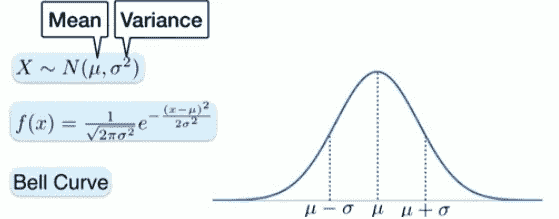

[source](https://courses.edx.org/courses/course-v1:UCSanDiegoX+DSE210x+3T2019/course/)

下表总结了连续分布的概率密度函数、均值和方差。

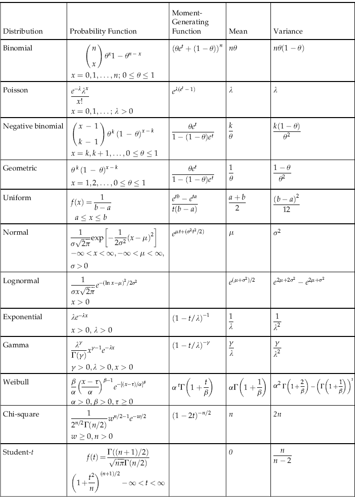

[source](https://www.oreilly.com/library/view/statistics-and-probability/9781118501696/a01.html)

# 结论

在本文中，我们提供了大多数数据科学家想要掌握的概率概念的通俗易懂的复习。我们超越了掷骰子，直观地说明了如何使用结果、事件、样本空间、分布函数、累积函数、随机变量、期望和方差来量化和分析不确定性。

在这篇文章中，我们使用了加州大学圣地亚哥分校的 Alon Orlitsky 教授的教学材料。他和 AdaBoost 算法的发明者 Yoav Freund 教授一起提供了一个关于概率和统计的免费课程。如果您想更深入地了解本文介绍的概念，我们强烈建议您参加本课程。

条件概率不包括在内；也不是贝叶斯方法的本质特征，贝叶斯方法的本质特征是在基于统计数据分析的推理中明确使用概率来量化不确定性。

我们在下面的文章中温和地介绍贝叶斯数据分析。

 [## 贝叶斯噩梦。解决了！

### 通过 Python PyMC3 中的示例和代码对贝叶斯数据分析进行了温和的介绍。

towardsdatascience.com](/bayesian-nightmare-how-to-start-loving-bayes-1622741fa960) 

感谢阅读。