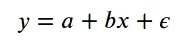
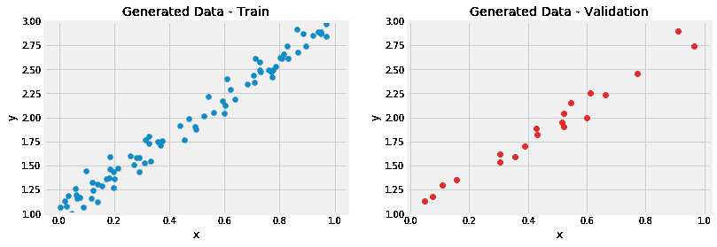
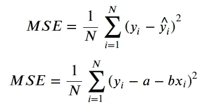
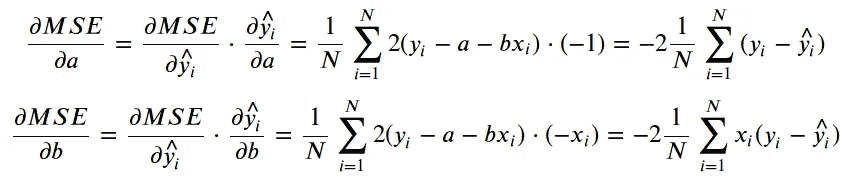
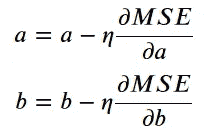
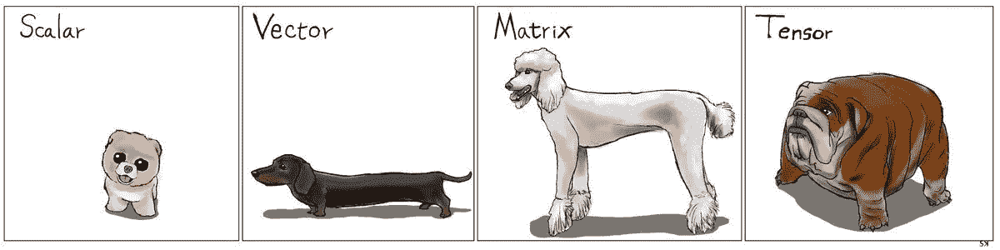
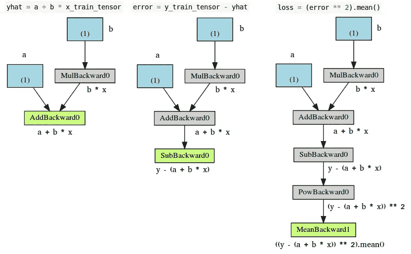
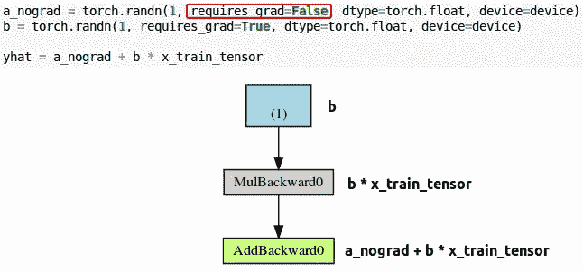
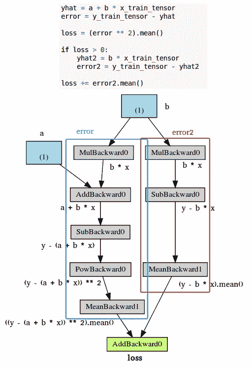
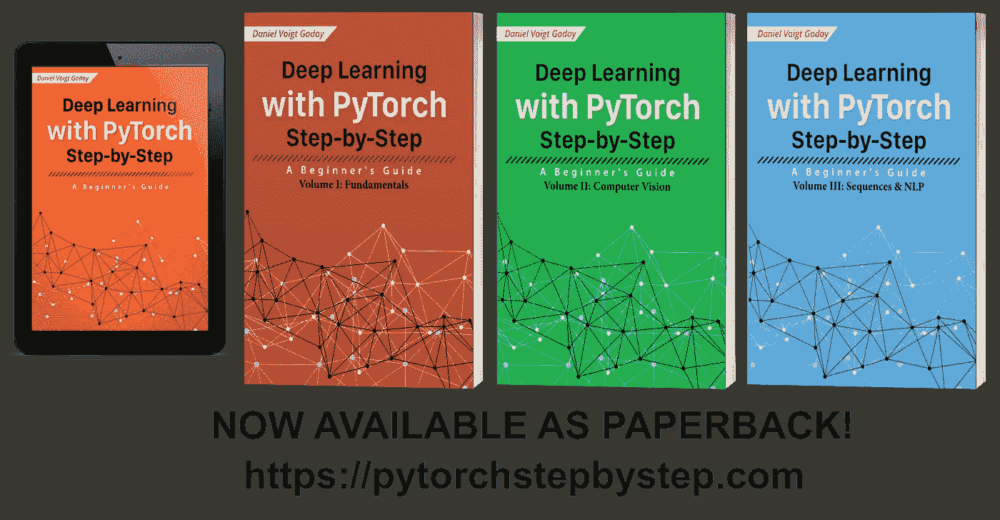

# 通过示例了解 PyTorch:分步指南

> 原文：<https://towardsdatascience.com/understanding-pytorch-with-an-example-a-step-by-step-tutorial-81fc5f8c4e8e?source=collection_archive---------0----------------------->


Photo by [Allen Cai](https://unsplash.com/@aycai?utm_source=medium&utm_medium=referral) on [Unsplash](https://unsplash.com?utm_source=medium&utm_medium=referral)

> 更新(2021 年 5 月 18 日):今天我已经**完成了**我的书: [**深度学习用 PyTorch 循序渐进:入门指南**](https://leanpub.com/pytorch/) **。**
> 
> 更新(2022 年 2 月 23 日):**平装版**现已上市(三册)。更多详情请查看[**pytorchstepbystep.com**](https://pytorchstepbystep.com)。
> 
> 更新(2022 年 7 月 19 日):第一卷《基础》的**西班牙语版**现已在 [Leanpub](https://leanpub.com/pytorch_ES) 上发布。

# 介绍

**PyTorch** 是**发展最快的**深度学习框架， **Fast.ai** 在其 MOOC、[深度学习 for Coders](https://course.fast.ai/) 及其[库](https://docs.fast.ai/)中也使用了该框架。

PyTorch 也非常 Python 化，也就是说，如果你已经是 Python 开发者，使用它会感觉更自然。

此外，根据安德烈·卡帕西的说法，使用 PyTorch 甚至可以改善你的健康状况

# 动机

有很多 PyTorch 教程，它的文档非常完整和广泛。所以，**为什么**要一直看这个循序渐进的教程？

好吧，尽管人们可以找到关于 PyTorch 能做的几乎所有事情的信息，但我错过了从基本原理的结构化方法中得到结构化的方法。

在这篇文章中，我将引导你了解 PyTorch 使用 Python 构建深度学习模型变得更加简单和直观的主要原因，包括亲笔签名的模型、动态计算图、模型类和更多，我还将向你展示如何避免常见的陷阱

此外，由于这是一篇很长的文章，我建立了一个 T2 目录 T3，如果你把它作为 T4 的迷你课程 T5，一次一个主题地浏览内容，会使浏览更容易。

# 目录

*   [一个简单的回归问题](https://medium.com/p/81fc5f8c4e8e#40de)
*   [梯度下降](https://medium.com/p/81fc5f8c4e8e#dc96)
*   [Numpy 中的线性回归](https://medium.com/p/81fc5f8c4e8e#a657)
*   [PyTorch](https://medium.com/p/81fc5f8c4e8e#3a3f)
*   [亲笔签名](https://medium.com/p/81fc5f8c4e8e#ea0d)
*   [动态计算图](https://medium.com/p/81fc5f8c4e8e#3806)
*   [优化器](https://medium.com/p/81fc5f8c4e8e#cf51)
*   [损失](https://medium.com/p/81fc5f8c4e8e#8877)
*   [型号](https://medium.com/p/81fc5f8c4e8e#6208)
*   [数据集](https://medium.com/p/81fc5f8c4e8e#2e24)
*   [数据加载器](https://medium.com/p/81fc5f8c4e8e#58f2)
*   [评估](https://medium.com/p/81fc5f8c4e8e#5017)

# 简单的回归问题

大多数教程都是从一些好看的*图像分类问题*开始，来说明如何使用 PyTorch。这看起来很酷，但我相信它会分散你对主要目标的注意力。

为此，在本教程中，我将坚持使用一个**简单的**和**熟悉的**问题:一个**线性回归** **与一个单一特征 *x*** ！没有比这更简单的了…



Simple Linear Regression model

## 数据生成

让我们开始**生成**一些合成数据:我们从我们的**特征 *x*** 的 100 个点的向量开始，并使用 ***a = 1*** 、 ***b = 2*** 和一些高斯噪声来创建我们的**标签**。

接下来，让我们**将我们的合成数据分割**成**训练**和**验证**集合，洗牌指数数组并使用前 80 个洗牌点进行训练。

Generating synthetic train and validation sets for a linear regression



Figure 1: Synthetic data — Train and Validation sets

我们**知道**a = 1 和 b = 2，但是现在让我们看看通过使用**梯度下降**和**训练** **集合**中的 80 个点，我们能多接近真实值…

# 梯度下降

如果你对梯度下降的内部工作方式很熟悉，*可以跳过*这一部分。完全解释梯度下降是如何工作的已经超出了这篇文章的范围，但是我将涵盖计算梯度下降需要经历的**四个基本步骤**。

## 第一步:计算损失

对于一个回归问题，**损失**由**均方差(MSE)** 给出，即**标签** (y)和**预测** (a + bx)之间所有平方差的平均值。

> 值得一提的是，如果我们使用训练集中的**所有点**(*N*)来计算损失，我们正在执行**批次**梯度下降。如果我们每次都使用一个**单点**，这将是一个**随机**梯度下降。在 1 和 N 之间的任何其他(n) **表示**小批量**梯度下降。**



Loss: Mean Squared Error (MSE)

## 第二步:计算梯度

一个**梯度**是一个**偏导数** — *为什么* *偏导数*？因为它是相对于(w.r.t .)一个**单个** **参数**来计算的。我们有两个参数， ***a*** 和 ***b*** ，所以必须计算两个偏导数。

一个**导数**告诉你*一个给定的 **量变化多少**当你*稍微* *变化*一些**其他量**。在我们的例子中，当我们改变两个参数中的每一个**时，我们的 ***MSE*** **损耗**变化了多少？***

下面等式的*最右边的*部分是你通常在简单线性回归的梯度下降实现中看到的。在**中间步骤**中，我向您展示**应用[链式法则](https://en.wikipedia.org/wiki/Chain_rule)弹出的所有元素**，这样您就知道最终表达式是如何产生的。



Computing gradients w.r.t coefficients a and b

## 步骤 3:更新参数

在最后一步，我们使用渐变来更新参数。由于我们试图**最小化**我们的**损失**，我们**反转梯度的符号**用于更新。

还有另一个需要考虑的参数:学习率**，用*希腊字母* ***eta*** (看起来像字母 ***n*** )表示，这是我们需要应用于梯度的**乘法因子**，用于参数更新。**

****

**Updating coefficients a and b using computed gradients and a learning rate**

**如何**选择**一个学习率？这是一个独立的话题，也超出了本文的范围。**

## **第四步:冲洗，重复！**

**现在我们使用**更新的** **参数**返回到**步骤 1** 并重新开始该过程。**

> **每当每个点已经用于计算损失时，一个**历元完成。对于**批次**梯度下降，这是微不足道的，因为它使用所有点来计算损失——一个历元**与**一个更新**相同。对于**随机**梯度下降，**一个历元**表示 **N 个** **更新**，而对于**小批量**(尺寸 N)，**一个历元**有 **N/n 个更新**。**

**一遍又一遍地重复这个过程，对于**许多时代**，简而言之就是**训练**一个模型。**

# **数字线性回归**

**是时候使用 **Numpy only** 使用梯度下降实现我们的线性回归模型了。**

> **等一下…我以为这个教程是关于 PyTorch 的！**

**是的，但这有两个目的**:*第一*，介绍我们任务的**结构**，它将基本保持不变，*第二*，向您展示主要的**难点**，这样您就可以充分体会 PyTorch 让您的生活变得多么轻松:-)****

****为了训练一个模型，有两个初始化步骤:****

*   ****参数/权重的随机初始化(我们只有两个， *a* 和 *b* ) —第 3 行和第 4 行；****
*   ****超参数的初始化(在我们的例子中，只有*学习率*和*周期数* ) —第 9 行和第 11 行；****

****确保*总是初始化你的随机种子*，以确保你的结果的**再现性**。像往常一样，随机种子是 [42](https://en.wikipedia.org/wiki/Phrases_from_The_Hitchhiker%27s_Guide_to_the_Galaxy#Answer_to_the_Ultimate_Question_of_Life,_the_Universe,_and_Everything_(42)) ，一个人可能选择的所有随机种子中最不随机的:)****

******对于每个时期**，有**四个训练步骤**:****

*   ****计算模型的预测—这是**正向传递** —第 15 行；****
*   ****使用*预测*和*标签*和手头任务的适当**损失函数**计算损失——第 18 和 20 行；****
*   ****计算每个参数的**梯度**——第 23 和 24 行；****
*   ******更新**参数—第 27 行和第 28 行；****

****只要记住，如果你*不*使用批量梯度下降(我们的例子使用了)，你将不得不写一个**内循环**来执行**四个训练步骤**用于每个**个体点** ( **随机**)或 ***n* 点** ( **小批量**)。稍后我们将看到一个小批量的例子。****

****Implementing gradient descent for linear regression using Numpy****

****只是为了确保我们没有在代码中犯任何错误，我们可以使用 *Scikit-Learn 的线性回归*来拟合模型并比较系数。****

```
**# a and b after initialization
[0.49671415] [-0.1382643]
# a and b after our gradient descent
[1.02354094] [1.96896411]
# intercept and coef from Scikit-Learn
[1.02354075] [1.96896447]**
```

****它们**匹配**多达 6 位小数——我们有一个使用 Numpy 的*完全工作的线性回归*实现。****

****时间到了**火炬**它:-)****

# ****PyTorch****

****首先，我们需要涵盖一些基本概念，如果你在全力建模之前没有很好地掌握它们，这些概念可能会让你失去平衡。****

****在深度学习中，我们随处可见**张量**。嗯，Google 的框架叫 *TensorFlow* 是有原因的！究竟什么是张量？****

## ****张量****

****在 *Numpy* 中，你可能有一个**数组**有**三个维度**吧？也就是从技术上来说，一个**张量**。****

****一个**标量**(单个数)有**个零**维，一个**向量** **有** **个**维，一个**矩阵有两个**维，一个**张量有三个或更多个**维。就是这样！****

****但是，为了简单起见，通常也称向量和矩阵为张量——所以，从现在开始，**所有东西要么是标量，要么是张量**。****

********

****Figure 2: Tensors are just higher-dimensional matrices :-) [Source](http://karlstratos.com/drawings/drawings.html)****

## ****加载数据、设备和 CUDA****

****你会问，我们如何从 Numpy 的数组到 PyTorch 的张量？这就是`[**from_numpy**](https://pytorch.org/docs/stable/torch.html#torch.from_numpy)`的好处。不过，它返回一个 CPU 张量。****

****“*但是我想用我的花式 GPU…* ”你说。别担心，这就是`[**to()**](https://pytorch.org/docs/stable/tensors.html#torch.Tensor.to)`的用处。它将你的张量发送到你指定的任何**设备**，包括你的 **GPU** (简称`cuda`或`cuda:0`)。****

****"*如果没有可用的 GPU，我希望我的代码回退到 CPU，该怎么办？你可能想知道……py torch 又一次支持了你——你可以使用`[**cuda.is_available()**](https://pytorch.org/docs/stable/cuda.html?highlight=is_available#torch.cuda.is_available)`来查找你是否有 GPU 供你使用，并相应地设置你的设备。*****

****您还可以使用`[float()](https://pytorch.org/docs/stable/tensors.html#torch.Tensor.float)`轻松地将**转换为较低的精度(32 位浮点)。******

****Loading data: turning Numpy arrays into PyTorch tensors****

****如果您比较两个变量的**类型**，您将得到您所期望的:第一个变量为`numpy.ndarray`，第二个变量为`torch.Tensor`。****

****但是你的张量“住”在哪里呢？在你的 CPU 还是你的 GPU 里？你不能说……但是如果你用 PyTorch 的`**type()**`，它会揭示它的**位置** — `torch.cuda.FloatTensor` —这里是一个 GPU 张量。****

****我们也可以反过来，使用`[**numpy()**](https://pytorch.org/docs/stable/tensors.html?highlight=numpy#torch.Tensor.numpy)`，将张量转换回 Numpy 数组。应该和`x_train_tensor.numpy()` **一样简单，但是** …****

```
**TypeError: can't convert CUDA tensor to numpy. Use Tensor.cpu() to copy the tensor to host memory first.**
```

****不幸的是，Numpy **不能**处理 GPU 张量……你需要先用`[**cpu()**](https://pytorch.org/docs/stable/tensors.html#torch.Tensor.cpu)`让它们成为 CPU 张量。****

## ****创建参数****

****用于*数据*的*张量*与用作(*可训练* ) **参数/权重**的**张量**有何区别？****

****后面的张量需要**计算其梯度**，因此我们可以**更新**它们的值(即参数值)。这就是`**requires_grad=True**`论点的好处。它告诉 PyTorch 我们希望它为我们计算梯度。****

****你可能想为一个参数创建一个简单的张量，然后发送到你选择的设备，就像我们对数据所做的那样，对吗？没那么快…****

****Trying to create variables for the coefficients…****

****第一段代码为我们的参数、梯度和所有的东西创建了两个很好的张量。但他们是 **CPU** 张量。****

```
**# FIRST
tensor([-0.5531], requires_grad=True)
tensor([-0.7314], requires_grad=True)**
```

****在第二段代码中，我们尝试了将它们发送到 GPU 的简单方法。我们成功地将它们发送到了另一个设备上，但是我们不知何故“丢失”了梯度****

```
**# SECOND
tensor([0.5158], device='cuda:0', grad_fn=<CopyBackwards>) tensor([0.0246], device='cuda:0', grad_fn=<CopyBackwards>)**
```

****在第三块中，我们**首先**将我们的张量发送到**设备**和**，然后**使用`[**requires_grad_()**](https://pytorch.org/docs/stable/tensors.html#torch.Tensor.requires_grad_)`方法将其`requires_grad`设置到`True`位置。****

```
**# THIRD
tensor([-0.8915], device='cuda:0', requires_grad=True) tensor([0.3616], device='cuda:0', requires_grad=True)**
```

> ****在 PyTorch 中，每一个**以一个**下划线** ( **_** )结束**的方法都会就地修改**，也就是说，它们将**修改**底层变量。******

**虽然最后一种方法工作得很好，但是最好是在**创建**时**将**张量分配给**设备**。**

**Actually creating variables for the coefficients :-)**

```
tensor([0.6226], device='cuda:0', requires_grad=True) tensor([1.4505], device='cuda:0', requires_grad=True)
```

**简单多了，对吧？**

**现在我们知道了如何创建需要梯度的张量，让我们看看 PyTorch 如何处理它们——这是……**

# **亲笔签名**

**亲笔签名的是 PyTorch 的*自动微分包*。多亏了它，我们**不需要担心**关于*偏导数，链式法则*或者任何类似的东西。**

**那么，我们如何告诉 PyTorch 去做它的事情并且**计算所有的梯度**？这就是`[**backward()**](https://pytorch.org/docs/stable/autograd.html#torch.autograd.backward)`的好处。**

**你还记得**计算梯度**的**起点**吗？当我们计算它相对于我们的参数的偏导数时，它是损失。因此，我们需要从相应的 Python 变量中调用`backward()`方法，比如`loss.backward().`**

****坡度**的**实际值**是多少？我们可以通过查看张量的`[**grad**](https://pytorch.org/docs/stable/autograd.html#torch.Tensor.grad)` **属性**来考察它们。**

**如果你检查该方法的文档，它清楚地说明了**梯度是累积的**。所以，每次我们使用**渐变**到**更新**参数时，我们需要**将渐变归零**。这就是`[**zero_()**](https://pytorch.org/docs/stable/tensors.html#torch.Tensor.zero_)`的好处。**

**方法名末尾的**下划线** ( **_** )是什么意思？你还记得吗？如果没有，请返回到上一节并找出答案。**

**因此，让我们**放弃****手动** **计算梯度**并使用`backward()`和`zero_()`方法来代替。**

**就这样？嗯，差不多吧…但是，总有一个**抓手**，这次和**参数**的**更新**有关…**

**在第一次尝试中，如果我们使用与我们的 *Numpy* 代码中相同的更新结构，我们将会得到下面奇怪的**错误**…但是我们可以通过查看张量本身得到一个关于正在发生什么的*提示*——我们再次**“丢失”****梯度**，同时将更新结果重新分配给我们的参数。因此,`**grad**`属性变成了`**None**`,并引发了错误…**

```
# FIRST ATTEMPT
tensor([0.7518], device='cuda:0', grad_fn=<SubBackward0>)
AttributeError: 'NoneType' object has no attribute 'zero_'
```

**然后我们稍微改变一下，在第二次尝试中使用熟悉的**就地 Python 赋值**。PyTorch 再一次对此进行了抱怨，并引发了一个**错误**。**

```
# SECOND ATTEMPT
RuntimeError: a leaf Variable that requires grad has been used in an in-place operation.
```

> **为什么？！原来是**“过犹不及”**的情况。罪魁祸首是 PyTorch 从每一个 **Python 操作**中构建一个**动态计算图**的能力，该操作涉及任何**梯度计算张量**或**其依赖关系**。**
> 
> **我们将在下一节更深入地研究动态计算图的内部工作原理。**

**那么，我们如何告诉 PyTorch 去**“后退”**并让我们**更新我们的参数**而不弄乱它的*花哨的动态计算图*？这就是`[**torch.no_grad()**](https://pytorch.org/docs/stable/autograd.html#torch.autograd.no_grad)`的好处。它允许我们**独立于 PyTorch 的计算图**对张量、**执行常规的 Python 操作。****

**最后，我们成功地运行了我们的模型，并获得了**结果参数**。毫无疑问，它们**与我们在 *Numpy* 唯一实现中得到的**相匹配。**

```
# THIRD ATTEMPT
tensor([1.0235], device='cuda:0', requires_grad=True) tensor([1.9690], device='cuda:0', requires_grad=True)
```

# **动态计算图**

> **“不幸的是，没有人能被告知动态计算图是什么。你得自己去看。”摩耳甫斯**

**"*黑客帝国*"有多伟大？对吧。但是，玩笑归玩笑，我想让**你**到**也自己看看图表**！**

> **[PyTorchViz](https://github.com/szagoruyko/pytorchviz) 包和它的`*make_dot(variable)*`方法允许我们轻松地可视化与给定 Python 变量相关的图形。**

**因此，让我们坚持使用**最小量**:两个(*梯度计算* ) **张量**用于我们的参数、预测、误差和损失。**

**Computing MSE in three steps**

**如果我们调用`**make_dot(yhat)**`，我们将得到下面图 3 中最左边的****图**:****

********

****Figure 3: Computation graph for every step in computing MSE****

****让我们仔细看看它的组件:****

*   ******蓝框**:这些对应于我们用作**参数**的**张量**，我们要求 py torch**计算梯度**的那些张量；****
*   ******灰框**:一个 **Python 操作**，涉及一个**梯度计算张量**或**它的依赖**；****
*   ******绿框**:与灰框相同，除了它是计算渐变的**起点(假设`**backward()**`方法是从用于可视化**图形的**变量调用的)——它们是从图形中的**自下而上**开始计算的。******

**如果我们为`**error**`(中间)和`**loss**`(右边)**变量**绘图，它们与第一个变量**唯一的区别**是**中间步骤** ( **灰色方框**)的数量。**

**现在，仔细看看**最左边**图的**绿框**:有**两个** **箭头**指向它，既然是**加**上**两个** **变量**、`a`和`b*x`。似乎很明显，对吧？**

**然后再看同图的**灰色** **方框**:它正在执行一个**乘法**，即`b*x`。但是只有一个箭头指向它！箭头来自与我们的**参数** **b** 对应的**蓝色** **框**。**

****为什么**没有一个盒子放我们的**数据 x** ？答案是:我们**不为它计算梯度**！因此，尽管计算图执行的操作中涉及到更多的*张量*，但它**仅**显示了**梯度计算张量**和**的依赖关系**。**

**如果我们为我们的**参数 a** 设置`**requires_grad**`为`**False**`，计算图会发生什么？**

****

**Figure 4: now variable a does NOT have its gradient computed anymore. But it is STILL used in computation**

**不出所料，**参数 a** 对应的**蓝框**没了！很简单:**没有渐变，没有图形**。**

**关于*动态计算图*的**最好的**事情是，你可以让它**如你所愿**一样复杂。你甚至可以使用*控制流语句*(例如 if 语句)来**控制渐变的流**(显然！) :-)**

**下面的图 5 显示了一个例子。是的，我知道计算本身完全是无意义的**

****

**Figure 5: Complex computation graph just to make a point :-)**

# **【计算机】优化程序**

**到目前为止，我们一直在使用计算出的梯度手动**更新参数。这对两个参数的*来说可能没问题……但是如果我们有一大堆参数**呢？！我们使用 PyTorch 的**优化器**之一，比如 [**SGD**](https://pytorch.org/docs/stable/optim.html#torch.optim.SGD) 或者 [**Adam**](https://pytorch.org/docs/stable/optim.html#torch.optim.Adam) 。*******

一个优化器接受我们想要更新的**参数**，我们想要使用的**学习率**(可能还有许多其他超参数！)和**执行******通过其`[**step()**](https://pytorch.org/docs/stable/optim.html#torch.optim.Optimizer.step)`方法更新**。**

**此外，我们也不再需要一个接一个地将梯度归零。我们只需调用优化器的`[**zero_grad()**](https://pytorch.org/docs/stable/optim.html#torch.optim.Optimizer.zero_grad)`方法，仅此而已！**

**在下面的代码中，我们创建一个*随机梯度下降* (SGD)优化器来更新我们的参数 **a** 和 **b** 。**

> **不要被**优化器**的名字所迷惑:如果我们一次使用**所有训练数据**进行更新——正如我们在代码中实际做的那样——优化器正在执行一个**批处理**梯度下降，尽管它的名字如此。**

**PyTorch’s optimizer in action — no more manual update of parameters!**

**让我们检查我们的两个参数，之前和之后，只是为了确保一切仍然工作正常:**

```
# BEFORE: a, b
tensor([0.6226], device='cuda:0', requires_grad=True) tensor([1.4505], device='cuda:0', requires_grad=True)
# AFTER: a, b
tensor([1.0235], device='cuda:0', requires_grad=True) tensor([1.9690], device='cuda:0', requires_grad=True)
```

**酷！我们已经*优化了***优化**流程:-)还剩下什么？**

# **失败**

**我们现在处理**损失计算**。不出所料，PyTorch 又一次掩护了我们。根据手头的任务，有许多[损失函数](https://pytorch.org/docs/stable/nn.html#loss-functions)可供选择。由于我们的是回归，我们使用的是[均方误差(MSE)损失](https://pytorch.org/docs/stable/nn.html#torch.nn.MSELoss)。**

> **注意`*nn.MSELoss*`实际上**为我们创建了一个损失函数**—**它不是损失函数本身**。此外，您可以指定一个要应用的**归约方法**，即**您希望如何合计单个点的结果** —您可以将它们平均(归约= '均值')或简单地将它们相加(归约= '总和')。**

**然后我们**使用**创建的损失函数，在第 20 行，计算给定我们的**预测**和我们的**标签**的损失。**

**我们的代码现在看起来像这样:**

**PyTorch’s loss in action — no more manual loss computation!**

**此时，只剩下一段代码需要修改:预测**。然后是时候介绍 PyTorch 实现一个…****

# ****模型****

****在 PyTorch 中，一个**模型**由一个从 [**模块**](https://pytorch.org/docs/stable/nn.html#torch.nn.Module) 类继承的常规 **Python 类**表示。****

****它需要实现的最基本的方法是:****

*   ****`**__init__(self)**` : **它定义了组成模型**的部件——在我们的例子中，是两个*参数*、 **a** 和 **b** 。****

> ****您不局限于定义**参数**，尽管……**模型也可以包含其他模型(或层)作为其属性**，因此您可以轻松地嵌套它们。我们很快也会看到这样的例子。****

*   ****`[**forward(self, x)**](https://pytorch.org/docs/stable/nn.html#torch.nn.Module.forward)`:在给定输入 **x** 的情况下，执行**实际计算**，即**输出预测**。****

> ****不过，你不应该把**叫做** `***forward(x)***`方法。你应该**调用整个模型本身**，就像在`***model(x)***`中执行正向传递和输出预测一样。****

****让我们为我们的回归任务建立一个合适的(然而简单的)模型。它应该是这样的:****

****Building our “Manual” model, creating parameter by parameter!****

****在`__init__`方法中，我们定义了我们的**两个参数**、 **a** 和 **b** ，使用`[**Parameter()**](https://pytorch.org/docs/stable/nn.html#torch.nn.Parameter)`类告诉 PyTorch 这些**张量应该被认为是模型的参数，它们是**的一个属性。****

****我们为什么要关心这个？通过这样做，我们可以使用我们模型的`[**parameters()**](https://pytorch.org/docs/stable/nn.html#torch.nn.Module.parameters)`方法来检索**所有模型参数**、**甚至**嵌套模型**的那些参数的迭代器，我们可以使用这些参数来馈送我们的优化器(而不是我们自己构建一个参数列表！).******

****此外，我们可以使用我们模型的`[**state_dict()**](https://pytorch.org/docs/stable/nn.html#torch.nn.Module.state_dict)`方法获得所有参数的**当前值。******

> ******重要的**:我们需要**将我们的模型发送到数据所在的同一个设备**。如果我们的数据是由 GPU 张量构成的，那么我们的模型也必须“生活”在 GPU 中。****

****我们可以使用所有这些方便的方法来更改我们的代码，代码应该是这样的:****

****PyTorch’s model in action — no more manual prediction/forward step!****

****现在，打印出来的语句看起来像这样——参数 **a** 和 **b** 的最终值仍然相同，所以一切正常:-)****

```
**OrderedDict([('a', tensor([0.3367], device='cuda:0')), ('b', tensor([0.1288], device='cuda:0'))])
OrderedDict([('a', tensor([1.0235], device='cuda:0')), ('b', tensor([1.9690], device='cuda:0'))])**
```

****我希望你注意到了代码中的一个特殊语句，我给它分配了一个注释**“这是什么？！?"—** `**model.train()**`。****

> ****在 PyTorch 中，模型有一个`[***train()***](https://pytorch.org/docs/stable/nn.html#torch.nn.Module.train)`方法，有点令人失望的是，**没有执行训练步骤**。其唯一目的是**将模型设置为训练模式**。为什么这很重要？例如，一些模型可能使用类似 [**退出**](https://pytorch.org/docs/stable/nn.html#torch.nn.Dropout) 的机制，这些机制在培训和评估阶段具有**不同的行为。******

## ****嵌套模型****

****在我们的模型中，我们手动创建了两个参数来执行线性回归。让我们使用 PyTorch 的 [**线性**](https://pytorch.org/docs/stable/nn.html#torch.nn.Linear) 模型作为我们自己的属性，从而创建一个嵌套模型。****

****尽管这显然是一个虚构的例子，因为我们几乎包装了底层模型，而没有添加任何有用的东西(或者根本没有！)对它来说，它很好地说明了这个概念。****

****在`**__init__**`方法中，我们创建了一个**属性**，它包含了我们的**嵌套** `**Linear**` **模型**。****

****在`**forward()**`方法中，我们**调用嵌套模型本身**来执行正向传递(*注意，我们是* ***而不是*** *调用* `*self.linear.forward(x)*` *！*)。****

****Building a model using PyTorch’s Linear layer****

****现在，如果我们调用这个模型的`**parameters()**`方法， **PyTorch 将以递归的方式计算其属性的参数**。您可以自己尝试使用类似于:`[*LayerLinearRegression().parameters()]`的代码来获得所有参数的列表。你也可以添加新的`Linear`属性，即使你在向前传球中根本不使用它们，它们也会**仍然**列在`parameters()`下。****

## ****序列模型****

****我们的模型足够简单…您可能会想:*“为什么还要费心为它构建一个类呢？!"嗯，你说得有道理…*****

****对于使用**普通层**的**简单模型**，其中一层的输出作为输入被顺序地馈送到下一层，我们可以使用一个，呃… [**顺序**](https://pytorch.org/docs/stable/nn.html#torch.nn.Sequential) 模型:-)****

****在我们的例子中，我们将建立一个带有单个参数的序列模型，也就是我们用来训练线性回归的`Linear`层。该模型将如下所示:****

```
**# Alternatively, you can use a Sequential model
model = nn.Sequential(nn.Linear(1, 1)).to(device)**
```

****很简单，对吧？****

## ****训练步骤****

****到目前为止，我们已经定义了一个**优化器**，一个**损失函数**和一个**模型**。向上滚动一点，快速查看循环中的代码*。如果我们使用**不同的优化器**，或者**损失**，甚至**模型**，会不会**改变**？如果不是，我们如何使**更通用**？*****

****嗯，我想我们可以说所有这些代码行**执行一个训练步骤**，给定那些**三个元素** ( *优化器、损耗和模型*)**特性**和**标签**。****

****那么，**编写一个函数，将这三个元素**和**作为参数，返回另一个执行训练步骤**、**、**的函数，并返回相应的损失，这样如何？****

****然后我们可以使用这个通用函数构建一个`**train_step()**` 函数，在我们的训练循环中调用。现在我们的代码应该看起来像这样…看看训练循环现在有多小？****

****Building a function to perform one step of training!****

****让我们休息一下我们的训练循环，暂时关注一下我们的**数据**…到目前为止，我们只是简单地使用了我们的 *Numpy 数组*转 **PyTorch 张量**。但是我们可以做得更好，我们可以建立一个…****

# ****资料组****

****在 PyTorch 中，**数据集**由从 [**数据集**](https://pytorch.org/docs/stable/data.html#torch.utils.data.Dataset) 类继承的常规 **Python 类**表示。你可以把它想象成一种 Python **元组列表**，每个元组对应**一个点(特性，标签)**。****

****它需要实现的最基本的方法是:****

*   ****`**__init__(self)**` :它采用**构建一个**元组列表**所需的任何参数**——它可能是将要加载和处理的 CSV 文件的名称；可能是*两个张量*，一个是特征，一个是标签；或者其他什么，取决于手头的任务。****

> **在构造函数方法 ( `__init__`)中**不需要加载整个数据集。如果您的**数据集很大**(例如，成千上万的图像文件)，一次加载它将不会是内存高效的。建议**按需加载**(每当`__get_item__`被调用时)。****

*   **`**__get_item__(self, index)**`:它允许数据集被**索引**，因此它可以像列表 ( `dataset[i]`)一样工作**——它必须**返回一个对应于所请求数据点的元组(特征，标签)**。我们可以返回我们的**预加载的**数据集或张量的**对应切片**，或者如上所述，**按需加载** **它们**(就像这个[示例](https://pytorch.org/tutorials/beginner/data_loading_tutorial.html#dataset-class))。****
*   **`**__len__(self)**`:它应该简单地返回整个数据集的**大小**，这样，无论何时对它进行采样，它的索引都被限制为实际大小。**

**让我们构建一个简单的自定义数据集，它采用两个张量作为参数:一个用于要素，一个用于标注。对于任何给定的索引，我们的数据集类将返回每个张量的相应切片。它应该是这样的:**

**Creating datasets using train tensors**

**再一次，你可能会想"*为什么要大费周章地在一个类中包含几个张量呢？*”。而且，再一次，你确实有一个观点…如果一个数据集只是一对张量的**，我们可以使用 PyTorch 的 [**TensorDataset**](https://pytorch.org/docs/stable/data.html#torch.utils.data.TensorDataset) 类，它将做我们在上面的自定义数据集中所做的事情。****

> **你是否注意到我们用 Numpy 数组构建了我们的**训练张量**，但是我们**没有将它们发送到设备**？所以，他们现在是 **CPU** 张量！**为什么是**？**
> 
> **我们**不希望我们的整个训练数据被加载到 GPU 张量**中，就像我们到目前为止在我们的示例中所做的那样，因为**会占用我们宝贵的**显卡 RAM 中的空间**。****

**好吧，好吧，但是话说回来，**我们为什么要建立数据集呢？我们这样做是因为我们想用一种…****

# **数据加载器**

**到目前为止，我们在每个训练步骤中都使用了**整体训练数据**。一直是**批次梯度下降**。当然，这对我们*小得可笑的数据集*来说没问题，但是如果我们想要认真对待这一切，我们**必须**使用**小批量**梯度下降。因此，我们需要小批量。因此，我们需要**相应地分割**我们的数据集。要不要手动*做*？！我也没有！**

**所以我们使用 PyTorch 的 [**DataLoader**](https://pytorch.org/docs/stable/data.html#torch.utils.data.DataLoader) 类来完成这项工作。我们告诉它使用哪个**数据集**(我们刚刚在上一节中构建的那个)，期望的**小批量**以及我们是否想要**洗牌**。就是这样！**

**我们的**加载器**将表现得像一个**迭代器**，所以我们可以**循环遍历它**并且**每次获取一个不同的小批量**。**

**Building a data loader for our training data**

**要检索小批量样本，只需运行下面的命令，它将返回包含两个张量的列表，一个用于要素，另一个用于标注。**

```
next(iter(train_loader))
```

**这如何改变我们的训练循环？我们去看看吧！**

**Using mini-batch gradient descent!**

**现在有两件事情不同了:不仅我们有一个*内循环*来从我们的`DataLoader`加载每个*小批量*，更重要的是，我们现在**只发送一个小批量到设备**。**

> **对于更大的数据集，**使用**数据集的** `**__get_item__**`逐个样本地加载数据** **(到 **CPU** 张量中)，然后**将属于同一**小批量的所有样本**一次发送到您的 GPU** (设备)是为了让**最好地利用您的显卡 RAM** 。****
> 
> 此外，如果您有许多 GPU 来训练您的模型，最好保持您的数据集“不可知”，并在训练期间将批处理分配给不同的 GPU。

到目前为止，我们只关注了**训练** **数据**。我们为它构建了一个*数据集*和一个*数据加载器*。我们可以对**验证**数据做同样的事情，使用我们在这篇文章开始时执行的**分割**…或者我们可以使用`random_split`来代替。

## 随机分裂

PyTorch 的`[**random_split()**](https://pytorch.org/docs/stable/data.html#torch.utils.data.random_split)`方法是执行**训练-验证分割**的一种简单而熟悉的方式。请记住，在我们的示例中，我们需要将它应用到**整个数据集** ( *不是我们在前面两节中构建的训练数据集*)。

然后，对于每个数据子集，我们构建一个相应的`DataLoader`，因此我们的代码看起来像这样:

Splitting the dataset into training and validation sets, the PyTorch way!

现在我们有了一个**数据加载器**用于我们的**验证集**，所以，用它来…

# 估价

这是我们旅程的最后**部分——我们需要改变训练循环，以包括对我们的模型**的**评估，即计算**验证损失**。第一步是包括另一个内部循环来处理来自*验证加载器*的*小批量*，将它们发送到与我们的模型相同的*设备*。接下来，我们使用我们的模型(第 23 行)进行**预测**，并计算相应的**损失**(第 24 行)。**

这就差不多了，但是还有**两个小**，**一个大**，要考虑的事情:

*   `[**torch.no_grad()**](https://pytorch.org/docs/stable/autograd.html#torch.autograd.no_grad)`:尽管在我们的简单模型中不会有什么不同，但是用这个**上下文管理器**包装验证**内部循环来禁用您可能无意中触发的任何梯度计算**是一个**良好实践**，因为**梯度属于训练**，而不属于验证步骤；
*   `[**eval()**](https://pytorch.org/docs/stable/nn.html#torch.nn.Module.eval)`:它唯一做的事情就是**将模型设置为评估模式**(就像它的`train()`对应的那样)，这样模型就可以调整它关于一些操作的行为，比如[](https://pytorch.org/docs/stable/nn.html#torch.nn.Dropout)**。**

**现在，我们的训练循环应该是这样的:**

**Computing validation loss**

**T21，我们还有什么可以改进或改变的吗？当然，总会有其他东西**添加到你的模型中——例如，使用 [**学习速率调度器**](https://pytorch.org/docs/stable/optim.html#how-to-adjust-learning-rate) 。但是这个帖子已经*太长了*，所以我就停在这里。****

**包含所有附加功能的完整工作代码在哪里？“你问什么？你可以在这里 找到 [**。**](https://gist.github.com/dvgodoy/1d818d86a6a0dc6e7c07610835b46fe4)**

# **最后的想法**

**虽然这篇文章比我开始写它时预期的长得多，但我不会让它有任何不同——我相信它有大多数必要的步骤，以一种结构化的方式学习 T42，如何使用 PyTorch 开发深度学习模型。**

**希望在完成这篇文章中的所有代码后，你能够更好地理解 PyTorch 的官方[教程](https://pytorch.org/tutorials/)。**

> **更新(2021 年 5 月 18 日):今天我已经**完成了**我的书: [**深度学习用 PyTorch 循序渐进:入门指南**](https://leanpub.com/pytorch/) **。****
> 
> **更新(2022 年 2 月 23 日):**平装版**现已上市(三册)。更多详情请查看[**pytorchstepbystep.com**](https://pytorchstepbystep.com)。**
> 
> **更新(2022 年 7 月 19 日):第一卷《基础》的**西班牙语版**现已在 [Leanpub](https://leanpub.com/pytorch_ES) 上发布。**

****

**[Deep Learning with PyTorch Step-by-Step](https://pytorchstepbystep.com)**

***如果您有任何想法、意见或问题，请在下方留言或联系我* [*推特*](https://twitter.com/dvgodoy) *。***