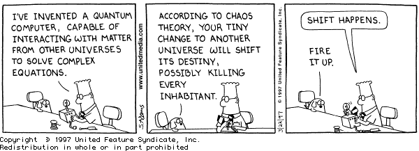
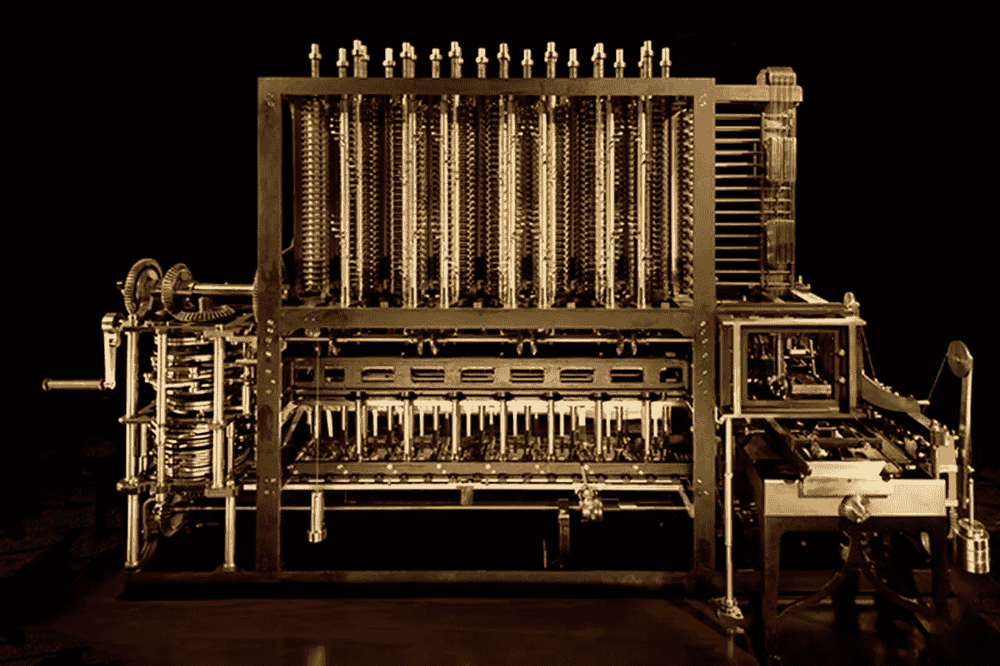
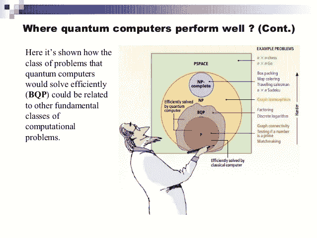
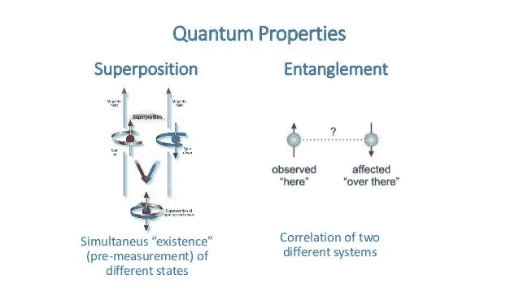
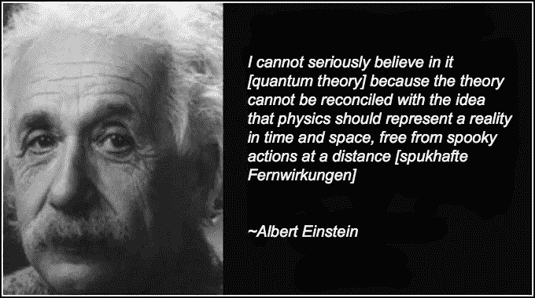
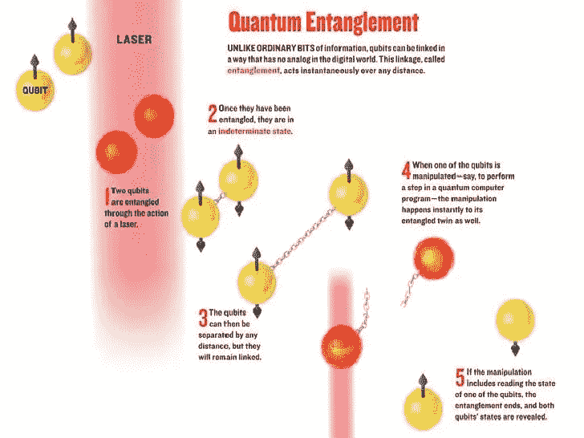
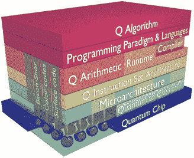
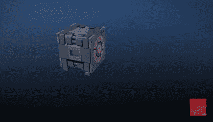

# 理解量子计算机

> 原文：<https://towardsdatascience.com/understanding-quantum-computers-ecb9d375b46f?source=collection_archive---------26----------------------->

随着我们寻求探索未知领域，并将人类的影响范围从亚原子粒子扩大到遥远的星球，对计算能力的渴望与日俱增。量子计算机可能是这些需求的答案。

尽管没有必要去研究经典计算机来理解量子计算机是如何工作的，但是计算机是如何进化的以及围绕量子计算机有如此多的误解是非常有趣的，我发现有必要去研究经典计算机是如何变成今天的样子以及它们与量子计算机有什么关系。

“电脑”。这个词现在可能看起来不那么特别了，见鬼，它变得如此流行，以至于当人们说他们不知道如何使用计算机时，这看起来很奇怪。电脑无处不在，它们几乎可以放在任何地方——从你的膝盖到你的手(或者[在你的手里](https://www.dailymail.co.uk/sciencetech/article-3221287/Would-microchipped-Kaspersky-implants-chip-man-s-hand-one-day-used-pay-goods-unlock-home.html)！！！)但情况并非总是如此。坐在你腿上的电脑在 19 世纪可能无法适应整个世界，在 20 世纪下半叶也只能勉强适应足球场。这种变化是如何发生的，这很有趣。让我们简要地看一下计算机的发展历程，但在此之前，让我们先定义一下什么是计算机。

大多数人都知道什么是计算机，但对他们来说很难定义它。从这个词最基本的意义上来说，计算机是任何可以计算的东西，也就是说，可以做简单的算术计算，下面是来自[维基百科](https://en.wikipedia.org/wiki/Computer)的一个更正式的定义:

> 计算机是一种可以通过计算机编程指令自动执行一系列算术或逻辑运算的装置。现代计算机有能力遵循被称为程序的广义操作集。这些程序使计算机能够执行非常广泛的任务。包括硬件、操作系统(主软件)和用于“完整”操作所需的外围设备的“完整”计算机可称为计算机系统。该术语也可用于连接并一起工作的一组计算机，特别是计算机网络或计算机集群。

The Difference Engine

尽管现代计算机的旅程始于 20 世纪，但早在 19 世纪人们就感受到了对这种机器的需求，伟大的发明家/科学家们也尝试着制造这种机器。机械计算机就是在那个时候设计出来的(最著名的是由[查尔斯·巴贝奇](https://en.wikipedia.org/wiki/Charles_Babbage)，第一个程序是由包括[阿达·洛芙莱斯女士](http://mentalfloss.com/article/53131/ada-lovelace-first-computer-programmer)在内的许多人编写的。但是一些计算机仅仅是在设计中构思出来的，因为它们远远超出了当时的技术水平，而且非常昂贵，我们最好使用人类来代替。巴贝奇的计算机是在 20 世纪 90 年代由美国加州山景城的历史博物馆建造的，这里有一个[好视频](https://www.youtube.com/watch?v=BlbQsKpq3Ak)展示了巴贝奇设计的实际差分机。

然后重点转移到机电计算机和电线，水银用于穿孔卡和 IBM(国际商业机器)的出现，计算机变得越来越好，现在可以执行非常复杂的计算，这进一步加速了两次世界大战，军事上需要计算机来获得战略优势。但是这些仍然不足以满足不断增长的计算需求，因此计算机变得越来越大。更大的计算机意味着更复杂的结构，管理它们变得越来越困难。(有趣的事实:正是在这个时候，bug 会飞入这些计算机，导致结果出现问题，因此在现代计算机科学中使用了单词“ **bugs** ”。

Alan Turing help build an electro-mechanical device, “The Bombe” to help decipher German Enigma-machine-encrypted secret messages during World War II.

随着电子晶体管的引入，这一切都改变了，现在计算机开始缩小，它们的潜力现在已经为人所知，大量的激烈竞争(加上许多科幻小说)导致了越来越小的计算机的发展，这都归功于晶体管尺寸的缩小。每个人都注意到了这一点，但戈登·摩尔浓缩了这一观察，并将其公式化——“密集集成电路上的晶体管数量每两年翻一番”。

被称为摩尔定律的定律多年来都是正确的(现在仍然如此)，但摩尔定律有一个问题:晶体管不能一直缩小，它们必然会遇到量子效应，当量子物理出现时，就会有大量的不确定性(明白吗！).计算机需要对答案有绝对的把握，否则计算机就不会很有用。

> 摩尔定律是指在密集集成电路中，晶体管的数量大约每两年翻一番。这一观察结果是以飞兆半导体(Fairchild Semiconductor)联合创始人兼英特尔(Intel)首席执行官戈登·摩尔的名字命名的，他在 1965 年的论文中描述了每个集成电路的组件数量每年翻一番，并预测这一增长速度将至少再持续十年。1975 年，展望下一个十年，他将预测修改为每两年翻一番。由于英特尔高管大卫·豪斯(David House)的预测(更多晶体管和更快晶体管的综合效应)，这一时期通常被称为 18 个月。

根据目前的估计，晶体管将在 2024 年左右停止变得更小。由于在此期间，单个晶体管将足够小，量子效应将非常显著，如果我们要制造晶体管，任何更小的量子效应都将发挥作用，因此传统(或经典)计算方法将停止其在性能改善方面的指数增长。

为了克服性能增强中的这一障碍，我们可以使用新型计算，也称为量子计算。量子计算可以帮助我们在几秒钟内完成大量的计算。这有助于解决传统计算机以前无法解决的问题。许多人以此为论据，说这是量子计算机是必要的原因之一，它们可以帮助取代经典计算机，但这是完全错误的。我们将会看到，它们存在和需要的原因要复杂得多，也更令人着迷。

以上信息(以及许多其他东西)可以在这个 [YouTube 课程](https://www.youtube.com/playlist?list=PL8dPuuaLjXtNlUrzyH5r6jN9ulIgZBpdo)中以更详细、更结构化的方式找到。

# 进入量子世界

量子计算机不是来取代经典计算的，这不是它们的本意。它们与经典计算机非常不同，有自己的计算方式。在我们用经典计算机解决的大多数问题上，它们可能永远无法打败普通计算机。那为什么需要他们？

原因是量子计算机是为了解决一些更大的问题而不是为了在网上看猫视频(*叹*)。量子计算机可以用来解决经典计算机无法解决的问题。像破解 RSA 加密这样的问题，以及像量子建模这样需要量子解决方案的问题。实际上，(伟大的物理学家理查德·费曼)构想的量子计算机的第一个应用是研究量子粒子。因为，如果我们可以用数学方法模拟一个量子粒子，然后在计算机中创建它的模拟，那么我们就可以对它们进行各种实验，否则这是不可能的。

那么这些问题是什么呢？为什么我们的普通电脑不能帮上忙呢？有些问题需要极大的计算能力和空间，例如寻找超大素数的因子、模拟分子、模拟量子现象等。在计算机科学中，我们将问题分成不同的类别，这取决于当我们增加输入值的数量时，它们是如何增长的(例如，需要多少计算)。这些被称为多项式时间，不确定多项式时间和 np 难问题。对于很少的输入，经典计算机可以解决 NP 问题，但是对于大的 N 值，计算时间变得很长，因此计算变得不可行。但是有些问题是 NP 级别的，但是仍然可以在有限的时间内通过量子计算机解决。这些问题被称为 **B** 舍入误差 **Q** 量子 **P** 奥林匹克时间问题。但是到目前为止，这类问题是有限的，你最好在经典计算机上解决这些问题，而不是在量子计算机上。但是有些问题(比如大数的质因数分解)只能由量子计算机解决(尽管是非常强大的)。

The Problem Hierarchy

为了理解计算机，我们首先看一下它的构成材料，即硅，然后我们从二极管到门到寄存器，再到更复杂的体系结构，如可以执行更复杂计算的 alu 和 CPU，然后我们在它上面放一个抽象层，为它编写程序，指导它执行我们希望它执行的任务。我们将用类似的方法来理解量子计算机的内部工作原理。但在此之前，我们需要了解量子计算机利用的一些奇怪的物理现象。

# 先决物理学

量子物理学本身是一门极其庞大和有趣的学科，但要理解量子计算机我们不需要完全理解它，我们只需要看看一些量子现象(即量子纠缠和量子叠加)，并对概念进行抽象理解，以理解量子计算机的工作。

**量子叠加**是一种非常反直觉的物理现象，它表明电子等量子粒子可以同时出现在一个以上的状态，即一个电子可以同时处于两个地方，也可以同时具有不同的动量或能量。这在我们的日常生活中是观察不到的，因为一个东西应该只在一个地方，如果它同时出现在许多地方，那就违反了经典物理定律。但是这对于量子粒子来说确实是可能的，因为它们具有双重性，即类波性和类粒子性。量子粒子据说同时是波和粒子(需要注意的是，“同时”只是为了理解，因为在量子世界中没有时间或现实的概念)，因此具有双重性质。现在波有这个叠加原理，你可能知道，也就是说，两个波可以相互叠加产生另一个波。这是根据[维基百科](https://en.wikipedia.org/wiki/Quantum_superposition)对量子叠加的定义:

> 它指出，就像经典物理学中的波一样，任何两个(或更多)量子态可以加在一起(“叠加”)，结果将是另一个有效的量子态；相反，每个量子态都可以表示为两个或更多不同态的总和。数学上是指薛定谔方程解的一个性质；由于薛定谔方程是线性的，任何解的线性组合也将是一个解。

这里有一个来自[狄拉克的](https://en.wikipedia.org/wiki/Paul_Dirac)书【1】的关于量子叠加的更数学的解释:

1.  考虑两个状态 A 和 B 的叠加，通过观察得到结果 A 和 B。
2.  根据叠加过程中 A 和 B 的相对权重的概率定律，对处于叠加状态的系统进行的观察有时是 A，有时是 B。

为了更好地理解量子叠加，你可能想看看[量子叠加 wiki 页面](https://en.wikipedia.org/wiki/Quantum_superposition)的附带视频，我发现那个视频对理解量子叠加很有帮助。如果你仍然有困难，这里有一个[很棒的视频](https://www.youtube.com/watch?v=hkmoZ8e5Qn0)解释了量子叠加，或者看看这个 [quora 线程](https://www.quora.com/Do-quantum-objects-actually-exist-in-multiple-states-at-once-when-unobserved-or-is-this-some-analogy-of-some-kind)来进一步理清你的理解

Quantum Effects

**量子纠缠**是最令人着迷的量子现象之一，这也是爱因斯坦对量子力学持怀疑态度并将其称为[“幽灵般的超距作用”的原因之一。](https://dragallur.wordpress.com/2016/02/14/spooky-action-at-a-distance/)

假设你有两个粒子在一个孤立的宇宙中创造出能量，现在让我们考虑它们的角动量，它们的角动量之和应该是常数(角动量守恒定律)。假设它们相距很远，那么它们的角动量之和应该是相同的(因为角动量是守恒的)。例如，如果一个粒子向上，那么另一个粒子应该在相反的方向。现在让我们考虑一下，我们测量第一个粒子的自旋，发现它是向上的，那么其他粒子的自旋一定是向下的(角动量守恒)，借助于一些未知的通道相互接触(假设)，或者它们正在用比光更快的东西进行通信(因为物理学这是不可能的)。

Quantum Entanglement gif

我发现上面的思想实验对于理解为什么量子纠缠如此怪异非常有用，但是这里有一个关于量子纠缠的更[的正式定义](https://en.wikipedia.org/wiki/Quantum_entanglement):

> 量子纠缠是一种物理现象，当成对或成组的粒子以某种方式产生、相互作用或共享空间接近度时，即使粒子相距很远，每个粒子的量子状态也无法独立于其他粒子的状态来描述。

量子纠缠已经用光子、中微子、电子、像巴基球一样大的分子，甚至小钻石进行了实验演示。纠缠在通信和计算中的应用是一个非常活跃的研究领域。这里有一个[好视频](https://www.youtube.com/watch?time_continue=99&v=IOYyCHGWJq4)把量子纠缠和量子叠加都解释的很清楚。

尽管量子纠缠看起来很奇怪，但它仍然有效，这是量子计算机的关键所在，已经有许多实验证明量子纠缠确实存在，中国在 2011 年发射了一颗卫星(名为 Micius ),以促进使用量子纠缠进行通信，并在 2017 年进行了一次视频会议。

了解了上述信息，我们现在可以进一步了解量子计算机的内部工作原理。我们将从信息存储和检索开始，看看如何利用量子效应进行计算。然后我们看看这些工具是如何组合在一起制造量子逻辑门的。然后，这些门可以组合起来进行更复杂的计算。然后我们可以将抽象层层叠加，最终得到量子计算机的最终模型。

# 量子位

在传统的计算机中，信息是以比特的形式存储的，这些二进制二进制 T2 三进制 T4 可以代表 0 或 1 的状态，我们已经开发了相当复杂的系统，仅仅通过使用这种简单的存储形式，但是我们仍然可以用一个比特做得更好，不像比特只能存储 0 和 1，量子比特可以存储第三种也是非常重要的状态，即 0 和 1 的叠加。这种状态的叠加有助于量子计算机做经典计算机可能做不到的事情。当一个量子位处于其中一个叠加态时，可以说它同时处于 0 和 1 两种状态，但实际情况并非如此。例如，假设你向北移动了 3 米，然后向西移动了 4 米，现在你在西北方向上 5 米，或者你在北方和西方的叠加上。换个说法——“你同时在北和西！”听起来不再那么美味了，是吗？量子态的叠加也是如此。即使一个量子位不处于 1 或 0 状态中的任何一个，但是它处于例如 80% 1 状态和 40% 0 状态。因此，它同时处于两种状态的叠加。

这里有一个很好的答案解释了[量子比特如何同时持有 0 和 1？](https://www.quora.com/How-can-a-qubit-hold-0-and-1-at-same-time)

一个量子位通常是由硅和磷组成的，有时是由光子组成的！人们还试图利用原子核的自旋来制造量子位。但是，是什么让量子位不同于经典位呢？答案在于量子叠加原理。让我们考虑一个例子

假设你现在有两个比特，它们可以是`00, 01, 10, 11`，也就是说，它们可以是四种状态中的一种。现在考虑两个量子比特，它们可以是- (↑，↑)，(↓，↓)，((↓，↓) + (↓，↓))或者((↓，↓)-(↓，↓)，其中，+和-表示要么相干要么消相干叠加如图所示。

现在假设上述每个状态的概率由α，β，γ，δ给出。现在有趣的部分来了，量子位不在这些状态中的任何一个，而是在这些状态的叠加中。即，它的状态是

α(↑,↑) + β((↓,↑)-(↑,↓)) + γ((↓,↑)+(↑,↓)) + δ(↑,↑)

因此，如果我们现在执行计算，我们实际上将同时对所有这些状态执行计算，而不是单独对每个状态执行计算，从而显著提高某些算法的性能。

States of a two qubit system

量子位最令人印象深刻的一点是，增加计算能力并不需要太多。因此，举例来说，你想要将上述系统的计算能力加倍以表示 8 个状态，现在要做到这一点，我们只需要再增加一个量子位，从而使所表示的状态的数量加倍。现在，假设我们需要用经典比特来表示上述系统，为此我们需要四个单独的状态(由比特组成)，现在要加倍它，即表示 8 个状态，我们需要加倍状态，即 4 个以上的表示。因此，为了让经典计算机的计算能力翻倍，我们需要让它的体积翻倍。但是对于已经很庞大的超级计算机来说，这是不切实际的。但是有了量子计算机，你只需增加一个量子位就可以逃脱。

即使原则上我们可以同时进行这些操作，我们也不可能测量这些状态，因为一旦我们测量了这些状态，叠加态就被破坏了。因此，实际上，我们只能得到一个答案，如果我们测量一个量子位，我们很可能会得到一个无用的随机答案。为了解决这个问题，我们设计了这样一种算法，即错误的状态相互干扰并相互抵消，而正确的答案通过干扰得到提升(正如在 [shor 的算法](https://en.wikipedia.org/wiki/Shor's_algorithm)中所做的)。最后，留给我们的答案是正确的可能性大于错误的可能性。这可以通过[量子傅立叶变换](https://en.wikipedia.org/wiki/Quantum_Fourier_transform)来实现。这里有一个[很棒的视频](https://www.youtube.com/watch?v=wUwZZaI5u0c)来理解量子算法是如何工作的。

# 信息存储和检索

计算机做的最重要的事情之一是读取和写入数据，因为如果可能的话，它可以做任何事情，如艾伦·图灵所示。图灵机的概念在量子计算机中得到了进一步的发展，已经提出了[量子图灵机](https://en.wikipedia.org/wiki/Quantum_Turing_machine)。让我们了解一下量子计算机是如何读写数据的。

States of a two qubit system

量子位嵌入在晶体管中。现在所有的量子位都有能量，假设我们有一个处于向下状态的电子，那么它会有低能量，现在用一个精确的微波(精确的意思是在正确的位置以正确的频率)我们可以给那个电子足够的能量使它向上旋转。这将导致晶体管中电压的变化，我们现在可以说，在此基础上，它确实增加了。因此，我们已经将一个量子位的状态从 0 改变为 1，并且我们现在已经成功地写入了一个量子位。

从一个量子位中读取也是类似的，但是我们必须记住，这并不容易，我们不能仅仅有一个好的微波发生器和从/向量子位中读取/写入。由于在室温下，量子粒子有太多的能量，它会产生随机的模式，但我们需要非常精确的模式，所以我们需要将物质冷却到几乎零开尔文，这样我们就可以记录量子位数据。这里有一个由 veritasium 制作的[精彩视频，非常详细地说明了上述内容。](https://www.youtube.com/watch?v=zNzzGgr2mhk&list=PLkahZjV5wKe_dajngssVLffaCh2gbq55_&index=6)

# 大局

已经了解了量子位的读写等基本操作，我们现在可以理解量子计算机如何执行逻辑运算了。这是借助量子门完成的。量子逻辑门是在少量量子位上运行的基本量子电路。它们是量子电路的组成部分，就像传统数字电路中的经典逻辑门一样。但与经典门不同的是，量子门有一个奇特的性质——它们是可逆的。这意味着输入可以产生输出，反之亦然。例如，知道一个非门的输出是 1，我们就知道输入必须是 0。类似地，如果我们知道输出是 0，那么输入一定是 1。因此，非门是可逆的。

量子门必须是可逆的，因为量子力学要求量子系统永远不会随时间丢失信息，并且它必须总是能够重建过去。有许多可用的量子门，完整的列表可以在[这里](https://en.wikipedia.org/wiki/Quantum_logic_gate)找到。这里我们将简要介绍一些最重要的量子门:

*   **CNOT 门:** or Controlled NOT 是量子计算机最基本的门之一。结合使用 CNOT 门和单量子位旋转，任何量子电路都可以被模拟到任意的精确度。它可以用来纠缠和解开 EPR 态。CNOT 门在一个由两个量子位组成的量子寄存器上运行。当且仅当第一个量子位(控制量子位)为 1 时，CNOT 门翻转第二个量子位(目标量子位)。
*   **托夫里门:**托夫里门是一种通用的可逆逻辑门，也就是说任何可逆电路都可以由托夫里门构成。它也被称为“受控-受控-非”门。它有 3 位输入和输出；如果前两位都设为 1，则反转第三位，否则所有位保持不变。
*   **哈达玛门:**哈达玛门是一种单量子位操作，它将基态∣0 >映射到(∣0 > +∣1 > )/√2，∣1 >映射到(∣0 > −∣1 > )/√2，从而创建两个基态的相等叠加。哈达玛门也可以表示为绕 Y 轴旋转 90°，然后绕 X 轴旋转 180°。

有了量子计算机内部工作的上述知识，我们可以将这些结合起来，形成计算机更大、更有用的部分(就像在经典计算机中一样)。这些组成了我们的量子计算机。现在我们需要经典计算机中所有可用的东西，从编译器、操作系统、编程语言等等开始。由于经典计算机有丰富的历史，我们可以利用这一点，不需要太多的工作，就可以构建一个工作量子计算软件。目前，大多数公司都有自己的架构，但如果我们想提高这一领域的研究速度，这需要尽快改变。我们需要标准化的架构，所以研究人员很容易开发和测试新事物。这是建议的架构之一。

States of a two qubit system

正如我们所看到的，这似乎是一个经典的计算机体系结构，量子这个术语与之相关联，的确如此。现在我们能够理解如何使用这些组件，并利用它们做一些有用的事情。已经提出了许多量子算法:

*   **Shor 的算法**可以用于整数因式分解，它利用数论来实现这一点，它理论上可以破解 RSA 加密。
*   **格罗弗算法**是一种量子算法，仅使用函数的 O ( N)次评估，以高概率找到产生特定输出值的黑盒函数的唯一输入，其中 N 是函数域的大小。它是由 Lov Grover 在 1996 年发明的。
*   **Deutsch-Jozsa** 问题将 n 位二进制值作为输入，并为每个这样的值产生 0 或 1 作为输出。我们被承诺函数要么是常数(所有输出为 0 或所有输出为 1)要么是平衡的，那么任务是通过使用 oracle(黑盒量子计算机)来确定 f 是常数还是平衡的。

这些算法非常复杂，已经有非常好的资源可以详细解释它们，因此在这个博客中解释它们没有什么意义。这里有一个斯科特·阿伦森的关于肖尔算法的博客，还有一个 T2 的关于格罗弗算法的博客

# 挑战和缺点

量子计算机非常容易出错。的确，我们从来没有从量子计算机中得到准确的结果。我们有时得到正确的结果，有时得到错误的结果，当我们得到正确的结果多于错误的结果时，我们说我们的量子计算机给了我们好的答案。量子纠错本身就是一个领域。降低结果的不确定性是非常必要的，因为只有在这之后，我们才能使量子计算机可用。

量子计算机的另一个问题是，一旦你观察到一个状态，它就会失去所有的信息，因为它必须坍缩到只有一个状态。现在，观察并不意味着人类的观察，它意味着任何可能导致光子交换的与量子粒子的相互作用。现在，这可以通过与几乎任何东西的相互作用来实现，这被称为**量子退相干**。这里有一个来自维基百科的更正式的定义

> 量子退相干是量子相干性的丧失。在量子力学中，电子等粒子由波函数描述，波函数是系统量子态的数学表示；波函数的概率解释被用来解释各种量子效应。只要不同状态之间存在确定的相位关系，就说系统是相干的。相干性在量子物理定律下得以保留，这对量子计算机的运行是必要的。然而，当量子系统不是完全孤立的(在这种情况下，不可能操纵或研究它)，相干性与环境共享，并随着时间的推移而消失，这一过程称为量子退相干。这个过程的结果是，量子行为显然消失了，就像经典力学中能量似乎因摩擦而消失一样。

退相干导致了另一个问题——只有当多个量子比特可以相互纠缠时，它们在量子计算机中才有用。在今天的量子计算机中，当你试图纠缠 10 个量子比特时，它们已经失去了相干性。今天的量子阱的相干寿命只有几微秒，远低于执行有意义的计算任务所需的时间。因此，退相干限制了量子计算机计算能力的增长。

为了克服退相干，我们需要非常复杂且非常绝缘(甚至与空气中存在的波(信号)绝缘)的系统来保护量子位不受任何外部影响。不用说，这是极其困难的，需要大量的资源和巧妙的工程，导致巨额资金的投资。再加上安装它的难度和危险性，你就可以告别在家里拥有一台量子计算机的梦想了。

# 前方的路

即使量子计算机为我们提供了一个伟大的视角，但围绕它们有很多虚假的炒作，有一些阴谋论认为量子计算机是通往其他维度的通道(lol！！！)，鉴于任何新技术和大量围绕量子物理的科幻小说，这种炒作是很自然的。但我们需要对量子计算机持现实态度，因为我们甚至不知道我们是否会有可用于实际目的(如模拟分子)的量子计算机。由于退相干，增加量子计算机中的量子比特数量非常困难，即使量子比特的质量在过去十年中有所提高，但在我们可以期待量子计算机的一些结果之前，仍然需要对量子计算机进行大量的研究和关注，并需要教育人们。

大多数量子计算研究都集中在破解密码术上(由于它的影响)，这是由于 [Shor 的算法](https://en.wikipedia.org/wiki/Shor%27s_algorithm)，但是期望量子计算机在不久的将来破解密码术是不现实的，因为我们需要成千上万的量子位来破解密码术，而这些天我们几乎没有两位数。随着时间的推移，量子计算机的许多新应用已经出现，从量子互联网到量子力学系统的模拟，这可能导致新材料的形成，这些新材料可用于抗癌、制造纳米粒子、制造超导材料等。量子密码术正在成为量子效应应用的更先进的领域之一。

中国科技大学的简希望，到 2030 年，量子通信将跨越多个国家。在 10 年左右，你可以期待量子互联网。英特尔最近宣布了一台名为“Tangle Lake”的 49 位量子计算机，据报道，谷歌已经建造了一个名为“Bristlecone”的 72 位量子计算机芯片，IBM 推出了世界上第一台商用量子计算机，名为 IBM Q System One。阿里巴巴在这一领域也取得了长足的进步。

总而言之，量子计算机的前景似乎是光明的，再加上大公司之间的激烈竞争，你就有了生活在即将成为伟大历史的时代的秘诀。

*[1] P.A.M .狄拉克(1947)。量子力学原理(第二版)。克拉伦登出版社。第 12 页。*

*原载于 2019 年 4 月 8 日*[*https://khansaadbinhasan . github . io*](https://khansaadbinhasan.github.io/Understanding-Quantum-Computers/)*。*