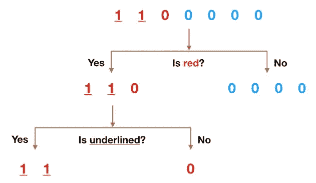
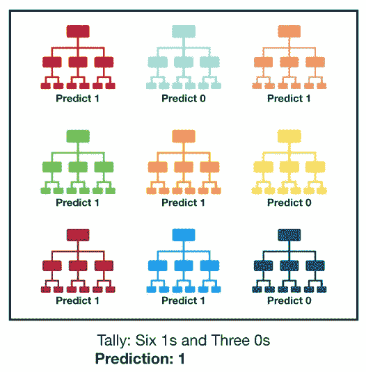
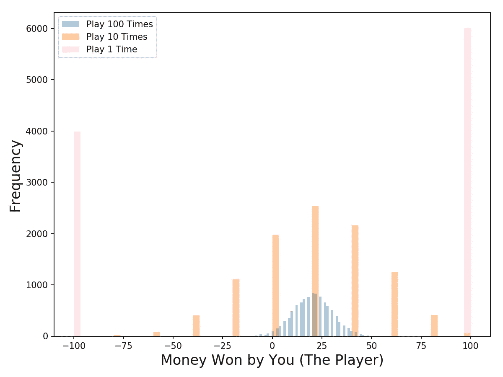
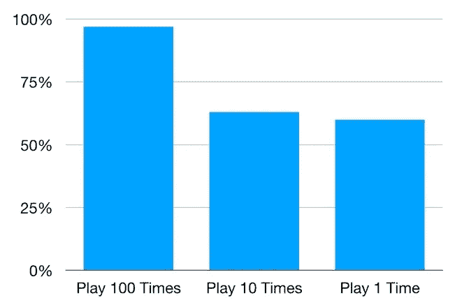
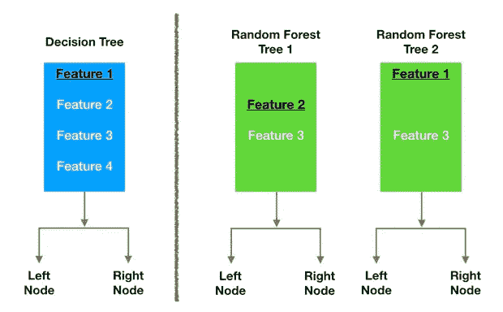

# 了解随机森林

> 原文：<https://towardsdatascience.com/understanding-random-forest-58381e0602d2?source=collection_archive---------0----------------------->

Photo by [Skitterphoto](https://www.pexels.com/@skitterphoto?utm_content=attributionCopyText&utm_medium=referral&utm_source=pexels) from [Pexels](https://www.pexels.com/photo/bright-daylight-environment-forest-240040/?utm_content=attributionCopyText&utm_medium=referral&utm_source=pexels)

## 该算法如何工作以及为什么如此有效

机器学习的很大一部分是分类——我们想知道一个观察值属于哪个类(也叫组)。对观察结果进行精确分类的能力对于各种业务应用程序非常有价值，例如预测特定用户是否会购买产品，或者预测给定的贷款是否会违约。

数据科学提供了大量的分类算法，如[逻辑回归](/understanding-logistic-regression-using-a-simple-example-163de52ea900)、支持向量机、朴素贝叶斯分类器和决策树。但是靠近分类器层次结构顶端的是随机森林分类器(也有随机森林回归器，但那是另一天的主题)。

在这篇文章中，我们将研究基本决策树是如何工作的，单个决策树是如何组合成随机森林的，并最终发现为什么随机森林如此擅长它们的工作。

# 决策树

让我们快速浏览一下决策树，因为它们是随机森林模型的构建模块。幸运的是，它们非常直观。我敢打赌，大多数人在生活中的某个阶段都有意无意地使用过决策树。

Simple Decision Tree Example

通过一个例子可能更容易理解决策树是如何工作的。

假设我们的数据集由左图顶部的数字组成。我们有两个 1 和五个 0(1 和 0 是我们的类),并希望使用它们的特性来区分这些类。这些特征是颜色(红色对蓝色)以及观察值是否带下划线。那么我们如何做到这一点呢？

颜色似乎是一个非常明显的特征，因为除了一个 0 以外，所有的 0 都是蓝色的。所以我们可以用这个问题，“它是红色的吗？”分割我们的第一个节点。您可以将树中的一个节点看作是路径分成两部分的点——符合标准的观察值沿着“是”分支前进，不符合标准的观察值沿着“否”分支前进。

No 分支(蓝色)现在都是 0，所以我们已经完成了，但是我们的 Yes 分支仍然可以进一步分裂。现在我们可以使用第二个特征，并询问“它是否加了下划线？”进行第二次分裂。

带下划线的两个 1 进入 Yes 子分支，不带下划线的 0 进入右边的子分支，我们就完成了。我们的决策树能够使用这两个特征完美地分割数据。胜利！

显然，在现实生活中，我们的数据不会如此清晰，但决策树采用的逻辑是相同的。在每个节点，它会问—

> 什么特征允许我以一种方式分割手头的观察结果，使得结果组尽可能地彼此不同(并且每个结果子组的成员尽可能地彼此相似)？

# 随机森林分类器

随机森林，顾名思义，由大量个体决策树组成，作为一个[集合体](https://en.wikipedia.org/wiki/Ensemble_learning)运行。随机森林中的每棵树都给出一个类别预测，拥有最多票数的类别成为我们模型的预测(见下图)。

Visualization of a Random Forest Model Making a Prediction

随机森林背后的基本概念简单而强大——群体的智慧。用数据科学的话说，随机森林模型如此有效的原因是:

> **作为一个委员会运作的大量相对不相关的模型(树)将胜过任何单个的组成模型。**

模型之间的低相关性是关键。就像低相关性投资(如股票和债券)组合在一起形成的投资组合大于其各部分之和一样，不相关模型可以产生比任何单个预测都更准确的整体预测。**产生这种奇妙效果的原因是这些树相互保护，避免各自的错误**(只要它们不总是朝着同一个方向犯错)。虽然有些树可能是错误的，但许多其他的树将是正确的，因此作为一个群体，这些树能够朝着正确的方向移动。因此，随机森林运行良好的先决条件是:

1.  我们的特征中需要有一些实际的信号，以便使用这些特征建立的模型比随机猜测做得更好。
2.  由单个树做出的预测(以及因此产生的误差)需要彼此具有低相关性。

# 为什么不相关的结果如此巨大的一个例子

拥有许多不相关模型的奇妙效果是一个如此重要的概念，我想给你看一个例子来帮助你真正理解它。想象我们正在玩下面的游戏:

*   我使用一个均匀分布的随机数生成器来产生一个数。
*   如果我生成的数字大于或等于 40，你就赢了(所以你有 60%的胜算)，我付给你一些钱。如果低于 40，我赢了，你付给我同样的钱。
*   现在我给你以下选择。我们可以:

1.  **游戏 1** —玩 100 次，每次下注 1 美元。
2.  **游戏 2** —玩 10 次，每次下注 10 美元。
3.  **第三场** —玩一次，下注$100。

你会选哪个？每场比赛的期望值是一样的:

> 期望值游戏 1 = (0.60*1 + 0.40*-1)*100 = 20
> 
> 期望值游戏 2= (0.60*10 + 0.40*-10)*10 = 20
> 
> 期望值游戏 3= 0.60*100 + 0.40*-100 = 20

Outcome Distribution of 10,000 Simulations for each Game

发行版呢？让我们用蒙特卡洛模拟来可视化结果(我们将对每种游戏类型运行 10，000 次模拟；**比如我们会模拟 10000 次第一场**的 100 次打法。看看左边的图表，现在你会选择哪种游戏？即使期望值相同，**结果分布也有很大不同，从正的、窄的(蓝色)到二进制的(粉色)。**

游戏 1(我们玩 100 次)提供了赚钱的最好机会——**在我运行的 10，000 次模拟中，你在 97%的模拟中都赚钱了！**对于第二场游戏(我们玩了 10 次)，你在 63%的模拟中赚钱，这是一个急剧的下降(你输钱的概率也急剧增加)。而我们只玩一次的游戏 3，你在 60%的模拟中赚钱，正如预期的那样。

Probability of Making Money for Each Game

因此，即使这些游戏有着相同的期望值，它们的结果分布却完全不同。我们越是将 100 美元的赌注分成不同的游戏，我们就越有信心赚钱。如前所述，这是可行的，因为每个剧本都是独立于其他剧本的。

随机森林也是一样——每棵树就像我们之前游戏中的一个游戏。我们只是看到我们赚钱的机会随着我们玩的次数越来越多而增加。同样，对于随机森林模型，我们做出正确预测的机会随着模型中不相关树木的数量而增加。

如果你想自己运行模拟游戏的代码，你可以在我的 GitHub 这里找到它。

# 确保模型相互多样化

那么随机森林如何确保每棵树的行为与模型中任何其他树的行为不太相关呢？它使用以下两种方法:

**Bagging(Bootstrap Aggregation)——决策树对它们接受训练的数据非常敏感——训练集的微小变化会导致明显不同的树结构。** Random forest 利用了这一点，它允许每棵单独的树通过替换从数据集中随机采样，从而产生不同的树。这个过程被称为装袋。

注意，使用 bagging，我们不是将训练数据分成更小的块，而是在不同的块上训练每棵树。相反，如果我们有一个大小为 N 的样本，我们仍然为每棵树提供一个大小为 N 的训练集(除非另有说明)。但是代替原始的训练数据，我们用替换取一个大小为 N 的随机样本。例如，如果我们的训练数据是[1，2，3，4，5，6]，那么我们可以给我们的树一个下面的列表[1，2，2，3，6，6]。请注意，这两个列表的长度都是 6，并且“2”和“6”都在我们提供给我们的树的随机选择的训练数据中重复出现(因为我们使用替换进行采样)。

Node splitting in a random forest model is based on a random subset of features for each tree.

**特征随机性—** 在正常的决策树中，当需要分割一个节点时，我们会考虑每一个可能的特征，并选择一个在左节点和右节点的观察值之间产生最大分离的特征。相比之下，随机森林中的每棵树只能从随机要素子集中选取。这迫使模型中的树之间有更多的变化，并最终导致树之间更低的相关性和更多的多样化。

让我们来看一个直观的例子——在上图中，传统的决策树(蓝色)在决定如何拆分节点时，可以从所有四个特征中进行选择。它决定使用特性 1(黑色加下划线)，因为它将数据分成尽可能独立的组。

现在让我们来看看我们的随机森林。在本例中，我们将只检查森林中的两棵树。当我们检查随机森林树 1 时，我们发现它只能考虑特征 2 和 3(随机选择)来进行节点分裂决策。我们从传统的决策树(蓝色)中知道，特征 1 是最好的分割特征，但是树 1 看不到特征 1，所以它被迫使用特征 2(黑色并带下划线)。另一方面，树 2 只能看到特征 1 和 3，因此它能够选择特征 1。

> **所以在我们的随机森林中，我们最终得到的树不仅在不同的数据集上进行了训练(多亏了 bagging ),而且还使用不同的特征来做决策。**

我亲爱的读者，这就创造了不相关的树，它们缓冲并保护彼此免受错误的影响。

# 结论

随机森林是我个人的最爱。来自金融和投资领域的圣杯总是建立一系列不相关的模型，每个模型都有正的预期回报，然后将它们放在一个投资组合中，以赚取巨大的阿尔法(阿尔法=市场回报)。说起来容易做起来难！

随机森林是数据科学的等价物。我们最后复习一遍。什么是随机森林分类器？

> 随机森林是一种由许多决策树组成的分类算法。**它在构建每棵树时使用 bagging 和特征随机性，试图创建一个不相关的树木森林**，其委员会的预测比任何单棵树都更准确。

为了让我们的随机森林做出准确的类别预测，我们需要什么？

1.  **我们需要至少有一些预测能力的功能。毕竟，如果我们把垃圾放进去，我们就会把垃圾弄出来。**
2.  **森林中的树木，更重要的是它们的预测需要不相关**(或者至少彼此之间的相关性很低)。虽然算法本身通过特征随机性试图为我们设计这些低相关性，但我们选择的特征和超参数也会影响最终的相关性。

感谢阅读。我希望你从阅读这篇文章中学到的和我写这篇文章时学到的一样多。干杯！

如果你总体上喜欢这篇文章和我的写作，请考虑通过我的推荐链接注册 Medium 来支持我的写作。谢谢！