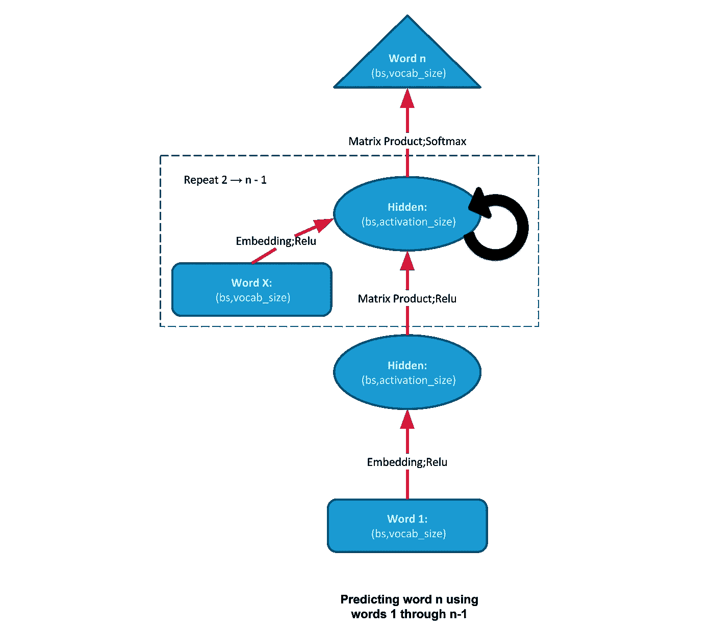
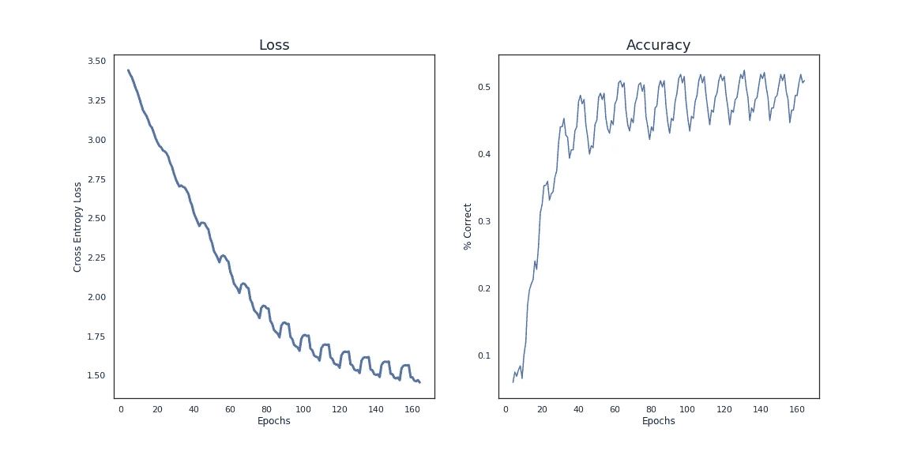
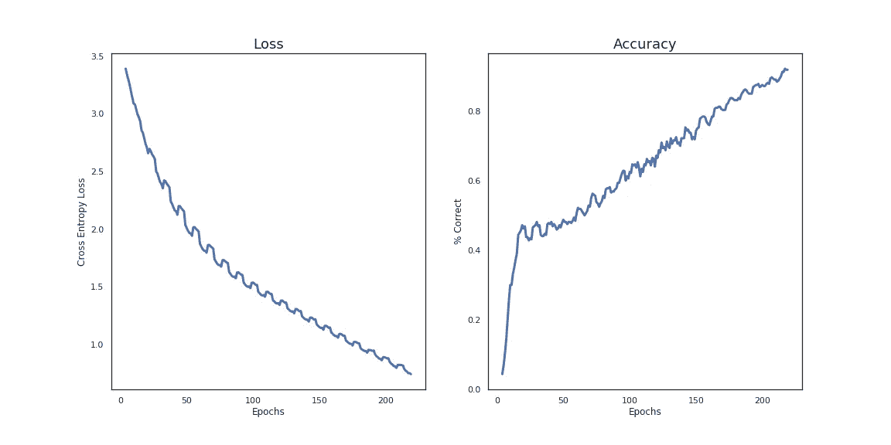

# 通过示例了解 RNNs

> 原文：<https://towardsdatascience.com/understanding-rnns-by-example-c8cd52b13059?source=collection_archive---------28----------------------->

## 训练你的 PyTorch 模型计数


成为机器学习实践者最艰难的任务之一是直观地理解模型背后的*魔力*。人们普遍认为你需要成为一名数学专家才能完全掌握底层的机制，但你真正需要的只是浏览几个基本的例子。掌握简单的模型会给你在复杂性增加时所需要的基础。

有很多精彩的文章从较高的层面讲述了 RNN 是如何工作的，所以我将本课的内容提供给那些对自己实现一个具体示例感兴趣的人。

这篇文章中的很多想法和插图都来源于 [*fast.ai*](https://www.fast.ai/) 以及他们在 NLP 中的课程。

# RNNs 入门:

传统的前馈网络接收固定大小的输入，并产生固定大小的输出。当您的表格数据具有恒定的列数时，这非常有用，但是当您具有可变长度的序列(如音频、时间序列或我们示例中的文本)时，这就没什么用了。

RNN 的*魔力*在于它将当前输入与先前或隐藏状态相结合的方式。这种隐藏状态可以简单地认为是模型的**内存**或**上下文**。如果我让你预测一个句子中的下一个单词，如果当前单词是“hot ”,那就不可能做出准确的猜测。如果你有一些比当前输入更多的记忆，比如“我吃了一个热的”，你可以更好地猜测下一个单词是“狗”。



鉴于其简单性，rnn 的能力令人惊叹。rnn 只是一个循环，将它们的内存与当前输入相加，并通过线性层发送该组合值，以计算下一步的内存。在为每一步输入计算隐藏状态后，隐藏状态通过输出层发送，以进行最终预测。下面是这个循环的伪代码:

```
h = hidden_state_init()
for word in words:
   h += embedding(h)
   h = linear(h)
out = linear_output(h)
return out
```

在本教程中，我们将用英语教我们的 RNN 数数。例如，如果我们的输入是:

```
['one', 'thousand', 'three', 'hundred', 'tweleve', ',' , 'one']
```

那么序列中的下一个单词将是*‘千’*。

# 设置数据管道:

## 加载数据和构建词汇表:

首先，我们需要加载 [train.txt](https://drive.google.com/file/d/1kTJc-73djl6mmGdNZjQxFJqJjXvBlGQC/view?usp=sharing) 和 [valid.txt](https://drive.google.com/file/d/1bdwi4_tSiuXmC0qpDpr3t5-q6O_B3sBr/view?usp=sharing) 文件，它们的数字分别从 1 到 8000 和 8000 到 9999。我们将把这些文件加载到一个字符串列表中，通过制作一组字符串来构建我们的词汇表，然后构造一个从每个字符串到一个整数的映射。

## 创建批处理迭代器:

当训练我们的模型时，我们希望输出比输入快一步。例如，如果当前输入是“二”，那么输出应该是“，”。

```
x = ['one', ',', 'two', ',', 'three', ',', 'four', ',', 'five', ','] 
y = [',', 'two', ',', 'three', ',', 'four', ',', 'five', ',', 'six']
```

这个迭代器将首先生成形状的 2d 列表(bs，bptt ),其中 bs 代表批量大小，bptt 代表时间上的反向传播，或者基本上是序列中的字数。一旦我们生成了这些列表，我们就使用我们在上一步中构建的字典将令牌映射到它对应的整数。最后，我们将 2d 列表转换为 torch 张量，以便我们的模型可以处理它们。

# 训练第一个模型:

虽然 PyTorch 有一个专用的 RNN 层，但我们实际上将使用我们的循环来重新创建该层，这样我们可以更直观地掌握我们的层的顺序。我们的模型将由 4 个独特的层构成:

*   **i_h(隐藏的输入):**将输入(表示特定令牌的数字)映射到一个嵌入，其大小是我们定义的隐藏状态的 64
*   **h_h (hidden to hidden):** 线性层将先前的隐藏状态+当前输入作为输入，并向前传播这些组合值以生成当前隐藏状态
*   **h_o(隐藏到输出):**线性层，正向传播当前隐藏状态，生成预测输出
*   **bn(批量标准化):**移动和缩放激活以使[优化场景明显更平滑](https://arxiv.org/pdf/1805.11604.pdf)(不要担心这个！).

一旦我们建立了模型，训练模型就相当于样板代码。然而，我将讨论一些关于我们的训练循环的细节。

*   我们使用 Adam 作为我们的优化器，它和学习率一起决定在随机梯度下降(SGD)过程中减去梯度时的步长。
*   我们使用交叉熵损失，这是任何分类任务中最常见的损失函数，并且通过对不正确答案的高概率猜测(假阳性)和正确答案的低概率猜测(假阴性)进行惩罚来工作。
*   我们迭代 10 个时期，这意味着我们将暴露所有的输入 10 次。在每个时期内，我们使用 DataLM 迭代器通过迭代整个输入来构建批处理。
*   我们记录每一步的损失和准确性。注意，损失是为每个标记计算的，而准确度只是模型正确获得第 71 个标记的能力的度量。我会让你想想，如果我们为每个记号计算，精度会有什么变化。

```
plt.plot(pd.Series(losses).rolling(4).mean())
plt.plot(pd.Series(accuracy).rolling(4).mean())
```



# 改进模型:

我们可以使用 PyTorch 的原生 RNN 层重构上面的模型，以获得与上面相同的结果。在实践中，您应该使用本机层，因为它更容易使用，并且由于一些 GPU 优化，运行速度更快。

虽然我们上面的演示表明，RNNs 可以有效地处理序列数据，但它们与长期依赖性作斗争。gru(门控循环单元)的功能与 rnn 非常相似，但在决定当前输入对当前状态的影响程度方面更智能。我很快会写一篇关于 GRUs 的文章，但与此同时，我会推荐这个由 [fast.ai](https://www.youtube.com/watch?v=Bl6WVj6wQaE&list=PLtmWHNX-gukKocXQOkQjuVxglSDYWsSh9&index=15) 做的讲座。

通过使用 GRU 而不是 RNN，我们可以将准确率从略高于 50%提高到 95%。



# 测试模型:

我们使用由数字 8001–9999 组成的验证列表，随机选择 20 个令牌。当我运行代码时，我对以下输入序列进行了采样:

```
seven , nine thousand three hundred eight , nine thousand three hundred nine , nine thousand three hundred ten ,
```

我们将此输入运行到我们的模型中，以预测下一个令牌。在预测了那个记号之后，我们把它附加到输入中来预测另一个记号。我们重复这个输入→预测→连接→输入序列 20 步。

使用与上面相同的输入字符串，我们得到以下输出:

```
nine thousand three hundred eight , nine thousand three hundred nine , nine thousand three hundred ten , nine thousand nine hundred eleven , nine thousand nine hundred twelve , nine thousand nine hundred thirteen , nine thousand
```

现在，当以 95%的准确率预测 20 个令牌时，我们只会在 36%的时间内得到正确的输出。根据经验，使用训练集，我在 80%的情况下得到正确的输出，在 45%的情况下使用验证得到正确的输出

# 总结:

希望现在你对 RNN 的工作原理有了更好的理解，但是我不期望你完全掌握所有的细节。说到这里，我对如何加强你的理解有很多建议:

*   如果你喜欢自上而下的结账方式
*   如果你想深入了解数学，请访问关于序列模型的 [deeplearning.ai](https://www.coursera.org/learn/nlp-sequence-models) 课程。
*   如果你是动手型的，那么把 RNN 应用到另一个应用程序中。

**参考文献:**

J.霍华德，r .托马斯，[自然语言处理的代码优先介绍](https://www.fast.ai/2019/07/08/fastai-nlp/) (2019)， [fast.ai](https://www.fast.ai/)