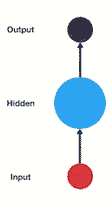
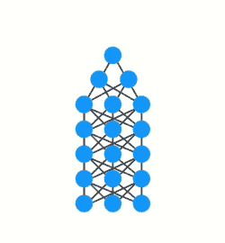
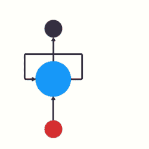
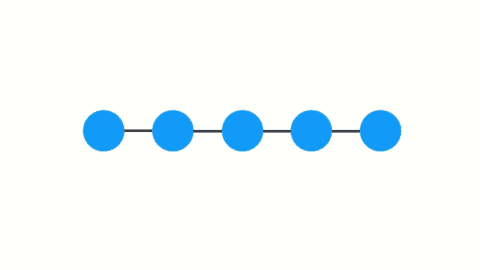
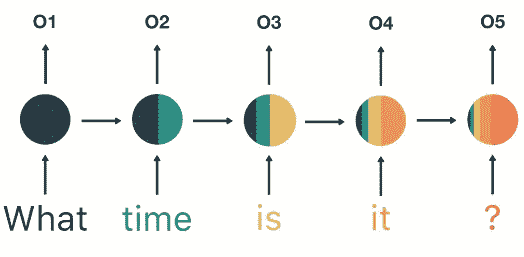
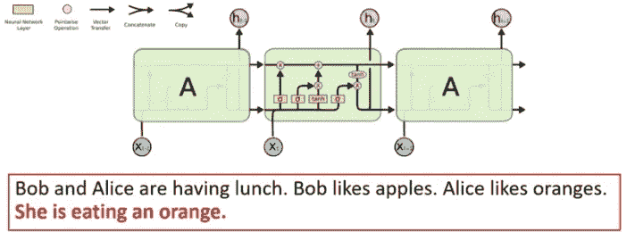
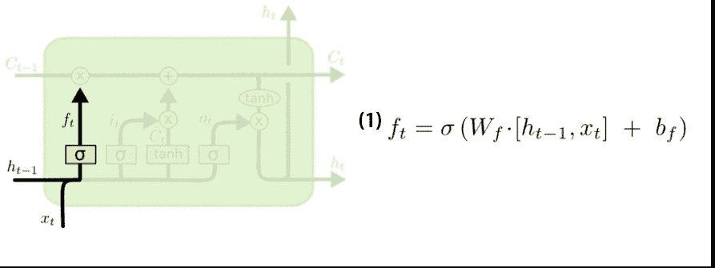
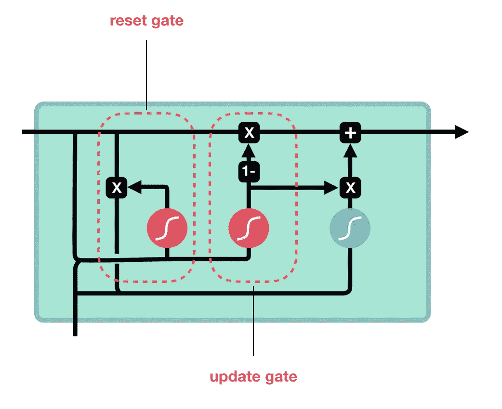

# 了解 rnn、LSTMs 和 gru

> 原文：<https://towardsdatascience.com/understanding-rnns-lstms-and-grus-ed62eb584d90?source=collection_archive---------16----------------------->

一个**递归神经网络** (RNN)是一个基本神经网络的变体。rnn 适用于处理序列数据，如自然语言处理和音频识别。直到最近，他们还饱受短期记忆问题的困扰。在这篇文章中，我将尝试解释什么是(1) RNN，(2)消失梯度问题，(3)这个问题的解决方案被称为**长短期记忆** (LSTM)和**门控循环单元** (GRU)。

# 什么是 RNN？

首先，让我们介绍基本的神经网络架构，神经网络通过 3 个基本步骤进行训练:

(1)进行预测的向前传球。

(2)使用**损失函数**将预测与地面真实情况进行比较。损失函数输出一个**误差值**。

(3)使用该误差值，执行**反向传播**，其计算网络中每个节点的梯度。

相比之下，RNN 包含一个**隐藏状态**，它从先前的状态中获取信息:

隐藏状态的概念类似于为了做出更准确的预测而对顺序数据进行整合。考虑一下，如果您的数据仍然是运动中的球的照片，预测球的运动会容易得多:

没有序列信息，就不可能预测它的移动方向，相反，如果你知道以前的位置:

预测会更准确。同样的逻辑也适用于估计句子中的下一个单词，或者歌曲中的下一段音频。这个信息是隐藏状态，它是先前输入的表示。

# 消失梯度问题

然而，这变得有问题，为了训练一个 RNN，你使用一个叫做**通过时间** (BPTT)的反向传播的应用。由于每一层的权重通过**链规则**进行调整，它们的梯度值将随着其在每个时间步长的传播而呈指数缩小，最终“消失”:

为了在 NLP 应用程序中说明这一现象:

Vanishing Gradient

通过输出 5，您可以看到来自“什么”和“时间”的信息几乎都消失了，如果没有这些信息，您认为您能多好地预测“是”和“它”之后的内容呢？

# LSTM 和 GRU 作为解决方案

LSTMs 和 GRUs 是作为消失梯度问题的解决方案而创建的。它们内部有一种叫做**门**的机制，可以调节信息的流动。

对于 LSTM，有一个主**单元状态**，或传送带，以及几个控制新信息是否可以进入传送带的门:

在上面的问题中，假设我们要确定新句子中说话人的性别。我们将不得不选择性地忘记关于先前状态的某些事情，即，关于鲍勃是谁，他是否喜欢苹果，并记住其他事情，爱丽丝是一个女人，她喜欢桔子。

放大来看，LSTM 中的门通过三个步骤来完成这一过程:

(1)决定忘记什么(状态)
(2)决定记住什么(状态)
(3)状态的实际“遗忘”和更新
(4)输出的产生

总结一下，在 LSTM 中，遗忘门(1)决定哪些相关内容要从前面的步骤中保留。输入(2)门决定从当前步骤添加什么相关信息。输出门(4)决定下一个隐藏状态应该是什么。

对于作为新一代 rnn 的 GRU，它与 LSTM 非常相似，只是 GRUs 摆脱了小区状态，使用隐藏状态来传递信息。它也只有两个门，一个**复位门**和**更新门**:

(1)更新门的作用类似于 LSTM 的遗忘和输入门，它决定保留什么信息和丢弃什么信息，以及添加什么新信息。

候选隐藏状态的实现方式与 LSTM 相同，不同之处在于，在候选计算内部，它将重置一些先前的门(0-1 之间的向量，由线性变换定义)。

(2)重置门用于决定忘记多少过去的信息。

插图摘自
1。[麻省理工 6。s094:Lex frid man
2 在 2017 年冬季](https://www.youtube.com/redirect?v=nFTQ7kHQWtc&event=video_description&redir_token=xfOh4nt5k1IP4vmqji3oxaJNatN8MTU3MzQ0Mjk5MUAxNTczMzU2NTkx&q=http%3A%2F%2Fbit.ly%2F2Hc2zhf)讲授的自动驾驶汽车深度学习。LSTM 和 GRU 的图解指南:一步步的解释