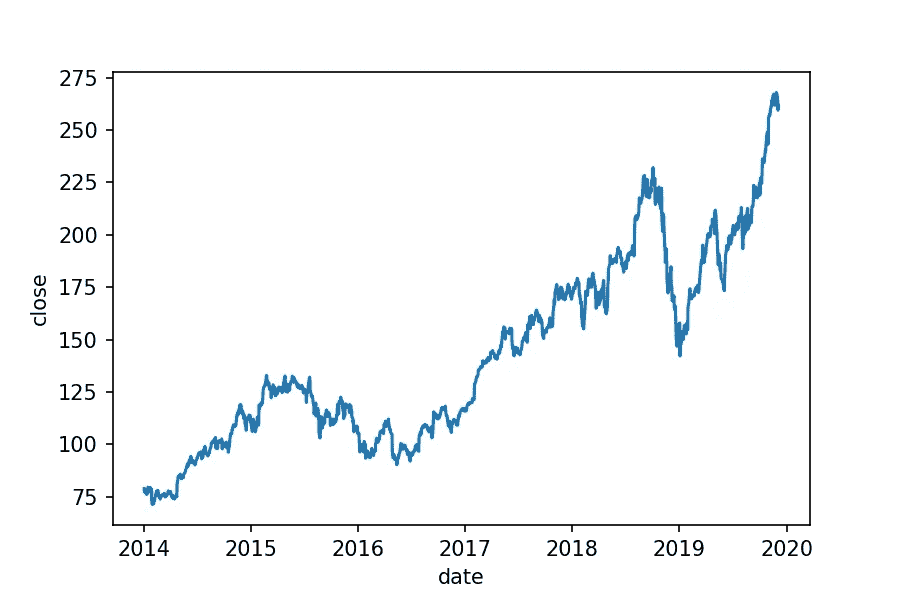
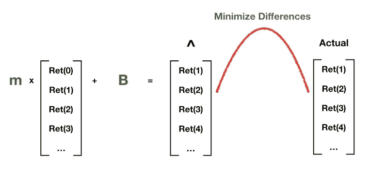
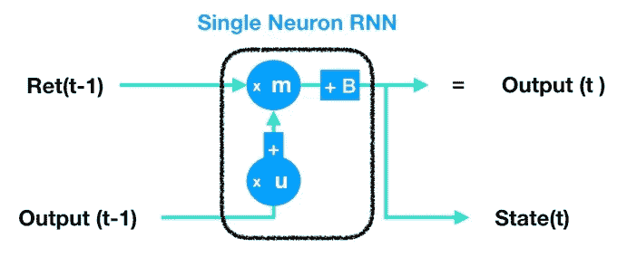

# 了解 RNNs(递归神经网络)

> 原文：<https://towardsdatascience.com/understanding-rnns-recurrent-neural-networks-479cd0da9760?source=collection_archive---------15----------------------->


Photo by [Gemma Evans](https://unsplash.com/@stayandroam?utm_source=medium&utm_medium=referral) on [Unsplash](https://unsplash.com?utm_source=medium&utm_medium=referral)

## 能够记住过去的神经网络

第一次听说 RNN(递归神经网络)时，我有些不知所措。我读过的一篇文章声称，RNN 是一个具有记忆的神经网络——它可以记住数据的连续起伏，以便做出更明智的预测。

当时我的第一个想法是——RNN 与有许多滞后的线性回归(自回归模型)有什么不同？事实证明，RNN 不仅与众不同，而且更灵活、更强大。

但是，在我们将它添加到我们的预测工具包之前，我们应该尽最大努力对它的工作原理有一个直观的理解——从 RNN 如何能够记住过去开始。让我们找出答案。

# 顺序数据

RNN 是一种最适合处理序列数据的神经网络。如果你对神经网络不熟悉，那么你应该从我的理解神经网络帖子开始。在本文中，我将假设读者对什么是神经网络以及如何工作有一个基本的了解。

**什么是顺序数据——顺序很重要的数据。**序列数据的一些示例包括股票价格和利率(按时间排序)、博客文章中的文字(文字的顺序传达上下文和含义)或每天的平均温度(按时间排序)。



An example of sequential data (Apple stock price)

通常，对于序列数据，我们希望预测接下来会发生什么。例如，我们可能想要预测明天的温度，或者下个月股票的价格是高还是低。

# 简单线性回归预测

我能想到的最简单的预测是 AR(1)模型(一种具有单一滞后的自回归模型)，在这种模型中，您只需使用前一个观察值来尝试预测下一个观察值。让我们以股票回报为例:

*   我们想预测 *Ret、*苹果下个月的回归*。这是我们的目标变量。*
*   我们唯一的特征变量是最近一个月的回报。
*   我们的数据集由 20 年的苹果月度股票回报时间序列组成(计算为从上个月最后一天到本月最后一天苹果股票价格的百分比变化)。

AR(1)模型将具有以下等式:

> 预测 _Ret(t) = m*Ret(t-1) + B

这应该看起来很熟悉，因为这是一条线的方程(Y = mX + B)。下图更详细地描绘了我们的 AR(1)模型。让我们一点一点来看:

*   我们使用我们的数据来估计绿色参数的最佳值——m 是我们直线的斜率，B 是截距。
*   请注意，左边的等式产生了一个带有帽子符号(^).)的输出帽子表示输出仅仅是我们的目标变量的一个估计，实际的股票回报。
*   我们的目标是最小化预测回报(^)和实际回报之间的差异。
*   请注意，第一个月返回的横向 *Ret(0)* 与第二个月返回的 *Ret(1)* 对齐， *Ret(1)* 与 *Ret(2)* 对齐，以此类推。这就是我们所说的使用前一个观察值(我们的特征)来预测下一个观察值(我们的目标)的含义——给定上个月的收益和我们的估计值 *m* 和 *B* ，我们可以预测下个月的收益。



AR(1) model

你不需要在市场上待很久就知道这不是一个好的模式。股票价格会因为各种原因波动(公司基本面、经济冲击、投资者恐惧/兴奋)，有时甚至没有任何原因。所以我们不应该指望一个简单的 AR(1)模型就能做好。

相反，我们应该超越最近的观察，考虑整个序列**(实际上，我们应该考虑价格变动之外的数据，但那是另一个故事了)**。RNNs 允许我们这样做。

# 使用 RNNs 考虑整个序列

在我们深入研究 RNNs 之前，读者可能会问一个问题:“为什么不增加自回归模型中的滞后数？”也就是说，与其使用单一滞后，为什么不使用 AR(20)之类的东西，它使用最近 20 个月的月度回报来预测下个月的回报。答案是双重的:

1.  用于我们的模型的月回报率实际上是我们需要调整的一个重要参数。选择错误的数字可能会导致糟糕的性能。此外，根据经济体制的不同，月度回报的最佳使用次数可能会有很大差异。RNN 绕过了这一点，因为它可以看到整个可用的历史回报，更重要的是，它自动决定在每个时间点给历史回报多少权重。所以我们不需要告诉 RNN 查看之前的 5、10 或 20 个回报，因为它天生就知道要这么做。
2.  自回归模型是线性模型，因此假设我们的特征和目标之间存在线性关系。在存在非线性的情况下，这可能会导致性能问题。 **RNNs，尤其是当堆叠在更多 RNNs 或者密集层(一个密集层就是一层正常的神经网络神经元)上时，可以检测和捕获我们数据中的所有非线性关系。**事实上，对于 RNNs(以及一般的神经网络),我们应该更担心过拟合而不是欠拟合。

## 模特有记忆意味着什么？

让我们使用神经网络神经元重新创建 AR(1)模型。这里没有什么复杂的——回想一下，一个单一的神经元(如果你不熟悉神经元，[请花点时间阅读我之前关于神经网络的博客](/understanding-neural-networks-19020b758230))接受一个输入，将其乘以一个权重( *m* ，并向其添加一个偏差( *B* )。这些正是单变量线性回归的操作，这就是 AR(1)模型。 ***注意，为了简化说明，我们在这里忽略了激活功能。***


AR(1) via a neural net neuron

现在让我们考虑一下如何给这个模型增加内存。在数量模型的情况下，记忆是什么？没有 100%正确的答案，但在我看来，**记忆是从相关的过去经历中提取信息以帮助决策的能力。在建模方面，我们希望模型是动态的**——换句话说，我们希望它能够根据它对情况的理解(基于它过去的经验)而变化。

我们的 AR(1)模型可能会用历史数据进行训练(回想一下，我们给它输入了苹果过去 20 年的月度股票回报)，但它肯定没有记忆。在估计回归参数 *m* 和 *B* 时，AR(1)模型对我们给定的每个数据点进行同等加权。因此，它不能决定哪些数据点更相关，哪些数据点不相关(回归参数是静态的，一旦估计)。它是静态的，不是动态的。

## 记忆从何而来？

最后，是时候给我们的模型记忆了。它实际上只需要一个简单的技巧。请注意下图底部的附加内容:



Super simple RNN with memory

关键的添加是我们现在接受先前的输出，*输出(t-1)* ，将其与新的参数 *u，*相乘，并将其添加到先前的输出中。所以我们更新后的等式看起来像:

> 预测 _ Ret(t)=**u *预测 _Ret(t-1) +** m*Ret(t-1) + B

或者用更一般的符号来表示:

> 输出(t)=**u *输出(t-1) +** m*Ret(t-1) + B

那么这到底为什么构成记忆呢？要了解原因，我们需要向前跳一点，首先了解 RNN 是如何分析数据的。以下是 RNN 如何生成预测的 Python 伪代码:

```
# Our input data is 20 years of Apple's monthly returns
inputs = appl_monthy_returns
time_steps = range(inputs.shape[0])# List to store outputs
predictions = []# Initialize state to 0 (state is output[t-1] from above)
state = 0# Initialize u, m, and B
u = 1
m = 1
B = 1for t in time_steps:
    input_t = inputs[t]
    current_prediction = (u * state) + (m * input_t) + B
    predictions.append(current_prediction)
    state = current_prediction

    # Function that updates m and B via backpropagation through time
    u, m, B = BPTT(state, predictions, inputs)
```

好了，现在让我们浏览一下代码:

1.  首先我们将*状态*，也就是我所说的*输出(t-1)* 初始化为 0，因为在 *t=0* 时没有先前的*状态*。
2.  然后我们开始循环。输入多少，循环就运行多少次——在我们的例子中，我们有 20 年的月回报，所以它将运行 20*12 = 240 次。
3.  在循环的每次迭代中，我们计算当前预测。然后，我们将计算出的预测附加到我们的输出列表中，*预测*——该列表是我们对下个月收益的预测。
4.  接下来，我们设置*状态*等于当前预测，以便我们可以在下一个循环中使用它——也就是说，我们需要从 *t=0* 的预测来计算在 *t=1* 的预测。
5.  最后，我们使用时间反向传播(超出了本文的范围)来更新 RNN 的参数 *u* 、 *m* 和 *B* 。

请注意几个关键事项:

*   **状态是记忆的来源。**时间 t 的状态是先前的输出(从时间 t-1 开始)，该先前的输出包括先前的模型参数(时间 t-1 的 *u* 、 *m* 和 *B* )以及时间 t-2 的输出。当 RNN 的当前时间步长(每个时间步长都是 for 循环的一次迭代)查看前一个时间步长的输出(*状态*)时，它实际上是在查看过去的自己。**之前的输出是 RNN 对过去的自己进行快照并将其向前传递的方式。这就是为什么我在伪代码中称之为*状态*的原因——这只是总结(非常粗略地)模型决策过程的最新状态的一种方式。**
*   我们用参数 *u* 乘以*状态*。这允许 RNN 决定使用多少内存(自身过去的快照)。
*   我们在 for 循环的每次迭代中做的最后一件事是更新 RNN 的参数( *u* 、 *m* 和 *B* )。**这意味着在循环的每次迭代中，我们可能会看到 *u* 、 *m* 和 *B* 的不同值。**
*   for 循环的目的是让 RNN 在时间中向前移动。与一次性估计模型的线性回归不同，RNN 通过一次一个时间步长增量检查序列数据而逐渐收敛。

让我们写出这个等式(使用更简单的符号)，以确保我们理解了所有内容。我将调用 t 时刻的输出， *O(t)，*和输入， *X(t)。*让我们写出 *O(3):*

> O(3) = u * O(2) + m * X (3) + B

我们也可以写出 *O(2)* :

> O(2) = u_2 * O(1) + m_2* X (2) + B_2

代入 *O(2)* ，我们得到:

> O(3)= u ***(u _ 2 * O(1)+m _ 2 * X(2)+B _ 2)**+m * X(3)+B

看看时间 t=3 时的输出如何包括先前的参数( *u_2* 、 *m_2* 和 *B_2* ) — **这些参数是 RNN 如何在时间 t=2 时做出决定的，并且它们现在已经被传递到模型的当前迭代。**如果我们愿意，我们也可以展开 *O(1)* 来查看从时间 t=1 开始的参数也包括在内。

回想一下，我们将模型记忆定义为动态的，能够根据情况变化。RNN 现在可以做到这一点——通过以前的输出包括过去的快照，RNN 可以访问其历史参数，并可以根据情况需要决定是否将它们纳入其决策过程。

# 结论

写这篇文章让我学到了很多。以前我很清楚 RNNs 是如何工作的，但我一直想更好地理解人们说 RNNs 有记忆是什么意思。我希望你现在也能更好地理解它。

但是我们的工作还没有完成。理论上，rnn 应该能够熟练地利用过去的经验来做决策。但在现实中，他们遭遇了所谓的消失梯度问题。在未来的帖子中，我们将探索为什么会这样，以及一个称为 LSTM 的增强 RNN 如何帮助我们解决这个问题。在那之前，干杯！

***更多数据科学与商业相关岗位由我:***

[*数据科学家的商业战略*](/business-strategy-for-data-scientists-25e3ca0af5ee)

[*多少分析才算过分*](/how-much-analysis-is-too-much-e1dfc5b37cbb)

[*用 Python 进行业务模拟*](/business-simulations-with-python-a70d6cba92c8)

[*了解 PCA*](/understanding-pca-fae3e243731d?source=post_page---------------------------)

[*理解贝叶斯定理*](/understanding-bayes-theorem-7e31b8434d4b)

[*理解朴素贝叶斯分类器*](/understanding-the-naive-bayes-classifier-16b6ee03ff7b)