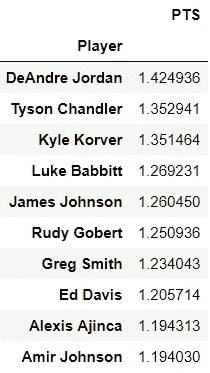
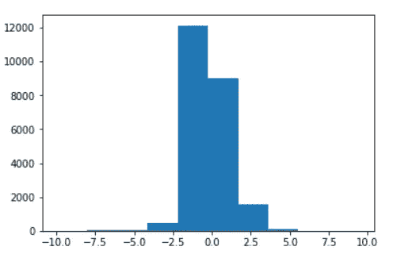
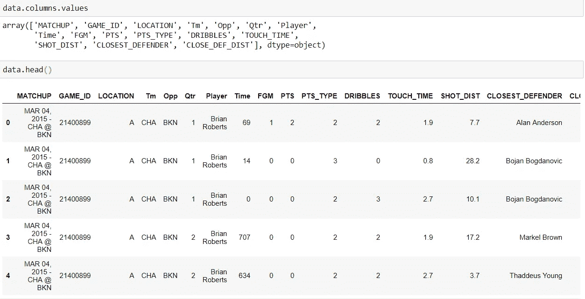
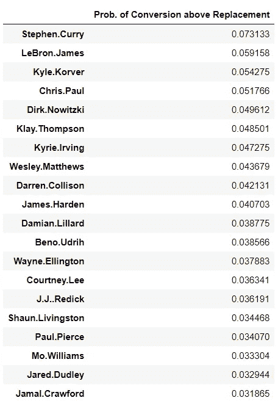
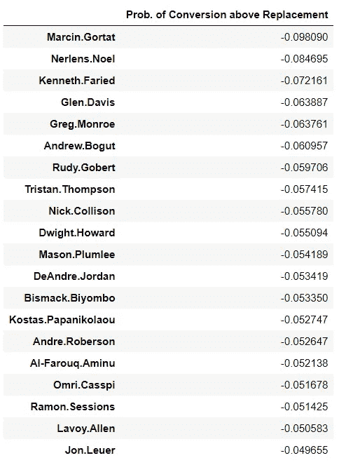

# 理解得分倾向:评估 NBA 球员的混合模型方法

> 原文：<https://towardsdatascience.com/understanding-scoring-propensity-a-mixed-model-approach-to-evaluating-nba-players-d749a7e453a7?source=collection_archive---------21----------------------->

"谁是 NBA 的最佳得分手？"是我和朋友交谈时经常提到的一个问题。像勒布朗·詹姆斯、詹姆斯·哈登和斯蒂芬·库里这样的名字总是会出现。

通常很难找到一个单一的答案；当计分员之间存在差异时，这个问题变得更加微妙。当考虑到球员得分的不同情况时，我们如何区分天赋？

例如，我们如何像这样比较两个玩家:

Steph Curry

LeBron James

两位球员都是高产射手，但他们得分的方式不同。我们怎样才能让它们有共同点呢？

*注意:在这个分析中，我不会使用罚球命中率和/或百分比。如果他们没有犯规，这个更好的头衔应该是“最佳射手”。*

# 一个简单的方法:每杆得分

天真地说，我们对“最佳得分手”的第一个论点可能取决于使用每杆得分(PPS)作为一种分析手段。毕竟，谁每次尝试得分最多，理论上就应该是最佳得分手。这种方法有缺点，但是我们将在后面解决这些问题。

从 kaggle.com 收集 2014-2015 赛季的数据，我们可以开始一些初步的分析。如果我们聚集球员，取他们每次投篮的平均得分，我们可以看到谁是最成功和最不成功的投篮手。

Top 10 PPS (2014–2015)

从左边的列表中，我们可以看到最有效率的得分手是抓高球的大个子(乔丹/钱德勒)。混合在一起的，是像科弗和巴比特这样精准的三分球投手。

如果我们太天真，我们会简单地认为他们是联盟中最好的“投篮手”。然而，从我们的篮球知识来看，我们知道靠近篮筐的投篮(例如乔丹/钱德勒接到的扣篮和高球)比远一点的投篮容易得多。此外，我们也知道更多的空位投篮比高度争议的投篮更容易。让我们用数据验证来测试我们的直觉，以确保我们是在正确的轨道上。

Shot Distance vs Def Distance (yellow indicates make, purple indicates miss)

如果我们看上面的散点图，我们可以看到球员离篮筐越远，就越容易失误。当他们离篮筐更近而防守队员离得更远时，他们很少会失手。我们可以把这想象成一个过渡上篮/扣篮的机会。我们的直觉是正确的，我们可以进行更细致的分析。

# 稍微好一点的方法:逻辑回归

为了说明这些不同的因素(投篮距离，防守距离)，我们可以建立一个简单的逻辑回归模型来预测投篮是否进了。特征包括截击项、射门距离和防守距离。逻辑回归假设每个样本的误差产生过程是相同的。在我们采用这种方法时，请记住这个假设。

Model Generation

仅仅建立一个简单的模型，我们可以看到，盲目猜测镜头转换会给我们大约 55%的准确性。该模型提高了约 5%。随着更多的超参数调整，我相信我们可以做得更好，但不是令人难以置信的。

检查残差显示，模型并不完全拟合(不以 0 为中心，并且略有偏斜)。这可能表明违反了前面提到的 i.i.d .假设。

Residuals of Fit

这种违反可能是由于模型对玩家是盲目的。也许每个玩家都有不同的出错过程。从本质上来说，基于一些隐含的潜在技能水平，每个球员对投篮是否会有不同的影响。

为了解决这个问题，我们可以做三件事之一:

*   在现有的逻辑回归模型中添加使用一次性编码表示的玩家
*   为每个玩家建立一个单独的模型
*   以某种方式结合上述策略

在第一种方法中，我们并没有真正以他们自己独特的方式对待不同球员的每一次投篮尝试。我们仍然假设每个镜头来自相同的数据生成过程，所以我们的假设仍然会被违反，尽管我们的准确性可能会提高。

在第二种方法中，我们当然会考虑不同玩家的不同错误，但是我们最终会建立很多模型！

第三种方法是我的首选方法，它将上述策略结合到一个模型中。这就是所谓的分层线性建模。

# 一个不完美但改进很多的模型:HLMMs

分层线性混合模型(HLMMs)是指处理具有清晰分层结构的分组数据的模型。例如，这些模型已被用于研究不同学区对学生 SAT 成绩的[效应](https://www.r-bloggers.com/an-introduction-to-probabilistic-programming-with-stan-in-r/)。

在我们的例子中，我们希望看到不同球员对击球结果的影响。我们的数据(投篮次数)可以按以下方式分组:

*   通过游戏
*   按团队
*   按玩家
*   由最近的防守队员防守
*   按季度

这些不同的分组都是为了解释数据中的一些差异。另一种思考方式是，上述每一组对击球结果都有不同的影响。例如，也许数据中的大多数差异(即成功或失败)是由“玩家”组决定的。这些类型的分组被称为“随机效应”。

HLMMs 由固定效果和随机效果组成(因此得名“混合”)。固定效应是被认为同等影响所有群体的变量。例如，在我们的例子中，镜头的距离可以被认为是一个固定的效果。

这些模型也解释了分组中的不平衡。例如，让我们说在 10000 次投篮中，我们只有一个板凳球员的 6 个数据点，因为这个球员通常不怎么上场。如果我们使用我们的第一种方法，这 6 个数据点在决定这个玩家的价值时会稍微不重要。如果我们使用我们的第二种方法，为每个玩家建立一个单独的模型，这个玩家的影响将会严重过度拟合。想象一下，如果这个球员 6 投全中；这位模特会对他评价很高，但可能无法解释他的运气。

HLMMs 在这两种方法之间找到了一个折中的办法。简单来说，如果一个群体的成员没有太多的数据，他的效果会更接近群体所有成员的均值。如果他这样做了，他的效果会更远。这就是所谓的“缩水”。如果你有兴趣了解更多关于混合模型的信息，这个[链接](https://stats.idre.ucla.edu/other/mult-pkg/introduction-to-linear-mixed-models/)会给你一个很好的起点。

# 将 HLMMs 应用于拍摄数据

让我们重温一下我们的每次投篮得分分析。之前，我们只显示了球员的每次投篮得分，但没有显示他们的投篮次数。包含这些信息可以显示玩家是否“不走运”。

在左边，我们可以看到球员之间投篮次数的巨大差异。以斯蒂芬·库里和希度·特克格鲁的差异为例。两者的 PPS 都一样，但是 Steph 的尝试次数多了 9 倍！直觉告诉我们，斯蒂芬的信息更可信，但我们能肯定地说，斯蒂芬是一个比特科格鲁单独使用这些信息更好的投篮手吗？

事实证明，我们可以尝试使用假设检验，但这是假设斯蒂芬和赫多拍摄了完全相同类型的照片。因为这是极不可能的，我们将忽略这条路线。

我们能做的是建立一个 HLMM 并解释模型的系数。

HLMM Specification

以上是如何指定混合模型的。贝塔项是固定效应“X”的系数，“u”是随机效应“Z”的系数。请注意，模型是线性的；系数的正值表示相关预测值的增加(当其他值保持不变时)，与预测值“y”的适当增加相一致。

在篮球方面，我们可以看到一个球员的系数如何与预测值，投篮结果相关联。一个更好的射手会有更大的正系数。

# 构建 HLMM:使用贝叶斯方法

让我们重温一下我们的数据。

Data Frame for Shot Data

让我们在数据中寻找可能引入差异的分组。我想到了一些:

*   运动员
*   球员的防守队员
*   游戏 ID
*   玩家的团队
*   玩家的对手
*   四分之一

现在，我们可以寻找可能在人群中固定的影响:

*   主场/客场比赛
*   射击距离
*   防守距离
*   运球次数
*   触摸时间
*   季度剩余时间
*   计时器

通常，当使用贝叶斯方法时，人们希望拟合“[最大模型](https://www.sciencedirect.com/science/article/pii/S0749596X12001180)”。这意味着，如果一个人想要在我们的情况下，确认或否认一个假设(即谁是最好的射手)，我们应该指定最大随机效应结构。那是什么意思？

考虑我们上面的功能。我们可以这样设置固定效果，并为每个组指定一个随机截距。然而，直觉上我们知道射门距离、防守距离和射门前运球对每个球员的影响是不同的。因此，我们可以假设一种结构，它包括上述每个特征的随机斜率以及随机截距。此外，我们可以假设防守者的距离对每个防守者的影响不同，并包括一个随机斜率。

使用 R 的 [brms](https://cran.r-project.org/web/packages/brms/vignettes/brms_multilevel.pdf) 软件包，我可以拟合一个具有“最大结构”的模型，并解释结果。请注意，这将需要一段时间，取决于您运行的迭代和链的数量。

# 分析模型结果

我最终拟合的模型在 r 中有这个公式。

FGM ~拦截+位置+ CLOSE_DEF_DIST + (1 +射门 _DIST +运球|球员)+(1 |最近的 _ 后卫)

这意味着，响应(FGM)是固定效应(主队/客场和后卫距离)+最近的后卫和球员的截距+球员的随机坡度效应乘以射门距离和运球次数的函数。响应 FGM 是二进制 0/1 响应；这意味着系数必须以对数标度进行解释，因为影响是使用 logit 链接函数进行转换的。

为了捕捉某个玩家相对于其他玩家的影响，我们需要做一点数学计算。回想一下，如果其他预测因子保持不变，系数测量的是反应。在我们指定的模型中，我们有几个变量保持不变:

*   位置(家庭/外出)
*   防守距离
*   射击距离
*   运球
*   拥护者

因为我换算了防守距离、射门距离和运球次数的值，它们的中间值应该是 0。我们将用它作为我们的常数，使我们的计算更容易。为了简单起见，我们假设每个玩家都在家。接下来，我们必须固定一个防御者值；我们将使用中间值。随机效应用一个正态(均值=0，方差=sigma)来指定，所以中值应该是 0！这使得我们的最终计算相当容易。

## 计算玩家效果

logit 链接执行以下转换:

ln(p/(1-p)) = **βX + Zu**

回想一下，“Z”和“ **β** 分别是随机效应和固定效应的系数。“P”是成功结果的概率值(在我们的例子中是命中)。

在我们的例子中(因为我们使用中值 0)，这分解为:

ln(p/(1-p)) =拦截+主场+球员

我称方程的 RHS 为线性预测值。现在，求解 p，我们得到:

e^(linear_predictor)/(1+e^(linear_predictor)

我们现在可以用概率来比较球员对射门转换的影响了！

因为我们去贝叶斯，这不是我们能做的。我们实际上可以使用生成的样本来查看每个玩家效果的概率分布。这比使用单一值要好得多，因为我们可以比较估计中的不确定性。

我将在下面用一个例子来说明，重温斯蒂芬·库里和希度·特克格鲁的例子。回想一下，斯蒂芬和海多的得分相当，但是斯蒂芬的出手次数是他的 9 倍。

Player Effects

橙色的是特科格鲁的投篮转换值分布，蓝色的是库里的。x 轴代表转换的概率，而 y 轴代表相应 x 值的非归一化频率。

一些要带走的东西:

*   特科格鲁的分布更加分散。这意味着我们对他的影响不太确定。这是有道理的，因为我们只有 100 次投篮机会。因此，库里的分布更紧密，这意味着模型对他的效果更确定。
*   特科格鲁的分布峰值向库里的左移。这表明，模型估计库里更有可能比特科格鲁对投篮命中率有更大的影响！然而，我们可以看看分布的交叉点，看看库里拥有更高效果的频率。我们简单取一下库里的“x”值比特科格鲁大多少倍的平均值。从上面的分布来看，由样本确定为 91.875%。斯蒂芬比特科格鲁有 92%的可能拥有更好的转化能力。

我们可以对球员的所有组合重复这个过程，并进行比较，但更有用的是考虑一个球员如何比其他人增加投篮的概率。我不会在发布会上发言。相反，我将只使用样本的中间值。

然后，我们可以从每个玩家的效果中减去所有玩家的转换中值，并查看每个玩家的转换高于替换的概率。

Top 20 Shot Converters

我们可以在左侧看到 2014-2015 赛季前 20 名和后 20 名击球手的名单。我们注意到了什么？有什么突出的？我们如何用我们建立的模型来解释这些结果？为什么我们会看到某些玩家凌驾于其他人之上？

Bottom 20 Shot Converters

# 结束语

数据有些嘈杂。最近的防守者可能只是一个帮忙的球员，而不是一个真正争球的球员。这些数据缺少球员投篮的类型(跳投、扣篮、勾手)。数据还缺乏球员投篮时周围的密度(球道是否拥挤，或者只有一个防守队员时是否相当清晰)。我们注意到大人物受到相当重的惩罚；它们经常位于替换级别图表的底部。这可能是因为这些玩家经常参与提示，而这些提示通常在第一次尝试时不会完全转化。同样，拥有更精细的数据(包括分数差异以剔除“关键”球员)将是有益的。请在下面留下您的评论。请记住，这仅适用于 2014-2015 赛季，但该流程也适用于今天的数据。

# 承认

我要感谢 [Alex Hayes](https://twitter.com/alexpghayes?lang=en) 帮助我理解贝叶斯环境下混合模型的方差-协方差结构。我还要感谢我的朋友们，他们不断地参与激烈的辩论，给了我分析性地解决辩论的灵感。